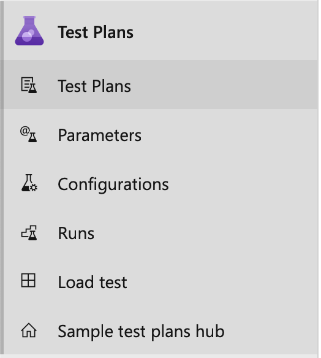
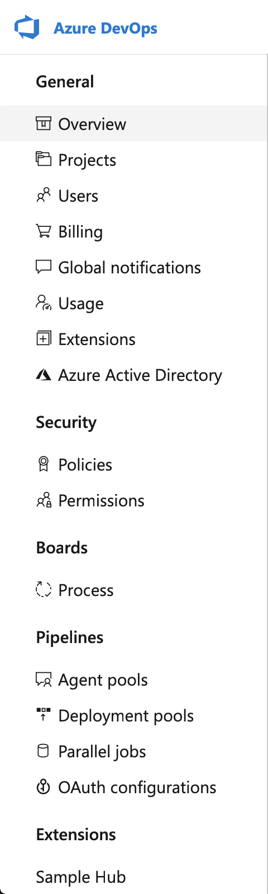

# Extension points

This reference is designed to show where extensions can contribute new capabilities into VSTS.
An understanding of two key concepts: contributions and contribution types, is recommended.
See [contribution model](../../develop/contributions-overview.md) for an overview.

<div class="alert alert-warning">
Install the [contributions-guide extension](https://marketplace.visualstudio.com/items/ms-samples.samples-contributions-guide) to see all the places where contributions can be made.
If you want to see how it's implemented, look at the [source for the extension](https://github.com/Microsoft/vso-extension-samples/tree/master/contributions-guide).
</div>

<a name="hubs"></a>
## Hubs and hub groups

A hub (like Backlog, Queries, or Branches) lives under (i.e. targets) a hub group. A hub group (like Code or Work) lives at a certain level (like project/team) and either in the main web or admin web areas.

Most extensions will either contribute a hub to an existing hub group, or a new hub group to a certain navigation level. 

As an example, a hub contributed to the "Code" hub group would be declared like this in the extension's manifest:

```json
{
    ...
    "contributions": [
        {
            "id": "my-custom-hub",
            "type": "ms.vss-web.hub",
            "targets": [
                "ms.vss-code-web.code-hub-group"
            ],
            "properties": {
                "name": "Code Hub",
                "order": 30,
                "uri": "/views/code/custom.html"
            }
        }
    ]
}
```

In this example:

* `ms.vss-web.hub` is the type of this contribution. This type is defined in the `vss-web` extension published under the `ms` publisher. This type declares optional/required properties required by contributions of this type (name, order, etc).
* `ms.vss-code-web.code-hub-group` is the full ID of the hub group contribution this hub is targetting. This contribution is declared in the `vss-code-web` extension published under the `ms` publisher
* `my-custom-hub` is the short ID of this contribution; `{publisherId}.{extensionId}.my-custom-hub` is the full ID

This new hub is rendered under the Code hub group:


### Targetable hub groups
<a name="targets" />

Here are the most common, Microsoft-provided hub groups that hubs can be contributed to:  

Name                | ID                                         | Level                           | Preview
--------------------|--------------------------------------------|---------------------------------|-----------------------------          
Code                | `ms.vss-code-web.code-hub-group`           | Project/team                    | 
Work                | `ms.vss-work-web.work-hub-group`           | Project/team                    | 
Build and Release   | `ms.vss-build-web.build-release-hub-group` | Project/team                    | 
Test                | `ms.vss-test-web.test-hub-group`           | Project/team                    | 
Admin               | `ms.vss-web.collection-admin-hub-group`    | Project Collection (admin)      |  
Admin               | `ms.vss-web.project-admin-hub-group`       | Project (admin)                 |  

<a name="menus"></a>
## Menus and toolbars

See [how to add an action](../../develop/add-action.md) for details on contributing an action to a menu or toolbar.

<a name="menus_admin"></a>
### Admin

Name                              | Target ID                                           | Preview 
----------------------------------|-----------------------------------------------------|-------------------
Collection overview toolbar       | `ms.vss-admin-web.collection-overview-toolbar-menu` | 
Collection overview projects grid | `ms.vss-admin-web.projects-grid-menu`               | 
Project overview toolbar          | `ms.vss-admin-web.project-overview-toolbar-menu`    | 
Project overview teams grid       | `ms.vss-admin-web.teams-grid-menu`                  | 

<a name="menus_build"></a>
### Build

Name                      | Target ID                                   | Preview 
--------------------------|---------------------------------------------|-------------------
Completed build menu      | `ms.vss-build-web.completed-build-menu`     | 
Build definitions menu    | `ms.vss-build-web.build-definition-menu`    | 

<a name="menu_release"></a>
### Release

Name                                     | Target ID                                                              | Preview 
-----------------------------------------|-------------------------------------------------------------------------|-------------------
Release definition explorer context menu | `ms.vss-releaseManagement-web.release-definition-explorer-context-menu` | 
Release definition explorer toolbar menu | `ms.vss-releaseManagement-web.release-definition-explorer-toolbar-menu` | 
Release summary toolbar menu             | `ms.vss-releaseManagement-web.release-editor-tool-bar-menu`             | 
Release summary tab                      | `ms.vss-releaseManagement-web.release-details-view`                     | 
Release summary section                  | `ms.vss-releaseManagement-web.release-details-summary-tab`              | 

<a name="menus_code"></a>
### Code

Name                                | Target ID                                        | Preview 
------------------------------------|--------------------------------------------------|-------------------
Source item (grid) menu             | `ms.vss-code-web.source-grid-item-menu`          | 
Source item (tree) menu             | `ms.vss-code-web.source-tree-item-menu`          | 
Source item (grid and tree) menu    | `ms.vss-code-web.source-item-menu`               |
Change list item menu               | `ms.vss-code-web.change-list-item-menu`          |
Change list summary item menu       | `ms.vss-code-web.change-list-summary-item-menu`  |
Git branches tree menu              | `ms.vss-code-web.git-branches-tree-menu`         | 
Git branches summary menu           | `ms.vss-code-web.git-branches-summary-grid-menu` |     
Git branches diff summary menu      | `ms.vss-code-web.git-branches-summary-grid-diff-menu` |
Git pull request actions menu       | `ms.vss-code-web.pull-request-action-menu` | 
Git pull request tabs (pivots)      | `ms.vss-code-web.pr-tabs` | 

<a name="menus_test"></a>
### Test

Name                       | Target ID                                   | Preview 
---------------------------|---------------------------------------------|-------------------
Test run toolbar           | `ms.vss-test-web.test-run-toolbar-menu`     | 
Test run grid menu         | `ms.vss-test-web.test-run-grid-menu`        | 
Test plan suites toolbar   | `ms.vss-test-web.test-plans-suites-toolbar` |
Test plan suites tree menu | `ms.vss-test-web.test-plans-suites-context` |
Test plan hub pivot tab    | `ms.vss-test-web.test-plan-pivot-tabs`      | 

<a name="menus_work"></a>
### Work

Name                            | Target ID                                         | Preview 
--------------------------------|---------------------------------------------------|-------------------
Work item query menu            | `ms.vss-work-web.work-item-query-menu`            | 
Work item query results toolbar menu | `ms.vss-work-web.work-item-query-results-toolbar-menu` | 
Work item query results menu item | `ms.vss-work-web.query-result-work-item-menu` | 
Work item toolbar               | `ms.vss-work-web.work-item-toolbar-menu`          | 
Backlog item menu               | `ms.vss-work-web.backlog-item-menu`               | 
Sprint board pivot filter menu  | `ms.vss-work-web.sprint-board-pivot-filter-menu`  | 
Board pivot filter menu         | `ms.vss-work-web.backlog-board-pivot-filter-menu` | 
Card menu                       | `ms.vss-work-web.backlog-board-card-item-menu`    | 
Product backlog tab             | `ms.vss-work-web.product-backlog-tabs`            | 
Iteration backlog tab           | `ms.vss-work-web.iteration-backlog-tabs`          | 
Portfolio backlog pane          | `ms.vss-work-web.portfolio-backlog-toolpane`      | 
Product backlog pane            | `ms.vss-work-web.requirement-backlog-toolpane`    | 
Iteration backlog pane          | `ms.vss-work-web.iteration-backlog-toolpane`      | 

<a name="serviceHooks"></a>

## Service hooks
Service hook publishers define a set of events. Subscriptions listen for the events and define actions to take based on the event. 
Subscriptions also target consumers, which are external services that can perform their own actions, when an event occurs.

Check out how to [add service hooks](../../develop/add-service-hook.md).
