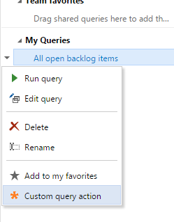
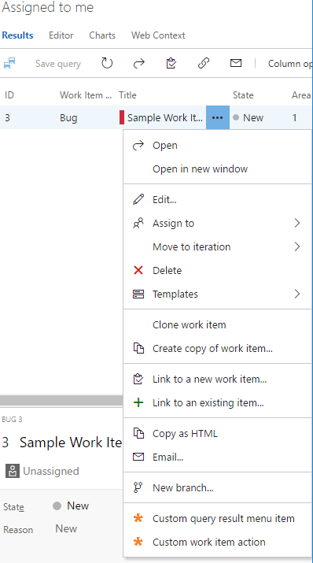
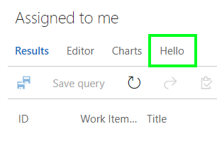
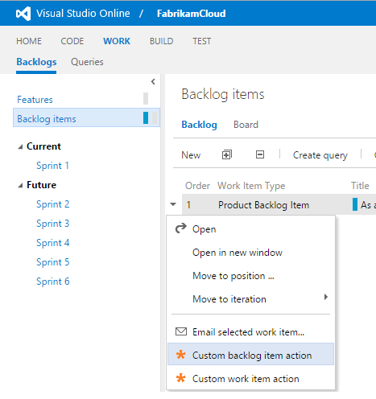
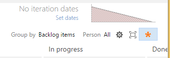
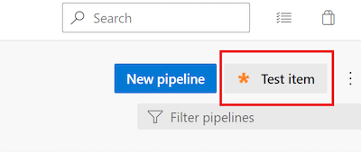
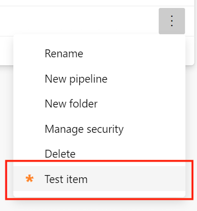
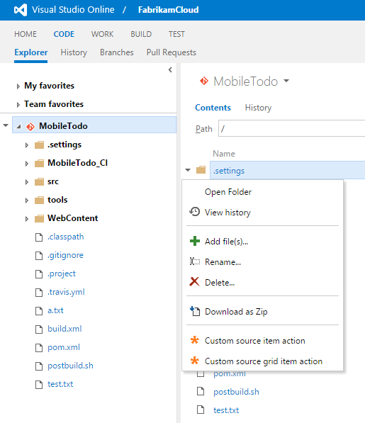
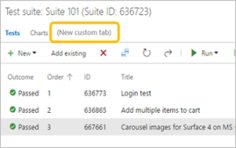

# Extensibility points

[!INCLUDE [version-lt-eq-azure-devops](../../../includes/version-lt-eq-azure-devops.md)]

Extensions enhance the Azure DevOps user experience by contributing new capabilities. In this article, we highlight the most common extensibility points that your extension can target. For more information about the Azure DevOps extensibility model, see the [Contribution model](../../develop/contributions-overview.md).

The [Contributions Guide extension](https://marketplace.visualstudio.com/items/ms-samples.samples-contributions-guide) is a sample extension. Install this extension into your organization. Once it's installed, you see the extensibility points that are available. We recommend you install this extension into a personal or test organization. The [source for this extension](https://github.com/Microsoft/vso-extension-samples/tree/master/contributions-guide) is also available. 
Also, find a sample of a repository creation extension point [here](https://github.com/microsoft/azure-devops-extension-sample/tree/master/src/Samples/RepositoryActions).

For more information, see the following references:
- [azure-devops-extension-api](/javascript/api/azure-devops-extension-api/)
- [azure-devops-extension-sdk](/javascript/api/azure-devops-extension-sdk/)
- [azure-devops-extension-sample](https://github.com/microsoft/azure-devops-extension-sample)
- [installed extension api](/rest/api/azure/devops/extensionmanagement/installed-extensions?view=azure-devops-rest-6.0&preserve-view=true)

<a name="hubs"></a>

## Hubs and hub groups

Hubs and hub groups are the primary navigation elements in Azure DevOps. **Files**, **Releases**, **Backlogs**, and **Queries** are examples of hubs. A hub belongs to a hub group. The **Files** hub, for example, belongs to the project-level **Azure Repos** hub group. Hub groups can exist at the organization or collection level or the project level. Most extensions contribute to the project level.

The following table describes the most common hub groups in Azure DevOps that you can contribute hubs to.  

::: moniker range=">= azure-devops-2019"

| Name                | ID                                         | Level                    | Preview image| 
| --------------------|--------------------------------------------|--------------------------|----------------------------- |          
| Azure Boards        | `ms.vss-work-web.work-hub-group`           | Project/team             | | 
| Azure Repos         | `ms.vss-code-web.code-hub-group`           | Project/team             | | 
| Azure Pipelines     | `ms.vss-build-web.build-release-hub-group` | Project/team             | | 
| Azure Test Plans    | `ms.vss-test-web.test-hub-group`           | Project/team             | | 
| Project settings    | `ms.vss-web.project-admin-hub-group`       | Project                  | | 
| Organization settings  | `ms.vss-web.collection-admin-hub-group` | Organization or collection  |  | 
::: moniker-end

::: moniker range="< azure-devops-2019"

| Name                | ID                                         | Level                           | Preview image| 
| --------------------|--------------------------------------------|---------------------------------|----------------------------- |          
| Code                | `ms.vss-code-web.code-hub-group`           | Project/team                    | | 
| Work                | `ms.vss-work-web.work-hub-group`           | Project/team                    | | 
| Build and Release   | `ms.vss-build-web.build-release-hub-group` | Project/team                    | | 
| Test                | `ms.vss-test-web.test-hub-group`           | Project/team                    | | 
| Project settings    | `ms.vss-web.project-admin-hub-group`       | Project                |  | 
| Collection settings | `ms.vss-web.collection-admin-hub-group`    | Collection      |  | 

::: moniker-end

### Example

The following example shows how to contribute a hub to the Code hub group:

```json
{
    ...
    "contributions": [
        {
            "id": "my-custom-hub",
            "type": "ms.vss-web.hub",
            "targets": [
                "ms.vss-code-web.code-hub-group"
            ],
            "properties": {
                "name": "Code Hub",
                "order": 30,
                "uri": "/views/code/custom.html"
            }
        }
    ]
}
```
* `ms.vss-web.hub` is the type of this contribution. This type is defined in the `vss-web` extension published under the `ms` publisher. This type declares optional and required properties that are required by contributions of this type (for example, name, order, and so on).
* `ms.vss-code-web.code-hub-group` is the full ID of the hub group contribution this hub is targeting. This contribution is declared in the `vss-code-web` extension published under the `ms` publisher
* `my-custom-hub` is the short ID of this contribution; `{publisherId}.{extensionId}.my-custom-hub` is the full ID

<a name="menus"></a>

## Add an icon to your menu or toolbar

Add an icon property, so it can be used directly by name.

We recommend providing your own icon.
Using your own icon example:

 ```"properties": {
            "name": "Sample hub",
            "uri": "dist/Hub/Hub.html",
            "icon": "asset://static/sample-icon.png",
            "supportsMobile": true
        }
```

Using the [Office UI Fabric Icons](https://uifabricicons.azurewebsites.net/) example:

```"properties": {
            "iconName": "Code",
            "name": "Code Hub",
            "order": 30,
            "uri": "/views/code/custom.html"
        }
```


## Settings for menus and toolbars

| Name                              | Target ID                                           |  
| ----------------------------------|-----------------------------------------------------| 
| Organization/collection) overview toolbar | `ms.vss-admin-web.collection-overview-toolbar-menu` | 
| Collection overview projects grid | `ms.vss-admin-web.projects-grid-menu`               | 
| Project overview toolbar          | `ms.vss-admin-web.project-overview-toolbar-menu`    | 
| Project overview teams grid       | `ms.vss-admin-web.teams-grid-menu`                  | 

<a name="menus_work"></a> 

::: moniker range=">= azure-devops-2019"

## Azure Boards menu and toolbar

| Name                            | Target ID                                         | Preview image | 
| --------------------------------|---------------------------------------------------|------------------- |
| Work item query menu            | `ms.vss-work-web.work-item-query-menu`            | | 
| Work item query results toolbar menu | `ms.vss-work-web.work-item-query-results-toolbar-menu` | | 
| Work item query results menu item | `ms.vss-work-web.query-result-work-item-menu`   | | 
| Work item query results tab     | `ms.vss-work-web.query-tabs`                      | | 
| Work item for context menu               | `ms.vss-work-web.work-item-toolbar-menu` | | 
| Backlog item menu               | `ms.vss-work-web.backlog-item-menu`               | | 
| Sprint board pivot filter menu  | `ms.vss-work-web.sprint-board-pivot-filter-menu`  | | 
| Board pivot filter menu         | `ms.vss-work-web.backlog-board-pivot-filter-menu` | | 
| Card menu                       | `ms.vss-work-web.backlog-board-card-item-menu`    |   | 
| Product backlog tab             | `ms.vss-work-web.product-backlog-tabs`            | | 
| Iteration backlog tab           | `ms.vss-work-web.iteration-backlog-tabs`          | | 
| Portfolio backlog pane          | `ms.vss-work-web.portfolio-backlog-toolpane`      | | 
| Product backlog pane            | `ms.vss-work-web.requirement-backlog-toolpane`    | | 
| Iteration backlog pane          | `ms.vss-work-web.iteration-backlog-toolpane`      | | 

::: moniker-end

::: moniker range="< azure-devops-2019"

## Work menu and toolbar

| Name                            | Target ID                                         | Preview image | 
| --------------------------------|---------------------------------------------------|-------------------| 
| Work item query menu            | `ms.vss-work-web.work-item-query-menu`            | | 
| Work item query results toolbar menu | `ms.vss-work-web.work-item-query-results-toolbar-menu` | | 
| Work item query results menu item | `ms.vss-work-web.query-result-work-item-menu`   | | 
| Work item query results tab     | `ms.vss-work-web.query-tabs`                      | | 
| Work item for context menu               | `ms.vss-work-web.work-item-toolbar-menu` | | 
| Backlog item menu               | `ms.vss-work-web.backlog-item-menu`               | | 
| Sprint board pivot filter menu  | `ms.vss-work-web.sprint-board-pivot-filter-menu`  | | 
| Board pivot filter menu         | `ms.vss-work-web.backlog-board-pivot-filter-menu` | | 
| Card menu                       | `ms.vss-work-web.backlog-board-card-item-menu`    |   | 
| Product backlog tab             | `ms.vss-work-web.product-backlog-tabs`            | | 
| Iteration backlog tab           | `ms.vss-work-web.iteration-backlog-tabs`          | | 
| Portfolio backlog pane          | `ms.vss-work-web.portfolio-backlog-toolpane`      | | 
| Product backlog pane            | `ms.vss-work-web.requirement-backlog-toolpane`    | | 
| Iteration backlog pane          | `ms.vss-work-web.iteration-backlog-toolpane`      |  |


::: moniker-end

::: moniker range=">= azure-devops-2019 <= azure-devops-2020"

## Azure Pipelines menu and toolbar

| Name                      | Target ID                                   | Preview | 
| --------------------------|---------------------------------------------|-------------------| 
| Completed build menu      | `ms.vss-build-web.completed-build-menu`     | | 
| Build definitions menu    | `ms.vss-build-web.build-definition-menu`    | | 
| Test results toolbar action    | `ms.vss-test-web.test-results-actions-menu`    | | 
| Test result details tab    | `ms.vss-test-web.test-result-details-tab-items`    | | 
| Release pipeline explorer context menu | `ms.vss-releaseManagement-web.release-definition-explorer-context-menu` | | 
| Release pipeline explorer toolbar menu | `ms.vss-releaseManagement-web.release-definition-explorer-toolbar-menu` | | 
| Release summary toolbar menu             | `ms.vss-releaseManagement-web.release-editor-tool-bar-menu`           | | 
| Release summary tab                      | `ms.vss-releaseManagement-web.release-details-view`                   | | 
| Release summary section                  | `ms.vss-releaseManagement-web.release-details-summary-tab`            | | 
::: moniker-end

::: moniker range="azure-devops"

## Azure Pipelines menu and toolbar

| Name                      | Target ID                                   | Preview | 
| --------------------------|---------------------------------------------|-------------------| 
| Completed build menu      | `ms.vss-build-web.completed-build-menu`     | | 
| Build definitions menu    | `ms.vss-build-web.build-definition-menu`    | | 
| Test results toolbar action    | `ms.vss-test-web.test-results-actions-menu`    | | 
| Test result details tab    | `ms.vss-test-web.test-result-details-tab-items`    | | 
| Release pipeline explorer context menu | `ms.vss-releaseManagement-web.release-definition-explorer-context-menu` | | 
| Release pipeline explorer toolbar menu | `ms.vss-releaseManagement-web.release-definition-explorer-toolbar-menu` | | 
| Release summary toolbar menu             | `ms.vss-releaseManagement-web.release-editor-tool-bar-menu`           | | 
| Release summary tab                      | `ms.vss-releaseManagement-web.release-details-view`                   | | 
| Release summary section                  | `ms.vss-releaseManagement-web.release-details-summary-tab`            | | 
| Pipeline details view, header button                  | `ms.vss-build-web.pipelines-header-menu`            | | 
| Pipeline details view, folder context menu                  | `ms.vss-build-web.pipelines-folder-menu`            | | 

<a name="buildtasks"></a>

### Azure Pipelines tasks

Tasks perform work in a build or release. For more information, learn how to [contribute a build or release task](../../develop/add-build-task.md).

::: moniker-end

::: moniker range="< azure-devops-2019"

## Build menu and toolbar

| Name                      | Target ID                                   | Preview image| 
| --------------------------|---------------------------------------------|-------------------| 
| Completed build menu        | `ms.vss-build-web.completed-build-menu`     | | 
| Build definitions menu      | `ms.vss-build-web.build-definition-menu`    | | 
| Test results toolbar action | `ms.vss-test-web.test-results-actions-menu`  | | 
| Test result details tab     | `ms.vss-test-web.test-result-details-tab-items` |  | 

::: moniker-end

::: moniker range="< azure-devops-2019"

## Release menu and toolbar

| Name                                     | Target ID                                                              | Preview | 
| -----------------------------------------|-------------------------------------------------------------------------|-------------------| 
| Release pipeline explorer context menu | `ms.vss-releaseManagement-web.release-definition-explorer-context-menu` | | 
| Release pipeline explorer toolbar menu | `ms.vss-releaseManagement-web.release-definition-explorer-toolbar-menu` | | 
| Release summary toolbar menu             | `ms.vss-releaseManagement-web.release-editor-tool-bar-menu`             | | 
| Release summary tab                      | `ms.vss-releaseManagement-web.release-details-view`                     | | 
| Release summary section                  | `ms.vss-releaseManagement-web.release-details-summary-tab`              | | 

::: moniker-end

<a name="menus_code"></a>

::: moniker range=">= azure-devops-2019"

## Azure Repos menu and toolbar

| Name                                | Target ID                                        | Preview image | 
| ------------------------------------|--------------------------------------------------|-------------------| 
| Source item (grid) menu             | `ms.vss-code-web.source-grid-item-menu`          | | 
| Source item (tree) menu             | `ms.vss-code-web.source-tree-item-menu`          | | 
| Source item (grid and tree) menu    | `ms.vss-code-web.source-item-menu`               |  | 
| Change list item menu               | `ms.vss-code-web.change-list-item-menu`          |  | 
| Change list summary item menu       | `ms.vss-code-web.change-list-summary-item-menu`  |  | 
| Git branches tree menu              | `ms.vss-code-web.git-branches-tree-menu`         | | 
| Git pull request actions menu       | `ms.vss-code-web.pull-request-action-menu`       | | 
| Git pull request tabs (pivots)      | `ms.vss-code-web.pr-tabs`                        | | 
| Git commit listing menu             | `ms.vss-code-web.git-commit-list-menu`           | | 
| Git commit detail menu              | `ms.vss-code-web.git-commit-details-menu`        | | 

::: moniker-end

::: moniker range="< azure-devops-2019"
## Code menu and toolbar

|Name                                | Target ID                                        | Preview image |
|------------------------------------|--------------------------------------------------|-------------------|
|Source item (grid) menu             | `ms.vss-code-web.source-grid-item-menu`          | |
|Source item (tree) menu             | `ms.vss-code-web.source-tree-item-menu`          | |
|Source item (grid and tree) menu    | `ms.vss-code-web.source-item-menu`               |  |
|Change list item menu               | `ms.vss-code-web.change-list-item-menu`          |  |
|Change list summary item menu       | `ms.vss-code-web.change-list-summary-item-menu`  |  |
|Git branches tree menu              | `ms.vss-code-web.git-branches-tree-menu`         | |
|Git pull request actions menu       | `ms.vss-code-web.pull-request-action-menu`       | |
|Git pull request tabs (pivots)      | `ms.vss-code-web.pr-tabs`                        | |
|Git commit listing menu             | `ms.vss-code-web.git-commit-list-menu`           | |
|Git commit detail menu              | `ms.vss-code-web.git-commit-details-menu`        | | 

::: moniker-end

<a name="menus_test"></a>

::: moniker range=">= azure-devops-2019"

## Azure Test Plans menu and toolbar

| Name                       | Target ID                                   | Preview image | 
| ---------------------------|---------------------------------------------|-------------------| 
| Test run grid menu         | `ms.vss-test-web.test-run-grid-menu`        | | 
| Test plan suites tree menu | `ms.vss-test-web.test-plans-suites-context` | | 
| Test plan hub pivot tab    | `ms.vss-test-web.test-plan-pivot-tabs`      | | 

::: moniker-end

::: moniker range="< azure-devops-2019"
## Test menu and toolbar

| Name                       | Target ID                                   | Preview image  | 
| ---------------------------|---------------------------------------------|-------------------| 
| Test run grid menu         | `ms.vss-test-web.test-run-grid-menu`        |  | 
| Test plan suites tree menu | `ms.vss-test-web.test-plans-suites-context` |  | 
| Test plan hub pivot tab    | `ms.vss-test-web.test-plan-pivot-tabs`      | | 

::: moniker-end

<a name="dashboard"></a>

## Other extensibility points

- **Dashboard widget**: An extension can contribute a new type of widget that can be added by users to a [dashboard](../../../report/dashboards/overview.md). Learn how to [contribute a dashboard widget](../../develop/add-dashboard-widget.md).
- **Work item form**: The work item form is enhanced by extensions with new sections, tabs, actions, and custom field renderers. For more information, learn how to 
 [extend the work item form](../../develop/add-workitem-extension.md).
- **Service hooks**: A "consumer" is the service that events are sent to in Service Hooks. An extension can contribute consumer services. These services get configured by a user (or programmatically), to send events to that service. For more information, see [contribute a service hooks consumer](../../develop/add-service-hook.md).
- **Features**:
::: moniker range="azure-devops"
   **Name:** Preview feature (hosted only)  
   **Target ID:** ms.vss-web.managed-features  
::: moniker-end
 
::: moniker range="< azure-devops"
   **Name:** Feature (on-premises only)  
   **Target ID:** ms.vss-web.managed-features-onprem  
::: moniker-end
