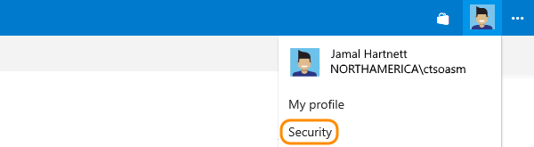
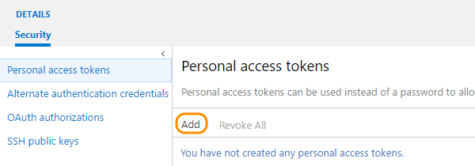
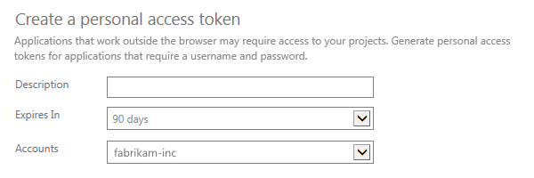
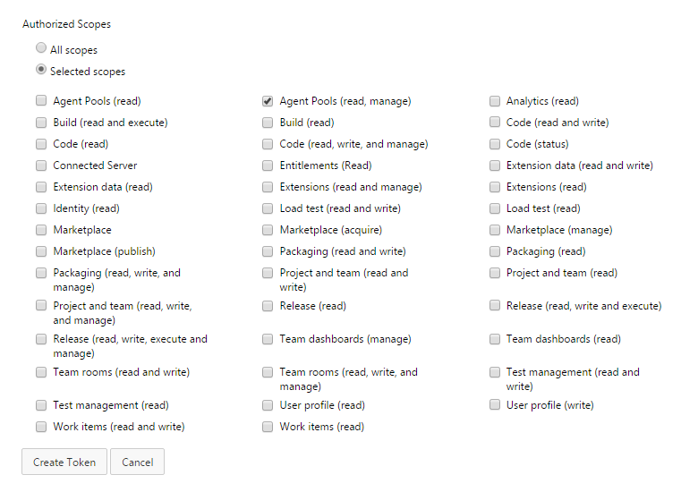
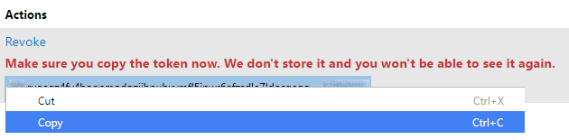
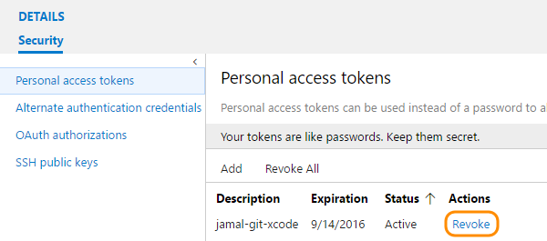

## Create personal access tokens to authenticate access

0.  Sign in to either your VSTS account (```https://{youraccount}.visualstudio.com```)
or your Team Foundation Server web portal (```https://{server}:8080/tfs/```).

0.  From your home page, open your profile. Go to your security details.

	**TFS 2017**

	

	**VSTS**

	


0. Create a personal access token.

   

0.  Name your token. Select a lifespan for your token.

	If you're using VSTS, and you have more than one account,
	you can also select the VSTS account where you want to use the token.

   

0.  Select the [scopes](../../integrate/get-started/authentication/oauth.md#scopes)
that this token will authorize for **your specific tasks**.

	For example, to create a token to enable a [build and release agent](../../pipelines/agents/agents.md) to authenticate to VSTS or TFS, 
	limit your token's scope to **Agent Pools (read, manage)**. 

   <!--   -->

0. When you're done, make sure to *copy the token*. You'll use this token as your password.

   

   **Note: Remember that this token is your identity and acts as you when it's used.
	Keep your tokens secret and treat them like your password.**

	**Tip:** To keep your token more secure, use credential managers
	so that you don't have to enter your credentials every time.
	Here are some recommended credential managers:

	*	Git: [Git Credential Manager for macOS and Linux](https://github.com/Microsoft/Git-Credential-Manager-for-Mac-and-Linux)
	or [Git Credential Manager for Windows](https://github.com/Microsoft/Git-Credential-Manager-for-Windows)
	(Requires [Git for Windows](https://www.git-scm.com/download/win))
	*	NuGet: [NuGet Credential Provider](/vsts/package/nuget/nuget-exe)

## Revoke personal access tokens to remove access

When you don't need your token anymore, just revoke it to remove access.

0. From your home page, open your profile. Go to your security details.

	**VSTS**

	

	**TFS 2017**

	


0.	Revoke access.

	
