#  Improve code quality with branch policies
#### Team Services | TFS 2015 & TFS 2017

Branch policies help teams protect their important [branches](tutorial/branches.md) of development. 
Policies enforce your team's code quality and change management standards.

## Enable branch policies

0. Open the **Branches** view on the web while viewing your repo.

	

0. Locate your branch in the view. You can search for your branch using the **Search all branches** box in the upper right.

0. Open the context menu for the branch by selecting the **...** icon. Select **Branch policies** from the context menu.

	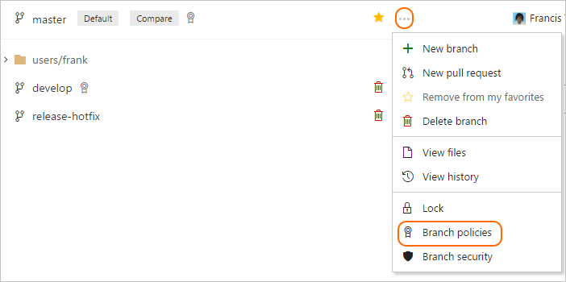   

After you set up a branch policy, you cannot directly push changes to the branch. Changes to the branch are only made through pull requests.

## Require code reviews

Code reviews are a best practice for most software development projects. 
To require teams to review their changes before completing a pull request, select **Require a minimum number of approvals before completing pull request** under **Code review requirements**.

   
### Require a minimum number of reviewers

The basic policy requires that a certain number of reviewers approves the code with no rejections.

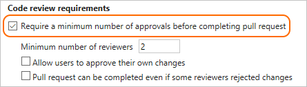  

The owner cannot review and approve their own changes if **Allow users to approve their own changes** is not selected. If any reviewer rejects
the changes, the pull request cannot be completed unless the **Pull request can be completed even if some reviewers rejected changes** is selected.

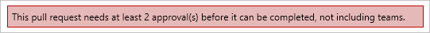

When the required number of reviewers approve the pull request, it can be completed.

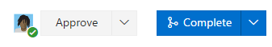 

> If you don't expect any problems with your changes, set the pull request to [automatically complete](pull-requests.md#complete-the-pull-request) when all policies are met.   

### Automatically add reviewers

Designate reviewers for specific directories and files in your repo. These reviewers are automatically added to pull requests that change files along those paths. 

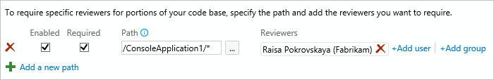

#### Require specific reviewers

If you select **Required** next to a path entry, then the pull request cannot be completed until:

* Every user added as a reviewer for the path approves the changes.
* At least one person in every group added to the path approves the changes.

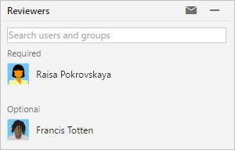

Clear the **Required** checkbox if you want to add reviewers automatically, but not require their approval to complete the pull request.

When the required reviewers approve the code, complete the pull request.

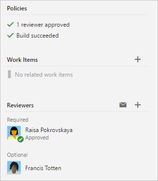   

   
## Require a successful build

Set a policy requiring changes in a pull request to build successfully with the protected branch before the pull request can be completed.
Even if you're using [continuous integration](https://www.visualstudio.com/learn/what-is-continuous-integration) (CI) on your development branches to catch problems early, build policies reduce 
build breaks and keep your tests results passing.

 0. [Create a build definition](../build/apps/index.md). Check **When team members create or update a pull request...** and select the build definition from the drop-down. 
When a new pull request is created or when changes are pushed to an existing pull request targeting this branch, a new build is queued.  Select **Block pull request completion unless there is a valid build** to require this build to complete successfully. 

    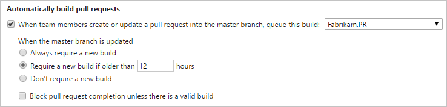   

 0. Set a build expiration to make sure that updates to your protected branch don't break changes in open pull requests.
    * **Always require a new build**: This option sets the build policy status in a pull request to failed when the protected branch is updated. You must requeue a build to refresh the build status. This setting ensures that the changes in pull requests build successfully even as the protected branch changes. This option is best for teams that have important branches with a lower volume of changes. Teams working in busy development branches may find it disruptive to wait for a build to complete every time the protected branch is updated.
    * **Require a new build if older than...hours**: This option expires the current policy status when the protected branch updates if the passing build is older than the threshold entered. This option is a compromise between always requiring a build when the protected branch updates and never requiring one. This choice is excellent for reducing the number of builds when your protected branch has frequent updates. 
    * **Don't require a new build**: Updates to the protected branch do not change the policy status. This reduces the number of builds for your branch, but can cause problems when closing pull requests that haven't been updated recently.

When the owner pushes changes that build successfully, the policy status is updated. If you have a **Always require a new build** or **Require a new build if older than..hours** build policy chosen, the policy status 
updates when the protected branch is updated if the most recent build is no longer valid.

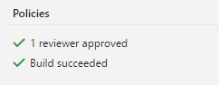

## Require linked work items

Require associations between pull requests and a work item to ensure that changes to your branch have [work item management tracking](https://www.visualstudio.com/en-us/docs/work/backlogs/connect-work-items-to-git-dev-ops).
Linking work items provides additional context for your changes and ensures that updates go through your [work item tracking process](https://www.visualstudio.com/en-us/docs/work/process/customize-process).

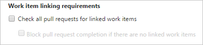

## Merge requirements

Maintain a consistent branch history by enforcing a merge strategy when a pull request is completed. 
Select **Require a specific type of merge when pull requests are completed** and pick an option to require that pull requests merge using that strategy.

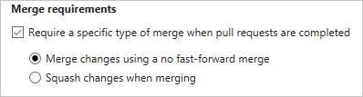

- **Merge changes using a no fast-forward merge** - This merges the commit history of the source branch when the pull request closes and creates a merge commit in the target branch. 
- **Squash changes when merging** - Complete all pull requests with a squash merge, creating a single commit with the changes in the branch. [Learn more about squash merging](merging-with-squash.md) and how it affects your branch history.

## Bypass branch policies

In some cases, you need to bypass policy requirements so you can push changes to the branch directly. For these situations, grant the **Exempt from policy enforcement** permission to a user or group. You can scope this permission to an entire project, a repo, or a single branch. Manage this permission along the with other [Git permissions](https://www.visualstudio.com/en-us/docs/setup-admin/permissions#Git).  

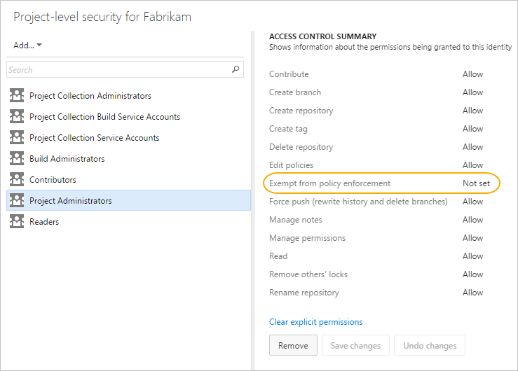

>[!IMPORTANT]
> Users with **Exempt from policy enforcement permission** set to allow can complete pull requests even if the branch policy is not satisfied. Use caution when granting this permission, especially
> at the repo and team project level.

## Q & A

<!-- BEGINSECTION class="md-qanda" -->

#### Q: When are the conditions set in branch policies checked?

Branch policies are re-evaluated on the server as changes are pushed and reviewers vote.
If there is a build triggered by the policy, the build status is set to waiting until the build completes.

#### Q: What type of wildcard characters are supported when configuring required code reviewers?
Single asterisks (`*`) are supported, and will match any number of characters, including both forward-slashes (`/`) and back-slashes (`\`).  Question marks (`?`) will match any single character.  

Examples:

* `*.sql` will match all files with the .sql extension
* `/ConsoleApplication/*` will match all files under the folder named ConsoleApplication
* `/.gitattributes` will match the .gitattributes file in the root of the repo
* `*/.gitignore` will match any .gitignore file in the repo

#### Q: Are the required code reviewer paths case-sensitive?
No, branch policies are not case-sensitive at this time.

#### Q: Can I use XAML build definitions in branch policies?
You cannot use [XAML build definitions](https://msdn.microsoft.com/library/ms181715%28v=vs.120%29.aspx) in branch policies.

#### Q: How can I configure multiple users as required reviewers, but only require that one of them approve?
You can [add the users to a group](../setup-admin/team-services/add-team-members-vs.md), and then add the group as a reviewer.  Any member of the group can then approve on behalf of the group to meet the policy requirement.

#### Q: I have the exempt from policy permission set, why am I still seeing policy failures in the pull request status?
Even for users that are exempt from policy enforcement, the configured policies are still evaluated when changes are added to a pull request.  For exempt users, policy status is advisory only and will not block completion of the pull request.

#### Q: Where can I get more information on advanced policy configurations?
Check out the [REST API documentation](http://go.microsoft.com/fwlink/?LinkId=526702) for more details.    

<!-- ENDSECTION --> 