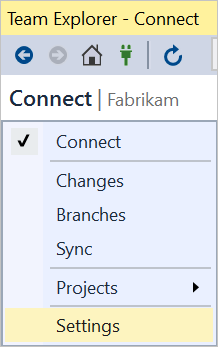
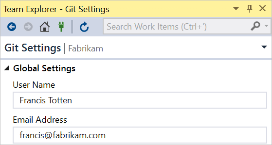
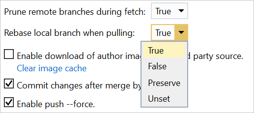
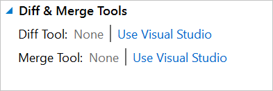

# Git preferences and settings
#### VSTS | TFS 2018

Git has a set of configuration files that define any non-default behavior that you specify.
You can specify your name and email address, your preferred diff and merge tools, command aliases, formatting, and much more. 
These files allow you to personalize and customize Git to optimize your workflow.

## Files and order of precedence

There are four files which are used to set configuration options. These files are read from widest to most narrow scope with the last file taking precedence over previously read files. 
The files are read in the following order:

0. `$(prefix)/etc/gitconfig`: System-wide configuration file.
0. `$XDG_CONFIG_HOME/git/config`: Second user-specific configuration file. If `$XDG_CONFIG_HOME` is not set or is empty, `$HOME/.config/git/config` is used. Support for this file is not included in all versions, so for compatibility reasons, its use is not recommended.
0. `~/.gitconfig`: User-specific configuration file, also known as the "global" configuration file.
0. `$GIT_DIR/config`: Repository-specific configuration file.

For more information, see the [Pro Git reference on configuration files](https://git-scm.com/docs/git-config#FILES).

## Configuring settings

Visual Studio allows you to configure and check some of the most common Git configuration settings.
**Global Settings** corresponds to the user-specific configuration file and **Repository Settings** corresponds to the repository-specific configuration file.
For settings not exposed in Visual Studio, run the following in the command line to write a value to your configuration files:

```
git config [--local|--global|--system] section.key value
```

To learn more, check out the Pro Git chapter on [customizing Git](https://git-scm.com/book/en/v2/Customizing-Git-Git-Configuration) and the [git-config documentation](https://git-scm.com/docs/git-config).

### Name and Email
The name and email that you provide will be used as the author information for any commit you author.

# [Visual Studio](#tab/visual-studio)
0. In Team Explorer, go to **Settings**.

	

0. To set your user name and email at the global level, go to **Global Settings**; to set these at the repo level, go to **Repository Settings**.

0. Provide your user name and email, then **Update** to save. Note that for **Repository Settings**, you'll first need to check **Override global user name and email settings**.

	

# [Command Line](#tab/command-line)
To set your user name, open a command prompt, navigate to the repository, and run:
```
git config user.name "Francis Totten"
```

By default, this command writes to the local repository configuration file. To write to other files, pass one of the following options: `--system`, `--global`, or `--file <filename>`.

For example, to write to the global configuration file, run:
```
git config --global user.name "Francis Totten"
```

Similarly, to set your email, run `git config --global user.email "francis@fabrikam.com"`.

---

### Prune remote branches during fetch (fetch.prune)
Pruning removes remote-tracking branches that no longer exist on the remote and helps you keep your branches list clean and up to date.
We recommend setting this option to **True** at the global level. Valid settings are:

- True (recommended)
- False
- Unset (default)

# [Visual Studio](#tab/visual-studio)
Requires Visual Studio 2017 Update 5 and later.
0. In Team Explorer, go to **Settings**.

	

0. Go to **Global Settings** and set **Prune remote branches during fetch** to **True** (recommended). Select **Update** to save.

	

# [Command Line](#tab/command-line)
To prune branches on every `fetch`, open a command prompt, and run:
```
git config --global fetch.prune true
```

This command will set fetch.prune to true in your global configuration file (recommended).

---

### Rebase local branch when pulling (pull.rebase)
Rebasing sets aside the changes made by commits in the current branch that are not in the upstream branch, resets the current branch to the upstream branch, 
then applies the changes that were set aside. Valid settings are:

- True: Rebase current branch on top of upstream branch after fetch.
- False: Merge the current branch into the upstream branch.
- Unset (default): Unless specified in other configuration files, merge the current branch into the upstream branch.
- Interactive: Rebase in interactive mode.
- Preserve: Rebase without flattening locally created merge commits.

# [Visual Studio](#tab/visual-studio)
Requires Visual Studio 2017 Update 5 and later.
0. In Team Explorer, go to **Settings**.

	

0. Go to **Global Settings** to configure this option at the global level; go to **Repository Settings** to configure this option at the repo level.

0. Set **Rebase local branch when pulling**. Select **Update** to save.

	

Note that it is not possible to configure `pull.rebase` to **Interactive** in Visual Studio. Visual Studio does not have interactive rebase support.
To configure `pull.rebase` to use interactive mode, use the command line.

# [Command Line](#tab/command-line)
To configure pull.rebase, open a command prompt, navigate to the repository, and run:
```
git config [--local|--global|--system] pull.rebase [true|false|interactive|preserve]
```

---

### Diff and Merge Tools
Git will show diffs and merge conflicts in your preferred tools. If you do not have a diff or merge tool configured, you can configure Git to use Visual Studio in **Global Settings** and **Repository Settings**:



## Verifying configuration settings
Visual Studio shows most of configuration settings in **Global Settings** and **Repository Settings**.
For settings not exposed in Visual Studio, you can open and inspect your configuration files or use the following in the command line:

```
git config --list
```