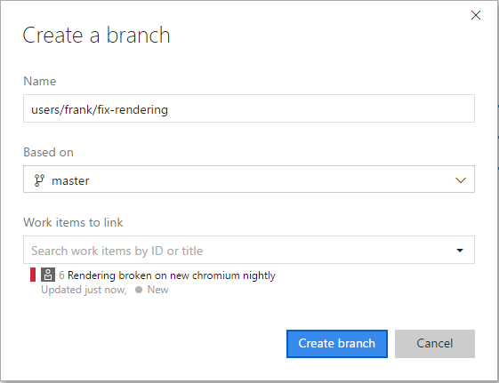

# Create a new Git branch

#### VSTS | TFS 2018 | TFS 2017

>[!TIP]
> Need help creating a new Git branch in your local repo from Visual Studio or the command line? Visit the [Git tutorial](tutorial/branches.md).   

>[!IMPORTANT]
> Users of previous TFS releases will not have the **Branches** tab in the **Code** view. Create a new branch in TFS from the **Code** view by selecting the drop-down next to the branch name and then selecting **New branch**.

## Create a new branch from the web 
   
0. From your Team Project, select the **Code** view. Make sure you're working with the right repo, then select **Branches**.

   

0. Select the **New branch** button in the upper right corner of the page.

0. In the **Create a branch** dialog, enter a name for your new branch, select a branch to base the work off of, and associate any work items.

    

0. Select **Create branch**.

>[!TIP]
> You will need to [fetch](tutorial/pulling.md) the branch before you can see it and swap to it in your local repo.