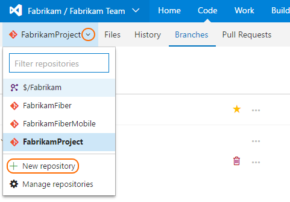
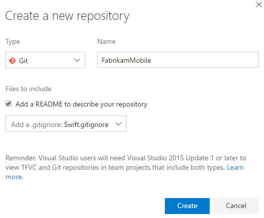

# Create a new Git repo in your team project

#### Team Services | TFS 2015 & TFS 2017 

Create new Git repos in your team projects to manage your source code as your project grows.
Every Git repo has its own set of permissions to isolate itself from other work in your project.

New to git repos? [Learn more](https://www.visualstudio.com/learn/set-up-a-git-repository/)

>[!IMPORTANT]
> You must have [Create Repository permissions](../setup-admin/permissions.md#git-repository) to create a new repo in a team project. 

## Create a repo from the web 

0. In the team project area in the web interface, select **Code**, then select the drop-down next to the current repo name and choose **New Repository...**

       
  
0. In the **Create a new repository** window, verify that Git is the repo type and enter a name for your new repo. You can also choose to add a README and create a .gitignore for the type of code you plan to manage in the repo.

   

 When you're happy with the repo name and choices, select **Create**.

0. A new empty Git repo is now created in your team project. If you created an empty repo, you'll have instructions on how to [clone](tutorial/clone.md) the repo to your computer or [push](tutorial/pushing.md) code in an existing repo into the newly created one.
If you created a README or a .gitignore, you can [clone](tutorial/clone.md) the repo using the **Clone** link on the upper right of the page to get working with a local copy of the repo immediately. 
