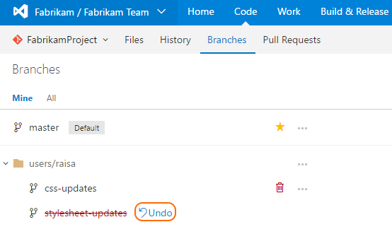

# Delete a Git branch from the web interface

#### Team Services | TFS 2017

>[!IMPORTANT]
> This topic covers deleting a Git branch via the web in Team Services and TFS 2017. If you need to delete a Git branch in your own repo from Visual Studio or the command line,
> follow [these steps](tutorial/branches.md#delete-a-branch) in the [Team Services Git tutorial](tutorial/gitworkflow.md).

0. Open your repo on the web and select the  **Branches** view.

0. Locate your branch on the branches page. If you don't see it, select **All** to view all branches and filter the branches using the **Search all branches** box in the upper right.

0. Select the trashcan icon next to the branch you want to delete. 

    

## Undo a branch delete

If you delete a branch by accident, you can undo the delete by selecting **Undo** next to the branch name.

   

If you navigate away from the branches page, you will not see the **Undo** link.  [Push](tutorial/pushing.md) your branch from your local repo
to your Team Services to restore it. 
