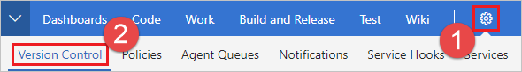
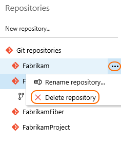
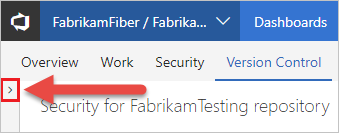

# Delete a Git repo from your team project
#### VSTS | TFS 2018 | TFS 2017 | TFS 2015

Remove unused Git repos from your team project when they are no longer needed. 

>[!TIP]
> Consider [renaming](repo-rename.md) the repo and [locking](lock-branches.md) its default branch instead of removing it. The [commit history](tutorial/history.md) of the repo will be lost when it is deleted.   

>[!IMPORTANT]
> You cannot remove a repo if it is the only Git repo in the Project. If you need to delete the only Git repo in a Project, [create a new Git repo](create-new-repo.md) first, then delete the repo.
>      
> You must have [Delete Repository permissions](../security/set-git-tfvc-repository-permissions.md#git-repository) to delete a repo from a team project. 

>[!NOTE]
>The steps in this article show how to delete a Git repo from your team project. If you want to delete the entire team project, see [Delete a team project](../accounts/delete-team-project.md).

## Delete a Git repo from the web 

0. Select the settings icon in the web to bring up the project administration page and choose **Version Control**.

   
   

0. Select the Git repository to remove from the list shown and select the **...** next to the name. Choose **Delete Repository**.

   

   >[!NOTE]
   >If the **Repositories** pane is not expanded, select **>** to expand it and display the list of repositories.
   >
   >

0. Confirm the deletion of the repository by typing the repo's name and selecting **Delete**.

