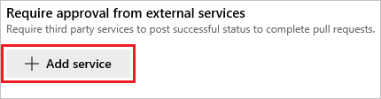
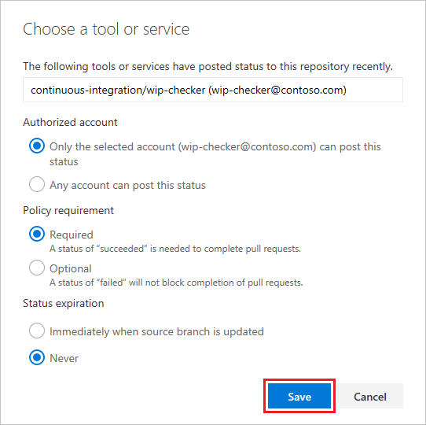

# Configure a branch policy for an external service 

#### Visual Studio Team Services | TFS 2018 RC1 

Branch policies are a powerful feature to ensure high quality code in your repo by establishing requirements for all pull requests.  External services can use the PR [Status API](https://go.microsoft.com/fwlink/?linkid=854107) to post detailed status to your PRs.  The branch policy for external services brings the ability for those 3rd party services to participate in the PR workflow and establish policy requirements.  This article guides you through the process of configuring a branch policy for a service that is posting PR status.  For more information about PR status, see [Create a pull request status server](https://go.microsoft.com/fwlink/?linkid=854108).

## Prerequisites

* A VSTS account with a Git repo. If you don't have a VSTS account, [sign up](../../accounts/create-account-with-work-school.md) to upload and share code in free unlimited private Git repositories.
* A service that posts status to PRs.  See [Create a pull request status server](https://go.microsoft.com/fwlink/?linkid=854108).

## Configure the branch policy 

1. Navigate to Code > Branches and find the branch that you want to configure the policy on (typically `master` or `develop`).  From the context menu, select the **Branch policies** option.

    

2. Select **Protect this branch** then find the policy to **Require approval from external services**.  Select **Add service**.

    

3. Select the service you want to create a policy for from the list.

  

  **Authorized account** is used to enforce that status from only the specified account will be counted towards the policy fulfillment.  

  **Policy requirement** determines whether or not this policy is optional or required to complete pull requests into the branch.  

  **Status expiration** is used to determine when a posted status is no longer valid.  If the status posted is specific to the latest code (i.e. a build), use the option to expire when the source branch changes.  

## Create a new pull request

1. Create a new pull request into the branch where the policy is defined.  For more information, see [Create a pull request](https://review.docs.microsoft.com/en-us/vsts/git/tutorial/pullrequest).

2. After creating the PR, the new policy will appear in the Policies section of the PR details view.  Initially, the policy will appear as not set until the external service has posted status.  

    

    When the service has posted status, the policy will update accordingly. Completion will be blocked until the policy approves the PR.

    

    When the policy criteria are met, and the service posts a `succeeded` status, the PR will be approved and completion will be unblocked.

    

## Summary
In this article, you learned how to configure a branch policy for an external service.  