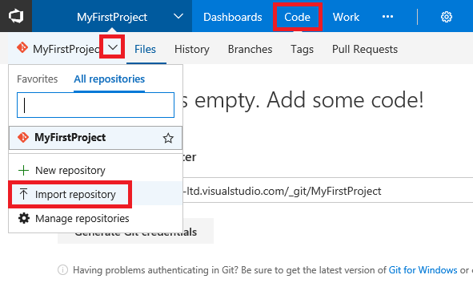
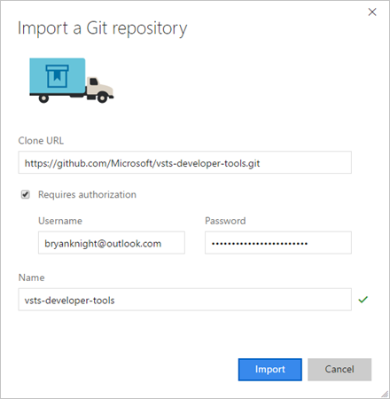
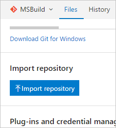

# Import a Git repo
#### VSTS | TFS 2018 | TFS 2017 Update 1

This guide shows you how to import an existing Git repo from GitHub, Bitbucket, GitLab, or other location into a new or empty existing repo in your VSTS project.

## Prerequisites

* A VSTS account. If you don’t have one, you can [sign up](../accounts/create-account-msa-or-work-student.md) for one for free. Each account includes free, unlimited private Git repositories.
  * If you are using TFS, you must have TFS 2017 Update 1 or higher. For instructions on manually importing a Git repo using TFS 2017 RTM, see [Manually import a repo](#manually-import-a-repo).

## Import into a new repo

From the repo drop-down, select **Import repository**. 



If the source repo is publicly available, just [enter the clone URL](tutorial/clone.md#clone_url) of the source repository and a name for your new Git repository.

If the source repository is private but can be accessed using basic authentication (username-password, personal access token, etc.),  select **Requires authorization** and enter the your credentials.



## Import into an existing empty repo

On the **Files** page of the empty Git repository, select **Import** and [enter the clone URL](tutorial/clone.md#clone_url). You will need to provide credentials if the source repository requires authentication. 



>[!NOTE]
>The import feature disables automated linking for work items mentioned in a commit comment since the work item IDs in the destination project might not be the same as ones in the source project. Automatic linking for work items mentioned in a commit can be re-enabled by navigating to **Settings**, **Version Control**,  selecting your repository, and choosing **Options**. For more information on linking commits with work items, see [How do I associate my commits with work items?](share-your-code-in-git-vs-2017.md#how-do-i-associate-my-commits-with-work-items)

## Manually import a repo

The import repo feature was introduced in TFS 2017 Update 1. If you are using TFS 2017 RTM, you can use the following steps to manually import a repo into TFS 2017 RTM. You can also follow these steps to manually import a repo into a VSTS repo by replacing TFS with VSTS in the following steps.

0. Clone the source repo to a temporary folder on your computer using the `bare` option, as shown in the following command line example, and then navigate to the repo's folder. Note that when cloning using the `bare` option, the folder name includes the `.git` suffix. In this example, `https://github.com/contoso/old-contoso-repo.git` is the source repo to be manually imported.

    ```
    git clone --bare https://github.com/contoso/old-contoso-repo.git
    cd old-contoso-repo.git
    ```

0. [Create a target repo](create-new-repo.md#create-a-repo-using-the-web-portal) using TFS 2017 RTM, and make a note of the clone URL. In this example, `https://contoso-ltd.visualstudio.com/MyFirstProject/_git/new-contoso-repo` is the URL for the new target repo.

0. Run the following command to copy the source repo to the target repo.

    ```
    git push --mirror https://contoso-ltd.visualstudio.com/MyFirstProject/_git/new-contoso-repo
    ``` 

0. Delete the temporary folder by running the following commands.

    ```
    cd ..
    rm -rf old-contoso-repo.git
    ```


## Frequently asked questions

Although most of the time the import is successful, the following conditions can cause problems.

* [What if my Source repository is behind two-factor authentication?](#what-if-my-source-repository-is-behind-two-factor-authentication)
* [What if my source repository does not support multi_ack?](#what-if-my-source-repository-does-not-support-multiack)
* [Can I import from previous versions of Team Foundation Server?](#can-i-import-from-previous-versions-of-team-foundation-server)
* [Can I use MSA based credentials?](#can-i-use-msa-based-credentials)
* [Can I import from TFVC?](#can-i-import-from-tfvc)

### What if my source repository is behind two-factor authentication?

The import service uses REST APIs to validate and trigger import and cannot work directly with repositories that require two-factor authentication.
Most Git hosting providers like [GitHub](https://help.github.com/articles/creating-an-access-token-for-command-line-use/) and [VSTS](../accounts/use-personal-access-tokens-to-authenticate.md) support personal tokens which can be supplied to the import service. 

### What if my source repository does not support multi_ack?

The import service uses the [multi_ack](https://git-scm.com/book/en/v2/Git-Internals-Transfer-Protocols) capability of the Git protocol during the import.
If the source repository does not provide this capability, the import service can fail to import from the given source.
This failure can happen when creating import request or while import is in progress.

### Can I import from previous versions of Team Foundation Server?
If the source Git repository is in a TFS version earlier than TFS 2017 RTM, then import will fail.
This happens because of a contract mismatch between latest VSTS/TFS and pre-2017 RTM versions of TFS.

### Can I use MSA based credentials?
Unfortunately, MSA (Microsoft Account, formerly Live ID) based credentials will not work. Import service relies on basic authentication to communicate with the source repository. If the username / password you are using are not basic auth then authentication will fail and import will fail.
One way to check if the username / password you are using are basic auth or not is to try using Git to clone your repository using the below format

```
git clone https://<<username>>:<<password>>@<<remaining clone Url>>
```

### Can I import from TFVC?

You can migrate code from an existing TFVC repository to a new Git repository within the same account. While migrating to Git has many benefits, it is an involved process for large TFVC repositories and teams. Centralized version control systems, like TFVC, behave different than Git in fundamental ways. The switch involves a lot more than learning new commands. It is a disruptive change that requires careful planning. For more information, see [Import from TFVC to Git](import-from-tfvc.md).

## Next steps

> [!div class="nextstepaction"]
> [New to Git repos? Learn more](https://www.visualstudio.com/learn/set-up-a-git-repository/)

> [!div class="nextstepaction"]
> [Learn more about using Git in the Git tutorial](tutorial/gitworkflow.md)

