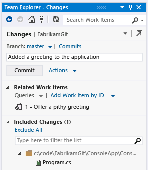

#  Use Visual Studio and Team Foundation Server with Git
#### Team Services | TFS 2015 | Visual Studio 2013

<table>
<tr>
<td>

</td>
<td>

You can begin using [Git](http://www.git-scm.com/) distributed version control before you write your first line of code with virtually no cost or risk. You get many benefits, including being able to revert to a known good state whenever you get in trouble. When you need to switch contexts, you can quickly create a private local branch. Later, you can either publish the branch or dispose of it.

All this is done on your local dev machine, with no server required. When you�re ready, you can quickly share your code and begin collaborating in TFS or on a third-party Git service.

You can use Visual Studio and Git to collaborate with your team using Team Foundation Server (on-premises or on [Visual Studio Team Services](http://tfs.visualstudio.com/)), on [CodePlex](http://www.codeplex.com/), or on a third-party service such as GitHub or Bitbucket.

<ul>
<li>[Get started using Git](get-started.md)</li>
<li>[Conduct a Git pull request](pull-requests.md)</li>
<li>[Improve code quality with branch policies](branch-policies.md)</li>
<li>[Rebase a topic branch in Visual Studio](rebase.md)</li>
<li>[Work from the Git command prompt](command-prompt.md)</li>
<li>[Rename a Git repository](repo-rename.md)</li>
<li>[Learn about Git permissions](http://msdn.microsoft.com/en-us/library/ms252587.aspx#git)</li>
</ul>

[More Git](http://go.microsoft.com/fwlink/?LinkId=392931)

</td>
</tr>
</table>
