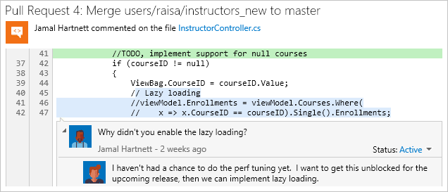

#  Git and Team Services
#### Team Services | TFS 2015 & 2017  | Visual Studio 2015 & 2017 | [Previous version](overview-2013.md)

Host and manage your code in Git version control with Team Services and Team Foundation Server. 

New to Git? [Learn more](https://www.visualstudio.com/learn-git) about how Git and Team Services can help your team ship great code.

    

        <strong style="text-align:center;">Get started</strong>
        <ul>
            <li>[Team Services Git quick start](gitquickstart.md)</li>
            <li>[Visual Studio](share-your-code-in-git-vs.md)</li>
            <li>[Command line](share-your-code-in-git-cmdline.md)</li>
            <li>[Xcode](share-your-code-in-git-xcode.md)</li>
            <li>[Eclipse](share-your-code-in-git-eclipse.md)</li>
        </ul>
    

    

        <strong style="text-align:center;">Git tutorial</strong>
        <ul>
            <li>[Git workflow](tutorial/gitworkflow.md)</li>
            <li>[Create a new repo](tutorial/creatingrepo.md)</li>
            <li>[Clone an existing repo](tutorial/clone.md)</li>
            <li>[Commit your work](tutorial/commits.md)</li>
            <li>[Push your changes](tutorial/pushing.md)</li>
            <li>[Sync with others](tutorial/pulling.md)</li>
            <li>[Undo changes](tutorial/undo.md)</li>
        </ul>
    

    

        <strong style="text-align:center;">Authenticate</strong>
        <ul>
            <li>[Authentication overview](auth-overview.md)</li>
            <li>[Git credential managers](set-up-credential-managers.md)</li>
            <li>[SSH](use-ssh-keys-to-authenticate.md)</li>
        </ul>
    

    

        <strong style="text-align:center;">Repos</strong>
        <ul>
            <li>[Create a repo](create-new-repo.md)</li>
            <li>[Delete a repo](delete-existing-repo.md)</li>
            <li>[Import a repo](import-git-repository.md)</li>
            <li>[Git and TFVC repos](team-projects.md)</li>
            <li>[Set repo permissions](../setup-admin/permissions.md#git-repository)</li> 
            <li>[Work with large files](manage-large-files.md)</li>
        </ul>
    

    

        <strong style="text-align:center;">Branches</strong>
        <ul>
            <li>[Manage your branches](manage-your-branches.md)</li>
            <li>[Create a branch strategy](https://www.visualstudio.com/en-us/articles/git-branching-guidance)</li>
            <li>[Set branch permissions](branch-permissions.md)</li>
            <li>[Lock branches](lock-branches.md)</li>
            <li>[Delete a branch](delete-branch.md)</li>
        </ul>
    

    

        <strong style="text-align:center;">Pull requests</strong>
        <ul>
            <li>[Review code with pull requests](pull-requests.md)</li>
            <li>[Squash merge pull requests (TFS 2017 only)](merging-with-squash.md)</li>
            <li>[Comment with markdown (TFS 2017 only)](../reference/markdown-guidance.md)</li>
            <li>[Set up branch policies](branch-policies.md)</li>
        </ul>
    

## Get started

Connect your favorite development environment to Team Services to access your repos and manage your work.
Team Services IDE integrations are available for [Visual Studio](../setup-admin/team-services/set-up-vs.md), 
[Visual Studio Code](https://marketplace.visualstudio.com/items?itemName=ms-vsts.team), [Eclipse](http://java.visualstudio.com/Docs/tools/eclipse), 
and [IntelliJ](https://java.visualstudio.com/Docs/tools/intelliJ).

New to Git? Learn how to share code with Git and Team Services with getting started guides for [Visual Studio](share-your-code-in-git-vs.md) , 
[Eclipse](share-your-code-in-git-eclipse.md) , [Xcode](share-your-code-in-git-xcode.md), and the [command line](share-your-code-in-git-cmdline.md).

## Git tutorial

Get up and running with Git and Team Services in just a few minutes with the [Team Services Git quick start](gitquickstart.md).

The [Team Services Git tutorial](tutorial/gitworkflow.md) walks you through Git tasks like [creating repos](tutorial/creatingrepo.md), [working in branches](tutorial/branches.md), [saving your work](tutorial/commits.md) , and [sharing your changes](tutorial/pushing.md). 
Every task is presented step-by-step in Visual Studio or from the command line.

   

## Authenticate with your repos

   

 

You can authenticate with your Team Services Git repo from any platform using [cross-platform credential managers](set-up-credential-managers.md) or [SSH public key authentication](use-ssh-keys-to-authenticate.md).

If you have code ready to share in Team Services, our getting started guides take you through the steps to connect your development environment to a Team Services Git repo and share your code with your team.

<ul>
<li>[Get Started with Visual Studio](share-your-code-in-git-vs.md)</li>
<li>[Get Started with Xcode](share-your-code-in-git-xcode.md)</li>
<li>[Get Started with Eclipse](share-your-code-in-git-eclipse.md)</li>
</ul>

## Manage your repos

 

Manage your repos and customize your team's workflow. Set up permissions to control access to your code and set up branch policies and continuous integration to prevent build breaks and catch bugs sooner.

<ul>
<li>[Create](create-new-repo.md), [delete](delete-existing-repo.md), and [rename](repo-rename.md) repos.</li>
<li>Set [repo permissions](../setup-admin/permissions.md) and [branch permissions](branch-permissions.md)</li>
<li>[Set up branch policies](branch-policies.md) to protect key branches</li>
<li>[Set up continuous integration](../build/define/triggers.md#continuous-integration-ci) to catch bugs sooner.</li>
</ul>

 

## Review code

 

Review code with your team and make sure that changes build and pass tests before it's merged.

<ul>
<li>[Create a pull request](pull-requests.md)</li>
<li>[Link work items to pull requests](pull-requests.md#link-work-items)</li> 
<li>[Set up branch policies](branch-policies.md#require-the-pull-request-to-build)</li> 
<li>[Squash merge pull requests](merging-with-squash.md)</li>
<li>[Git branch and pull request workflows](https://www.visualstudio.com/en-us/articles/git-branching-guidance)</li>
</ul>

