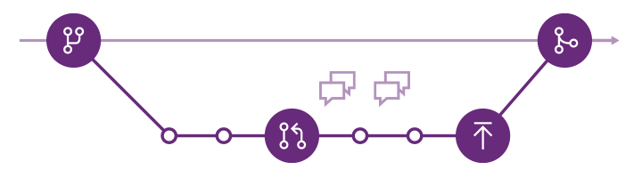
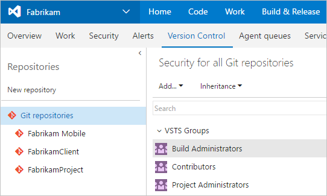

#  Git and VSTS
#### VSTS | TFS 2018 | TFS 2017 | TFS 2015 | VS 2017 | VS 2015

Host and manage your code in Git version control with VSTS and Team Foundation Server. Use version control to save your work and coordinate code changes across your team. Even if you're just a single developer, version control helps you stay organized as you fix bugs and develop new features. Version control keeps a history of your development so that you can review and even rollback to any version of your code with ease.

New to Git? [Learn more](/azure/devops/git/learn-git-with-team-services) about how Git and VSTS can help your team ship great code, and learn [how we use Git at Microsoft](/azure/devops/devops-at-microsoft/use-git-microsoft).

## Get started

Connect your favorite development environment to VSTS to access your repos and manage your work.
VSTS IDE integrations are available for [Visual Studio](../accounts/set-up-vs.md), 
[Visual Studio Code](https://marketplace.visualstudio.com/items?itemName=ms-vsts.team), [Eclipse](/vsts/java/download-eclipse-plug-in), 
and [IntelliJ](/vsts/java/download-intellij-plug-in).

New to Git? Learn how to share code with Git and VSTS with the following getting started guides:

<!--- All images are Placeholder --> 
<!-- Converting to icon48 format, this gets cleaner in YAML -->

<a href="create-new-repo.md">Web</a>

<a href="share-your-code-in-git-vs-2017.md">Visual Studio</a>

<a href="share-your-code-in-git-cmdline.md">Command-line</a>

<a href="share-your-code-in-git-xcode.md">Xcode</a>

<a href="share-your-code-in-git-eclipse.md">Eclipse</a>

<a href="create-repo-intellij.md">IntelliJ</a>

## Git tutorial

Get up and running with Git and VSTS in just a few minutes with the [VSTS Git quick start](gitquickstart.md).

The [VSTS Git tutorial](tutorial/gitworkflow.md) walks you through Git tasks like [creating repos](tutorial/creatingrepo.md), [working in branches](tutorial/branches.md), [saving your work](tutorial/commits.md), and [sharing your changes](tutorial/pushing.md). 
Every task is presented step-by-step in Visual Studio or from the command line.

   

## Authenticate with your repos

   

 

You can authenticate with your VSTS Git repo from any platform using [cross-platform credential managers](set-up-credential-managers.md) or [SSH public key authentication](use-ssh-keys-to-authenticate.md).

If you have code ready to share in VSTS, our getting started guides take you through the steps to connect your development environment to a VSTS Git repo and share your code with your team.

<ul>
<li>[Get Started with Visual Studio](share-your-code-in-git-vs.md)</li>
<li>[Get Started with Xcode](share-your-code-in-git-xcode.md)</li>
<li>[Get Started with Eclipse](share-your-code-in-git-eclipse.md)</li>
<li>[Get Started with IntelliJ](create-repo-intellij.md)</li>
</ul>

## Manage your repos

 

Manage your repos and customize your team's workflow. Set up permissions to control access to your code and set up branch policies and continuous integration to prevent build breaks and catch bugs sooner.

<ul>
<li>[Create](create-new-repo.md), [delete](delete-existing-repo.md), and [rename](repo-rename.md) repos.</li>
<li>Set [repo permissions](../security/permissions.md) and [branch permissions](branch-permissions.md)</li>
<li>[Set up branch policies](branch-policies.md) to protect key branches</li>
<li>[Set up continuous integration](../pipelines/build/triggers.md#continuous-integration-ci) to catch bugs sooner.</li>
</ul>

 

## Review code

 

Review code with your team and make sure that changes build and pass tests before it's merged.

<ul class="panelContent cardsFTitle">
    <li>
        <a href="pull-requests.md">
        

            

                

                    

                        

                            
                        

                    

                    

                        <h3>Create a pull request</h3>
                    

                

            

        

        </a>
    </li>
    <li>
        <a href="pull-requests.md#link-work-items">
        

            

                

                    

                        

                            
                        

                    

                    

                        <h3>Link work items to pull requests</h3>
                    

                

            

        

        </a>
    </li>
    <li>
        <a href="branch-policies.md#require-the-pull-request-to-build">
        

            

                

                    

                        

                            
                        

                    

                    

                        <h3>Set up branch policies</h3>
                    

                

            

        

        </a>
    </li>
    <li>
        <a href="merging-with-squash.md">
        

            

                

                    

                        

                            
                        

                    

                    

                        <h3>Squash merge pull requests</h3>
                    

                

            

        

        </a>
    </li>
    <li>
        <a href="concepts/git-branching-guidance.md">
        

            

                

                    

                        

                            
                        

                    

                    

                        <h3>Git branch and pull request workflows</h3>
                    

                

            

        

        </a>
    </li>
</ul>

