#  Review code with pull requests

#### VSTS | TFS 2015 & TFS 2017 | Visual Studio 2015 & 2017

Create pull requests to review and merge code in a [Git team project](../accounts/create-team-project.md).
Pull requests let your team give feedback on changes in feature branches before merging the code into the master branch.
Reviewers can step through the proposed changes, leave comments, and vote to approve or reject the code.

New to pull requests? [Learn more](https://www.visualstudio.com/learn/git-pull-requests/) about how to get feedback with Git pull requests.

## Create a new pull request

Create a new pull request from:

---
- Pushed feature branches to your Git repo 
- The **Development** section in a linked work item
- The **Pull Requests** tab in the **Code** view on the web
- Team Explorer in Visual Studio     

---

### After pushing a branch

When you publish or update a feature branch in your VSTS Git repo, you will get a prompt asking if would like to create a pull request in the **Code** view on the web.

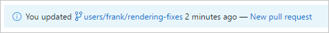

Select the **New pull request** link to go to a page where you will [enter your pull request details](pull-requests.md#finish) and create the pull request.

### From a linked work item

Create a pull request directly from a work item linked to the branch. 

0. From the **Backlogs** or **Queries** tab in the **Work** view , open the work item with the linked branch. 
0. In the **Development** area of the work item, you will see a link to create a pull request under the branch name.  

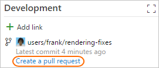

Select the link to go to a page where you will [enter your pull request details](pull-requests.md#finish) and create the pull request.

### From the Code view on the web 

Create pull requests from any branch from the **Pull Request** tab in the **Code** view on the web.  

Select **New pull request** in the upper right to go to a page where you will [enter your pull request details](pull-requests.md#finish) and create the pull request.
Pick the branch you wish to have reviewed and the branch you want to merge the changes into, such as the master branch.  

### From Visual Studio

Create pull requests directly from Visual Studio. 

0. [Connect to your Team Project from Visual Studio](../user-guide/connect-team-projects.md)
0. Open Team Explorer (select **View**, then **Team Explorer** or use the Ctrl+\, Ctrl+M hotkey)
0. Select **Pull Requests** from the navigation drop-down menu or select the **Pull Requests** button.

   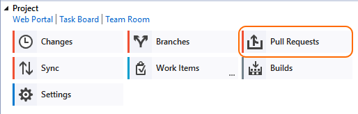

0. Select the **New Pull Request** link to open up a browser window to create a new pull request on the web.

Create pull requests from the **Branches** view in Team Explorer by right-clicking the branch name and selecting **Create pull request** while connected to your Team Project.

## Add detail to your pull request

Link work items and describe the changes in the branch to make it easier for others to see what problem you are trying to solve. 
Change the pull request title, add a detailed description, link work items, and make comments to explain your changes.

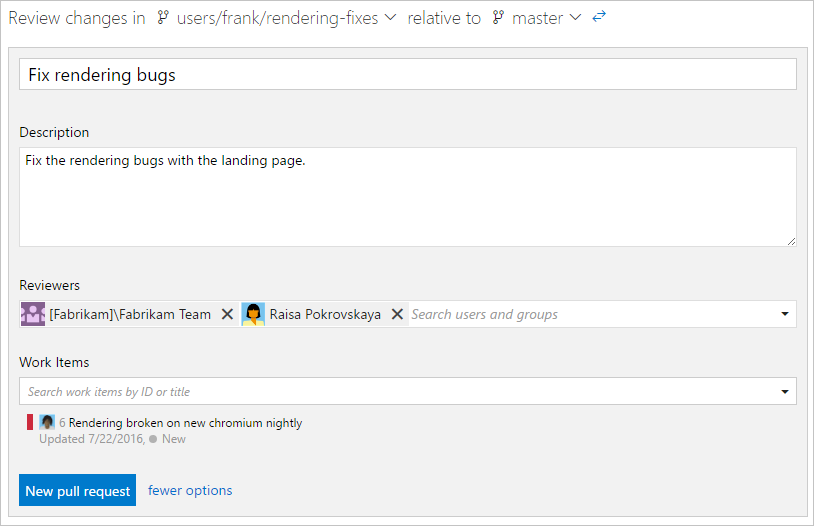

### Add and remove reviewers

Add reviewers to your pull request. 

0. Select the **Overview** tab in the pull request.

0. Select the add icon  in the **Reviewers** area.

0. Enter the name of the user or group to add to the reviewer list for the pull request. If the user isn't a member of your Team Project, you'll need to [add them](../accounts/add-team-members-vs.md).

0. As you enter a name or email address, a list of matching users or groups will appear. Select the user or group from the list to add them as a reviewer.

Remove a reviewer from a pull request by selecting the  that appears to the right of their name when you hover over them.

### Link work items

> Pull requests automatically link to work items when the source branch or any of its commits are linked to a work item.

Link work items to your pull request:

0. Select the **Overview** tab in the pull request.

0. Select the add icon  in the **Work Items** area.

0. Enter the ID of the work item or search for work items with titles that match your text. Select the work item from the list that appears.

Remove work item links by selecting the  that appears when you hover over the work item. 
This only removes the link between a work item to a pull request&mdash;links created in the branch or from commits stay in the work item.

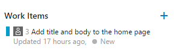

### Edit pull request title and description

Edit the pull request title description by selecting the **Edit** link that appears when you mouse over the existing description.
Update the title of a pull request by clicking the current title and updating the text.
Keep these fields up to date so reviewers know what the changes in the pull request are trying to accomplish.   

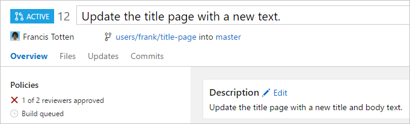

## Manage your pull requests

Manage your pull requests you own or are assigned to with the **Pull Requests** tab in the Code view on the web.
Select **Active** to show all active pull requests for the current repo. Select **Completed** or **Abandoned** to bring up a history of closed pull requests. 

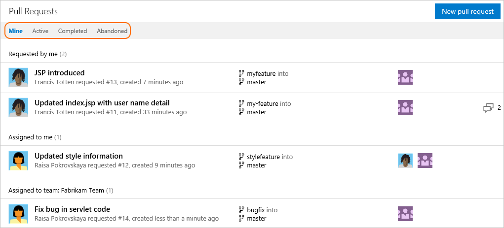 

## Review a pull request 

The **Overview** tab shows the current state of the pull request at a glance. 
Review the title, description, and discussion to get an understanding of the proposed changes and see issues brought up by other reviewers.  

### Browse code changes

Select the **Files** tab to view the differences between the most changes between the source and target branch of the pull request.    

Review previous versions of the code pushed to the source branch of the pull request from the **All changes** drop-down. 
A new version is added to the list in the drop-down and on the **Updates** tab every time the branch is updated in VSTS. 

The diff view updates as you select different changes, showing the differences between the files in the currently selected and previous version in the pull request. 
Catch up with a pull request after being away from it for awhile by stepping through changes made since your last review.

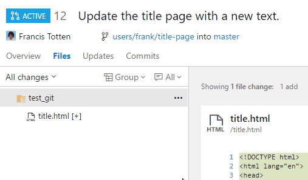

Browse a list of changes by push from the author using the **Updates** tab. You can select and view changes made in commits on the branch in the **Commits** tab.

### Leave comments

Add comments to the pull request to make suggestions, reply to previous comments, and point out problems with the proposed changes. 
Comment inline in the **Files** tab in your pull request by selecting the comment icon ().
Leave feedback not tied to a specific code change by commenting in the **Overview** tab. 
Reply directly to the author or other reviewers by using @_username_ and reference work items using #_workitem_ in your comments.

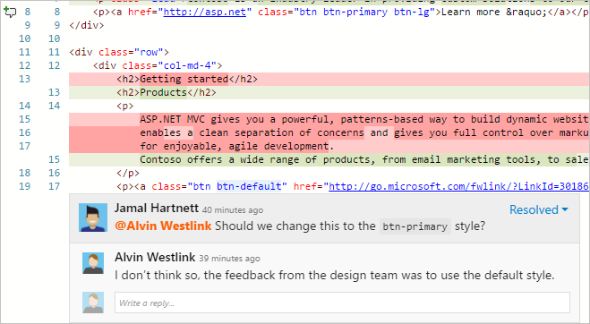

Update comment status to let reviewers know what you are doing to address the concerns brought up in their review. New comments start in **Active** status and can be updated using the 
drop-down in the comment to:

---
- **Active**: Comment is still under review.
- **Resolved**: The issue brought up in this comment has been fixed.
- **Pending** : The issue in this comment will be addressed, but isn't fixed yet.
- **Won't Fix**: Note the suggestion in the comment, but don't make changes in this pull request to address it.
- **Closed**: Discussion for this comment is closed.   

---

   
    
### Vote on the changes   

Vote on the changes in a pull request by choosing an option from the button on the upper right. The default option is **Approve**, but you can select other options from the drop-down:

---   
- **Approve with suggestions** : Agree with the pull request, but provide optional suggestions to improve the code.
- **Waiting for the author** : Do not approve the changes, and ask the author to review your comments. The author should let you know when you should re-review the code after they have addressed your concerns.
- **Rejected** : The changes aren't acceptable. If you are voting this way, you should leave a comment in the pull request detailing why the changes were rejected.    

---

The number of required approvals in a pull request is set from the [branch policy](branch-policies.md) for the branch. Pull requests can be completed if the number of required approvals is met, even if other reviewers have rejected the changes.
Votes in a pull request do not reset when new code is pushed to the branch-make sure you have [notifications](#notifications) enabled if you want to review your vote as the code changes.

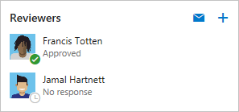

> Best practice: At least two reviewers should review and approve the changes in a significant pull request.  

## Update code in response to feedback

Update your code in response to comments by creating a new [commit](tutorial/commits.md) with the changes and [pushing](tutorial/pushing.md) the updates to the branch in your VSTS repo. 
You can make quick updates to your branch from the **Files** tab in the **Code** view on the web.

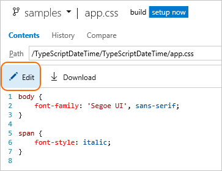

## Complete the pull request

Complete your pull request after the reviewers approve of the changes by selecting **Complete** in the upper right of the pull request view, then choose **Complete** from the drop-down. 
If you have branch policies, choose **Complete now** instead of **Auto-complete** to close the pull request if all branch policies are met. 

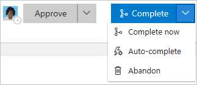

Enter the message used for the [merge commit](tutorial/merging.md) and update the pull request description as needed in the dialog that follows. 
You can choose to [squash merge](merging-with-squash.md) your pull request and delete the source branch once the merge is complete.

Linked work items will also updated showing the pull request completion.

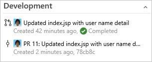

### Complete automatically

Select **Auto-complete** from the **Complete** button drop-down to complete the pull request and merge the changes as soon as all [branch policies](branch-policies.md) are met.
Auto-completion lets you skip having to come back to the pull request to complete it after the build finishes successfully and the reviewers approve the changes.
If there's a problem completing the pull request, you'll get an email notifying you what the problem is so you can fix it.

Once auto-complete has been set, the pull request will display a banner confirming that the changes will be merged as soon as the policies are satisfied.
Select **Cancel auto-complete** to turn off auto-complete and return the pull request to an active state.

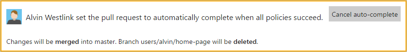

### Abandon your changes

Abandon pull requests when you decide the work in the feature branch should not be merged by selecting **Abandon** from the drop-down on the **Complete** button.
The abandoned pull request will still be viewable on the web and stays linked to work items.

Reactivate an abandoned pull request at any time by selecting the pull request from the **Abandoned** tab in the **Pull Request** view, then selecting  **Reactivate**.

#### Receiving notification of pull request updates

Subscribe to email alerts to get notified when changes are made to your pull requests. 

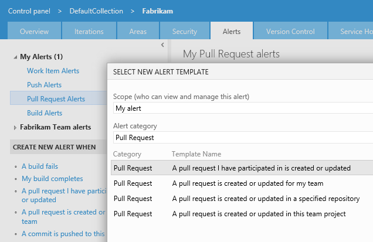

## Revert a pull request

Undo the changes made in a pull request by opening the completed pull request and selecting **Revert**. When you revert a pull request in this way, you create a new branch with changes that will
undo the pull request for an existing target branch in your repo.

In the dialog that appears, pick the branch where you want to undo the pull request changes in the **Target branch** selector and the name of a new branch where the reverted changes will be created in the **Topic branch name** field, then select **Revert**. 
Select **Create pull request** to merge the newly created branch in a second pull request to complete the revert.

> Note: The branch created during this revert has a single commit that reverts the file changes in the pull request. The branch does not contain a reverted commit for each of the commits merged in the original pull request.

## Cherry-pick a pull request

Copy changes made in a pull request to another branch in your repo by selecting **Cherry-pick** while viewing the completed pull request or selecting **Cherry-pick** from the **...** menu while viewing an active pull request.
Cherry-picking a pull request in this way creates a new branch with the copied changes that you then merge into a target branch in a second pull request.

In the dialog that appears, enter the branch you want to merge the copied changes into in the **Target branch** field and a new branch that will contain the copied changes in the **Topic branch name** field, then select **Cherry-pick**.
If there are no conflicts between the target branch and the newly created topic branch, you can then select **Create pull request** to merge the topic branch into the target branch to complete the cherry-pick.

## Set a new default branch    

> This step requires [Edit Policies permissions](../security/set-git-tfvc-repository-permissions.md#git-repository) on your Git repo. 

Configure your Git repo to use a different default branch to merge code into when your team creates new pull requests.
This is useful when you want to use a branch other than `master` for new changes or need to change your main line of development in your repo.

0. Select the settings icon while you have your team project open to bring up the project administration page.

   
   
0. Select **Version Control**.

0. Select your Git repository. Your branches are displayed under your repo.   

0. Select the **...** next to the branch you want to set as default, then select **Set as default branch**.   

   

