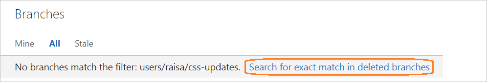

# Restore a deleted Git branch from the web portal

#### VSTS | TFS 2018

>[!IMPORTANT]
> This topic covers restoring a deleted Git branch via the web in VSTS and TFS 2018. If you need to restore a Git branch in your own repo from Visual Studio or the command line,
[push](tutorial/pushing.md) your branch from your local repo to VSTS to restore it. 

0. Open your repo on the web and select the  **Branches** view.

0. Search for the exact branch name using the **Search all branches** box in the upper right.

0. Click the link to **Search for exact match in deleted branches**. If there is a deleted branch that matches your search, you will be able to see which commit it pointed to when it was deleted,
who deleted it, and when it was deleted.

    

0. To restore the branch, select the **...** icon next to the branch name and then select **Restore branch** from the menu. The branch will be recreated at the last commit to which it pointed.
Note that branch policies and permissions will **not** be restored.

    