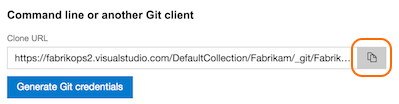

# Get started with Git from the command line
#### Team Services | TFS 2015 & 2017

Share your code in a Team Services Git repo using the command line.

> The instructions below use the default bash shell used on Linux and Mac OS X, but the Git commands will
work in any shell.

## Download and install Git

### Windows

Download and install [Git for Windows](https://git-scm.com/download/win) , which includes the [Git Credential Manager](set-up-credential-managers.md) to 
easily connect to Team Services. 

### Mac OS X

Use [Homebrew](http://brew.sh/) to install and set up Git.

<pre style="color:white;background-color:black;font-family:Consolas,Courier,monospace;padding:10px">
&gt; brew install git</pre>

### Linux and Unix

Use your distribution's package management system to download and install Git. For example, on Ubuntu:

<pre style="color:white;background-color:black;font-family:Consolas,Courier,monospace;padding:10px">
&gt; sudo apt-get install git</pre>

Refer to the [list of install commands](https://git-scm.com/download/linux) for the most up to date instructions for your Linux distribution.

## Create your local repo

Create a local Git repo for your code. 

> If your code is already in a local Git repo, you can skip this step.

0. Navigate to the folder where your code is on the command line:

   <pre style="color:white;background-color:black;font-family:Consolas,Courier,monospace;padding:10px">
&gt; cd /home/fabrikam/fiber</pre>

0. Create a Git repo on your machine to store your code. You will connect this repo to Team Services in the next step.

   <pre style="color:white;background-color:black;font-family:Consolas,Courier,monospace;padding:10px">
&gt; git init .</pre>

0. Commit your code into the local Git repo.

   <pre style="color:white;background-color:black;font-family:Consolas,Courier,monospace;padding:10px">
&gt; git add --all</pre>

   <pre style="color:white;background-color:black;font-family:Consolas,Courier,monospace;padding:10px">
&gt; git commit -m "first commit of my code"</pre>

## Create your Team Services repo

0. [Create a new Team services Git repo](create-new-repo.md) for your code. Copy the clone URL once you are done creating your repo.

   

0. Connect your local repo to the Team Services repo using the copied clone URL in the `git remote` command:

   <pre style="color:white;background-color:black;font-family:Consolas,Courier,monospace;padding:10px">
&gt; git remote add origin 
https://fabrikops2.visualstudio.com/DefaultCollection/Fabrikam/_git/FabrikamApp</pre>

## Push your code 

> Set up authentication with [credential managers](set-up-credential-managers.md) or [SSH](use-ssh-keys-to-authenticate.md) before continuing.

<pre style="color:white;background-color:black;font-family:Consolas,Courier,monospace;padding:10px">
&gt; git push origin master</pre>

## Try this next

Learn more about using Git in the [Git tutorial](tutorial/gitworkflow.md) and [create a build](../build/overview.md) for your project code.