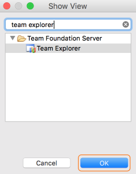
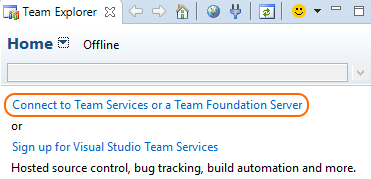
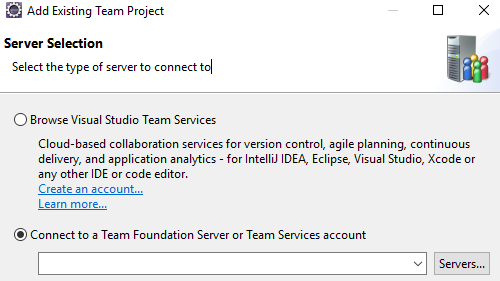
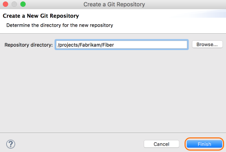
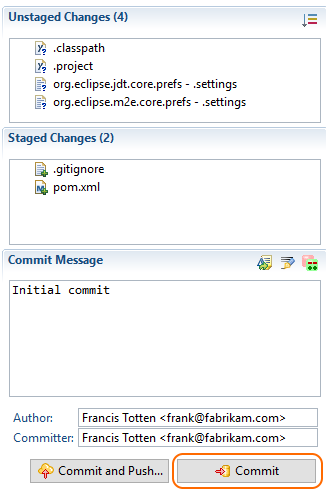
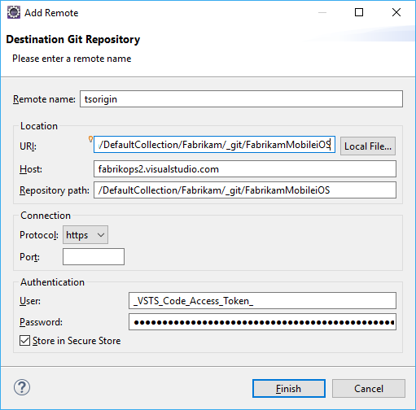

# Share your code in Git using Eclipse
#### Team Services | TFS 2015 & 2017

Share your Eclipse project with your team in a Team Services/TFS Git repo.

## Use Team Explorer Everywhere

[Team Explorer Everywhere](https://www.visualstudio.com/en-us/products/team-explorer-everywhere-vs.aspx) is an [open-source](https://github.com/Microsoft/team-explorer-everywhere) Eclipse plug-in to connect Eclipse to Team Services or Team Foundation Server. If you're working with Team Services/TFS and Eclipse, use this plugin to connect to your repos, builds, and work items. 

0. [Install the Team Explorer Everywhere plug-in](http://java.visualstudio.com/docs/tools/eclipse#_install-the-tee-plugin-for-eclipse).

0. Add the Team Explorer Everywhere view in Eclipse. Go to **Window, Show View** and select **Other...** Search for **Team Explorer**, select the **Team Explorer** view, and select **OK**.   

   

## Connect to Team Services

0. In the Team Explorer Everywhere view, select **Connect to Team Services or a Team Foundation Server** . 

   
   
   > If you don't have a Team Services account, select **Sign up for Visual Studio Team Services** to create an account now.

0. If you know your Team Services or Team Foundation Server account URL, select the **Servers...** button under **Connect to a Team Foundation Server or Team Services account** to add your TFS server or account to the drop-down list. 
If you don't know your account information for Team Services, select **Browse Visual Studio Services** and select **Next**.

   

   Either choice will prompt for your credentials before continuing further. 

0. Select the team project where you will share your code from the **Team Project Selection** dialog and select **Finish**.

## Create a local Git repo for your Eclipse project

Before you can push your project to Team Services, you need to add it to a local Git repo.

> If your code is already in a local Git repo, you can skip this step.

0. Right-click your project name in Project Explorer and select **Team, Share Project...** Select **Git** and select **Next**. 

0. Select **Create...** from the **Configure Git Repository** window and choose a folder for your local Git repo. Select **Finish**.

    

0.  Right-click your project in Project Explorer and select **Team, Commit...**. Stage your changes by dragging your files to the **Staged Changes** field, enter a commit message, then select **Commit**.

    

## Push your project to your Team Services/TFS repo

0. In Team Explorer Everywhere, select **Git Repositories**, then right-click the empty repo you want to push your Eclipse project to and select **Copy Clone URL**.

    

    > If you don't have an empty Git repo created in Team Services/TFS yet, you can create one using [these instructions](create-new-repo.md).
    
0. In Package Explorer, right-click your project and Select **Team, Push Branch ...** . Paste the clone URL from the clipboard into the **URI** field and select **Next**. Make sure **Configure upstream for push and pull** is selected in the next window and select **Next**.

    
    
0. Review the changes and select **Finish** in the **Push Branch** window.

Your project code is now your Team Services Git repo.

## Try this next

Learn more about using Git in the [Git tutorial](tutorial/gitworkflow.md) and [create a build](../build/get-started/java-maven.md) for your project code.

## Q&A

<!-- BEGINSECTION class="m-qanda" -->

#### Q: What if the Git views for commit and push don't show up?

A: You can [download EGit](http://www.eclipse.org/egit/) to use Git with Eclipse.

<!-- ENDSECTION -->