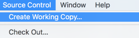
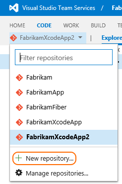
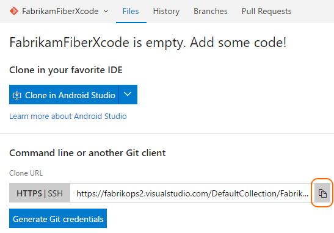
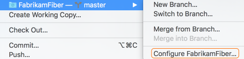
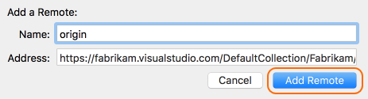
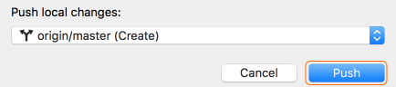
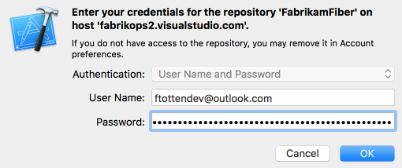

#  Share your code in Git using Xcode
#### VSTS | TFS 2018 | TFS 2017 | TFS 2015

This guide shows you how to share your Xcode projects in a VSTS Git repo. 

## Prerequisites

* A VSTS account. If you don't have one, you can [sign up](../accounts/create-account-msa-or-work-student.md) for one for free. Each account includes free, unlimited private Git repositories.

## Create a local Git repo for your Xcode project

Create a local Git repo for your code to manage your project in version control. 

* [New projects](#new-projects)
* [Existing projects](#existing-projects)

If your project is already in a local Git repo, you can skip ahead to [Create a new VSTS repo](#create-a-new-vsts-repo).

### New projects

Create a local Git repo when you create a new project. Choose **Create Git repository on My Mac** when creating a new project. 

### Existing projects

Create a local Git repo for your existing projects not in version control by going to **Source Control, Create Working Copy...** . Select the projects to add to the local Git repo and select **Create**. Xcode creates a Git repo for your code and adds a [commit](tutorial/commits.md) with your project files.

## Create a new VSTS repo

Create a new Git repo in VSTS for your Xcode project. 

If you have already created a repo for your Xcode project in VSTS, you can skip ahead to [Push your project](#push-your-project).

0. Browse to your Team Project in your VSTS account and select the drop-down  next to the name of the current Git repo. Select **New Repository..**  
  

0. Enter a name for your new Git repo and select **Create**. Your browser will navigate to your new empty Git repo for your Xcode project. Copy the clone URL to the clipboard so that you can use it in Xcode to connect to VSTS.  

  

  > [!NOTE]
  > If you want to use SSH to connect to your VSTS Git repo, [Set up SSH credentials](use-ssh-keys-to-authenticate.md) and use the SSH clone URL when adding the remote for your local Git repo.

## Push your project

0. Go to **Source Control** in Xcode and select **_Projectname_ -- master**, then **Configure...**  

  

0. Select **Remotes**, then select the  icon and choose **Add Remote...**

0. In the **Address** field, paste the Git clone URL for your VSTS repo copied in the previous step. Select **Add Remote**, then select **Done** to finish creating the `origin` remote for your local Git repo.  

  

0. Go to **Source Control, Push...**, enter the branchname on `origin` to push to, and select **Push**.

  

0. If prompted, enter your VSTS credentials. For **Username**, enter your VSTS username. For **Password**, enter a [Personal Access Token](../accounts/use-personal-access-tokens-to-authenticate.md) created for your user in VSTS. Select **OK**. 

  

Xcode will [push](tutorial/pushing.md) your project to your VSTS Git repo so you can share it with your team.

## Next steps

> [!div class="nextstepaction"]
> [Learn more about using Git in the Git tutorial](tutorial/gitworkflow.md)

