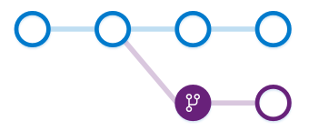

#  Create work in branches  

###### Team Services | TFS 2015 & TFS 2017 | Visual Studio 2015 & 2017

## Overview

Git branches aren't much more than a small reference that keeps an exact history of commits, so they are very cheap to create.
[Committing](commits.md) changes to a branch will not affect other branches, and you can share branches with others without having to merge the changes into the main project.
Create new branches to isolate changes for a feature or a bug fix from your master branch and other work. 

Since the branches are lightweight, switching between branches is quick and easy. 
Git does not create multiple copies of your source when working with branches&mdash;it uses the history information stored in commits to recreate the files on a branch when you start working on it.
Your [Git workflow](gitworkflow.md) should create and use branches for managing features and bugfixes.
The rest of the Git workflow, such as [sharing code](pushing.md) and [reviewing code with pull requests](pullrequest.md) all work through branches.
Isolating work in branches makes it very simple to change what you are working on by simply changing your current branch.

## Video Overview

<iframe src="https://channel9.msdn.com/series/Team-Services-Git-Tutorial/Git-Tutorial-Branches/player" width="640" height="360" allowFullScreen frameBorder="0"></iframe>

## How are Git branches created?

Create branches using the `branch` command. `Branch` creates a reference in Git for the new branch and a pointer back to the parent commit so Git can keep a history of changes as you add commits to the branch. 
When you are working with a branch that someone else shared, Git keeps an upstream tracking relationship to associate the branch on the local repo with the corresponding branch on the remote repo.
This makes it very simple to sync changes with others using [push](pushing.md) and [pull](pulling.md).

In this image, a new branch is created from the main branch. Work continues on both branches and commits are added to both branches. 

Git always adds new commits to the current local branch. Check what branch you are working on before you commit so that you don't commit changes to the wrong branch. 
Swap between local branches using the `checkout` command. Git will change the files on you computer to match the latest commit on the checked out branch.
When your work in the branch is ready to share with the rest of the team, you [push](pushing.md) the changes to update the remote branch. 

A common mistake is to make some changes and `commit` them, realize you are on an incorrect branch, then `checkout` to the correct branch.
Your most recent changes will no longer be on the filesystem since each branch has its own version of code. 
Git will bring the state of the files back to the last commit on the branch you swapped into, not the previous branch where you made your changes. 
You'll need to either [cherry-pick](cherry-pick.md) the commits from the branch or [merge](pulling.md#update-branches-with-merge) the changes into the correct branch.
 
## Create a branch

<ul class="nav nav-pills" style="padding-right:15px;padding-left:15px;padding-bottom:5px;vertical-align:top;font-size:18px;">
<li style="float:left;" data-toggle="collapse" data-target="#changeexample">How to create a branch</li>
<li style="float: right;"><a style="max-width: 374px;min-width: 120px;vertical-align: top;background-color:#AEAEAE;margin: 0px 0px 0px 8px;min-width:90px;color: #fff;border: solid 2px #AEAEAE;border-radius: 0;padding: 2px 6px 0px 6px;outline-style:none;height:32px;font-size:14px;font-weight:400" data-toggle="pill" href="#cmdline0">Command Line</a></li>
<li class="active" style="float: right"><a style="max-width: 374px;min-width: 120px;vertical-align: top;background-color:#007acc;margin: 0px 0px 0px 0px;min-width:90px;color: #fff;border: solid 2px #007acc;border-radius: 0;padding: 2px 6px 0px 6px;outline-style:none;height:32px;font-size:14px;font-weight:400" data-toggle="pill" href="#vs0">Visual Studio</a></li>
</ul>

<h6 style="padding-left:25px;">Visual Studio 2015 &amp; 2017</h6>

<ol><li>Open up Team Explorer and go to the **Branches** view.
<li> Right-click the parent branch (usually `master`) to base your changes and choose **New Local Branch From...**. 
<li>Supply a branch name in the required field and click **Create Branch**.
   
   

Visual Studio will automatically `checkout` to the newly created branch.</ol>

Use the `branch` command to create the branch and `checkout` to swap to that branch.
 
<pre style="color:white;background-color:black;font-family:Consolas,Courier,monospace;padding:10px">
&gt; git branch feature1
&gt; git checkout feature1
 Switched to branch 'feature1'
</pre>

## Delete a branch

> Deleting a branch in your local repo doesn't remove the branch on the remote.

<ul class="nav nav-pills" style="padding-right:15px;padding-left:15px;padding-bottom:5px;vertical-align:top;font-size:18px;">
<li style="float:left;" data-toggle="collapse" data-target="#changeexample1">How to delete a branch</li>
<li style="float: right;"><a style="max-width: 374px;min-width: 120px;vertical-align: top;background-color:#AEAEAE;margin: 0px 0px 0px 8px;min-width:90px;color: #fff;border: solid 2px #AEAEAE;border-radius: 0;padding: 2px 6px 0px 6px;outline-style:none;height:32px;font-size:14px;font-weight:400" data-toggle="pill" href="#cmdline1">Command Line</a></li>
<li class="active" style="float: right"><a style="max-width: 374px;min-width: 120px;vertical-align: top;background-color:#007acc;margin: 0px 0px 0px 0px;min-width:90px;color: #fff;border: solid 2px #007acc;border-radius: 0;padding: 2px 6px 0px 6px;outline-style:none;height:32px;font-size:14px;font-weight:400" data-toggle="pill" href="#vs1">Visual Studio</a></li>
</ul>

<h6 style="padding-left:25px;">Visual Studio 2015 &amp; 2017 </h6>

<ol><li>Open up Team Explorer and go to the **Branches** view.
<li>Locate the branch you want to delete. Make sure that you aren't checked out to that branch-you can't delete the branch you are currently working in.
<li>Right-click the branch name and select **Delete**. If you have unpublished changes, Visual Studio will ask and make sure you want to delete the branch so you don't possibly lose work.
   
</ol>

Delete a remote branch using the same method-locate the tree for the remote in Team Explorer's **Branches** view (such as `remotes/origin`), right-click and select **Delete**.

Delete a local branch using `git branch -d` while checked out to a different branch.
<pre style="color:white;background-color:black;font-family:Consolas,Courier,monospace;padding:10px">
&gt; git branch -d bugfix
</pre>

Deleting a remote branch requires use of the `git push` command using the `--delete` option.

<pre style="color:white;background-color:black;font-family:Consolas,Courier,monospace;padding:10px">
&gt; git push origin --delete  bugfix
</pre>

## Use branches to manage development

Git keeps track of which branch you are working on and makes sure that when you `checkout` a branch your files match the most recent commit on the branch. 
Branches let you work with multiple versions of the source code in the same local Git repository at the same time. 
Tell Git which branch you want to work on with `checkout`, and Git takes care of setting the right file versions for that branch.

You shouldn't need more than one repo on your system when you use branches to isolate your work. 
Set up your development environment one time after you [clone](clone.md), and then use Git branches to swap between feature work and bug fixing. 

## What's next

[Share code with push](pushing.md)