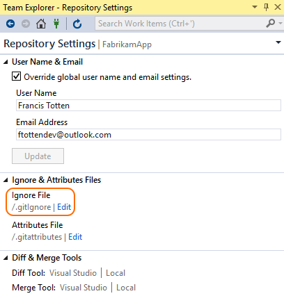

# Ignore file changes with Git

###### Team Services | TFS 2015 & TFS 2017 | Visual Studio 2015 & 2017

## Overview

Not every file created or updated in your code should be committed to Git. Temporary files from your development environment, test outputs and logs are all examples
of files that you create but are not part of your codebase. Customize which files Git tracks through the gitignore feature.

## Use gitignore to prevent tracking of files

Create a .gitignore file in your Git repo to prevent Git from staging unwanted files. 
Share the .gitignore in the default branch in your repo, so you and your team can update it to change which files to ignore. 

### Create a .gitignore

<div style="background-color: #f2f0ee;padding-top:10px;padding-bottom:10px;">
<ul class="nav nav-pills" style="padding-right:15px;padding-left:15px;padding-bottom:5px;vertical-align:top;font-size:18px;">
<li style="float:left;" data-toggle="collapse" data-target="#changeexample">How to create a .gitignore</li>
<li style="float: right;"><a style="max-width: 374px;min-width: 120px;vertical-align: top;background-color:#AEAEAE;margin: 0px 0px 0px 8px;min-width:90px;color: #fff;border: solid 2px #AEAEAE;border-radius: 0;padding: 2px 6px 0px 6px;outline-style:none;height:32px;font-size:14px;font-weight:400" data-toggle="pill" href="#cmdline0">Command Line</a></li>
<li class="active" style="float: right"><a style="max-width: 374px;min-width: 120px;vertical-align: top;background-color:#007acc;margin: 0px 0px 0px 0px;min-width:90px;color: #fff;border: solid 2px #007acc;border-radius: 0;padding: 2px 6px 0px 6px;outline-style:none;height:32px;font-size:14px;font-weight:400" data-toggle="pill" href="#vs0">Visual Studio</a></li>
</ul>

<div id="changeexample" class="tab-content collapse in fade" style="background-color: #ffffff;margin-left: 15px;margin-right:15px;padding: 5px 5px 5px 5px;">
<div id="vs0" class="tab-pane fade in active">
<h6>Visual Studio 2015 &amp; 2017</h6>

<p>Visual Studio will automatically create a .gitignore file in your repo when you [create new repo for your project](creatingrepo.md).

</div>

<div class="tab-pane fade" id="cmdline0" style="background-color: #ffffff;margin-left: 15px;margin-right:15px;padding: 5px 5px 5px 5px;">
<p>You should download a [template](https://github.com/github/gitignore) .gitignore file for your project type and customize it to meet your needs. If your project doesn't fit a template,
you can create a empty .gitignore from the command line by navigating to your Git repo and running:
<p>Windows:
<pre style="color:white;background-color:black;font-family:Consolas,Courier,monospace;padding:10px">
&gt; fsutil file createnew <font color="#b5bd68">C:\Users\frank\\myrepo\\.gitignore</font> 0
</pre>
Linux and Mac:
<pre style="color:white;background-color:black;font-family:Consolas,Courier,monospace;padding:10px">
&gt; touch <font color="#b5bd68">/home/frank/myrepo/.gitignore</font>
</pre>

</div></div></div>

> It is strongly recommended to place your .gitignore in the root folder of your repo to prevent confusion.

### Customize your .gitignore 

Modify your .gitignore to include files types, paths, and file patterns in your repo. Git starts ignoring these files as soon as the .gitignore is updated, but be sure to 
commit the changes if others on your team need the same set of ignored files.

<div style="background-color: #f2f0ee;padding-top:10px;padding-bottom:10px;">
<ul class="nav nav-pills" style="padding-right:15px;padding-left:15px;padding-bottom:5px;vertical-align:top;font-size:18px;">
<li style="float:left;" data-toggle="collapse" data-target="#changeexample1">How to customize your .gitignore</li>
<li style="float: right;"><a style="max-width: 374px;min-width: 120px;vertical-align: top;background-color:#AEAEAE;margin: 0px 0px 0px 8px;min-width:90px;color: #fff;border: solid 2px #AEAEAE;border-radius: 0;padding: 2px 6px 0px 6px;outline-style:none;height:32px;font-size:14px;font-weight:400" data-toggle="pill" href="#cmdline1">Command Line</a></li>
<li class="active" style="float: right"><a style="max-width: 374px;min-width: 120px;vertical-align: top;background-color:#007acc;margin: 0px 0px 0px 0px;min-width:90px;color: #fff;border: solid 2px #007acc;border-radius: 0;padding: 2px 6px 0px 6px;outline-style:none;height:32px;font-size:14px;font-weight:400" data-toggle="pill" href="#vs1">Visual Studio</a></li>
</ul>

<div id="changeexample" class="tab-content collapse in fade" style="background-color: #ffffff;margin-left: 15px;margin-right:15px;padding: 5px 5px 5px 5px;">
<div id="vs1" class="tab-pane fade in active">
<h6>Visual Studio 2015 &amp; 2017</h6>

<p>You can edit your .gitignore file for your repo by going to the **Settings** view in Team Explorer, then selecting **Repository Settings**. Select the **Edit** link under next to your .gitignore.
<p>



</div>

<div class="tab-pane fade" id="cmdline1" style="background-color: #ffffff;margin-left: 15px;margin-right:15px;padding: 5px 5px 5px 5px;">

<pre style="color:white;background-color:black;font-family:Consolas,Courier,monospace;padding:10px">
&gt; vim <font color="#b5bd68">/home/frank/myrepo/.gitignore</font>
</pre>

</div></div></div>
    
Each line in the .gitignore excludes a file or set of files matching a pattern. The [full gitignore syntax](https://git-scm.com/docs/gitignore) is very flexible. Here are some examples of 
the most common entries:

```bash
# ignore a single file
mycode.class

# ignore an entire directory
/mydebugdir/

# ignore a file type
*.json

# add an exception (using !) to the preceding rule to track a specific file
!package.json
```

> Windows users: All file paths in the .gitignore file use a forward slash separator and not a backslash.

## Ignore files only on your system 

Your .gitignore is shared across team members as a file committed and pushed to the Git repo. To exclude
files only on your system without pushing the changes to the rest of your team, edit the `.git/info/exclude` file in your local repo.
Changes to this file will not be shared with others and only apply to the files in that repo. The [syntax](https://git-scm.com/docs/gitignore) for this file is the 
same as the one used in .gitignore.

## Ignore files across all repos on your system

Set up a global .gitignore for use across all repos on your system using the command line `git config` tool:

<pre style="color:white;background-color:black;font-family:Consolas,Courier,monospace;padding:10px">
&gt; git config core.excludesfile <font color="#b5bd68">C:\Users\frank\.gitignore_global</font>
</pre>

This is particularly useful for ignoring entire file types you don't want to ever commit, such as compiled binaries.

## Ignore changes to committed files

#### Temporarily ignore changes

During development it's convenient to stop tracking file changes to a file committed into your git repo. This is very convenient when 
customizing settings or configuration files that are part of your project source for your own work environment.

<pre style="color:white;background-color:black;font-family:Consolas,Courier,monospace;padding:10px">
&gt; git update-index --assume-unchanged <font color="#b5bd68">&lt;file&gt;</font>
</pre>

Resume tracking files with:

<pre style="color:white;background-color:black;font-family:Consolas,Courier,monospace;padding:10px">
&gt; git update-index --no-assume-unchanged <font color="#b5bd68">&lt;file&gt;</font>
</pre>

#### Permanently ignore changes to a file

If a file is already tracked by Git, adding that file to your .gitignore is not enough to ignore changes to the file. You also need to 
remove the information about the file from Git's index:

> These steps will not delete the file from your system. They just tell Git to ignore future updates to the file.

0. Add the file in your .gitignore. 

0. Run the following:
<pre style="color:white;background-color:black;font-family:Consolas,Courier,monospace;padding:10px">
&gt; git rm --cached <font color="#b5bd68">&lt;file&gt;</font>
</pre>

0. Commit the removal of the file and the updated .gitignore to your repo. 

