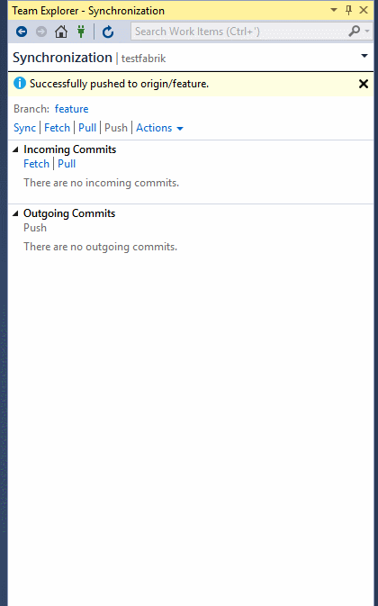
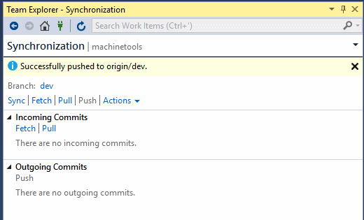

#   Update code with fetch and pull (command line)

###### Git command cmdline

## Update code with fetch and pull

Update the code in your local repo with the changes from other members of your team using the following commands:

---
- `fetch` , which downloads the changes from your remote repo but does not apply them to your code.
- `merge` , which applies changes taken from `fetch` to a branch on your local repo.
- `pull` , which is a combined command that does a `fetch` and then a `merge`.   

---

<li>
<a data-toggle="collapse" href="#expando-git-cmdline-tutorial">This article is part of the command line Git tutorial. Expand to view more Git tutorial steps &#x25BC;</a>

<ul>
<li><a href="gitworkflow-cmdline.md">Learn about Git</a></li>
<li><a href="creatingrepo-cmdline.md">Create a new repo</a></li>
<li><a href="clone-cmdline.md">Clone an existing repo</a></li>
<li><a href="commits-cmdline.md">Save work with commits</a></li>
<li><a href="branches-cmdline.md">Create work in branches</a></li>
<li><a href="pushing-cmdline.md">Share code with push</a></li>
<li><a href="pulling-cmdline.md">Update code with fetch and pull (this article)</a></li>
<li><a href="pullrequest-cmdline.md">Review code with pull requests</a></li>
<li><a href="rebase-cmdline.md">Apply changes with rebase</a></li>
<li><a href="cherry-pick-cmdline.md">Copy changes with cherry-pick</a></li>
<li><a href="merging-cmdline.md">Resolve merge conflicts</a></li>
<li><a href="undo-cmdline.md">Undo changes</a></li>
<li><a href="ignore-files-cmdline.md">Ignore files</a></li>
<li><a href="history-cmdline.md">Review history</a></li>
<li><a href="howto-cmdline.md">Frequently asked questions</a></li>
</ul>

</li> 

## Video Overview

<iframe src="https://channel9.msdn.com/series/Team-Services-Git-Tutorial/Git-Tutorial-Pull/player" width="640" height="360" allowFullScreen frameBorder="0"></iframe>

If there is a merge conflict between a commit you haven't [pushed](pushing-cmdline.md) yet and a commit you are merging or pulling, you'll need to [resolve those conflicts](merging-cmdline.md) before you finish updating your code.

## Download changes with fetch

You download changes to your local branch from the remote through `fetch`. `Fetch` asks the remote repo for all commits 
and new branches that others have pushed but you don't have and downloads them into your repo, creating local branches as needed. 

`Fetch` does not merge any changes into your local branches, it only downloads the new commits for your review.

<ul class="nav nav-pills" style="padding-right:15px;padding-left:15px;padding-bottom:5px;vertical-align:top;font-size:18px;">
<li style="float:left;" data-toggle="collapse" data-target="#changeexample">How to fetch changes</li>
<li style="float: right;"><a style="max-width: 374px;min-width: 120px;vertical-align: top;background-color:#AEAEAE;margin: 0px 0px 0px 8px;min-width:90px;color: #fff;border: solid 2px #AEAEAE;border-radius: 0;padding: 2px 6px 0px 6px;outline-style:none;height:32px;font-size:14px;font-weight:400" data-toggle="pill" href="#cmdline0">Command Line</a></li>
</ul>

<h6>Visual Studio 2015 &amp; 2017</h6>

Visual Studio uses the **Sync** view in Team Explorer to `fetch` changes. 
Changes downloaded by `fetch` are not applied until you **Pull** or **Sync** the changes.

<pre style="color:white;background-color:black;font-family:Consolas,Courier,monospace;padding:10px">
&gt; git fetch
remote: Found 3 objects to send. (9 ms)
Unpacking objects: 100% (3/3), done.
   e2ccee6..55b26a5  feature1   -&gt; origin/feature1 
</pre> 

## Update branches with merge

Apply changes downloaded through `fetch` using the `merge` command. `Merge` takes the commits retrieved from `fetch` and tries to add them to your local branch. The merge will keep the 
commit history of your local changes so that when you share your branch with [push](pushing-cmdline.md) Git will know how others should merge your changes.

The challenge with merge is when a commit taken from `fetch` conflicts with an existing unpushed commit on your branch. 
Git is generally very smart about resolving merge conflicts automatically, but sometimes you must [resolve merge conflicts manually](merging-cmdline.md) and complete the merge with a new merge commit.

<ul class="nav nav-pills" style="padding-right:15px;padding-left:15px;padding-bottom:5px;vertical-align:top;font-size:18px;">
<li style="float:left;" data-toggle="collapse" data-target="#changeexample1">How to merge changes</li>
<li style="float: right;"><a style="max-width: 374px;min-width: 120px;vertical-align: top;background-color:#AEAEAE;margin: 0px 0px 0px 8px;min-width:90px;color: #fff;border: solid 2px #AEAEAE;border-radius: 0;padding: 2px 6px 0px 6px;outline-style:none;height:32px;font-size:14px;font-weight:400" data-toggle="pill" href="#cmdline1">Command Line</a></li>
</ul>

<h6>Visual Studio 2015 &amp; 2017</h6>

Team Explorer merges when you do a **Pull** or a **Sync** from the **Changes** view. **Sync** is a combined operation of pulling remote changes and then pushing local ones,
synchronizing the commits on the local and remote branch.

Running `merge` without any flags or parameters will add the commits downloaded from `fetch` into the local branch.
Git will add a merge commit if you have any conflicts. This merge commit has two parent commits (one for each branch) and contains the changes committed to resolve the conflicts between branches. 

<pre style="color:white;background-color:black;font-family:Consolas,Courier,monospace;padding:10px">
&gt; git merge
Updating e2ccee6..55b26a5
 1 file changed, 1 insertion(+)
</pre>

You can merge without committing using `--no-commit` to attempt to perform the merge but not commit the final changes, which gives you a chance to inspect the changed files before finalizing
the merge with a commit.

  

## Fetch and merge with pull

`Pull` does a `fetch` and then a `merge` to download the commits and update your local branch in one command instead of two.
Use `pull` to quickly bring your branch up to date with the remote when you aren't worried about reviewing the changes before merging them into your own branch.

<ul class="nav nav-pills" style="padding-right:15px;padding-left:15px;padding-bottom:5px;vertical-align:top;font-size:18px;">
<li style="float:left;" data-toggle="collapse" data-target="#changeexample2">How to pull changes</li>
<li style="float: right;"><a style="max-width: 374px;min-width: 120px;vertical-align: top;background-color:#AEAEAE;margin: 0px 0px 0px 8px;min-width:90px;color: #fff;border: solid 2px #AEAEAE;border-radius: 0;padding: 2px 6px 0px 6px;outline-style:none;height:32px;font-size:14px;font-weight:400" data-toggle="pill" href="#cmdline2">Command Line</a></li>
</ul>

<h6>Visual Studio 2015 &amp; 2017</h6>

Open the Team Explorer and open the Sync view. Then click the **Pull** link under **Incoming Commits** to `pull` remote changes and merge them into your local branch. Pulling
updates files in your open project, so make sure to [commit your changes](commits-cmdline.md) before pulling.

`git pull` without any options will do a `fetch` of the changes you don't have from `origin` and will `merge` the changes for your current branch. 

<pre style="color:white;background-color:black;font-family:Consolas,Courier,monospace;padding:10px">
&gt; git pull
Updating 55b26a5..e7926cd
 1 file changed, 2 insertions(+), 1 deletion(-)
</pre>

Pull a remote branch into a local one by passing remote branch information into `pull`:

<pre style="color:white;background-color:black;font-family:Consolas,Courier,monospace;padding:10px">
&gt; git pull origin users/frank/bugfix
</pre>

This is a useful way to directly merge the work from remote branch into your local branch.

## What's next

- [Share code with push](pushing-cmdline.md)
- [Resolve merge conflicts](merging-cmdline.md)