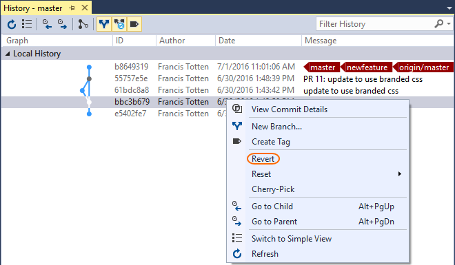

#  Undo changes (command line)

###### Git command line

## Undo changes

When undoing changes in Git, first decide what type of changes you are looking to undo. These changes fall into three categories:

- Discard uncommitted changes to a file, bringing the file back to the version in the last commit.
- Reset your local branch to a previous commit.
- Revert changes pushed to a remote branch and shared with others.

> Avoid trouble: **Never change the commit history of branches shared with others**

If you just need to make small updates such as to fix a typo or small problem introduced in your last commit, consider [amending your previous commit](commits-cmdline.md) or fixing the change
in a new commit instead of any of these other steps. 

<li>
<a data-toggle="collapse" href="#expando-git-cmdline-tutorial">This article is part of the command line Git tutorial. Expand to view more Git tutorial steps &#x25BC;</a>

<ul>
<li><a href="gitworkflow-cmdline.md">Learn about Git</a></li>
<li><a href="creatingrepo-cmdline.md">Create a new repo</a></li>
<li><a href="clone-cmdline.md">Clone an existing repo</a></li>
<li><a href="commits-cmdline.md">Save work with commits</a></li>
<li><a href="branches-cmdline.md">Create work in branches</a></li>
<li><a href="pushing-cmdline.md">Share code with push</a></li>
<li><a href="pulling-cmdline.md">Update code with fetch and pull</a></li>
<li><a href="pullrequest-cmdline.md">Review code with pull requests</a></li>
<li><a href="rebase-cmdline.md">Apply changes with rebase</a></li>
<li><a href="cherry-pick-cmdline.md">Copy changes with cherry-pick</a></li>
<li><a href="merging-cmdline.md">Resolve merge conflicts</a></li>
<li><a href="undo-cmdline.md">Undo changes (this article)</a></li>
<li><a href="ignore-files-cmdline.md">Ignore files</a></li>
<li><a href="history-cmdline.md">Review history</a></li>
<li><a href="howto-cmdline.md">Frequently asked questions</a></li>
</ul>

</li> 

## Discard uncommitted changes to a single file

Restore file contents back to a known good version, removing unwanted changes.

> Avoid trouble: These commands will overwrite your existing file changes.  If you think you might want these changes later, consider [stashing](howto-cmdline.md#stash) them instead.

<ul class="nav nav-pills" style="padding-right:15px;padding-left:15px;padding-bottom:5px;vertical-align:top;font-size:18px;">
<li style="float:left;" data-toggle="collapse" data-target="#changeexample2">How to undo file changes</li>
<li style="float: right;"><a style="max-width: 374px;min-width: 120px;vertical-align: top;background-color:#AEAEAE;margin: 0px 0px 0px 8px;min-width:90px;color: #fff;border: solid 2px #AEAEAE;border-radius: 0;padding: 2px 6px 0px 6px;outline-style:none;height:32px;font-size:14px;font-weight:400" data-toggle="pill" href="#cmdline2">Command Line</a></li>
</ul>

<h6 style="padding-left:25px;">Visual Studio 2015 &amp; 2017</h6>
<ol><li>Open up the **Changes** view in Team Explorer.
<li>Under the **Changes** section, find the file that you want to restore to the previous version. If your change is staged, remove it from the **Staged Changes** section by right-clicking and selecting **Unstage**.
<li>Right-click that file and select **Undo Changes**.    
   

</ol>

You can use the `checkout` command and give it the filename(s) to change. Use wildcards for undoing changes to multiple files.

<pre style="color:white;background-color:black;font-family:Consolas,Courier,monospace;padding:10px">
&gt; git checkout approuter.js
</pre>

You can revert the file to the version in a specific commit by providing the commit ID:

<pre style="color:white;background-color:black;font-family:Consolas,Courier,monospace;padding:10px">
&gt; git checkout 38035acd2 approuter.js
</pre>

This differs from the earlier use of the `checkout` command used to swap to a different [branch](branches-cmdline.md). 
Git will tell you if it is changing a file or swapping between branches in the output, and complain if it's not clear which one you are trying to do.

## Reset a branch to a previous state

Use `reset` to bring a branch in your local repository back to the contents of a previous commit. The most common use of the `reset` command is 
to simply discard all changed files since the last commit and return the files to the state they were in at the most recent commit.

> Avoid trouble: Don't use `reset` on branches shared with others. Use [revert](undo-cmdline.md#revert) instead.

<ul class="nav nav-pills" style="padding-right:15px;padding-left:15px;padding-bottom:5px;vertical-align:top;font-size:18px;">
<li style="float:left;" data-toggle="collapse" data-target="#changeexample">How to discard changes</li>
<li style="float: right;"><a style="max-width: 374px;min-width: 120px;vertical-align: top;background-color:#AEAEAE;margin: 0px 0px 0px 8px;min-width:90px;color: #fff;border: solid 2px #AEAEAE;border-radius: 0;padding: 2px 6px 0px 6px;outline-style:none;height:32px;font-size:14px;font-weight:400" data-toggle="pill" href="#cmdline0">Command Line</a></li>
</ul>

<h6>Visual Studio 2015 &amp; 2017</h6>

<ol><li>Open up the **Changes** view in Team Explorer. 
<li>Select **Actions** and choose **View History** from the drop-down. 
<li>In the history window that appears, right-click the commit to reset the repo to and select **Reset** from the context menu. 
<li>Choose **Reset and delete changes...**.

   

</li></ol>

<pre style="color:white;background-color:black;font-family:Consolas,Courier,monospace;padding:10px">
&gt; git reset --hard HEAD 
</pre>

The `--hard` part of the command tells Git to reset the files to the state of the previous commit and discard any staged changes. 
The `HEAD` argument tells Git to reset the local repository to the most recent commit. If you want to reset the repo to a different commit, provide the ID instead of HEAD.

   

A `reset` affects all files in the current branch on the repository, not just those in your current directory. `Reset` only discards changes that haven't 
been committed yet.

## Revert changes in shared commits

Use `revert` to undo the changes made in your commits pushed to shared branches. The `revert` command creates a new commit that undoes the changes on a previous commit. No history is rewritten
in a `revert`, making it safe to use when working with others.

<ul class="nav nav-pills" style="padding-right:15px;padding-left:15px;padding-bottom:5px;vertical-align:top;font-size:18px;">
<li style="float:left;" data-toggle="collapse" data-target="#changeexample1">How to revert changes</li>
<li style="float: right;"><a style="max-width: 374px;min-width: 120px;vertical-align: top;background-color:#AEAEAE;margin: 0px 0px 0px 8px;min-width:90px;color: #fff;border: solid 2px #AEAEAE;border-radius: 0;padding: 2px 6px 0px 6px;outline-style:none;height:32px;font-size:14px;font-weight:400" data-toggle="pill" href="#cmdline1">Command Line</a></li>
</ul>

<h6>Visual Studio 2015 &amp; 2017</h6>

Open up the **Changes** view in Team Explorer. Select **Actions** and choose **View History** from the drop-down. In the history window that appears, right-click the commit to undo and
select **Revert** from the context menu.

<pre style="color:white;background-color:black;font-family:Consolas,Courier,monospace;padding:10px">
&gt; git revert 8437fbaf
&gt; git commit
</pre>

These commands will undo the changes made in commit 8437fbaf and create a new commit on the branch. The original commit at `commit_id` is still in the Git history.
`Revert` is flexible but it requires a branch history and commit identifiers to use. Review your [history](history-cmdline.md) to find the commits you want to revert. 

## What's next

Check the other tutorial topics and learn more about Git.

- [Learn about Git](gitworkflow-cmdline.md)
- [Create a new repo](creatingrepo-cmdline.md)
- [Clone an existing repo](clone-cmdline.md)
- [Save work with commits](commits-cmdline.md)
- [Create work in branches](branches-cmdline.md)
- [Share code with push](pushing-cmdline.md)
- [Update code with fetch and pull](pulling-cmdline.md)
- [Review code with pull requests](pullrequest-cmdline.md)
- [Apply changes with rebase](rebase-cmdline.md)
- [Copy changes with cherry-pick](cherry-pick-cmdline.md)
- [Resolve merge conflicts](merging-cmdline.md)
- [Undo changes](undo-cmdline.md)
- [Ignore files](ignore-files-cmdline.md)
- [Review history](history-cmdline.md)
- [Frequently asked questions](howto-cmdline.md)