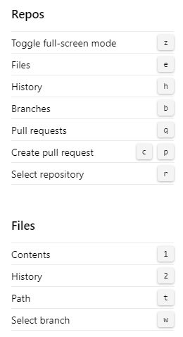
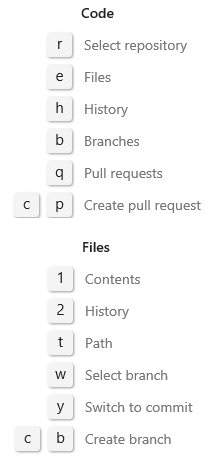

::: moniker range=">= azure-devops-2019"  
You can use the following keyboard shortcuts when you work in a page under **Repos**. To view the valid shortcuts, select **?** to access  global and service-specific shortcuts.  
::: moniker-end

::: moniker range="tfs-2018"  
You can use the following keyboard shortcuts when you work in a page under **Code**. To view the valid shortcuts, select **?** to access global and service-specific shortcuts.  
::: moniker-end

::: moniker range=">= azure-devops-2020"

### Git repositories

#### Repos Git shortcuts

|Shortcut|Action|
|---|---|
|z|Toggle full-screen mode|
|e|Open explorer|
|h|Open history|
|b|Open branches|
|q|Open pull requests|
|c, p|Create pull request|
|r|Select repository|

#### Repos files shortcuts

|Shortcut|Action|
|---|---|
|1|Open contents|
|2|Open history|
|t|Move focus to directory path|
|w|Select branch|

### TFVC repositories

  

#### Repos TFVC shortcuts

|Shortcut|Action|
|---|---|
|r|Select repository|

#### Repos TFVC code shortcuts

|Shortcut|Action|
|---|---|
|e|Open Files|
|c|Open changesets|
|v|Open shelvesets|

#### Repos TFVC files shortcuts

|Shortcut|Action|
|---|---|
|1|Open contents|
|2|Open history|
|t|Move focus to directory path|

::: moniker-end

::: moniker range="<= azure-devops-2019"

  

#### Repos or Code shortcuts

|Shortcut|Action|
|---|---|
|r|Select repository|
|e|Open explorer|
|h|Open history|
|b|Open branches (Git)|
|q|Open pull requests (Git)|
|c, p|Create pull request (Git)|
  
#### File Explorer shortcuts

|Shortcut|Action|
|---|---|
|1|Open contents|
|2|Open history|
|t|Move focus to directory path|
|w|Select branch (Git)|
|y|Switch to commit (Git)|
|c, b|Create branch (Git)|

::: moniker-end
