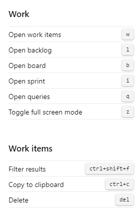
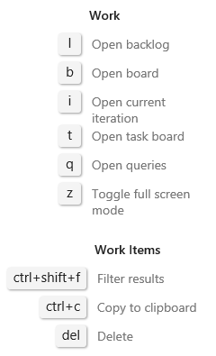

::: moniker range=">= azure-devops-2019"

You can use the following keyboard shortcuts when working from the **Boards>Work Items** or **Work>Work Items** page. 

::: moniker-end

::: moniker range="azure-devops-2019"

> [!NOTE]  
> The following shortcuts are available from the web portal for Azure DevOps Server 2019 and later versions. 

::: moniker-end

::: moniker range=">= azure-devops-2020"

:::row:::
   :::column span="2":::
        
   :::column-end:::
   :::column span="2":::
          
      **w**&nbsp;&nbsp;&nbsp;&nbsp;Open [work items](../../boards/work-items/view-add-work-items.md) 
      **l**&nbsp;&nbsp;&nbsp;&nbsp;Open [backlog](../../boards/backlogs/create-your-backlog.md) 
      **b**&nbsp;&nbsp;&nbsp;&nbsp;Open [board](../../boards/boards/kanban-quickstart.md) 
      **i**&nbsp;&nbsp;&nbsp;&nbsp;Open [sprint](../../boards/sprints/assign-work-sprint.md) 
      **q**&nbsp;&nbsp;&nbsp;&nbsp;Open [queries](../../boards/queries/using-queries.md) 
      **z**&nbsp;&nbsp;&nbsp;&nbsp;Toggle full screen 
        
      **Ctrl+Shift+f**&nbsp;&nbsp;&nbsp;Filter results 
      **Ctrl+c**&nbsp;&nbsp;&nbsp;&nbsp;&nbsp;&nbsp;&nbsp;&nbsp;&nbsp;&nbsp;&nbsp;Copy to clipboard 
      **Delete**&nbsp;&nbsp;&nbsp;&nbsp;&nbsp;&nbsp;&nbsp;&nbsp;&nbsp;&nbsp;&nbsp;&nbsp;&nbsp;Delete
   :::column-end:::
:::row-end:::
 
::: moniker-end

::: moniker range="azure-devops-2019"

:::row:::
   :::column span="2":::
        
   :::column-end:::
   :::column span="2":::
         
      **l**&nbsp;&nbsp;&nbsp;&nbsp;Open [backlog](../../boards/backlogs/create-your-backlog.md) 
      **b**&nbsp;&nbsp;&nbsp;&nbsp;Open [board](../../boards/boards/kanban-quickstart.md) 
      **i**&nbsp;&nbsp;&nbsp;&nbsp;Open [current iteration](../../boards/sprints/assign-work-sprint.md) 
      **t**&nbsp;&nbsp;&nbsp;&nbsp;Open [task board](../../boards/sprints/task-board.md) 
      **q**&nbsp;&nbsp;&nbsp;&nbsp;Open [queries](../../boards/queries/using-queries.md) 
      **z**&nbsp;&nbsp;&nbsp;&nbsp;Toggle full screen 
          
      **Ctrl+Shift+f**&nbsp;&nbsp;&nbsp;Filter results 
      **Ctrl+c**&nbsp;&nbsp;&nbsp;&nbsp;&nbsp;&nbsp;&nbsp;&nbsp;&nbsp;&nbsp;&nbsp;Copy to clipboard 
      **Delete**&nbsp;&nbsp;&nbsp;&nbsp;&nbsp;&nbsp;&nbsp;&nbsp;&nbsp;&nbsp;&nbsp;&nbsp;&nbsp;Delete 
   :::column-end:::
:::row-end:::
 
::: moniker-end

