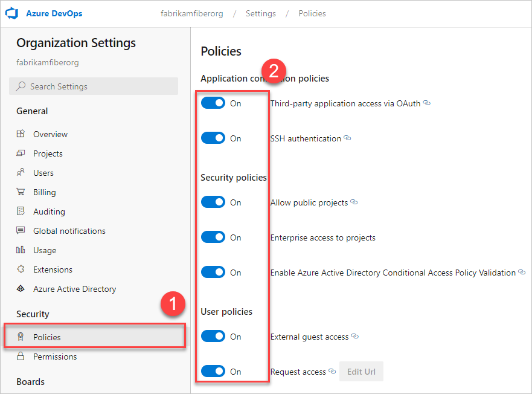

## Manage a policy

To update application connection, security, or user policies for your organization, follow these steps:

1. Sign in to your organization at `https://dev.azure.com/{Your_Organization}`.

2. Select  **Organization settings**.

   

3. Select **Policies**, then toggle the desired policy **on** or **off**.

   
