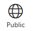

    

        <h1>Azure DevOps Documentation</h1>
        <ul class="pivots">
            <li>
                <a href="#start">Get started</a>
         <ul id="on-boarding" class="cardsY panelContent featuredContent">
            <li>             
                                    

                                        

                                            

                                                

                                                    

                                                        
                                                    

                                                

                                                

                                                    <h3><a href="/vsts/git">Repos Onboarding Guide</a></h3>
                                                    
Sign up and start developing code with distributed, flexible version control.

                                                

                                            

                                        

                                    

            </li>
            <li>                         
                                    

                                        

                                            

                                                

                                                    

                                                        
                                                    

                                                

                                                

                                                    <h3><a href="/vsts/boards/work-items">Agile Onboarding Guide</a></h3>
                                                    
Sign up and start using Agile tools to plan and track work.

                                                

                                            

                                        

                                    

            </li>
            <li>                                                
                                   

                                        

                                            

                                                

                                                    

                                                        
                                                    

                                                

                                                

                                                    <h3><a href="/vsts/pipelines">Pipelines Onboarding Guide </a></h3>
                                                    
Sign up and start building and releasing apps with continuous integration and deployment.

                                                

                                            

                                        

                                    

            </li>      
                 </ul> 
                 <ul id="start">
                    <li>
                        
                        <ul id="start-all" class="cardsL">
                            <li class="fullSpan">
                                

                                    <h1>Get started with Azure DevOps</h1>
                                    
Explore our most popular services with quickstarts, samples, and tutorials.

                                
 
                            </li>
                            <li>
                                

                                    

                                        

                                            

                                                <h3>Add your code</h3>
                                                <ul class="noBullet">
                                                    <li><a class="barLink" href="/vsts/repos/git/">Git Repositories</a></li>
                                                    <li><a class="barLink" href="/vsts/java/">Get started with Java</a></li>
                                                </ul>
                                            

                                        

                                    

                                

                            </li>
                            <li>
                                

                                    

                                        

                                            

                                                <h3>Test your code</h3>
                                                <ul class="noBullet">
                                                    <li><a class="barLink" href="/vsts/pipelines/test/set-up-continuous-testing-builds">Continuous Testing</a></li>
                                                    <li><a class="barLink" href="/vsts/test/index">Exploratory &amp; Manual Testing</a></li>
                                                    <li><a class="barLink" href="/vsts/test/load-test/index">Load Testing</a></li>
                                                </ul>
                                            

                                        

                                    

                                

                            </li>
                            <li>
                                

                                    

                                        

                                            

                                                <h3>Continuous integration &amp; delivery</h3>
                                                <ul class="noBullet">
                                                    <li><a class="barLink" href="/vsts/deploy-azure/">Deploy to Azure</a></li>
                                                    <li><a class="barLink" href="/vsts/pipelines/">Build &amp; Release</a></li>
                                                    <li><a class="barLink" href="/vsts/package/">Package Management</a></li>
                                                </ul>
                                            

                                        

                                    

                                

                            </li>
                            <li>
                                

                                    

                                        

                                            

                                                <h3>Plan &amp; track your work</h3>
                                                <ul class="noBullet">
                                                    <li><a class="barLink" href="/vsts/boards/boards/index">Boards &amp; Kanban</a></li>
                                                    <li><a class="barLink" href="/vsts/boards/backlogs/index">Backlogs</a></li>
                                                    <li><a class="barLink" href="/vsts/boards/sprints/index">Sprints (Scrum)</a></li>
                                                    <li><a class="barLink" href="/vsts/report/dashboards/index">Dashboards</a></li>
                                                </ul>
                                            

                                        

                                    

                                

                            </li>
                            <li>
                                

                                    

                                        

                                            

                                                <h3>Collaborate</h3>
                                                <ul class="noBullet">
                                                    <li><a class="barLink" href="/vsts/organizations/public/index">Public Projects</a></li>
                                                    <li><a class="barLink" href="/vsts/collaborate/index">Wiki</a></li>
                                                    <li><a class="barLink" href="/vsts/notifications/index">Notifications</a></li>
                                                    <li><a class="barLink" href="/vsts/search/index">Search</a></li>
                                                </ul>
                                            

                                        

                                    

                                

                            </li>
                            <li>
                                

                                    

                                        

                                            

                                                <h3>Navigation &amp; Settings</h3>
                                                <ul class="noBullet">
                                                    <li><a class="barLink" href="/vsts/overview/navigation/">Navigation Basics</a></li>
                                                    <li><a class="barLink" href="/vsts/settings/">Settings</a></li>
                                                </ul>
                                            

                                        

                                    

                                

                            </li>
                            <li>
                                

                                    

                                        

                                            

                                                <h3>Resources</h3>
                                                <ul class="noBullet">
                                                    <li>
                                                        <a class="barLink" href="/vsts/marketplace/overview">Marketplace</a>
                                                    </li>
                                                    <li>
                                                        <a class="barLink" href="https://www.visualstudio.com/learn/what-is-git/">Learn about Git</a>
                                                    </li>
                                                    <li>
                                                        <a class="barLink" href="https://www.visualstudio.com/learn/what-is-devops/">Learn about DevOps</a>
                                                    </li>
                                                    <li>
                                                        <a class="barLink" href="https://www.visualstudio.com/learn/what-is-agile/">Learn about Agile</a>
                                                    </li>
                                                </ul>
                                            

                                        

                                    

                                

                            </li>
                            <li>
                                

                                    

                                        

                                            

                                                <h3>Command-line tool</h3>
                                                <ul class="noBullet">
                                                    <li><a class="barLink" href="https://docs.microsoft.com/en-us/cli/vsts/overview">Azure DevOps CLI</a></li>
                                                </ul>
                                            

                                        

                                    

                                

                            </li>
                        </ul>
                    </li>
                </ul>
            </li>
            <li>
                <a href="#apps">Services</a>
                <ul id="apps">
                    <li>
                        <a data-default="true" href="#all">All</a>
                        <ul id="all" class="cardText">
                            <li>
                                

                                    <h3>Azure DevOps Repos</h3>
                                    <ul>
                                        <li><a class="barLink" href="/vsts/repos/git/index">Git Repositories</a></li>
                                        <li><a class="barLink" href="/vsts/repos/git/pullrequest">Pull Requests</a></li>
                                        <li><a class="barLink" href="/vsts/repos/git/branch-policies">Branch Policies</a></li>
                                        <li><a class="barLink" href="/vsts/repos/tfvc/index">TFVC</a></li>
                                    </ul>
                                    <h3>Azure DevOps Pipelines</h3>
                                    <ul>
                                        <li><a class="barLink" href="/vsts/pipelines/index">Build &amp; Release</a></li>
                                        <li><a class="barLink" href="/vsts/pipelines/index">Continuous Testing</a></li>
                                        <li><a class="barLink" href="/vsts/deploy-azure/index">Deploy to Azure</a></li>
                                        <li><a class="barLink" href="/vsts/package/index">Package Management</a></li>
                                    </ul>
                                    <h3>Azure DevOps Test</h3>
                                    <ul>
                                        <li><a class="barLink" href="/visualstudio/test/unit-test-your-code">Unit &amp; Functional Testing</a></li>
                                        <li><a class="barLink" href="/vsts/test/index">Exploratory &amp; Manual Testing</a></li>
                                        <li><a class="barLink" href="/vsts/test/load-test/index">Load Testing</a></li>
                                        <li><a class="barLink" href="/vsts/pipelines/index">Continuous Testing</a></li>
                                        <li><a class="barLink" href="/vsts/test/request-stakeholder-feedback">Request Stakeholder Feedback</a></li>
                                    </ul>
                                

                            </li>
                            <li>
                                

                                    <h3>Azure DevOps Agile</h3>
                                    <ul>
                                      <li><a class="barLink" href="/vsts/boards/work-items/index">Work Items</a></li>
                                        <li><a class="barLink" href="/vsts/boards/boards/index">Boards (Kanban)</a></li>
                                        <li><a class="barLink" href="/vsts/boards/backlogs/index">Backlogs</a></li>
                                        <li><a class="barLink" href="/vsts/boards/sprints/index">Sprints (Scrum)</a></li>
                                        <li><a class="barLink" href="/vsts/boards/queries/index">Queries</a></li>
                                        <li><a class="barLink" href="/vsts/settings/customize/index">Customization</a></li>
                                        <li><a class="barLink" href="/vsts/boards/plans/index">Agile at Scale</a></li>
                                    </ul>
                                    <h3>Overview (Collaborate)</h3>
                                    <ul>
                                        <li><a class="barLink" href="/vsts/project/project-vision-status">Summary</a></li>
                                        <li><a class="barLink" href="/vsts/report/dashboards/index">Dashboards</a></li>
                                        <li><a class="barLink" href="/vsts/report/analytics/what-are-analytics-views">Analytics views</a></li>
                                        <li><a class="barLink" href="/vsts/project/wiki/index">Wiki</a></li>
                                        <li><a class="barLink" href="/vsts/organizations/public/index">Public Projects</a></li> 
                                        <li><a class="barLink" href="/vsts/project/navigation/preview-features">Navigation</a></li> 
                                        <li><a class="barLink" href="/vsts/project/search/index">Search</a></li>
                                        <li><a class="barLink" href="/vsts/project/feedback/index">Feedback</a></li>
                                    </ul>
                                    <h3>Analytics</h3>
                                    <ul>
                                        <li><a class="barLink" href="/vsts/report/dashboards/index">Dashboards</a></li>
                                        <li><a class="barLink" href="/vsts/report/analytics/index">Analytics</a></li>
                                        <li><a class="barLink" href="/vsts/report/powerbi/index">Power BI</a></li>
                                        <li><a class="barLink" href="/vsts/report/extend-analytics/index">Extend Analytics with OData</a></li>
                                    </ul>
                                

                            </li>
                            <li>
                                

                                    <h3>Settings</h3>
                                    <ul>
                                        <li><a class="barLink" href="/vsts/organizations/settings/index">Project &amp; Organization Settings</a></li>
                                        <li><a class="barLink" href="/vsts/organizations/settings/about-teams-and-settings">Scale &amp; Configure Teams</a></li>
                                        <li><a class="barLink" href="/vsts/organizations/security/index">Security &amp; Identity</a></li>
                                        <li><a class="barLink" href="/vsts/organizations/settings/index">Project Management</a></li> 
                                        <li><a class="barLink" href="/vsts/organizations/public/index">Public Projects</a></li> 
                                        <li><a class="barLink" href="/vsts/organizations/accounts/index">Account Management</a></li>
                                        <li><a class="barLink" href="/vsts/billing/index">Billing</a></li>
                                        <li><a class="barLink" href="/vsts/notifications/index">Notifications</a></li>
                                        <li><a class="barLink" href="/vsts/marketplace/index">Manage Extensions</a></li>
                                    </ul>
                                    <h3>Marketplace and Extend</h3>
                                    <ul>
                                        <li><a class="barLink" href="/vsts/marketplace/overview">Discover & Manage Extensions</a></li>
                                        <li><a class="barLink" href="/vsts/extend/index">Develop Extensions</a></li>
                                        <li><a class="barLink" href="/vsts/integrate/index">Build Apps</a></li>
                                        <li><a class="barLink" href="/vsts/service-hooks/index">Service Hooks</a></li>
                                        <li><a class="barLink" href="/vsts/report/extend-analytics/index">Extend Analytics with OData</a></li>
                                        <li><a class="barLink" href="https://docs.microsoft.com/en-us/rest/api/vsts/">REST APIs</a></li>
                                        <li><a class="barLink" href="https://www.visualstudio.com/docs/integrate/extensions/reference/client/core-sdk">TypeScript APIs</a></li>
                                    </ul>
                                

                            </li>
                        </ul>
                    </li>
                   <li>
                        <a href="#onboarding-guides-cards">Onboarding</a>
                        <ul id="onboarding-guides-cards" class="cardsA">
                            <li>
                                <a href="/vsts/git">            
                                    

                                        

                                            

                                                

                                                    

                                                        
                                                    

                                                

                                                

                                                    <h3>Repos Onboarding Guide</h3>
                                                    
Sign up and start developing code with distributed, flexible version control.

                                                

                                            

                                        

                                    

                            </li>
                           <li>
                                <a href="/vsts/boards/work-items">            
                                    

                                        

                                            

                                                

                                                    

                                                        
                                                    

                                                

                                                

                                                    <h3>Agile Onboarding Guide</h3>
                                                    
Sign up and start using Agile tools to plan and track work.

                                                

                                            

                                        

                                    

                            </li>
                            <li>
                                <a href="/vsts/pipelines">            
                                    

                                        

                                            

                                                

                                                    

                                                        
                                                    

                                                

                                                

                                                    <h3>Pipelines Onboarding Guide</h3>
                                                    
Sign up and start building and releasing apps.

                                                

                                            

                                        

                                    

                            </li>
                            <li>
                                <a href="/vsts/test">            
                                    

                                        

                                            

                                                

                                                    

                                                        
                                                    

                                                

                                                

                                                    <h3>Test Onboarding Guide</h3>
                                                    
Sign up and start testing your apps.

                                                

                                            

                                        

                                    

                            </li>
                            <li>
                                <a href="/vsts/package">            
                                    

                                        

                                            

                                                

                                                    

                                                        
                                                    

                                                

                                                

                                                    <h3>Artifacts Onboarding Guide</h3>
                                                    
Sign up and start using artifacts to support continuous integration and deployment of your apps.

                                                

                                            

                                        

                                    

                            </li>
                           <li>
                                <a href="/vsts/user-guide">            
                                    

                                        

                                            

                                                

                                                    

                                                        
                                                    

                                                

                                                

                                                    <h3>Azure DevOps Enterprise Onboarding Guide</h3>
                                                    
Plan and track work, collaborate on code, and continuously deploy your apps by acquiring all Azure DevOps services. 

                                                

                                            

                                        

                                    

                            </li>
                        </ul>
                    </li>
                    <li>
                        <a href="#overview">Overview</a>
                        <ul id="overview" class="cardsA">
                            <li>
                                <a href="/vsts/project/project-vision-status">
                                    

                                        

                                            

                                                

                                                    

                                                        
                                                    

                                                

                                                

                                                    <h3>Project Summary</h3>
                                                    
Share your project vision and view cross project activity from the project summary.

                                                

                                            

                                        

                                    

                                </a>
                            </li>
                            <li>
                                <a href="/vsts/report/dashboards/index">
                                    

                                        

                                            

                                                

                                                    

                                                        
                                                    

                                                

                                                

                                                    <h3>Dashboards</h3>
                                                    
Monitor progress and trends to support improvement of team processes.

                                                

                                            

                                        

                                    

                                </a>
                            </li>
                            <li>
                                <a href="/vsts/report/analytics/what-are-analytics-views">
                                    

                                        

                                            

                                                

                                                    

                                                        
                                                    

                                                

                                                

                                                    <h3>Analytics views</h3>
                                                    
Define filter critera to support creation of Power BI reports using the Analytics service.

                                                

                                            

                                        

                                    

                                </a>
                            </li>
                            <li>
                                <a href="/vsts/project/wiki/index">
                                    

                                        

                                            

                                                

                                                    

                                                        
                                                    

                                                

                                                

                                                    <h3>READMEs &amp; Wikis</h3>
                                                    
Share information with your team and stakeholders.

                                                

                                            

                                        

                                    

                                </a>
                            </li>
                            <li>
                                <a href="/vsts/project/navigation/preview-features">
                                    

                                        

                                            

                                                

                                                    

                                                        
                                                    

                                                

                                                

                                                    <h3>Navigation Basics</h3>
                                                    
Choose an app, team, project or setting. Add work items, dashboards, and other artifacts.

                                                

                                            

                                        

                                    

                                </a>
                            </li>  
                            <li>
                                <a href="/vsts/project/search/index">
                                    

                                        

                                            

                                                

                                                    

                                                        
                                                    

                                                

                                                

                                                    <h3>Search</h3>
                                                    
Quickly find the code or work items you need to access across your account
                                                        or collection.

                                                

                                            

                                        

                                    

                                </a>
                            </li>
                        </ul>
                    </li>
                    <li>
                        <a href="#agile">Agile</a>
                        <ul id="agile" class="cardsA">
                            <li>
                                <a href="/vsts/boards/work-items/index">
                                    

                                        

                                            

                                                

                                                    

                                                        
                                                    

                                                

                                                

                                                    <h3>Work Items</h3>
                                                    
Track the features and requirements you're developing, code defects,
                                                        and issues.

                                                

                                            

                                        

                                    

                                </a>
                            </li>
                            <li>
                                <a href="/vsts/boards/boards/index">
                                    

                                        

                                            

                                                

                                                    

                                                        
                                                    

                                                

                                                

                                                    <h3>Boards (Kanban)</h3>
                                                    
Manage the continuous flow of work from concept to completion.

                                                

                                            

                                        

                                    

                                </a>
                            </li>
                            <li>
                                <a href="/vsts/boards/backlogs/index">
                                    

                                        

                                            

                                                

                                                    

                                                        
                                                    

                                                

                                                

                                                    <h3>Backlogs</h3>
                                                    
Create and organize your backlog, track features, users stories, and
                                                        bugs.

                                                

                                            

                                        

                                    

                                </a>
                            </li>
                            <li>
                                <a href="/vsts/boards/sprints/index">
                                    

                                        

                                            

                                                

                                                    

                                                        
                                                    

                                                

                                                

                                                    <h3>Sprints (Scrum)</h3>
                                                    
Plan a sprint, use a task board in daily scrums, monitor sprint burndown.

                                                

                                            

                                        

                                    

                                </a>
                            </li>
                            <li>
                                <a href="/vsts/boards/queries/index">
                                    

                                        

                                            

                                                

                                                    

                                                        
                                                    

                                                

                                                

                                                    <h3>Queries</h3>
                                                    
Find work items to bulk update and to chart progress and trends.

                                                

                                            

                                        

                                    

                                </a>
                            </li>
                            <li>
                                <a href="/vsts/settings/customize/index?toc=/vsts/settings/customize/toc.json&bc=/vsts/settings/customize/breadcrumb/toc.json">
                                    

                                        

                                            

                                                

                                                    

                                                        
                                                    

                                                

                                                

                                                    <h3>Customization</h3>
                                                    
Configure Agile tools and processes to meet your team's needs.

                                                

                                            

                                        

                                    

                                </a>
                            </li>
                            <li>
                                <a href="/vsts/boards/plans/index">
                                    

                                        

                                            

                                                

                                                    

                                                        
                                                    

                                                

                                                

                                                    <h3>Agile at Scale</h3>
                                                    
Grow your organization, support autonomous teams, and gain visibility
                                                        across teams.

                                                

                                            

                                        

                                    

                                </a>
                            </li>
                            <li>
                                <a href="/vsts/project/feedback/index">
                                    

                                        

                                            

                                                

                                                    

                                                        
                                                    

                                                

                                                

                                                    <h3>Feedback</h3>
                                                    
Request feedback on your working apps and quickly capture it within a
                                                        work item form.

                                                

                                            

                                        

                                    

                                </a>
                            </li>
                        </ul>
                    </li>
                    <li>
                        <a href="#code">Repos</a>
                        <ul id="code" class="cardsA">
 
                            <li>
                                <a href="/vsts/git">
                                    

                                        

                                            

                                                

                                                    

                                                        
                                                    

                                                

                                                

                                                    <h3>Git Repositories</h3>
                                                    
Develop code with distributed, flexible version control.

                                                

                                            

                                        

                                    

                                </a>
                            </li>
                            <li>
                                <a href="/vsts/repos/git/pull-requests">
                                    

                                        

                                            

                                                

                                                    

                                                        
                                                    

                                                

                                                

                                                    <h3>Pull Requests</h3>
                                                    
Create pull requests to review and merge code in a Git team project

                                                

                                            

                                        

                                    

                                </a>
                            </li>
                            <li>
                                <a href="/vsts/repos/git/concepts/forks">
                                    

                                        

                                            

                                                

                                                    

                                                        
                                                    

                                                

                                                

                                                    <h3>Forks</h3>
                                                    
Work in your own repo without affecting the original project.

                                                

                                            

                                        

                                    

                                </a>
                            </li>
                            <li>
                                <a href="/vsts/repos/git/branch-policies">
                                    

                                        

                                            

                                                

                                                    

                                                        
                                                    

                                                

                                                

                                                    <h3>Branch Policies</h3>
                                                    
Enforce code quality and change management standards.

                                                

                                            

                                        

                                    

                                </a>
                            </li>
                        </ul>
                    </li>
                    <li>
                        <a href="#delivery">Build and Release Pipelines</a>
                        <ul id="delivery" class="cardsA">
                            <li>
                                <a href="/vsts/pipelines/index">
                                    

                                        

                                            

                                                

                                                    

                                                        
                                                    

                                                

                                                

                                                    <h3>Build &amp; Release</h3>
                                                    
Implement continuous integration and continuous deployment.

                                                

                                            

                                        

                                    

                                </a>
                            </li>
                            <li>
                                <a href="/vsts/pipelines/index">
                                    

                                        

                                            

                                                

                                                    

                                                        
                                                    

                                                

                                                

                                                    <h3>Continuous Testing</h3>
                                                    
Automate build-deploy-test workflows to test your changes in a fast,
                                                        scalable, and efficient manner.

                                                

                                            

                                        

                                    

                                </a>
                            </li>
                            <li>
                                <a href="/vsts/deploy-azure/index">
                                    

                                        

                                            

                                                

                                                    

                                                        
                                                    

                                                

                                                

                                                    <h3>Deploy to Azure</h3>
                                                    
Release apps to Azure services and Azure virtual machines.

                                                

                                            

                                        

                                    

                                </a>
                            </li>
                            <li>
                                <a href="/vsts/package/index">
                                    

                                        

                                            

                                                

                                                    

                                                        
                                                    

                                                

                                                

                                                    <h3>CodeFeed</h3>
                                                    
Create, host, and share NuGet and npm packages with your teams.

                                                

                                            

                                        

                                    

                                </a>
                            </li>
                            <li>
                                <a href="/vsts/pipelines/library/index">
                                    

                                        

                                            

                                                

                                                    

                                                        
                                                    

                                                

                                                

                                                    <h3>Library Assets</h3>
                                                    
Define and use shared build and release assets for a team project.

                                                

                                            

                                        

                                    

                                </a>
                            </li>
                            <li>
                                <a href="/vsts/pipelines/agents/agents">
                                    

                                        

                                            

                                                

                                                    

                                                        
                                                    

                                                

                                                

                                                    <h3>Hosted &amp; Private Agents</h3>
                                                    
Add agents as needed to support your cloud build processes.

                                                

                                            

                                        

                                    

                                </a>
                            </li>
                            <li>
                                <a href="/vsts/pipelines/tasks">
                                    

                                        

                                            

                                                

                                                    

                                                        
                                                    

                                                

                                                

                                                    <h3>Task Reference</h3>
                                                    
Include build, utility, test, and deploy tasks in your build and release
                                                        definitions.

                                                

                                            

                                        

                                    

                                </a>
                            </li>
                        </ul>
                    </li>
                    <li>
                        <a href="#testing">Test</a>
                        <ul id="testing" class="cardsA">
                            <li>
                                <a href="/visualstudio/test/unit-test-your-code">
                                    

                                        

                                            

                                                

                                                    

                                                        
                                                    

                                                

                                                

                                                    <h3>Unit &amp; Functional Testing</h3>
                                                    
Maintain code health, avoid regressions, and achieve code coverage using Visual Studio.

                                                

                                            

                                        

                                    

                                </a>
                            </li>
                            <li>
                                <a href="/vsts/test/index">
                                    

                                        

                                            

                                                

                                                    

                                                        
                                                    

                                                

                                                

                                                    <h3>Exploratory &amp; Manual Testing</h3>
                                                    
Drive quality and collaboration throughout the development process using
                                                        a rich set of tools.

                                                

                                            

                                        

                                    

                                </a>
                            </li>
                            <li>
                                <a href="/vsts/test/load-test/index">
                                    

                                        

                                            

                                                

                                                    

                                                        
                                                    

                                                

                                                

                                                    <h3>Load Testing</h3>
                                                    
Performance test your code with hundreds of thousands of users.

                                                

                                            

                                        

                                    

                                </a>
                            </li>
                            <li>
                                <a href="/vsts/pipelines/index">
                                    

                                        

                                            

                                                

                                                    

                                                        
                                                    

                                                

                                                

                                                    <h3>Continuous Testing</h3>
                                                    
Automate build-deploy-test workflows to test your changes in a fast,
                                                        scalable, and efficient manner.

                                                

                                            

                                        

                                    

                                </a>
                            </li>
                            <li>
                                <a href="/vsts/project/feedback/index">
                                    

                                        

                                            

                                                

                                                    

                                                        
                                                    

                                                

                                                

                                                    <h3>Feedback</h3>
                                                    
Request feedback on your working apps and quickly capture it within a
                                                        work item form.

                                                

                                            

                                        

                                    

                                </a>
                            </li>
                        </ul>
                    </li>
                 <li>
                        <a href="#artifacts">Artifacts</a>
                        <ul id="artifacts" class="cardsA">
                            <li>
                                <a href="/vsts/package/index">
                                    

                                        

                                            

                                                

                                                    

                                                        
                                                    

                                                

                                                

                                                    <h3>Sign up for Artifacts</h3>
                                                    
Sign up and start using artifacts to support continuous integration and deployment of your apps.

                                                

                                            

                                        

                                    

                                </a>
                            </li>
                             <li>
                                <a href="/vsts/package/index">
                                    

                                        

                                            

                                                

                                                    

                                                        
                                                    

                                                

                                                

                                                    <h3>CodeFeed</h3>
                                                    
Create, host, and share NuGet and npm packages with your teams.

                                                

                                            

                                        

                                    

                                </a>
                            </li>
                        </ul>
                    </li>
                 <li>
                        <a href="#analytics">Analytics</a>
                        <ul id="analytics" class="cardsA">
                            <li>
                                <a href="/vsts/report/analytics/index">
                                    

                                        

                                            

                                                

                                                    

                                                        
                                                    

                                                

                                                

                                                    <h3>Analytics</h3>
                                                    
Add Analytics widgets or create enterprise-level reports using the Analytics service.

                                                

                                            

                                        

                                    

                                </a>
                            </li>
                            <li>
                                <a href="/vsts/report/powerbi/index">
                                    

                                        

                                            

                                                

                                                    

                                                        
                                                    

                                                

                                                

                                                    <h3>Power BI</h3>
                                                    
Use Power BI to drive ad hoc analysis, produce beautiful reports, and publish them for enterprise consumption.

                                                

                                            

                                        

                                    

                                </a>
                            </li>
                            <li>
                                <a href="/vsts/report/extend-analytics/index">
                                    

                                        

                                            

                                                

                                                    

                                                        
                                                    

                                                

                                                

                                                    <h3>Extend Analytics with OData</h3>
                                                    
Use the Analytics Service OData API's to create custom visualizations and reports.

                                                

                                            

                                        

                                    

                                </a>
                            </li>
                        </ul>
                    </li>
                    <li>
                        <a href="#settings">Settings</a>
                        <ul id="settings" class="cardsA">
                            <li>
                                <a href="/vsts/organizations/settings/index">
                                    

                                        

                                            

                                                

                                                    

                                                        
                                                    

                                                

                                                

                                                    <h3>Project &amp; Account Settings</h3>
                                                    
Configure resources for Azure DevOps services.

                                                

                                            

                                        

                                    

                                </a>
                            </li>   
                            <li>
                                <a href="/vsts/organizations/security/index">
                                    

                                        

                                            

                                                

                                                    

                                                        
                                                    

                                                

                                                

                                                    <h3>Security &amp; Identity</h3>
                                                    
Manage permissions and access to your team projects and repositories.
                                                        

                                                

                                            

                                        

                                    

                                </a>
                            </li>
                            <li>
                                <a href="/vsts/organizations/settings/index">
                                    

                                        

                                            

                                                

                                                    

                                                        
                                                    

                                                

                                                

                                                    <h3>Project Management</h3>
                                                    
Add, rename, and delete projects.

                                                

                                            

                                        

                                    

                                </a>
                            </li>  
                            <li>
                                <a href="/vsts/organizations/public/index">
                                    

                                        

                                            

                                                

                                                    

                                                        
                                                    

                                                

                                                

                                                    <h3>Public Projects</h3>
                                                    
Open your projects for wider collaboration.

                                                

                                            

                                        

                                    

                                </a>
                            </li>  
                            <li>
                                <a href="/vsts/organizations/settings/about-teams-and-settings">
                                    

                                        

                                            

                                                

                                                    

                                                        
                                                    

                                                

                                                

                                                    <h3>Scale &amp; Configure Teams</h3>
                                                    
Add teams and team administrators; configure team settings.

                                                

                                            

                                        

                                    

                                </a>
                            </li>
                           <li>
                                <a href="/vsts/organizations/accounts/index">
                                    

                                        

                                            

                                                

                                                    

                                                        
                                                    

                                                

                                                

                                                    <h3>Account Management</h3>
                                                    
Setup and manage your account and configure key settings to support your
                                                        teams.

                                                

                                            

                                        

                                    

                                </a>
                            </li>                         
                            <li>
                                <a href="/vsts/billing/index">
                                    

                                        

                                            

                                                

                                                    

                                                        
                                                    

                                                

                                                

                                                    <h3>Billing</h3>
                                                    
Manage subscriptions, extension purchases, and Azure Active Directory.

                                                

                                            

                                        

                                    

                                </a>
                            </li>
                            <li>
                                <a href="/vsts/notifications/index">
                                    

                                        

                                            

                                                

                                                    

                                                        
                                                    

                                                

                                                

                                                    <h3>Notifications</h3>
                                                    
Define which events generate alerts or post messages in third party tools.

                                                

                                            

                                        

                                    

                                </a>
                            </li>
                            <li>
                        </ul>
                    </li>
                    <li>
                        <a href="#integration">Marketplace & Extend</a>
                        <ul id="integration" class="cardsA">
                            <li>
                                <a href="/vsts/marketplace/index">
                                    

                                        

                                            

                                                

                                                    

                                                        
                                                    

                                                

                                                

                                                    <h3>Manage Extensions</h3>
                                                    
Discover, install, or remove Visual Studio Marketplace extensions for Azure DevOps.

                                                

                                            

                                        

                                    

                                </a>
                            </li>
                            <li>
                                <a href="/vsts/extend/index">
                                    

                                        

                                            

                                                

                                                    

                                                        
                                                    

                                                

                                                

                                                    <h3>Develop Extensions</h3>
                                                    
Extend Azure DevOps with custom web experiences, CI/CD tasks, and more.

                                                

                                            

                                        

                                    

                                </a>
                            </li>
                            <li>
                                <a href="/vsts/integrate/index">
                                    

                                        

                                            

                                                

                                                    

                                                        
                                                    

                                                

                                                

                                                    <h3>Build Apps</h3>
                                                    
Programmatically integrate with Azure DevOps from custom apps and services.

                                                

                                            

                                        

                                    

                                </a>
                            </li>
                            <li>
                                <a href="/vsts/service-hooks/index">
                                    

                                        

                                            

                                                

                                                    

                                                        
                                                    

                                                

                                                

                                                    <h3>Service Hooks</h3>
                                                    
Create subscriptions and configure the integration of Azure DevOps with
                                                        third-party apps.

                                                

                                            

                                        

                                    

                                </a>
                            </li>
                            <li>
                                <a href="/vsts/report/extend-analytics/index">
                                    

                                        

                                            

                                                

                                                    

                                                        
                                                    

                                                

                                                

                                                    <h3>Extend Analytics with OData</h3>
                                                    
Use the Analytics Service OData API's to create custom visualizations and reports.

                                                

                                            

                                        

                                    

                                </a>
                            </li>
                            <li>
                                <a href="/rest/api/vsts/index">
                                    

                                        

                                            

                                                

                                                    

                                                        
                                                    

                                                

                                                

                                                    <h3>REST APIs</h3>
                                                    
Interact with Azure DevOps through standard REST APIs.

                                                

                                            

                                        

                                    

                                </a>
                            </li>
                            <li>
                                <a href="/vsts/extend/reference/client/core-sdk/index">
                                    

                                        

                                            

                                                

                                                    

                                                        
                                                    

                                                

                                                

                                                    <h3>TypeScript APIs</h3>
                                                    
Interact with Azure DevOps through TypeScript APIs.

                                                

                                            

                                        

                                    

                                </a>
                            </li>
                        </ul>
                    </li>
                    <li>
                        <a href="#marketplace">Marketplace</a>
                        <ul id="marketplace" class="cardsA">

                        </ul>
                    </li>
                </ul>
            </li>
            <li>
                <a href="#ecosystem">Ecosystem</a>
                <ul id="ecosystem">
                    <li>
                        
                        <ul id="ecosystem-all" class="cardText cols cols4">
                            <li class="fullSpan" style="margin-top:0;">
                                

                                    <a href="https://marketplace.visualstudio.com" style="text-decoration: none;text-transform:inherit;color:#fff !important">
                                        
Marketplace 

                                    </a>
                                

                                

                                    <h2 style="padding-left:0;font-size:1.8rem;">Get Extensions</h2>
                                    
Extend Azure DevOps with popular extensions like Slack or Jenkins.

                                

                            </li>
                            <li class="fullSpan" style="margin-top:12px;">
                                

                                    <h3 style="margin:0;">Popular Extensions</h3>
                                

                            </li>
                            <li>
                                <ul class="noBullet">
                                    <li>
                                        <a class="barLink" href="https://marketplace.visualstudio.com/items?itemName=ms-devlabs.WorkItemVisualization">Work item visualizer</a>
                                    </li>
                                    <li>
                                        <a class="barLink" href="https://marketplace.visualstudio.com/items?itemName=ms-vsts.vss-services-slack">Slack</a>
                                    </li>
                                    <li>
                                        <a class="barLink" href="https://marketplace.visualstudio.com/items?itemName=Berichthaus.TfsTimetracker">Timetracker</a>
                                    </li>
                                </ul>
                            </li>
                            <li>
                                <ul class="noBullet">
                                    <li>
                                        <a class="barLink" href="https://marketplace.visualstudio.com/items?itemName=spartez.agile-cards">Agile cards</a>
                                    </li>
                                    <li>
                                        <a class="barLink" href="https://marketplace.visualstudio.com/items?itemName=ms-vsts.services-jenkins">Jenkins</a>
                                    </li>
                                    <li>
                                        <a class="barLink" href="https://marketplace.visualstudio.com/items?itemName=ms-vsts.vss-services-bamboo">Bamboo</a>
                                    </li>
                                </ul>
                            </li>
                            <li>
                                <ul class="noBullet">
                                    <li>
                                        <a class="barLink" href="https://marketplace.visualstudio.com/items?itemName=ms.vss-code-search">Code Search</a>
                                    </li>
                                    <li>
                                        <a class="barLink" href="https://marketplace.visualstudio.com/items?itemName=ms.vss-exploratorytesting-web">Test &amp; Feedback</a>
                                    </li>
                                    <li>
                                        <a class="barLink" href="https://marketplace.visualstudio.com/items?itemName=ms-vsts.services-zendesk">Zendesk</a>
                                    </li>
                                </ul>
                            </li>
                            <li>
                                <ul class="noBullet">
                                    <li>
                                        <a class="barLink" href="https://marketplace.visualstudio.com/items?itemName=ms-vsts.services-trello">Trello</a>
                                    </li>
                                    <li>
                                        <a class="barLink" href="https://marketplace.visualstudio.com/items?itemName=ms-vsts.services-uservoice">UserVoice</a>
                                    </li>
                                    <li>
                                        <a class="barLink" href="https://marketplace.visualstudio.com/items?itemName=octopusdeploy.octopus-deploy-build-release-tasks">Octopus Deploy</a>
                                    </li>
                                </ul>
                            </li>
                            <li class="fullSpan">
                                

                                    <h2 style="padding-left:0;margin-bottom:0;margin-top:24px;font-size:1.8rem;">Build your own extensions</h2>
                                    
Create custom extensions to transform your Azure DevOps look and experience.

                                

                            </li>
                            <li>
                                <h3>Custom extensions</h3>
                                <ul class="noBullet">
                                    <li>
                                        <a class="barLink" href="/vsts/extend">Get started</a>
                                    </li>
                                    <li>
                                        <a class="barLink" href="/vsts/report/extend-analytics/index">Get started with Analytics</a>
                                    </li>
                                </ul>
                            </li>
                            <li>
                                <h3>REST APIs</h3>
                                <ul class="noBullet">
                                    <li>
                                        <a class="barLink" href="/vsts/integrate/index">Get started</a>
                                    </li>
                                    <li>
                                        <a class="barLink" href="https://docs.microsoft.com/en-us/rest/api/vsts/">API reference</a>
                                    </li>
                                </ul>
                            </li>
                            <li>
                                <h3>TypeScript libraries</h3>
                                <ul class="noBullet">
                                    <li>
                                        <a class="barLink" href="https://github.com/Microsoft/vss-web-extension-sdk">Get started</a>
                                    </li>
                                    <li>
                                        <a class="barLink" href="https://www.visualstudio.com/en-us/docs/integrate/extensions/reference/client/core-sdk">API reference</a>
                                    </li>
                                </ul>
                            </li>
                            <li><!-- for spacing --></li>
                        </ul>
                    </li>
                </ul>
            </li>
           <li>
                <a href="#tfs">Team Foundation Server</a>
                <ul id="tfs">
                    <li>
                        <a data-default="true" href="#all">All</a>
                        <ul id="all" class="cardText">
                            <li>
                                

                                    <h3>Architecture and concepts</h3>
                                    <ul>
                                        <li><a class="barLink" href="/tfs/server/architecture/architecture">Architecture overview</a></li>
                                        <li><a class="barLink" href="/tfs/server/architecture/sql-server-databases">SQL Server databases</a></li>
                                        <li><a class="barLink" href="/tfs/server/architecture/background-job-agent">Background job agents</a></li>
                                    </ul>
                                    <h3>Install</h3>
                                    <ul>
                                        <li><a class="barLink" href="/tfs/server/install/get-started">Install guide</a></li>
                                        <li><a class="barLink" href="/tfs/server/install/install-proxy-setup-remote">Install TFS proxy for a remote site</a></li>
                                        <li><a class="barLink" href="/tfs/server/install/sql-server/install-sql-server">Install SQL Server</a></li>
                                    </ul>
                                    <h3>Upgrade</h3>
                                    <ul>
                                        <li><a class="barLink" href="/tfs/server/upgrade/get-started">Upgrade guide</a></li>
                                        <li><a class="barLink" href="/tfs/server/upgrade/walkthrough">Scenario walkthrough</a></li>
                                    </ul>
                                

                            </li>
                            <li>
                                

                                    <h3>Backup and restore</h3>
                                    <ul>
                                        <li><a class="barLink" href="/tfs/server/admin/backup/back-up-restore-tfs">Backup and restore guide</a></li>
                                        <li><a class="barLink" href="/tfs/server/admin/backup/manually-backup-tfs">Manually back up</a></li>
                                        <li><a class="barLink" href="/tfs/server/admin/backup/config-backup-sched-plan">Configure backup schedule</a></li>
                                    </ul>
                                    <h3>Admin and security</h3>
                                    <ul>
                                        <li><a class="barLink" href="/tfs/server/admin/config-tfs-resources">Configure and manage TFS resources</a></li>
                                        <li><a class="barLink" href="/tfs/server/ref/command-line/open-admin-console">Administration console</a></li>
                                        <li><a class="barLink" href="/tfs/server/admin/manage-team-project-collections">Manage project collections</a></li>
                                        <li><a class="barLink" href="/tfs/server/admin/add-administrator-tfs">Add TFS server administrators</a></li>
                                        <li><a class="barLink" href="/vsts/security/about-permissions">Permissions and groups</a></li>
                                        <li><a class="barLink" href="/vsts/security/access-levels">Access levels</a></li>
                                    </ul>
                                

                            </li>
                            <li>
                                

                                    <h3>Troubleshooting</h3>
                                    <ul>
                                        <li><a class="barLink" href="/tfs/server/troubleshooting/collection-upgrade-failure">Collection upgrade failures</a></li>
                                    </ul>
                                    <h3>Helpful resources</h3>
                                    <ul>
                                        <li><a class="barLink" href="/vsts/security/index">Security and identity</a></li>
                                        <li><a class="barLink" href="/vsts/notifications/index">Notifications</a></li>
                                    </ul>
                                

                            </li>
                        </ul>
                    </li>
                    <li>
                        <a href="#architecture">Architecture and concepts</a>
                        <ul id="architecture" class="cardsA">
                            <li>
                                <a href="/tfs/server/architecture/architecture">
                                    

                                        

                                            

                                                

                                                    

                                                        
                                                    

                                                

                                                

                                                    <h3>Architecture overview</h3>
                                                    
Review how TFS is deployed within your enterprise topology, and its dependencies.

                                                

                                            

                                        

                                    

                                </a>
                            </li>
                            <li>
                                <a href="/tfs/server/architecture/sql-server-databases">
                                    

                                        

                                            

                                                

                                                    

                                                        
                                                    

                                                

                                                

                                                    <h3>SQL Server databases</h3>
                                                    
Understand how SQL Server and TFS work together to help you manage your team projects and resources.

                                                

                                            

                                        

                                    

                                </a>
                            </li>
                            <li>
                                <a href="/tfs/server/architecture/background-job-agent">
                                    

                                        

                                            

                                                

                                                    

                                                        
                                                    

                                                

                                                

                                                    <h3>Background job agents</h3>
                                                    
Learn how job agents provide scheduling for your build, test, and release tasks.

                                                

                                            

                                        

                                    

                                </a>
                            </li>
                        </ul>
                    </li>
                    <li>
                        <a href="#install">Install</a>
                        <ul id="install" class="cardsA">
                            <li>
                                <a href="/tfs/server/install/get-started">
                                    

                                        

                                            

                                                

                                                    

                                                        
                                                    

                                                

                                                

                                                    <h3>Install guide</h3>
                                                    
Discover the different installation types and which is best for you.

                                                

                                            

                                        

                                    

                                </a>
                            </li>
                            <li>
                                <a href="//tfs/server/install/install-proxy-setup-remote">
                                    

                                        

                                            

                                                

                                                    

                                                        
                                                    

                                                

                                                

                                                    <h3>Install TFS proxy</h3>
                                                    
Install TFS proxy for setting up a remote site.

                                                

                                            

                                        

                                    

                                </a>
                            </li>
                            <li>
                                <a href="/tfs/server/install/sql-server/install-sql-server">
                                    

                                        

                                            

                                                

                                                    

                                                        
                                                    

                                                

                                                

                                                    <h3>Install SQL Server</h3>
                                                    
Review the installation of SQL Server to support your enterprise topology and TFS installation(s).

                                                

                                            

                                        

                                    

                                </a>
                            </li>
                        </ul>
                    </li>
                    <li>
                        <a href="#upgrade">Upgrade</a>
                        <ul id="upgrade" class="cardsA">
                            <li>
                                <a href="/tfs/server/upgrade/get-started">
                                    

                                        

                                            

                                                

                                                    

                                                        
                                                    

                                                

                                                

                                                    <h3>Upgrade guide</h3>
                                                    
Find what you need to know to begin upgrading your deployment.

                                                

                                            

                                        

                                    

                                </a>
                            </li>
                            <li>
                                <a href="/tfs/server/upgrade/walkthrough">
                                    

                                        

                                            

                                                

                                                    

                                                        
                                                    

                                                

                                                

                                                    <h3>Upgrade scenario walkthrough</h3>
                                                    
Walk through a specific upgrade scenario to get an idea of the upgrade process.

                                                

                                            

                                        

                                    

                                </a>
                            </li>
                        </ul>
                    </li>
                    <li>
                        <a href="#backuprestore">Backup and Restore</a>
                        <ul id="backuprestore" class="cardsA">
                            <li>
                                <a href="/tfs/server/admin/backup/back-up-restore-tfs">
                                    

                                        

                                            

                                                

                                                    

                                                        
                                                    

                                                

                                                

                                                    <h3>Backup and restore guide</h3>
                                                    
An overview to backing up and restoring TFS deployments.

                                                

                                            

                                        

                                    

                                </a>
                            </li>
                            <li>
                                <a href="/tfs/server/admin/backup/manually-backup-tfs">
                                    

                                        

                                            

                                                

                                                    

                                                        
                                                    

                                                

                                                

                                                    <h3>Manually back up</h3>
                                                    
Learn how to manually back up your TFS deployment.

                                                

                                            

                                        

                                    

                                </a>
                            </li>
                            <li>
                                <a href="/tfs/server/admin/backup/config-backup-sched-plan">
                                    

                                        

                                            

                                                

                                                    

                                                        
                                                    

                                                

                                                

                                                    <h3>Configure backup schedule</h3>
                                                    
Configure a regular backup schedule for your TFS deployment.

                                                

                                            

                                        

                                    

                                </a>
                            </li>
                        </ul>
                    </li>
                    <li>
                        <a href="#adminsecurity">Admin and Security</a>
                        <ul id="adminsecurity" class="cardsA">
                            <li>
                                <a href="/tfs/server/admin/config-tfs-resources">
                                    

                                        

                                            

                                                

                                                    

                                                        
                                                    

                                                

                                                

                                                    <h3>Configure and manage TFS resources</h3>
                                                    
An overview of TFS resources and how to manage them.

                                                

                                            

                                        

                                    

                                </a>
                            </li>
                            <li>
                                <a href="/tfs/server/ref/command-line/open-admin-console">
                                    

                                        

                                            

                                                

                                                    

                                                        
                                                    

                                                

                                                

                                                    <h3>Open administration console</h3>
                                                    
Find how to open and use the TFS administration console.

                                                

                                            

                                        

                                    

                                </a>
                            </li>
                            <li>
                                <a href="/tfs/server/admin/manage-team-project-collections">
                                    

                                        

                                            

                                                

                                                    

                                                        
                                                    

                                                

                                                

                                                    <h3>Manage project collections</h3>
                                                    
Learn how to create and manage the project collections for your organizations and teams.

                                                

                                            

                                        

                                    

                                </a>
                            </li>
                            <li>
                                <a href="/tfs/server/admin/add-administrator-tfs">
                                    

                                        

                                            

                                                

                                                    

                                                        
                                                    

                                                

                                                

                                                    <h3>Add server administrators</h3>
                                                    
Find how to add more server administrators to your deployment.

                                                

                                            

                                        

                                    

                                </a>
                            </li>
                            <li>
                                <a href="/vsts/security/about-permissions">
                                    

                                        

                                            

                                                

                                                    

                                                        
                                                    

                                                

                                                

                                                    <h3>Permissions and groups</h3>
                                                    
Learn about permissions and groups in TFS.

                                                

                                            

                                        

                                    

                                </a>
                            </li>
                            <li>
                                <a href="/vsts/security/access-levels">
                                    

                                        

                                            

                                                

                                                    

                                                        
                                                    

                                                

                                                

                                                    <h3>Access levels</h3>
                                                    
Learn about access levels in TFS.

                                                

                                            

                                        

                                    

                                </a>
                            </li>
                        </ul>
                    </li>
                    <li>
                        <a href="#troubleshooting">Troubleshooting</a>
                        <ul id="troubleshooting" class="cardsA">
                            <li>
                                <a href="/tfs/server/troubleshooting/collection-upgrade-failure">
                                    

                                        

                                            

                                                

                                                    

                                                        
                                                    

                                                

                                                

                                                    <h3>Collection upgrade failures</h3>
                                                    
Troubleshoot common collection upgrade failures.

                                                

                                            

                                        

                                    

                                </a>
                            </li>
                        </ul>
                    </li>
                    <li>
                        <a href="#helpful">Helpful resources</a>
                        <ul id="helpful" class="cardsA">
                            <li>
                                <a href="/vsts/security/index">
                                    

                                        

                                            

                                                

                                                    

                                                        
                                                    

                                                

                                                

                                                    <h3>Security and identity</h3>
                                                    
Manage permissions and access to your team projects and repositories.

                                                

                                            

                                        

                                    

                                </a>
                            </li>
                            <li>
                                <a href="/vsts/notifications/index">
                                    

                                        

                                            

                                                

                                                    

                                                        
                                                    

                                                

                                                

                                                    <h3>Notifications</h3>
                                                    
Define which events generate alerts or post messages in third party tools.

                                                

                                            

                                        

                                    

                                </a>
                            </li>
                        </ul>
                    </li>
                </ul>
<!---
                <a href="#azure-devops">Azure DevOps Resources</a>
                <ul id="azure-devops">
This center combines our resources on learning DevOps practices, Git version control, Agile methods, how we work with DevOps at Microsoft, and how you can assess your own DevOps progression. Alternatively, you can jump to documentation on [getting started with DevOps on Azure](/vsts/pipelines/), or to dive in, [start your own Azure DevOps project](https://portal.azure.com/#create/Microsoft.AzureProject). If you’re interested in practices, read on.   
<ul class="panelContent cardsC" style="display: flex;">
    <li>
        <a href="https://docs.microsoft.com/en-us/azure/devops/what-is-devops">
            

                

                    

                        

                            

                                
                            

                        

                        

                            <h3>Learn DevOps</h3>
                            
DevOps is the union of people, process, and products to enable continuous delivery of value to our end users.

                        

                    

                

            

        </a>
    </li>
    <li>
        <a href="https://docs.microsoft.com/en-us/azure/devops/git/what-is-git">
            

                

                    

                        

                            

                                
                            

                        

                        

                            <h3>Learn Git</h3>
                            
Git is a distributed version control system to track changes you make in your code over time.

                        

                    

                

            

        </a>
    </li>
    <li>
        <a href="https://docs.microsoft.com/en-us/azure/devops/agile/what-is-agile">
            

                

                    

                        

                            

                                
                            

                        

                        

                            <h3>Learn Agile</h3>
                            
Agile approaches to software development emphasize incremental delivery, team collaboration, continual planning, and continual learning.

                        

                    

                

            

        </a>
    </li>
    <li>
        <a href="https://docs.microsoft.com/en-us/azure/devops/devops-at-microsoft/index">
            

                

                    

                        

                            

                                
                            

                        

                        

                            <h3>DevOps at Microsoft</h3>
                            
This center will keep you current on how we adopt DevOps at Microsoft. We’ve selected the best videos and articles from both public conferences and internal training sessions.

                        

                    

                

            

        </a>
    </li>
    <li>
        <a href="https://www.youtube.com/channel/UC-ikyViYMM69joIAv7dlMsA">
        

            

                

                    

                        

                            
                        

                    

                    

                        <h3>DevOps Events and Talks</h3>
                        
Take a look at some of our recent conference talks on youtube at the channel DevOps at Microsoft.

                    

                

            

        

        </a>
    </li>
    <li>
        <a href="https://devopsassessment.net">
        

            

                

                    

                        

                            
                        

                    

                    

                        <h3>DevOps Self-Assessment</h3>
                        
Get tailored recommendations on how to improve your organization’s ability to develop and deliver value to customers, pivot when necessary, and beat competitors to market. 

                    

                

            

        

        </a>
    </li>
</ul>
-->

</li>
        </ul>
    

