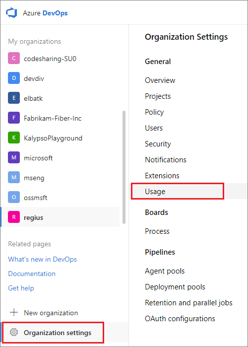
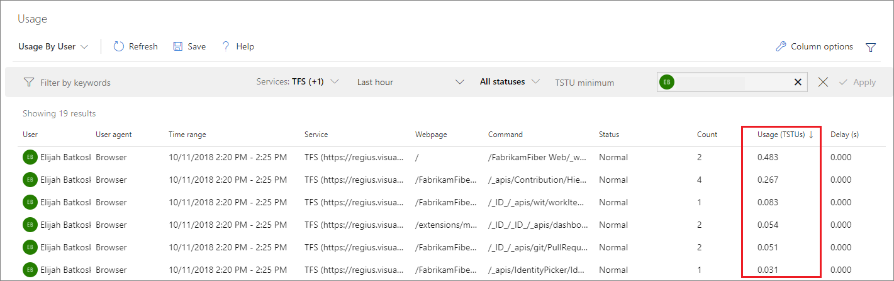

<!--- Supports FWLINK: http://go.microsoft.com/fwlink/?LinkId=692096 -->

#Rate limits  

**Azure DevOps Services**

Azure DevOps Services, like many Software-as-a-Service solutions, uses multi-tenancy to reduce costs and to enhance scalability and performance. This leaves users vulnerable to performance issues and even outages when other users of their shared resources have spikes in their consumption. To combat these problems, Azure DevOps Services limits the resources individuals can consume and the number of 
requests they can make to certain commands. When these limits are exceeded, subsequent requests may be either delayed or blocked.

When an individual user's requests are delayed by a significant amount, an email is sent to that user and a warning banner appears in the Web UI. If the user does not have an email address, 
for example, if the user is actually a build service account, the notification email is sent to the members of the Project Collection Administrators group. See 
[User Experience](#user-experience) for more detail.

When an individual user's requests are blocked, responses with HTTP code 429 (too many requests) will be received, with a message similar to the following:

```TF400733: The request has been canceled: Request was blocked due to exceeding usage of resource <resource name> in namespace <namespace ID>.```

##Current rate limits
Azure DevOps Services currently has a global consumption limit, which delays requests from individual users beyond a consumption threshold when shared resources are in danger of being overwhelmed.

###Global consumption limit
Because this limit is focused exclusively on avoiding outages when shared resources are close to being overwhelmed, individual users will typically only have their requests delayed when:

- One of their shared resources is at risk of being overwhelmed, and 
- Their personal usage exceeds 200 times the consumption of a typical user within a (sliding) five-minute window. 

The amount of the delay will depend on the user's sustained level of consumption. It may be as little as a few milliseconds per request or as much as thirty seconds. If their consumption goes to zero, or if their shared resources are no longer in danger of being overwhelmed, the delays will stop after a period of not more than five minutes. If their consumption remains high and their shared resources remain in danger of being overwhelmed, the delays may continue indefinitely.

#### Azure DevOps Services Throughput Units (TSTUs)  
Azure DevOps Services users consume many shared resources, and consumption depends on many factors. For example:

- Uploading a large number of files to Team Foundation version control or Git typically creates a large amount of load on both an Azure SQL Database and an Azure Storage account.
- Running a complex work item tracking query will create load on an Azure SQL Database, with the amount of load depending on the number of work items in the Azure DevOps Services organization. 
- Running a build on a private agent will create load on an Azure SQL Database and on one or more Azure Storage accounts, with the amount of load depending on the amount of version 
control content downloaded, the amount of data logged by the build, and so forth.
- All operations consume CPU and memory on one or more Azure DevOps Services application tiers or job agents.

To accommodate all of this, Azure DevOps Services resource consumption is expressed in abstract units called Azure DevOps Services Throughput Units, or TSTUs.  

TSTUs will eventually incorporate a blend of:

- [Azure SQL Database DTUs](https://azure.microsoft.com/documentation/articles/sql-database-service-tiers) as a measure of database consumption   
- Application tier and job agent CPU, memory, and I/O as a measure of compute consumption   
- Azure Storage bandwidth as a measure of storage consumption.  

For now, TSTUs are primarily focused on Azure SQL Database DTUs, since Azure SQL Databases are the shared resources most commonly overwhelmed by excessive consumption. 

A single TSTU per five minutes is the average load we expect a single normal user of Azure DevOps Services to generate. Normal users will also generate spikes in load. These will typically
be 10 or fewer TSTUs per five minutes, but will less frequently go as high as 100 TSTUs. The global consumption limit is 200 TSTUs within a sliding five-minute window.

## Pipelines

We take a similar approach to rate limiting in Azure Pipelines. Since pipelines are not associated to a single user like other activities, each pipeline is treated as an individual entity with its own resource consumption tracked. Just like the global consumption limit for users, we apply a 200 TSTU limit for an individual pipeline in a sliding 5-minute window. Even if build agents are self-hosted, there could be load on Azure DevOps Services resources for operations such as git clone. If a pipeline is delayed or blocked due to rate limiting, a message will appear in the attached logs.

<!---
###Work item tracking request limits
This limit restricts individual users to 5,000 work item tracking (WIT) commands per hour per organization. When this rate is exceeded, additional WIT commands will be blocked. When
the user falls back below this rate, the blocking will stop. It is important to note that the hour window is a sliding window.

To avoid disruption of existing applications, the following commands are temporarily whitelisted:

- ```GetWorkItem```
- ```PageWorkitemsById```

To avoid hitting these limits, we recommend:

- Using the reporting APIs (Work item revisions and Work item links) instead of GetWorkItem and PageWorkitemsById.
- Saving work item changes in batches, rather than one at a time.
- Reducing the frequency of running applications which make many WIT requests.

As discussed above, we expect to add additional rate limits over time. And we always reserve the right to slow down or block usage which we believe to be abusive.  
--> 

##User experience

When an individual user's requests are delayed by a significant amount, an email will be sent to that user and a warning banner will appear in the Web UI.  


If the user does not have an email address - for example, if the "user" is actually a build service account - the notification email will be sent to the members of the project collection 
administrators group. The warning banner and the notification email both include links to the Usage page, which can be used to investigate the usage that exceeded our thresholds, as well 
as the requests which were delayed.

Request history on the Usage page is ordered by usage (TSTUs) descending by default, but can be sorted by the other columns as well. Usage is grouped by command into five minute time windows,
with the number of commands in the window given by the Count column, and the total TSTU usage and delay time given in the corresponding columns. 

For members of the project collection administrators group, this same page can be used to investigate the usage of other users.

::: moniker range=">= azure-devops-2019"

   

::: moniker-end

::: moniker range="<= tfs-2018"

   

::: moniker-end

By default, visiting the Usage page will display requests for the last hour. Clicking the link from the email will open the Usage page scoped to the request history from 
30 minutes before and after the first delayed request. By default, the Usage page will default to showing the past hour. After arriving on the page, review the 
request history leading up to delayed requests.



Commands consuming a high number of TSTUs (in the hundreds, for example) will be the ones responsible for the user exceeding the threshold. The User Agent and IP address columns can be helpful to see where these commands 
are coming from. Common problems to look for are custom tools or build service accounts that might be making a large amount of calls in a short time window. To avoid these types of issues,
tools may need to be rewritten or build processes updated to reduce the type and number of calls made. For example, a tool might be pulling a large version control repository from scratch
on a regular basis, when it could pull incrementally instead. 
