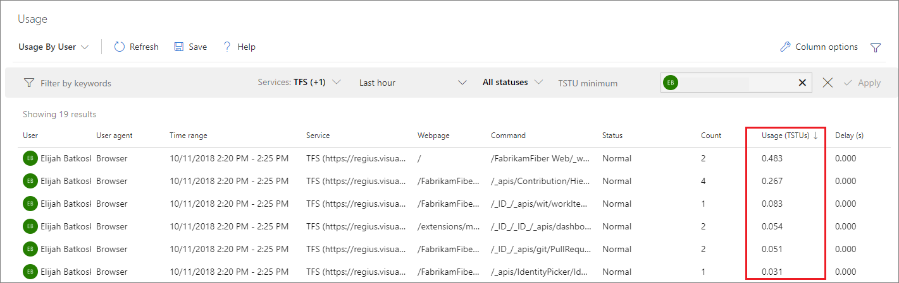

<!--- Supports FWLINK: https://go.microsoft.com/fwlink/?LinkId=692096 -->

# Rate limits  

[!INCLUDE [version-vsts-tfs-2018](../../includes/version-vsts-tfs-2018.md)]

Azure DevOps, like many software-as-a-service solutions, uses multi-tenancy to reduce costs and improve performance.
This design leaves users vulnerable to performance issues and even outages when other users of their shared resources have spikes in their consumption.
To combat these problems, Azure DevOps limits the resources individuals can consume and the number of 
requests they can make to certain commands.
When these limits are exceeded, future requests may be either delayed or blocked.

When a user's requests are delayed by a significant amount, that user gets an email and sees a warning banner in the web.
For the build service account and others without an email address, members of the Project Collection Administrators group get the email.
See [User Experience](#user-experience) for more detail.

When an individual user's requests are blocked, responses with HTTP code 429 (too many requests) will be received, with a message similar to:

```TF400733: The request has been canceled: Request was blocked due to exceeding usage of resource <resource name> in namespace <namespace ID>.```

## Current rate limits

Azure DevOps currently has a global consumption limit.
This limit delays requests from individual users beyond a threshold when shared resources are in danger of being overwhelmed.

### Global consumption limit

This limit is focused exclusively on avoiding outages when shared resources are close to being overwhelmed.
Individual users will typically only have their requests delayed when:

- One of their shared resources is at risk of being overwhelmed, and 
- Their personal usage exceeds 200 times the consumption of a typical user within a (sliding) five-minute window. 

The amount of the delay will depend on the user's sustained level of consumption.
Delays range from a few milliseconds per request up to 30 seconds.
Once consumption goes to zero or the resource is no longer overwhelmed, the delays will stop within five minutes.
If consumption remains high, delays may continue indefinitely to protect the resource.

#### Azure DevOps throughput units (TSTUs)  

Azure DevOps users consume many shared resources, and consumption depends on many factors. For example:

- Uploading a large number of files to version control creates a large amount of load on databases and storage accounts.
- Complex work item tracking queries create database load based on the number of work items they search through. 
- Builds drive load by downloading files from version control, producing log output, and so on.
- All operations consume CPU and memory on various parts of the service.

To accommodate all of this, Azure DevOps resource consumption is expressed in abstract units called Azure DevOps throughput units, or TSTUs.  

TSTUs will eventually incorporate a blend of:

- [Azure SQL Database DTUs](https://azure.microsoft.com/documentation/articles/sql-database-service-tiers) as a measure of database consumption   
- Application tier and job agent CPU, memory, and I/O as a measure of compute consumption   
- Azure Storage bandwidth as a measure of storage consumption.  

For now, TSTUs are primarily focused on Azure SQL Database DTUs, since Azure SQL Databases are the shared resources most commonly overwhelmed by excessive consumption. 

A single TSTU is the average load we expect a single normal user of Azure DevOps to generate per five minutes.
Normal users also generate spikes in load.
These spikes will typically be 10 or fewer TSTUs per five minutes.
Less frequently, spikes go as high as 100 TSTUs.
The global consumption limit is 200 TSTUs within a sliding five-minute window.

## Pipelines

Rate limiting is similar for Azure Pipelines.
Each pipeline is treated as an individual entity with its own resource consumption tracked.
Even if build agents are self-hosted, they generate load in the form of cloning and sending logs.

Just like the global consumption limit for users, we apply a 200 TSTU limit for an individual pipeline in a sliding 5-minute window.
If a pipeline is delayed or blocked by rate limiting, a message will appear in the attached logs.

<!---
### Work item tracking request limits
This limit restricts individual users to 5,000 work item tracking (WIT) commands per hour per organization. When this rate is exceeded, additional WIT commands will be blocked. When
the user falls back below this rate, the blocking will stop. It is important to note that the hour window is a sliding window.

To avoid disruption of existing applications, the following commands are temporarily added to an allow list:

- ```GetWorkItem```
- ```PageWorkitemsById```

To avoid hitting these limits, we recommend:

- Using the reporting APIs (Work item revisions and Work item links) instead of GetWorkItem and PageWorkitemsById.
- Saving work item changes in batches, rather than one at a time.
- Reducing the frequency of running applications which make many WIT requests.

As discussed above, we expect to add additional rate limits over time. And we always reserve the right to slow down or block usage which we believe to be abusive.  
--> 

## User experience

When a user's requests are delayed by a significant amount, that user gets an email and sees a warning banner in the web.


If the user doesn't have an email address, the notification email will be sent to the members of the Project Collection 
Administrators group.
The warning banner and the notification email both include links to the Usage page.
The Usage page helps you investigate requests that exceeded thresholds and/or were delayed.

Request history on the Usage page is ordered by usage (TSTUs) descending by default.
Usage is grouped by command into five minute time windows.
The Count column gives the number of commands in the window.
Other columns highlight total TSTU usage and delay time.

For members of the Project Collection Administrators group, this same page can be used to investigate the usage of other users.

::: moniker range=">= azure-devops-2019"

   

::: moniker-end

::: moniker range="<= tfs-2018"

   

::: moniker-end

When you first visit the Usage page, it displays requests for the last hour.
Email links open the Usage page scoped to the 30 minutes before and after the first delayed request.
After arriving on the page, review the request history leading up to delayed requests.



Commands consuming a high number of TSTUs (in the hundreds, for example) will be the ones responsible for the user exceeding the threshold. The User Agent and IP address columns can be helpful to see where these commands 
are coming from. Common problems to look for are custom tools or build service accounts that might be making a large amount of calls in a short time window. To avoid these types of issues,
tools may need to be rewritten or build processes updated to reduce the type and number of calls made. For example, a tool might be pulling a large version control repository from scratch
on a regular basis, when it could pull incrementally instead. 

## API client experience

When requests are about to be delayed, are delayed, or are blocked, Azure DevOps returns response headers to help API clients react.
While not fully standardized, these headers are [broadly in line with other popular services](https://stackoverflow.com/questions/16022624/examples-of-http-api-rate-limiting-http-response-headers).

The following table lists the headers available and what they mean.
With the exception of `X-RateLimit-Delay`, all of these headers will be sent before requests start getting delayed.
This design gives clients the opportunity to proactively slow down their rate of requests.

| Header name | Description |
|-------------|-------------|
| `Retry-After` | The [RFC 6585](https://tools.ietf.org/html/rfc6585#section-4")-specified header sent to tell you how long to wait before sending your next request in order to fall under the detection threshold. Units: seconds. |
| `X-RateLimit-Resource` | A custom header indicating the service and type of threshold which was reached. Threshold types and service names may vary over time and without warning. We recommend displaying this string to a human, but not relying on it for computation. |
| `X-RateLimit-Delay` | How long the request was delayed. Units: seconds with up to 3 decimal places (milliseconds). |
| `X-RateLimit-Limit` | Total number of TSTUs allowed before delays are imposed. |
| `X-RateLimit-Remaining` | Number of TSTUs remaining before being delayed. If requests are already being delayed or blocked, will be 0. |
| `X-RateLimit-Reset` | Time at which, if all resource consumption stopped immediately, tracked usage would return to 0 TSTUs. Expressed in Unix epoch time. |

### Recommendations

We recommend that you at least respond to the `Retry-After` header.
If you detect a `Retry-After` header in any response, wait until that amount of time has passed before sending another request.
Doing so will help your client application experience fewer enforced delays.

If possible, we further recommend that you monitor `X-RateLimit-Remaining` and `X-RateLimit-Limit` headers.
Doing so will allow you to approximate how quickly you're approaching the delay threshold.
Your client can intelligently react by spreading out its requests over time.
