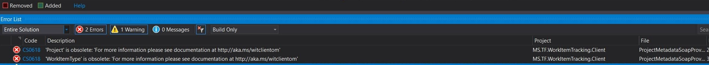

# Deprecation of the Work Item Tracking (WIT) and Test Client OM

**Azure DevOps**

WIT and Test Client OM are part of the broader TFS SDK. They are a set of SOAP based APIs that can be used to create tools to run operations against the Azure DevOps. These SOAP based APIs have been replaced by the set of modern REST based endpoints. Therefore we are in the process of deprecating the SOAP based APIs (Client OM) for WIT and Test.

> [!NOTE]
> WIT and Test Client OM for Azure DevOps has been deprecated in latest version Visual Studio 2019 and the [Microsoft.TeamFoundationServer.ExtendedClient](https://www.nuget.org/packages/Microsoft.TeamFoundationServer.ExtendedClient) package. This means, there will be no new work item tracking or test functionality included into the Client OM.

## Affected object models

Only the WIT and Test Client OM are being deprecated. Other areas like build and source control are not on a deprecation schedule at this time.

## Impact

If your organization is using the WIT Client OM in tools that run against Azure DevOps, we recommend you start migrating those tools to stop using the WIT Client OM and start using the new [REST](../index.md) based endpoints.

Updating your code to use REST is vital to ensure your tools will work as we release new functionality into Azure Boards and Azure Test.

## Visual Studio warnings

Any references to the latest versions of WIT Client OM will result in an obsolete warning. This includes the dlls that come with Visual Studio 2019 and Azure DevOps 2019. Here is an example warning you may receive...

**CS0618: 'WorkItemType' is obsolete: 'for more information please see documentation at https://aka.ms/witclientom'**

## Q&A

### How do I know what tools are running?

If you don't know what tools are running against your account that use the WIT Client OM, you can [contact us](mailto:dahellem@microsoft.com) directly. We can help you identify them so you can then contact the tool owners and ensure they are aware of our deprecation plan.

### How do I fix my tools?

First thing you should investigate and determine if the tool is still needed. We have found that many organizations will create a tool for a specific reason for a short period of time. Then for one reason or another, that tool continues to run when it is no longer needed. For this type of scenario, you can simply shut the tool down.

If the tool is still of use, then you will need to re-refactor that tool using the REST based [.NET client libraries](./dotnet-client-libraries.md). This will require some reaction work on your part to remove references to the old WIT Client OM and replace them with the appropriate .NET Client Libraries.

We have also put together this handy [migration guide](./migration-guide.md) with [sample code](https://github.com/Microsoft/azure-devops-wit-client-om-migration-guide) to aid your transition from WIT Client OM to the REST based .NET Client libraries.

## Resources

- [Migration Guide](./migration-guide.md)
- [Azure DevOps Services REST API Reference](../index.md)
- [.NET client libraries for Azure DevOps Services (and TFS)](./dotnet-client-libraries.md)
- [Understanding Rate limits](./rate-limits.md?tabs=new-nav)
- [Integration Best Practices](./integration-bestpractices.md)
- [Sample Code on GitHub](https://github.com/Microsoft/vsts-dotnet-samples)
