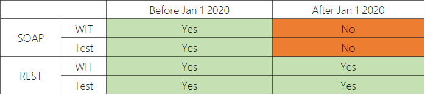
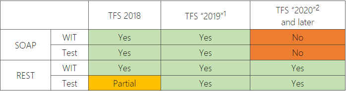

# Deprecation of the Work Item Tracking (WIT) and Test Client OM

**Azure DevOps**

WIT and Test Client OM are part of the broader TFS SDK. They are a set of SOAP based APIs that cat be used to create tools to run operations against the Azure DevOps. These SOAP based APIs have been replaced by the set of modern REST based endpoints. Therefore we are in the process of deprecating the SOAP based APIs (Client OM) for WIT and Test.

> [!NOTE]  
> In May of 2018 [we announced the deprecation](https://blogs.msdn.microsoft.com/devops/2018/05/21/announcing-the-deprecation-of-the-wit-and-test-client-om-at-jan-1-2020-2/) of the WIT and Test Client OM for Azure DevOps. For the Azure DevOps service, deprecation is schedule to take effect on 1/1/2020.

## Affected object models

Only the WIT and Test Client OM are being deprecated. Other areas like build and source control are not on a deprecation schedule at this time.

## Deprecation schedule

The tables below outline a support matrix of what you can expect across both SOAP and REST.

### Azure DevOps Service

### Azure DevOps Server

## Impact

If your organization has created or uses the WIT Client OM in tools that run against Azure DevOps, starting on 1/1/2020, those tools will stop working. You will need to make an investment in changing these tools to stop using the WIT Client OM and start using the new [REST](../index.md) based endpoints.

Updating your tools to use REST is vital to ensure your tools will work once the WIT Client OM is deprecated on 1/1/2020.

## Visual Studio warnings

Any references to the latest versions of WIT Client OM will result in a warning. This includes the dlls that come with Visual Studio 2019 and Azure DevOps 2019. Here is an example warning you may recieve...

**CS0618: 'WorkItemType' is obsolete: 'for more information please see documentation at http://aka.ms/witclientom'**

## Q&A

### How do I know what tools are running?

If you don't know what tools are running against your account that use the WIT Client OM, you can [contact us](mailto:dahellem@microsoft.com) directly. We can help you identify them so you can then contact the tool owners and esnure they are aware of our deprecation plan.

### How do I fix my tools?

First thing you should investigate and determine if the tool is still needed. We have found that many organizations will create a tool for a specific reason for a short period of time. Then for one reason or another, that tool continues to run on a machine under a person's desk. For this type of scenario, you can simply shut the tool down.

If the tool is still of use, then you will need to re-write that tool using the REST based [.NET client libraries](./dotnet-client-libraries.md). This will require some reaction work on your part to remove references to the old WIT Client OM and replace them with the appropriate .NET Client Libraries. Below are some additional resources to help you in this transition.

### Can you grant our organization an exception?

Sorry, no exceptions. We need all organizations off the WIT Client OM by 1/1/2020. We do not have any plans to extend the deprecation period at this time.

## Resources

- [Azure DevOps Services REST API Reference](../index.md)
- [.NET client libraries for Azure DevOps Services (and TFS)](./dotnet-client-libraries.md)
- [Understanding Rate limits](./rate-limits.md?tabs=new-nav)
- [Integration Best Practices](./integration-bestpractices.md)
- [Sample Code on GitHub](https://github.com/Microsoft/vsts-dotnet-samples)
