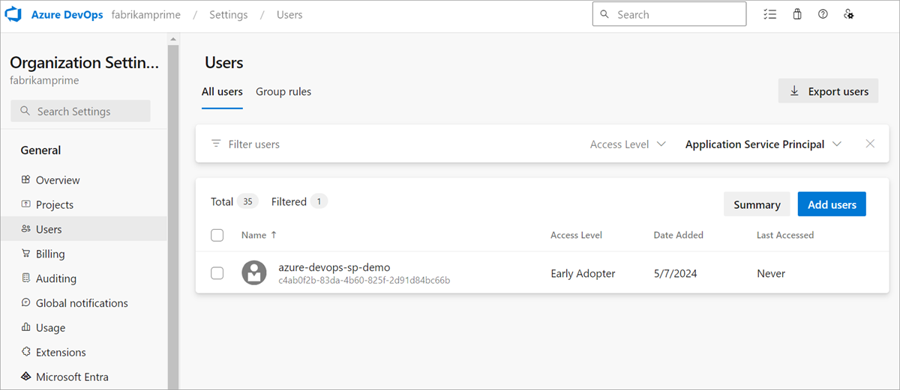

# Use Azure Active Directory service principals & managed identities

[!INCLUDE [version-eq-azure-devops](../../../includes/version-eq-azure-devops.md)]

You can now add Azure Active Directory (Azure AD) service principals and managed identities to your Azure DevOps organizations to grant access to your organization resources. For many teams, this feature can be a viable and preferred alternative to [personal access tokens (PATs)](../../../organizations/accounts/use-personal-access-tokens-to-authenticate.md) when authenticating applications that power automation workflows for your company. 

> [!NOTE]
> Service principals and managed identities support is currently in public preview. They're only available to organizations that are connected to Azure AD.

## About service principals and managed identities

[Service principals](/azure/active-directory/fundamentals/service-accounts-principal) are security objects within an Azure AD application that define what an application can do in a given tenant. They're set up in the Azure portal during the application registration process and configured to access Azure resources, like Azure DevOps. By adding service principals into your organization and setting up permissions on top of them, we can determine whether a service principal is authorized to access your organizational resources and which ones.

[Managed identities](/azure/active-directory/fundamentals/service-accounts-managed-identities) are another Azure AD feature that act similarly to an application's service principals. These objects provide identities for Azure resources and allow an easy way for services that support Azure AD authentication to share credentials. They're an appealing option because Azure AD takes care of credential management and rotation. While setup for a managed identity may look different on the Azure portal, Azure DevOps treats both security objects the same as a new identity in an organization with defined permissions. Throughout the rest of this article, we refer to managed identities and service principals interchangeably as service principal, unless specified.

Use the following steps to authenticate these identities to Azure DevOps to allow them to perform actions on behalf of themselves.

## Configure managed identities and service principals

Your implementation may vary, but at a high-level, the following steps help you start using service principals in your workflow. Consider looking at one of our [sample apps](https://github.com/microsoft/azure-devops-auth-samples/tree/master/ServicePrincipalsSamples) to follow along with an example on your own.

### 1. Create a new managed identity or application service principal

Create an [application service principal](#create-an-application-service-principal) or a [managed identity](#create-a-managed-identity) in the Azure portal. 

#### Create an application service principal

When you create a new application registration, an application object is created in Azure AD. The **application service principal** is a representation of this application object for a given tenant. When you register an application as a multi-tenant application, there's a unique service principal object that represents the application object for every tenant the application is added to.

Further information:
* [Application and service principal objects in Azure Active Directory](/azure/active-directory/develop/app-objects-and-service-principals)
* [Securing service principals](/azure/active-directory/fundamentals/service-accounts-principal)
* [Use the portal to create an Azure AD application and service principal that can access resources](/azure/active-directory/develop/howto-create-service-principal-portal)

> [!VIDEO https://www.microsoft.com/en-us/videoplayer/embed/RWWY8q]

#### Create a managed identity

Creating managed identities in the Azure portal differs significantly from setting up applications with service principals. Before you begin the creation process, you must first consider which type of managed identity you want to create:

* **System-assigned managed identity:** Some Azure services allow you to enable a managed identity directly on a service instance. When you enable a system-assigned managed identity, an identity is created in Azure AD. The identity is tied to the lifecycle of that service instance. When the resource is deleted, Azure automatically deletes the identity for you. By design, only that Azure resource can use this identity to request tokens from Azure AD.
* **User-assigned managed identity** You may also create a managed identity as a standalone Azure resource by creating a user-assigned managed identity and assign it to one or more instances of an Azure service. For user-assigned managed identities, the identity is managed separately from the resources that use it.

For more information, see the following articles and video:
* [What are managed identities for Azure resources?](/azure/active-directory/managed-identities-azure-resources/overview)
* [Manage user-assigned managed identities](/azure/active-directory/managed-identities-azure-resources/how-manage-user-assigned-managed-identities)
* [Configure managed identities for Azure resources on a VM using the Azure portal](/azure/active-directory/managed-identities-azure-resources/qs-configure-portal-windows-vm)

> [!VIDEO https://www.microsoft.com/en-us/videoplayer/embed/RWWL8K]

### 2. Add and manage service principals in an Azure DevOps organization

Once you configure the service principals in the Azure AD portal, you must do the same in Azure DevOps by adding the service principals to your organization. You can add them through the [Users page](../../../organizations/accounts/add-organization-users.md) or with the [ServicePrincipalEntitlements APIs](/rest/api/azure/devops/memberentitlementmanagement/service-principal-entitlements?view=azure-devops-rest-7.1). Since they can't sign in interactively, a user account that can add users to an organization, project, or team must add them. Such users include **Project Collection Administrators** (PCA) or **Project Administrators and Team Administrators** when the ["Allow team and project administrators to invite new users" policy](/azure/devops/organizations/security/restrict-invitations) is enabled. 

> [!TIP] 
> To add a service principal to the organization, enter the application or managed identity's display name. If you choose to add a service principal programmatically through the [`ServicePrincipalEntitlements` API](/rest/api/azure/devops/memberentitlementmanagement/service-principal-entitlements?view=azure-devops-rest-7.1), make sure to pass in the **service principal's object id** and not the application's object id. 

If you're a PCA, you can also grant a service principal access to specific projects and assign a license. If you're not a PCA, you must reach out to the PCA to update any project memberships or license access levels.



> [!NOTE]
> You can only add a managed identity for the tenant your organization is connected to. If you would like to access a managed identity in a different tenant, see the [workaround we've included in the FAQ](#q-can-i-add-a-managed-identity-from-a-different-tenant-to-my-organization).

After your service principals are added to the organization, you can treat them similarly to standard user accounts. You can assign permissions directly on a service principal, add it to security groups and teams, assign it to any access level, and remove it from the organization. You can also use the [`Service Principal Graph APIs`](/rest/api/azure/devops/graph/service-principals?view=azure-devops-rest-7.1) to perform CRUD operations on service principals.

> [!VIDEO https://www.microsoft.com/en-us/videoplayer/embed/RWWG70]

Management of service principals differs from user accounts in the following key ways:

* Service principals don't have emails and as such, they can't be invited to an organization via email.
* Group rules for licensing currently don't apply to service principals. If you want to assign an access level to a service principal, it's best to do so directly. 
* While service principals can be added to Azure AD groups (in the Azure portal), we have a current technical limitation preventing us from being able to display them in a list of Azure AD group members. This limitation isn't true for Azure DevOps groups. That being said, a service principal still inherits any group permissions set on top of an Azure AD group they belong to. 
* Not all users in an Azure AD group are immediately part of an Azure DevOps organization just because an admin creates a group and adds an Azure AD group to it. We have a process called "materialization" that happens once a user from an Azure AD group signs in to the organization for the first time. A user signing into an organization allows us to determine which users should be granted a license. Since sign-in isn't possible for service principals, an admin must explicitly add it to an organization as described earlier. 
* You can't modify a service principal’s display name or avatar on Azure DevOps.
* A service principal counts as a license for each organization it's added to, even if [multi-organization billing](../../../organizations/billing/buy-basic-access-add-users.md?#pay-for-a-user-once-across-multiple-organizations) is selected.

### 3. Access Azure DevOps resources with an Azure AD token

#### Get an Azure AD token
Acquiring an access token for a managed identity can be done by following along with the Azure AD documentation. For more information, see the examples for [service principals](/azure/active-directory/develop/v2-oauth2-client-creds-grant-flow#get-a-token) and [managed identities](/azure/active-directory/managed-identities-azure-resources/how-to-use-vm-token). 

The returned access token is a JWT with the defined roles, which can be used to access organization resources using the token as *Bearer*.

#### Use the Azure AD token to authenticate to Azure DevOps resources
In the following video example, we move from authenticating with a PAT to using a token from a service principal. We start by using a client secret for authentication, then move to using a client certificate. 

> [!VIDEO https://www.microsoft.com/en-us/videoplayer/embed/RWWNVM]

Another example demonstrates how to connect to Azure DevOps using a User Assigned Managed Identity within an Azure Function.

> [!VIDEO https://www.microsoft.com/en-us/videoplayer/embed/RWWL8L]

Follow along with these examples by finding the app code in our [collection of sample apps](https://github.com/microsoft/azure-devops-auth-samples/tree/master/ServicePrincipalsSamples).

Service principals can be used to call Azure DevOps REST APIs and do most actions, but it's limited from the following operations:
* Service principals can't be Organization Owners or create organizations.
* Service principals can't create tokens, like [personal access tokens (PATs)](../../../organizations/accounts/use-personal-access-tokens-to-authenticate.md) or [SSH Keys](../../../repos/git/use-ssh-keys-to-authenticate.md). They can generate their own Azure AD tokens and these tokens can be used to call Azure DevOps REST APIs.
* We don't support [Azure DevOps OAuth](./oauth.md) for service principals.

## FAQs

### Q: Why should I use a service principal or a managed identity instead of a PAT?

A: Many of our customers seek out a service principal or managed identity to replace an existing PAT (personal access token). Such PATs often belong to a service account (shared team  account) that is using them to authenticate an application with Azure DevOps resources. PATs must be laboriously rotated every so often (minimum 180 days). As PATs are simply bearer tokens, meaning token strings that represent a user’s username and password, they're incredibly risky to use as they can easily fall into the wrong person’s hands. Azure AD tokens expire every hour and must be regenerated with a refresh token to get a new access token, which limits the overall risk factor when leaked.

### Q: What are the rate limits on service principals and managed identities?

A: At this time, service principals and managed identities have the same [rate limits](../../concepts/rate-limits.md) as users.

### Q: Will using this feature cost more?

A: Service principals and managed identities are priced similarly as users, based on the access level. One notable change pertains to how we treat "multi-org billing" for service principals. Users get counted as only one license, no matter how many organizations they're in. Service principals get counted as one license per each organization the user's in. This scenario is similar to standard "user assignment-based billing". 

### Q: Can I use a service principal or managed identity with Azure CLI?

A: Yes! Anywhere that asks for PATs in the [Azure CLI](/azure/authenticate-azure-cli) can also accept [Azure AD access tokens](#get-an-azure-ad-token). See these examples for how you might pass an Azure AD token in to authenticate with CLI.

```powershell
# To authenticate with a command: After typing this command, the az devops login will prompt you to enter a token. You can add an Azure AD token too! Not just a PAT.
az devops login

# To authenticate a service principal with a password or cert:
az login --service-principal -u <app-id> -p <password-or-cert> --tenant <tenant>

# To authenticate a managed identity:
az login --identity
```

Now, let's get an Azure AD token and try to call an Azure DevOps API by passing it in the headers as a `Bearer` token:
```powershell
Write-Host "Obtain access token for Service Connection identity..."
$accessToken = az account get-access-token --resource 499b84ac-1321-427f-aa17-267ca6975798 --query "accessToken" --output tsv

Write-Host "Use access token with Azure DevOps REST API to list projects in the organization..."
$apiVersion = "7.1-preview.1"
$uri = "https://dev.azure.com/${yourUsername}/_apis/projects?api-version=${apiVersion}"
$headers = @{
    Accept = "application/json"
    Authorization = "Bearer $accessToken"
}
Invoke-RestMethod -Uri $uri -Headers $headers -Method Get | Select-Object -ExpandProperty value ` | Select-Object id, name
```

Now, you can use `az cli` commands per usual. 

### Q: Can I add a managed identity from a different tenant to my organization?

A: You can only add a managed identity from the same tenant that your organization is connected to. However, we have a workaround that allows you to set up a managed identity in the "resource tenant", where are all of your resources are. Then, you can enable it to be used by a service principal in the "target tenant", where your organization is connected. Do the following steps as a workaround:

1. Create a [user-assigned managed identity](/azure/active-directory/managed-identities-azure-resources/how-manage-user-assigned-managed-identities) in Azure portal for your resource tenant. 
2. Connect it to a [virtual machine and assign this managed identity](/azure/active-directory/managed-identities-azure-resources/qs-configure-portal-windows-vm) to it. 
3. Create a [key vault](/azure/key-vault/general/quick-create-portal) and generate a [certificate](/azure/key-vault/certificates/quick-create-portal) (can't be of type "PEM"). When you generate this certificate, a secret with the same name is also generated, which we use later. 
4. Grant access to the managed identity so that it can read the private key from the key vault. Create an access policy in the key vault with the "Get/List" permissions (under "Secret permissions" and search for the managed identity under "Select principal".
5. Download the created certificate in "CER" format, which ensures that it doesn't contain the private part of your certificate.
6. Create a new application registration in the target tenant.
7. Upload the downloaded certificate to this new application in the "Certificates & secrets" tab.
8. Add this application's service principal to the [Azure DevOps organization we want it to access](#2-add-and-manage-service-principals-in-an-azure-devops-organization), and remember to set up the service principal with any required permissions.
9. To get an Azure AD access token from this service principal that makes use of the managed identity certificate, see the following code sample:

> [!NOTE]
> You must regularly rotate certificates, as always.

```cs
public static async Task<string> GetSecret(string keyVaultName, string secretName)
{
	var keyVaultUri = new Uri("https://" + keyVaultName + ".vault.azure.net");
	var client = new SecretClient(keyVaultUri, new ManagedIdentityCredential());
	var keyVaultSecret = await client.GetSecretAsync(secretName);

	var secret = keyVaultSecret.Value;
	return secret.Value;
}

private static async Task<AuthenticationResult> GetAppRegistrationAADAccessToken(string applicationClientID, string appTenantId)
{
	IConfidentialClientApplication app;

	byte[] privateKeyBytes = Convert.FromBase64String(GetSecret(keyVaultName, secretName));
	X509Certificate2 certificateWithPrivateKey = new X509Certificate2(privateKeyBytes, (string)null, X509KeyStorageFlags.MachineKeySet);

	app = ConfidentialClientApplicationBuilder.Create(applicationClientID)
		.WithCertificate(certificateWithPrivateKey)
		.WithAuthority(new Uri(string.Format(CultureInfo.InvariantCulture, "https://login.microsoftonline.com/{0}", appTenantId)))
		.Build();
	app.AddInMemoryTokenCache();

	string AdoAppClinetID = "499b84ac-1321-427f-aa17-267ca6975798/.default";
	string[] scopes = new string[] { AdoAppClientID };

	var result = await app.AcquireTokenForClient(scopes).ExecuteAsync();

	return result;
}
```

### Q: Can I use a service principal to do git operations, like clone a repo?

A: See the following example of how we've passed an [Azure AD token](#get-an-azure-ad-token) of a service principal instead of a PAT to git clone a repo in a PowerShell script.

```powershell
$ServicePrincipalAadAccessToken = 'Azure AD access token of a service principal'
git -c http.extraheader="AUTHORIZATION: bearer $ServicePrincipalAadAccessToken" clone https://dev.azure.com/{yourOrgName}/{yourProjectName}/_git/{yourRepoName}
```
> [!TIP] 
> To keep your token more secure, use credential managers so you don't have to enter your credentials every time. We recommend [Git Credential Manager](https://github.com/GitCredentialManager/git-credential-manager), which can accept [Azure AD tokens (that is, Microsoft Identity OAuth tokens)](https://github.com/GitCredentialManager/git-credential-manager/blob/main/docs/environment.md#GCM_AZREPOS_CREDENTIALTYPE) instead of PATs if an environment variable is changed.

A helpful tip on how to get the access token from the Azure CLI to call git fetch:

1. Open the Git configuration of your repository: 
```sh
git config -e
```

2. Add the following lines:
```sh
[credential]
    helper = "!f() { test \"$1\" = get && echo \"password=$(az account get-access-token --resource 499b84ac-1321-427f-aa17-267ca6975798 --query accessToken -o tsv)\"; }; f" 
```

3. Test that it works using: 
```sh
GIT_TRACE=1 GCM_TRACE=1 GIT_CURL_VERBOSE=1 git fetch
```
### Q: Can I use a service principal to connect to feeds?

A: Yes, you can connect to any feed using Basic authentication by replacing the PAT secret value with an SP access token. In the following examples, we demonstrate how to connect with an Azure AD token for NuGet and Maven, but other feed types should also work.

#### Npm project setup with Azure AD tokens
> [!NOTE]
> The vsts-npm-auth tool does not support Azure AD access tokens. 

1. Add a `.npmrc` to your project, in the same directory as your `package.json`.
```
registry=https://pkgs.dev.azure.com/Fabrikam/_packaging/FabrikamFeed/npm/registry/ 
always-auth=true
```
2. Get an access token for your service principal or managed identity.
3. Add this code to your `${user.home}/.npmrc` and replace the placeholder `[AAD_SERVICE_PRINCIPAL_ACCESS_TOKEN]` with the access token from the previous step.
```
//pkgs.dev.azure.com/Fabrikam/_packaging/FabrikamFeed/npm/:_authToken=[AAD_SERVICE_PRINCIPAL_ACCESS_TOKEN]
```

#### Maven project setup with Azure AD tokens
1. Add the repo to both your `pom.xml`'s `<repositories>` and `<distributionManagement>` sections.

```xml
<repository>
  <id>Fabrikam</id>
  <url>https://pkgs.dev.azure.com/Fabrikam/_packaging/FabrikamFeed/maven/v1</url>
  <releases>
    <enabled>true</enabled>
  </releases>
  <snapshots>
    <enabled>true</enabled>
  </snapshots>
</repository>
```
2. Get an access token for your Service Principal or Managed Identity.
3. Add or edit the `settings.xml` file in `${user.home}/.m2` and replace the placeholder `[AAD_SERVICE_PRINCIPAL_ACCESS_TOKEN]` with the access token from the previous step.
```xml
<settings xmlns="http://maven.apache.org/SETTINGS/1.0.0"
          xmlns:xsi="http://www.w3.org/2001/XMLSchema-instance"
          xsi:schemaLocation="http://maven.apache.org/SETTINGS/1.0.0
                              https://maven.apache.org/xsd/settings-1.0.0.xsd">
  <servers>
    <server>
      <id>Fabrikam</id>
      <!-- username is not used in the authentication -->
      <username>Fabrikam</username>
      <password>[AAD_SERVICE_PRINCIPAL_ACCESS_TOKEN]</password>
    </server>
  </servers>
</settings>
``` 

### Q: Can I use a service principal to publish extensions to the Visual Studio Marketplace?

A: Yes. Do the following steps.

1. Add a service principal as a member to a publisher account. You can get the service principal's ID from its profile using [Profiles - Get](/rest/api/azure/devops/profile/profiles/get). Then, you can [add the service principal as a member](/visualstudio/extensibility/walkthrough-publishing-a-visual-studio-extension#add-additional-users-to-manage-your-publisher-account) to the publisher using the ID from the previous step.

2. Publish an extension via [TFX CLI](/azure/devops/extend/publish/command-line) using an SP. Execute the following [TFX CLI](https://github.com/microsoft/tfs-cli/blob/master/docs/extensions.md) command to use an SP access token:
```
tfx extension publish --publisher my-publisher --vsix my-publisher.my-extension-1.0.0.vsix --auth-type pat -t <AAD_ACCESS_TOKEN>
```

## Potential errors

### Failed to create service principal with object ID '{`provided objectId`}'

There's no service principal with the `provided objectId` in the tenant connected to your organization. One common reason is that you're passing in the object ID of the app registration, instead of the object ID of its service principal. Remember, a service principal is an object that represents the application for a given tenant, it's not the application itself.
The `service principal object ID` can be found in your tenant's "Enterprise Applications" page. Search for the application's name and select on the "Enterprise Application" result that returns. This result is the page of the service principal / enterprise application and you can use the Object ID found on this page to create a service principal in Azure DevOps.

### Access Denied: {`ID of the caller identity`} needs the following permission(s) on the resource Users to perform this action: Add Users

This error might be due to one of the following reasons:
* You're not the owner of the organization, project collection administrator, or a project or team administrator.
* You're a project or team administrator, but the policy ['Allow team and project administrators to invite new users'](../../../organizations/security/restrict-invitations.md) has been disabled.
* You're a project or team administrator who's enabled to invite new users, but you're trying to assign a license when you invite a new user. Project or team administrators aren't allowed to assign a license to new users. Any new invited user is added at the [default access level for new users](/azure/devops/organizations/billing/buy-basic-access-add-users#select-default-access-level-for-new-users). Contact a PCA to change the license access level.

### Azure DevOps Graph List API returns empty list, even though we know there are service principals in the organization
The Azure DevOps Graph List API may return an empty list, even if there are still more pages of users to return. Use the `continuationToken` to iterate through the lists, and you can eventually find a page where the service principals are returned. If a `continuationToken` is returned, that means there are more results available through the API. While we have plans to improve upon this logic, at this moment, it's possible that the first X results return empty.

## Related articles

* [Link to sample apps](https://github.com/microsoft/azure-devops-auth-samples/tree/master/ServicePrincipalsSamples)
* [Service Principals Entitlements API Reference](/rest/api/azure/devops/memberentitlementmanagement/service-principal-entitlements?view=azure-devops-rest-7.1)
* [Service Principal Graph API Reference](/rest/api/azure/devops/graph/service-principals)
