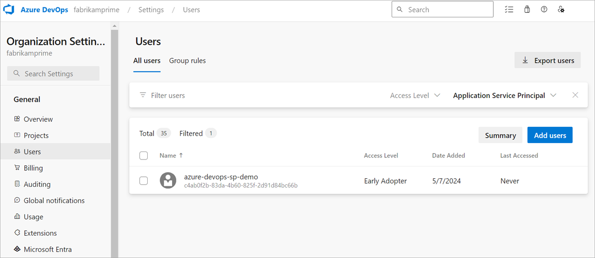

# Use service principals and managed identities in Azure DevOps

[!INCLUDE [version-eq-azure-devops](../../../includes/version-eq-azure-devops.md)]

Use a Microsoft Entra service principal or managed identity for Azure DevOps automation that runs without a user. These application identities aren't tied to an employee account, and they acquire short-lived Microsoft Entra access tokens instead of personal access tokens (PATs).

Managed identities and service principals have different credential-management requirements:

| Identity | Best for | Credential management |
|----------|----------|-----------------------|
| Managed identity | Workloads hosted on Azure | Azure manages the identity and its credentials. Your application doesn't store a client secret. |
| Service principal | Workloads outside Azure or workloads that need a portable application identity | Your application uses workload identity federation, a certificate, or a client secret. You manage certificates and client secrets. |

Prefer a managed identity for an Azure-hosted workload. For a service principal, prefer workload identity federation or a certificate over a client secret when the hosting environment supports it.

[!INCLUDE [use-microsoft-entra-reduce-pats](../../../includes/use-microsoft-entra-reduce-pats.md)]

## Understand application identities

### Service principals

A [service principal](/entra/identity-platform/app-objects-and-service-principals) is the local representation of an application in a Microsoft Entra tenant. Registering an application creates a service principal in its home tenant. A multitenant application can also have a service principal in each tenant that consents to the application.

A service principal can authenticate by using:

- A federated identity credential, when supported by the hosting platform.
- A certificate.
- A client secret, which you must store and rotate securely.

### Managed identities

A [managed identity](/entra/identity/managed-identities-azure-resources/overview) is a special type of service principal whose credentials Azure manages.

- A **system-assigned managed identity** belongs to one Azure resource and is deleted with that resource.
- A **user-assigned managed identity** is a separate Azure resource that can be assigned to multiple resources and managed independently.

## Prerequisites

- An Azure DevOps organization connected to a Microsoft Entra tenant.
- A service principal or managed identity in the tenant connected to the organization.
- Permission to add users to the organization. A member of **Project Collection Administrators** can add an identity. A project or team administrator can add an identity when the [invitation policy](../../../organizations/security/restrict-invitations.md) allows it.
- The permissions and access level required for the Azure DevOps resources that the identity accesses.

## Create an identity

Choose the identity type that matches the workload's hosting environment.

### Create a service principal

1. In the [Microsoft Entra admin center](https://entra.microsoft.com), select **App registrations** > **New registration**.
1. Enter a descriptive name and select the supported account type for your application.
1. Leave **Redirect URI** empty for a service-to-service application.
1. Add a federated identity credential or certificate. Create a client secret only when the workload can't use a stronger credential.

> [!IMPORTANT]
> An app registration has an application object and a service principal object. When you add the identity to Azure DevOps, use the service principal's **Object ID** from **Enterprise applications**, not the application object's ID from **App registrations**.

For more information, see [Application and service principal objects](/entra/identity-platform/app-objects-and-service-principals) and [Create a service principal](/entra/identity-platform/howto-create-service-principal-portal).

### Create a managed identity

To enable a system-assigned managed identity:

1. In the Azure portal, open the Azure resource that hosts your workload.
1. Select **Identity** > **System assigned**.
1. Set **Status** to **On**, and then select **Save**.

To create and assign a user-assigned managed identity:

1. In the Azure portal, create a **Managed Identity** resource.
1. Open the Azure resource that hosts your workload.
1. Select **Identity** > **User assigned** > **Add**.
1. Select the managed identity, and then select **Add**.

For more information, see [Manage user-assigned managed identities](/entra/identity/managed-identities-azure-resources/how-manage-user-assigned-managed-identities).

## Add the identity to Azure DevOps

You must explicitly add an application identity to each Azure DevOps organization that it accesses. Adding the identity only to a Microsoft Entra group doesn't make it available in Azure DevOps.

1. In Azure DevOps, select **Organization settings** > **Users**.
1. Select **Add users**.
1. Enter the display name of the service principal or managed identity.
1. Select the required access level and projects. Azure Repos access requires **Basic** or a higher functional access level. Visual Studio subscription benefits don't apply to application identities.
1. Select **Add**. Azure DevOps doesn't send an invitation email to an application identity.

   

To automate this step, use the [Service Principal Entitlements API](/rest/api/azure/devops/memberentitlementmanagement/service-principal-entitlements?view=azure-devops-rest-7.1&preserve-view=true).

## Configure access

Azure DevOps doesn't use Microsoft Entra application permissions to authorize an application identity. Assign an access level, Azure DevOps group memberships, and resource permissions just as you would for another organization member.

Follow these practices:

- Assign the lowest access level that supports the scenario.
- Add the identity to a purpose-specific Azure DevOps group instead of assigning many permissions directly.
- Grant access only to the required projects and resources.
- Review the identity's permissions and group memberships regularly.

For programmatic lookup and management, see the [Service Principal Graph API](/rest/api/azure/devops/graph/service-principals?view=azure-devops-rest-7.1&preserve-view=true).

## Acquire and use an access token

Request an access token for the Azure DevOps resource, and send it in the `Authorization` header as a bearer token. Treat access tokens as opaque. Don't depend on a fixed lifetime or decode claims from the token. Reuse the credential object so the Azure Identity library can cache tokens and acquire a new token when necessary.

The following .NET examples require the [Azure.Identity package](/dotnet/api/overview/azure/identity-readme).

### Service principal with a certificate

Set `AZURE_TENANT_ID`, `AZURE_CLIENT_ID`, and `AZURE_CLIENT_CERTIFICATE_PATH` in the workload's secure configuration.

```csharp
using Azure.Core;
using Azure.Identity;
using System.Net.Http.Headers;

string RequiredSetting(string name) =>
    Environment.GetEnvironmentVariable(name)
    ?? throw new InvalidOperationException($"Missing {name}.");

// Create a service-principal credential from a certificate.
var credential = new ClientCertificateCredential(
    RequiredSetting("AZURE_TENANT_ID"),
    RequiredSetting("AZURE_CLIENT_ID"),
    RequiredSetting("AZURE_CLIENT_CERTIFICATE_PATH"));

var token = await credential.GetTokenAsync(new TokenRequestContext(
    new[] { "https://app.vssps.visualstudio.com/.default" }));

// Call Azure DevOps with the Microsoft Entra token.
using var client = new HttpClient();
client.DefaultRequestHeaders.Authorization =
    new AuthenticationHeaderValue("Bearer", token.Token);
var response = await client.GetAsync(
    "https://dev.azure.com/{organization}/_apis/projects?api-version=7.1");
response.EnsureSuccessStatusCode();
Console.WriteLine(await response.Content.ReadAsStringAsync());
```

### User-assigned managed identity

Set `AZURE_CLIENT_ID` to the client ID of the user-assigned managed identity. Assign that identity to the Azure resource that hosts the application.

```csharp
using Azure.Core;
using Azure.Identity;
using System.Net.Http.Headers;

var managedIdentityClientId =
    Environment.GetEnvironmentVariable("AZURE_CLIENT_ID")
    ?? throw new InvalidOperationException("Missing AZURE_CLIENT_ID.");

// Select the user-assigned identity explicitly.
var credential = new ManagedIdentityCredential(
    ManagedIdentityId.FromUserAssignedClientId(managedIdentityClientId));
var token = await credential.GetTokenAsync(new TokenRequestContext(
    new[] { "https://app.vssps.visualstudio.com/.default" }));

// Call Azure DevOps with the Microsoft Entra token.
using var client = new HttpClient();
client.DefaultRequestHeaders.Authorization =
    new AuthenticationHeaderValue("Bearer", token.Token);
var response = await client.GetAsync(
    "https://dev.azure.com/{organization}/_apis/projects?api-version=7.1");
response.EnsureSuccessStatusCode();
Console.WriteLine(await response.Content.ReadAsStringAsync());
```

For a system-assigned managed identity, construct the credential with `ManagedIdentityId.SystemAssigned` instead. For more token-acquisition options, see [Acquire Microsoft Entra tokens](../../../cli/entra-tokens.md).

## Manage application identities

### Licensing

- Assign an access level directly to each application identity.
- Each identity consumes a license in every organization where it's assigned a paid access level.
- Multi-organization billing and Visual Studio subscription benefits for users don't apply to application identities.

### Identity lifecycle

- Application identities don't have email addresses and don't receive invitations.
- They can't sign in interactively or use the Azure DevOps web portal.
- They can't create PATs or SSH keys, create organizations, or use Azure DevOps OAuth flows.
- Removing an application identity from Microsoft Entra ID doesn't automatically remove its Azure DevOps membership. Remove stale identities from Azure DevOps as part of deprovisioning.

### Conditional Access

[Conditional Access for workload identities](/entra/identity/conditional-access/workload-identity) can target service principals under its supported conditions and licensing requirements. It doesn't support managed identities. User controls such as multifactor authentication and device compliance don't apply to non-user identities.

## Frequently asked questions

### Why use an application identity instead of a PAT?

An application identity isn't tied to a user's employment lifecycle. It requests short-lived access tokens and can be governed separately in Microsoft Entra ID and Azure DevOps. Managed identities don't require an application secret. Service principals still require credential management unless they use workload identity federation.

### What rate limits apply?

Service principals and managed identities have the same [Azure DevOps rate limits](../../concepts/rate-limits.md) as users.

### How is an application identity billed?

Assign an access level based on the features the identity needs. A paid access level is billed separately in every organization. Group-based licensing, multi-organization user billing, and Visual Studio subscription benefits don't apply.

### Can I add an identity from a different tenant?

The service principal or managed identity object that you add must exist in the Microsoft Entra tenant connected to the Azure DevOps organization. You can't add a managed identity directly from another tenant.

### Why can't the identity access an Azure Repos repository?

Confirm that the identity has **Basic** access or higher, membership in the project, and permission to access the repository. **Stakeholder** access doesn't include Azure Repos.

### Why can't Azure DevOps find my service principal?

In the Microsoft Entra admin center, select **Enterprise applications**, open the application, and use its **Object ID**. Don't use the object ID from **App registrations**.

### Why does the Graph API return an empty or incomplete list?

Follow the API's `continuationToken` values until no continuation token is returned. A service principal might appear on a later page.

### How do I resolve `TF401444: Sign-in required`?

Add the application identity explicitly to the Azure DevOps organization, assign an access level, and grant the required project and resource permissions.

## Related articles

- [Authentication methods for Azure DevOps integrations](authentication-guidance.md)
- [Microsoft Entra authentication](entra.md)
- [Sample applications for service principals](https://github.com/microsoft/azure-devops-auth-samples/tree/master/ServicePrincipalsSamples)
- [Service Principal Entitlements API](/rest/api/azure/devops/memberentitlementmanagement/service-principal-entitlements?view=azure-devops-rest-7.1&preserve-view=true)
- [Access Azure DevOps with a workload identity](../../../pipelines/library/add-devops-entra-service-connection.md)