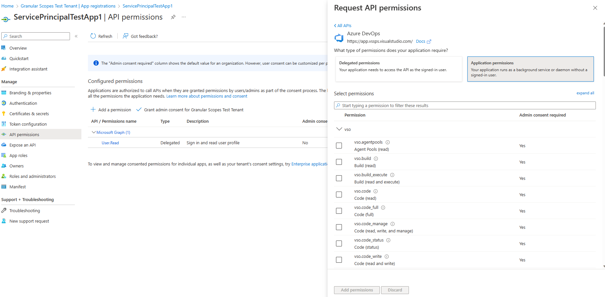
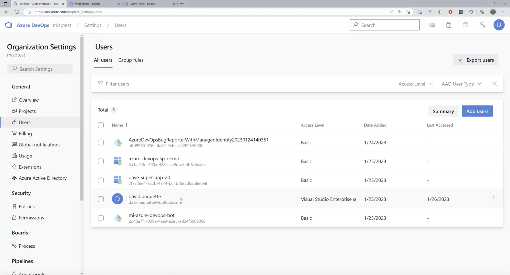

# Use Azure AD service principals & managed identities

[!INCLUDE [version-eq-azure-devops](../../../includes/version-eq-azure-devops.md)]

You can now add Azure Active Directory (Azure AD) service principals and managed identities to your Azure DevOps organizations to grant them access to your organization resources. For many teams, this feature can be a viable and preferred alternative to [personal access tokens (PATs)](../../../organizations/accounts/use-personal-access-tokens-to-authenticate.md) when authenticating applications that power automation workflows for your company. 

## About Service Principals and Managed Identities

> [!NOTE]
> Service principal and managed identities support is currently in public preview. They're only available to Azure AD-backed organizations.

You can let Azure AD applications access your Azure DevOps resources by adding their service principals to your organization. [Service principals](/azure/active-directory/fundamentals/service-accounts-principal) are security objects within an Azure AD application that define what an application can do in a given tenant. They're set up in the Azure portal during the application registration process and configured to access Azure resources, like Azure DevOps. By adding service principals into your organization and setting up permissions on top of them, we can determine whether a service principal is authorized to access your organizational resources and which ones.

[Managed identities](/azure/active-directory/fundamentals/service-accounts-managed-identities) are another Azure AD feature that acts similarly to an application's service principal. These objects provide identities for Azure resources and allow an easy way for services that support Azure AD authentication to share credentials. They're an appealing option because Azure AD takes care of credential management and rotation. While setup for a managed identity may look different on the Azure portal, Azure DevOps treats both security objects the same as a new identity in an organization with defined permissions. Throughout the rest of this documentation, we'll refer to managed identities and service principals interchangeably as service principal, unless specified.

We describe the steps needed to authenticate these identities to Azure DevOps to allow them to perform actions on behalf of themselves.

## Step-by-step Configuration

Your own implementation may vary, but at a high-level, the following steps are needed to start using service principals in your workflow.

### 1. Create a new managed identity or application service principal

The first step is to create an application and/or a managed identity, which must be done in the Azure portal. 

#### Create an Application Service Principal

When you create a new application registration, an application object is created in Azure AD. The **application service principal** is a representation of this application object for a given tenant. When you register an application as a multi-tenant application, there will be a unique service principal object that represents the application object for every tenant the application is added to.

Further information:
* [Application and service principal objects in Azure Active Directory](/azure/active-directory/develop/app-objects-and-service-principals)
* [Securing service principals](/azure/active-directory/fundamentals/service-accounts-principal)
* [Use the portal to create an Azure AD application and service principal that can access resources](/azure/active-directory/develop/howto-create-service-principal-portal)

[!VIDEO https://www.microsoft.com/en-us/videoplayer/embed/RWWY8q]

#### Create a Managed Identity
Creating managed identities in the Azure portal differs significantly from setting up applications with service principals. Before you begin the creation process, you must first consider which type of managed identity you want to create:

* **System-assigned managed identity:** Some Azure services allow you to enable a managed identity directly on a service instance. When you enable a system-assigned managed identity, an identity is created in Azure AD. The identity is tied to the lifecycle of that service instance. When the resource is deleted, Azure automatically deletes the identity for you. By design, only that Azure resource can use this identity to request tokens from Azure AD.
* **User-assigned managed identity** You may also create a managed identity as a standalone Azure resource by creating a user-assigned managed identity and assign it to one or more instances of an Azure service. For user-assigned managed identities, the identity is managed separately from the resources that use it.

Some helpful links:
* [What are managed identities for Azure resources?](/azure/active-directory/managed-identities-azure-resources/overview)
* [Manage user-assigned managed identities](/azure/active-directory/managed-identities-azure-resources/how-manage-user-assigned-managed-identities)
* [Configure managed identities for Azure resources on a VM using the Azure portal](/azure/active-directory/managed-identities-azure-resources/qs-configure-portal-windows-vm)

[!VIDEO https://www.microsoft.com/en-us/videoplayer/embed/RWWL8K]

### 2. Configure Azure DevOps OAuth application roles

#### Assign application roles and grant admin consent for service principals

[App-only roles](/azure/active-directory/develop/custom-rbac-for-developers) can be set up in Azure AD for service principals to authorize which permissions it will be allowed. (We treat roles slightly different than described in the Azure AD documentation. Rather than a role being a combination of permissions, each role is aligned to a single Azure DevOps scope.) All of the roles to choose from can be found on this list of [Azure DevOps scopes](./oauth.md#scopes).



[Assign these Azure AD app roles](/azure/active-directory/develop/howto-add-app-roles-in-azure-ad-apps#assign-app-roles-to-applications) to an app registration in the Azure portal or programmatically by using [the Microsoft Graph APIs](/graph/api/user-post-approleassignments). Each tenant admin must [grant consent](/azure/active-directory/develop/howto-add-app-roles-in-azure-ad-apps#grant-admin-consent) on behalf of all the users to allow the application to use these application permissions. 


#### Assign application roles and grant admin consent for managed identities

For managed identities, assigning an Azure AD role can only be done programmatically, like the following code snippet. When run by an admin, consent will be granted for the tenant.

As a pre-requisite, you may need the [AzureAD powershell module](/powershell/azure/active-directory/install-adv2) first.
```powershell
Install-Module AzureAD
```
Then, an administrator that can approve consent requests needs to run the following script:


```powershell
## VARIABLES

# Azure DevOps App ID in Azure AD
$azureDevOpsAppId = "499b84ac-1321-427f-aa17-267ca6975798"

# Azure DevOps API permissions. Find all at https://learn.microsoft.com/en-us/azure/devops/integrate/get-started/authentication/oauth?view=azure-devops#scopes
$permissions = "[List of comma-separated permissions]" # Example: "vso.build", "vso.graph"

# Azure AD Tenant ID
$tenatId = "77acec32-749c-443d-a53a-af7e86896469"

# Managed Identity Object ID. You can find it in the Azure resource instance under Managed Identity, or in the Enterprise Applications
$objectId = "[Object ID of your Managed Identity]"

## SCRIPT

Connect-AzureAD -Tenant $tenatId

# Find the Azure DevOps application
$azureDevOpsApp = Get-AzureADServicePrincipal -Filter "appId eq '$azureDevOpsAppId'"

# Assign all permissions to the Managed Identity service principal
foreach ($permission in $permissions)
{
   $role = $azureDevOpsApp.AppRoles | where Value -Like $permission | Select-Object -First 1
   New-AzureADServiceAppRoleAssignment -Id $role.Id -ObjectId $objectId -PrincipalId $objectId -ResourceId $azureDevOpsApp.ObjectId
}

```

### 3. Add and manage service principal in an Azure DevOps organization

Once you have completed configuring the service principal in the Azure AD portal, you must do the same in Azure DevOps by adding the service principal to your organization. They can be added through the [Users page](../../../organizations/accounts/add-organization-users.md) or with the [ServicePrincipalEntitlements APIs](//api-reference-links). Since they can't log in interactively, these actions must be done by a user account instead, specifically  a **Project Collection Administrator**. Only PCAs can add and manage service principals in an organization. When being added, you can also grant it access to specific projects and assign it a license.

> [!TIP] 
> To add the service principal to the organization, you will need to enter the application or managed identity's display name. If you choose to add a service principal programmatically through the [ServicePrincipalEntitlements API], make sure to pass in the service principal's object id and not the application's object id. 

> [!NOTE]
> You can only add a managed identity for the tenant your organization is connected to. If you would like to access a managed identity in a different tenant, see [the workaround we've included in the FAQ](#q-can-i-add-a-managed-identity-from-a-different-tenant-to-my-organization).



After they're added to the organization, they can be treated similarly to standard user accounts. You can directly assign permissions to the service principal, add and remove it from security groups and teams, assign it to any access level available to users, and remove it from the organization.

[!VIDEO https://www.microsoft.com/en-us/videoplayer/embed/RWWG70]

Management of service principals does differ from user accounts in a few key ways:
* Service principals don't have emails and as such, they can't be invited to an organization via email.
* Group rules for licensing currently don't apply to service principals. If you want to assign an access level to a service principal, it's best to do so directly. 
* While service principals can be added to Azure AD groups (in the Azure portal), we have a current technical limitation preventing us from being able to display them in a list of Azure AD group members. This limitation isn't true for Azure DevOps groups. That being said, a service principal will still inherit any group permissions set on top of an Azure AD group they belong to. 
* Not all users in an Azure AD group are immediately part of an Azure DevOps organization just because an admin creates a group and adds an Azure AD group to it. We have a process called "materialization" that happens once a user from an Azure AD group signs in to the organization for the first time. A user signing into an organizations allows us to determine which users should be granted a license. Since log in isn't possible for service principals, they must be explicitly added to an organization by an admin as described earlier. 
* You can't modify a service principal’s display name or avatar on Azure DevOps.
* A service principal will count as a license for each organization it's added to, even if [multi-organization billing](../../../organizations/billing/buy-basic-access-add-users.md?#pay-for-a-user-once-across-multiple-organizations) is selected.

### 4. Access Azure DevOps resources with an Azure AD token

#### Get an Azure AD token
Acquiring an access token for a managed identity can be done by following along with the Azure AD documentation. See these examples for [service principals](/azure/active-directory/develop/v2-oauth2-client-creds-grant-flow#get-a-token) and [managed identities](/azure/active-directory/managed-identities-azure-resources/how-to-use-vm-token). 

The returned access token is a JWT with the defined roles, which can be used to access organization resources using the token as *Bearer*.

#### Use the Azure AD token to authenticate to Azure DevOps resources
In the following video example, follow along with this [sample application](https://dev.azure.com/mseng/AzureDevOps/_git/Tools.Identity?path=/ServicePrincipalsSamples/1-ConsoleApp-AppRegistration) where we move from authenticating with a PAT to using a token from a service principal. We start by using a client secret for authentication, then move to using a client certificate.

[!VIDEO https://www.microsoft.com/en-us/videoplayer/embed/RWWNVM]

Another example demonstrates how to connect to Azure DevOps using a User Assigned Managed Identity within an Azure Function.

[!VIDEO https://www.microsoft.com/en-us/videoplayer/embed/RWWL8L]

Service principals can be used to call Azure DevOps REST APIs and do most actions, but it's limited from the following operations:
* Service principals can't be Organization Owners or create organizations.
* Service principals can't create tokens, like [personal access tokens (PATs)](../../../organizations/accounts/use-personal-access-tokens-to-authenticate.md) or [SSH Keys](../../../repos/git/use-ssh-keys-to-authenticate.md). They can generate their own Azure AD tokens and these tokens can be used to call Azure DevOps REST APIs.
* We won't be supporting [Azure DevOps OAuth](./oauth.md) for service principals.

## FAQs

### Q: Why should I use a service principal or a managed identity instead of a PAT?

Many of our customers seek out a service principal or managed identity to replace an existing PAT (personal access token). Such PATs often belong to a service account (shared team  account) that is using them to authenticate an application with Azure DevOps resources. PATs must be laboriously rotated every so often (minimum 180 days). As PATs are simply bearer tokens, token strings that represent a user’s username and password, they'
re incredibly risky to use as they can easily fall into the wrong person’s hands. Azure AD tokens expire every hour and must be regenerated with a refresh token to get a new access token, which limits the overall risk factor when leaked.

### Q: What are the rate limits on service principals and managed identities?
At this time, service principals and managed identities have the same [rate limits](../../concepts/rate-limits.md) as users.

### Q: Will using this feature cost me additional fees?
At this time, service principals and managed identities are no different in pricing than a standard user license. One notable change pertains to how we treat "multi-org billing" for service principals. While users are counted as only one license no matter how many organizations they have been added to, service principals will be counted as one license per each organization they have been added to (like standard "user assignment-based billing"). 

### Q: Can I use a service principal to do git operations, like clone a repo?
See the following example of how we've passed an [Azure AD token](#get-an-azure-ad-token) of a service principal instead of a PAT to git clone a repo in a PowerShell script.

```powershell
$ServicePrincipalAadAccessToken = 'Azure AD access token of a service principal'
git -c http.extraheader="AUTHORIZATION: bearer $ServicePrincipalAadAccessToken" clone https://dev.azure.com/{yourOrgName}/{yourProjectName}/_git/{yourRepoName}
```
> [!TIP] 
> To keep your token more secure, use credential managers so you don't have to enter your credentials every time. We recommend [Git Credential Manager](https://github.com/GitCredentialManager/git-credential-manager), which can accept [Azure AD tokens (that is, Microsoft Identity OAuth tokens)](https://github.com/GitCredentialManager/git-credential-manager/blob/main/docs/environment.md#GCM_AZREPOS_CREDENTIALTYPE) instead of PATs if an environment variable is changed.

### Q: Can I use a service principal or managed identity with Azure CLI?
Yes! Anywhere that asks for PATs in the Azure CLI can also accept [Azure AD access tokens](#get-an-azure-ad-token). (We will work on revising the requested environemnt variable to reflect this.) In the meantime, see these examples for how you might pass an Azure AD token in to authenticate with CLI.

```powershell
# Set the environment variable for current process, which is the preferred option for CI/CD. Please note that Azure AD tokens will expire in an hour, and use with care if this token is needed for longer.
$env:AZURE_DEVOPS_EXT_PAT="{aad_access_token}"

# Command: az devops login will prompt you to enter a token. You can add an Azure AD token too! Not just a PAT.
Example:
PS C:\Users> az devops login
Token:
```
After which, you should be able to use `az cli` commands per usual.

### Q: Can I add a managed identity from a different tenant to my organization?

You are only able to add a managed identity from the same tenant that your organization is connected to. However, we have a workaround that will allow you to set up a managed identity in the "resource tenant" where are all of your resources are and enable it to be used by an application service principal in the "target tenant", the tenant your organization is connected to.
1. To begin, create a [user-assigned managed identity](/azure/active-directory/managed-identities-azure-resources/how-manage-user-assigned-managed-identities) in Azure portal for your resource tenant. 
2. Connect it to a [virtual machine and assign this managed identity](/azure/active-directory/managed-identities-azure-resources/qs-configure-portal-windows-vm) to it. 
3. Create a [key vault](/azure/key-vault/general/quick-create-portal) and generate a [certificate](/azure/key-vault/certificates/quick-create-portal) (cannot be of type "PEM"). When you generate this certificate, a secret with the same name is also generated, which we will be using later. 
4. Now, grant access to the managed identity so that it can read the private key from the key vault. Create an access policy in the key vault with the "Get/List" permissions (under "Secret permissions" and search for the managed identity under "Select principal".
5. Lastly, download the created certificate in "CER" format, which ensures that it does not contain the private part of your certificate.
6. Next, we need to [create a new application registration](#1-create-a-new-managed-identity-or-application-service-principal) in the target tenant.
7. Upload the downloaded certificate to this new application in the "Certificates & secrets" tab.
8. Add this application's service principal to the [Azure DevOps organization we want it to access](#3-add-and-manage-service-principal-in-an-azure-devops-organization), and don't forget to set up the service principal with any required permissions.
9. To get an Azure AD access token from this service principal that makes use of the managed identity certificate, take a look at this code sample below:

```cs
public static async Task<string> GetSecret(string keyVaultName, string secretName)
{
	var keyVaultUri = new Uri("https://" + keyVaultName + ".vault.azure.net");
	var client = new SecretClient(keyVaultUri, new ManagedIdentityCredential());
	var keyVaultSecret = await client.GetSecretAsync(secretName);

	var secret = keyVaultSecret.Value;
	return secret.Value;
}

private static async Task<AuthenticationResult> GetAppRegistrationAADAccessToken(string applicationClientID, string appTenantId)
{
	IConfidentialClientApplication app;

	byte[] privateKeyBytes = Convert.FromBase64String(GetSecret(keyVaultName, secretName));
	X509Certificate2 certificateWithPrivateKey = new X509Certificate2(privateKeyBytes, (string)null, X509KeyStorageFlags.MachineKeySet);

	app = ConfidentialClientApplicationBuilder.Create(applicationClientID)
		.WithCertificate(certificateWithPrivateKey)
		.WithAuthority(new Uri(string.Format(CultureInfo.InvariantCulture, "https://login.microsoftonline.com/{0}", appTenantId)))
		.Build();
	app.AddInMemoryTokenCache();

	string AdoAppClinetID = "499b84ac-1321-427f-aa17-267ca6975798/.default";
	string[] scopes = new string[] { AdoAppClientID };

	var result = await app.AcquireTokenForClient(scopes).ExecuteAsync();

	return result;
}
```
10. Please note that this certificate must still be regularly rotated.

## Potential errors

#### Failed to create service principal with object ID '{`provided objectId`}'

This error will appear because there is no service principal with the `provided objectId` in the tenant connected to your organization.
One common reason why this error might happen is that you're passing in the object ID of the app registration, instead of the object ID of its service principal. Remember, a service principal is an object that represents the application for a given tenant, it's not the application itself.
The `service principal object ID` can be found in your tenant's "Enterprise Applications" page. Search for the application's name and click on the "Enterprise Application" result that returns. This result is the page of the service principal / enterprise application and you can use the Object ID found on this page to create a service principal in Azure DevOps.

#### Access Denied: {`ID of the caller identity`} needs the following permission(s) on the resource Users to perform this action: Add Users

This error might be due to one of the following reasons:
* You're not the owner of the organization, project collection administrator, or a project or team administrator.
* You're a project or team administrator, but the policy ['Allow team and project administrators to invite new users'](../../../organizations/security/restrict-invitations.md) has been disabled.
* You're a project or team administrator, you're enabled to invite new users, but you are trying to assign a license when you invite a new user.
  * Project or team administrators are not allowed to assign a license to new users. Any new invited user will be added with a Stakeholder license. Contact a PCA to change the license access level.

#### Azure DevOps Graph List API returns empty list, even though we know there are service principals in the organization
The Azure DevOps Graph List API may return an empty list, even if there are still additional pages of users to return. Use the `continuationToken` to iterate through the lists, and you will eventually find a page where the service principals are returned. If a `continuationToken` is returned, that means there are more results available through the API. While we have plans to improve upon this logic, at this moment, it is possible that the first X results return empty.

