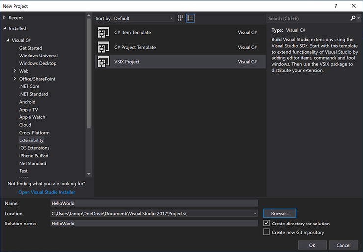
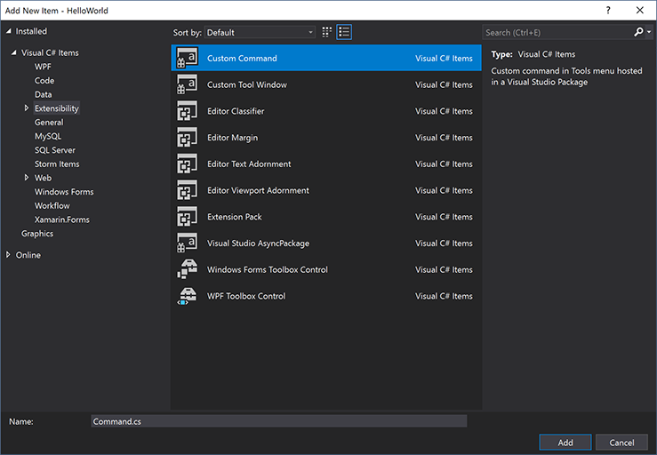
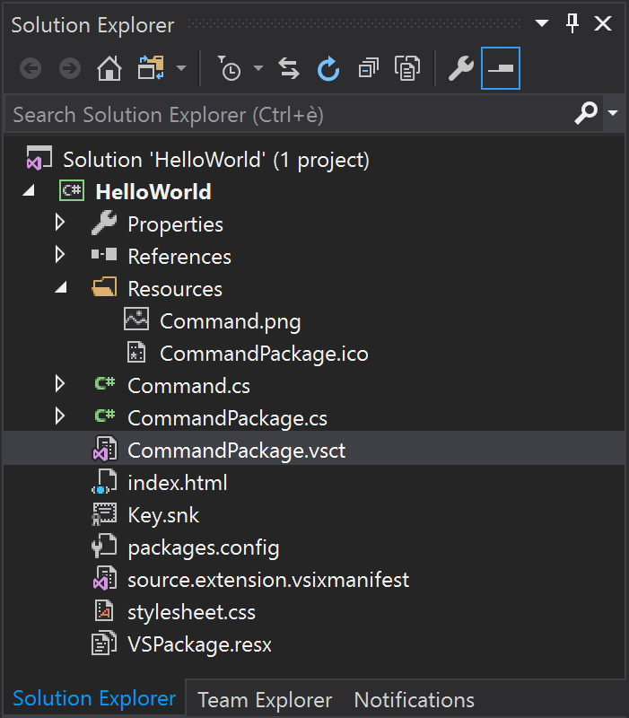
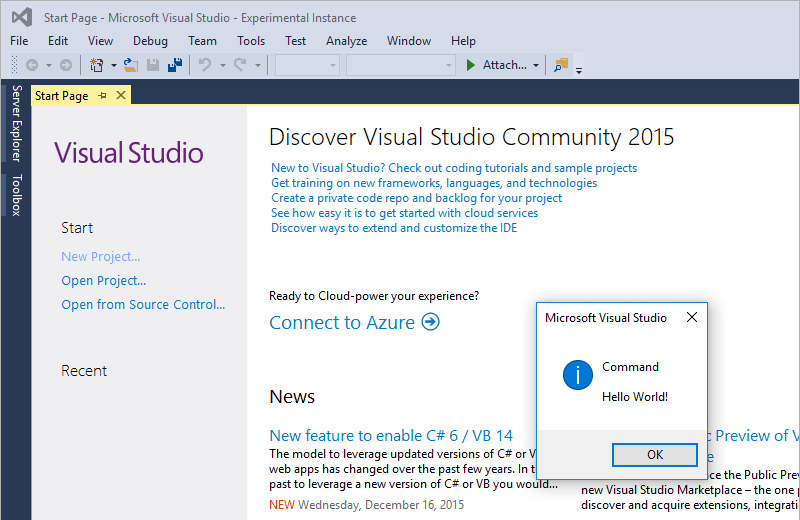

# Hello world

This Hello World example walks you through creating a custom command in Visual Studio and executing that command. You should learn the basics of these skills:
* [Create a project](#project)
* [Add a Custom command](#add)
* [Modify the code](#code)
* [Run it](#run)

For this example, you'll use Visual C# to add a custom menu button named "Say HelloWorld!" that looks like this:
 

## Create a project

NOTE: Before you start, you may be prompted to download the Extensibility tools. which include the VSIX template you'll need and sample code.

1.	From the **File** menu, click **New Project**. At the bottom of the screen, you can enter the name of your project.
2.	From the **Templates** menu, click **Visual C#**, click **Extensibility**, and then click **VSIX Project**. (Your custom templates can be added to VSIX templates, but you must use a VSIX template for the final project.)
  

You should now see the Getting Started page and some sample resources.

If you need to leave this tutorial and come back to it, you can find your new HelloWorld project on the **Start Page** in the **Recent** section.

## Add a Custom command

1.	If you select the manifest, you can see what options are changeable, for instance, metadata, description, and version.
2.	Right-click the project (not the solution). On the context menu, click **Add**, and then click **New Item**.
3.	Go back to the **Extensibility** section, and then click **Custom Command**.
  
4.  In the **Name** field at the bottom, give it a name, for instance Command.cs.

Your new command will be listed in the **Solution Explorer** under the **Resources** branch. This is also where you'll find other files related to your command, such as the PNG and ICO files if you wish to modify the image. 

## Modify the code

At this point, the Button you're adding is pretty generic. You'll have to modify the VSCT file and CS file if you want to make changes.
  * The VSCT file is where you can rename your commands, as well as define where they go in the Visual Studio command system. As you explore the VSCT file, you will notice a lot of commented code that explains what each section of code controls.
  * The CS file is where you can define actions, such as the click handler.

1.  In **Solution Explorer**, find the VSCT file for your new command. In this case, it will be called CommandPackage.vsct.
  
2.	Change the **ButtonText** parameter to "Say HelloWorld!"

          ...
          <Button guid="guidCommandPackageCmdSet" id="CommandId" priority="0x0100" type="Button">
             <Parent guid="guidCommandPackageCmdSet" id="MyMenuGroup" />
             <Icon guid="guidImages" id="bmpPic1" />
             <Strings>
                <ButtonText>Say HelloWorld!</ButtonText>
             </Strings>
          </Button>
          ...

3.	Go back to **Solution Explorer** and find the Command.cs file. Change the string message for the command to "Hello World!"

          ...
          private void Execute(object sender, EventArgs e)
          {
              ThreadHelper.ThrowIfNotOnUIThread();
              string message = "Hello World";
              string title = "Command";

              // Show a message box to prove we were here
              VsShellUtilities.ShowMessageBox(
                  this.package,
                  message,
                  title,
                  OLEMSGICON.OLEMSGICON_INFO,
                  OLEMSGBUTTON.OLEMSGBUTTON_OK,
                  OLEMSGDEFBUTTON.OLEMSGDEFBUTTON_FIRST);
          }
          ...

## Run it

You know how this is going to turn out, but you should run the code to see how Visual Studio 2015 now has a debug window.
1.	Click **Start**. A new instance of Visual Studio opens called **Experimental Instance**. This is the debug mode.
2.	On the **Tools** menu of the **Experimental Instance**, click **Say HelloWorld!**
   

You should see the output from your new custom command, in this case the window in the center of the screen that gives you the Hello World message. With the new dual-instance feature of Visual Studio 2015, you have both this **Experimental Instance** where you see the code in action and the original instance where you can make adjustments or fixes.

# Next steps

This walkthrough showed you how to:
* Create a project 
* Add a custom command to a menu
* Modify the VSCT file
* Modify the CS file
* Run your code

Now that you know the basics of working with Visual Studio, you can read overview material about other options in the **Develop** section of this Beginner's Guide and learn more about the rich library of [sample code](./samples.md) available to you.
