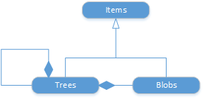

# Git items

[!INCLUDE [azure-devops](../_data/azure-devops-message.md)]

[!INCLUDE [API_version](../_data/version.md)]

Items are the files, folders, and submodules in a repository.
Files are [blobs](./blobs.md) in the API and folders are [trees](./trees.md).
If the repository contains [submodules](https://git-scm.com/docs/git-submodule), they will appear as [commits](./commits.md).



There are [code samples](https://github.com/Microsoft/vsts-dotnet-samples/blob/master/ClientLibrary/Snippets/Microsoft.TeamServices.Samples.Client/repos/git/ItemsSample.cs) available for this endpoint.

[!INCLUDE [GET_STARTED](../_data/get-started.md)]

## Types of data

This API does content negotiation based on the `Accept` header you send.

| `Accept` header value      | API behavior
|:---------------------------|:------------
| `application/zip`          | Returns zipped contents of the item requested
| `application/json`         | Returns metadata about the item
| `text/plain` or other      | Return contents of the item requested; ignores requests for recursion

## Get a file
<a name="afile" />

```no-highlight
GET https://{instance}/DefaultCollection/{project}/_apis/repos/git/repositories/{repository}/items?api-version={version}&scopePath={filePath}[&includeContentMetadata={bool}&lastProcessedChange={bool}]
```

| Parameter              | Type    | Default | Notes
|:-----------------------|:--------|:--------|:-------------------------------------------------------------------------------------------------------------
| URL
| instance               | string  |         | [VS Team Services account](../../get-started/rest/basics.md) ({account}.visualstudio.com) or [TFS server](/azure/devops/integrate/get-started/rest/basics) ({server:port}).
| project                | string  |         | ID or name of the [project](../tfs/projects.md). *Optional if specifying an ID for repository.*
| repository             | string  |         | ID or name of the [repository](./repositories.md).
| Query
| api-version            | string  |         | [Version](../../concepts/rest-api-versioning.md) of the API to use.
| scopePath              | string  | /       | Path to the item in the repository. `/WebSite/WebSite/Views/Home/_Home.cshtml`
| includeContentMetadata | bool    | false   | Use `true` to include additional metadata about the item content, like the file type.
| latestProcessedChange  | bool    | false   | `true` gets the [commit](./commits.md) that contains the previous change to the retrieved version of the item. Of course, the root item ("/") has no commits associated with it, so there will not be a commit returned with the root item.

[!INCLUDE [ID_vs_Name](_data/id_or_name.md)]

### Stream a file
<a name="streamafile" />

When you get an item that is a file, the response is a stream (`application/octet-stream`) that contains the contents of the file. You can also get a [specific version](#getaspecificversion) of an item. 

####Sample request
```no-highlight
GET http://fabrikam-fiber-inc:8080/DefaultCollection/Fabrikam-Fiber-Git/_apis/repos/git/repositories/Fabrikam-Fiber-Git/items?scopePath=/WebSite/WebSite/Views/Home/_Home.cshtml&api-version=1.0
```
####Sample response

```html
<div class="jumbotron">
    <h1>ASP.NET</h1>
    <p class="lead">ASP.NET is a free web framework for building great Web sites and Web applications using HTML, CSS, and JavaScript.</p>
    <p><a href="http://asp.net" class="btn btn-primary btn-large">Learn more &raquo;</a></p>
</div>
<div class="row">
    <div class="col-md-4">
        <h2>Getting started</h2>
        <p>
            ASP.NET Single Page Application (SPA) helps you build applications that include significant client-side interactions using HTML, CSS, and JavaScript.
            It's now easier than ever before to getting started writing highly interactive web applications.
        </p>
        <p><a class="btn btn-default" href="http://go.microsoft.com/fwlink/?LinkId=273732">Learn more &raquo;</a></p>
    </div>
    <div class="col-md-4">
        <h2>Get more libraries</h2>
        <p>NuGet is a free Visual Studio extension that makes it easy to add, remove, and update libraries and tools in Visual Studio projects.</p>
        <p><a class="btn btn-default" href="http://go.microsoft.com/fwlink/?LinkId=301866">Learn more &raquo;</a></p>
    </div>
    <div class="col-md-4">
        <h2>Web Hosting</h2>
        <p>You can easily find a web hosting company that offers the right mix of features and price for your applications.</p>
        <p><a class="btn btn-default" href="http://go.microsoft.com/fwlink/?LinkId=301867">Learn more &raquo;</a></p>
    </div>
</div>
```
#####Status code: 200

### Zip a folder
<a name="zipafolder" />

Set `scopePath` to the folder that you want to get in a zipped format and include the request header `Accept: application/zip`.

####Sample request
```http
Accept: application/zip
```
```no-highlight
GET https://{instance}/DefaultCollection/{project}/_apis/repos/git/repositories/{repository}/items?api-version={version}&scopePath={folderPath}
```

You can get a .zip file that contains the contents of a [specific version](#getaspecificversion) of folder, too.

## Get item metadata for

### A file

Set the accept header to `application/json` to get the metadata for a file, or for a [specific version](#getaspecificversion) of a file.

####Sample request

```http
Accept: application/json
```
```no-highlight
GET https://{instance}/DefaultCollection/{project}/_apis/repos/git/repositories/{repository}/items?api-version={version}&scopepath=/mywebsite/mywebsite/views/home/_home.cshtml
```

####Response
The objectId in the metadata is the SHA1 hash of the item.

#####Status code: 200
```json
{
  "count": 1,
  "value": [
    {
      "objectId": "61a86fdaa79e5c6f5fb6e4026508489feb6ed92c",
      "gitObjectType": "blob",
      "commitId": "03b1b831e41df536d836c95e2f68a42db4f3e0db",
      "path": "/MyWebSite/MyWebSite/Views/Home/_Home.cshtml"
    }
  ]
}
```
### A folder
<a name="afolder" />

When you get an item that is a folder, the default response is the metadata (`application/json`).
You can get the metadata for a [specific version](#getaspecificversion) of a folder, too.

#### Sample request

```
GET https://mytfsserver/DefaultCollection/_apis/git/repositories/278d5cd2-584d-4b63-824a-2ba458937249/items?scopePath=/MyWebSite/MyWebSite/Views&api-version=1.0
```

#### Sample response

```json
{
  "count": 1,
  "value": [
    {
      "objectId": "d1d5c2d49045d52bba6419652d6ecb2cd560dc29",
      "gitObjectType": "tree",
      "commitId": "23d0bc5b128a10056dc68afece360d8a0fabb014",
      "path": "/MyWebSite/MyWebSite/Views",
      "isFolder": true,
      "url": "https://mytfsserver/DefaultCollection/_apis/git/repositories/278d5cd2-584d-4b63-824a-2ba458937249/items/MyWebSite/MyWebSite/Views?versionType=Branch&versionOptions=None"
    }
  ]
}
```


### A folder and its children
<a name="afolderanditschildren" />

Use `recursionLevel` (and an appropriate `Accept` header) to include the contents of the folder in the response.
You can get the contents of a [specific version](#getaspecificversion) of the folder, too.

#### Sample request

```
GET https://mytfsserver/DefaultCollection/_apis/git/repositories/278d5cd2-584d-4b63-824a-2ba458937249/items?scopePath=/MyWebSite/MyWebSite/Views&recursionLevel=Full&includeContentMetadata=true&api-version=1.0
```

#### Sample response

```json
{
  "count": 13,
  "value": [
    {
      "objectId": "d1d5c2d49045d52bba6419652d6ecb2cd560dc29",
      "gitObjectType": "tree",
      "commitId": "23d0bc5b128a10056dc68afece360d8a0fabb014",
      "path": "/MyWebSite/MyWebSite/Views",
      "isFolder": true,
      "contentMetadata": {
        "fileName": "Views"
      },
      "url": "https://mytfsserver/DefaultCollection/_apis/git/repositories/278d5cd2-584d-4b63-824a-2ba458937249/items/MyWebSite/MyWebSite/Views?versionType=Branch&versionOptions=None"
    },
    {
      "objectId": "ea6765e1976b9e8a6d4981fd8febebd574a91571",
      "gitObjectType": "tree",
      "commitId": "23d0bc5b128a10056dc68afece360d8a0fabb014",
      "path": "/MyWebSite/MyWebSite/Views/Home",
      "isFolder": true,
      "url": "https://mytfsserver/DefaultCollection/_apis/git/repositories/278d5cd2-584d-4b63-824a-2ba458937249/items/MyWebSite/MyWebSite/Views/Home?versionType=Branch&versionOptions=None"
    },
    {
      "objectId": "9093f030aa7dd8c802cad228fae4c6bafae4b32f",
      "gitObjectType": "blob",
      "commitId": "23d0bc5b128a10056dc68afece360d8a0fabb014",
      "path": "/MyWebSite/MyWebSite/Views/Home/Index.cshtml",
      "url": "https://mytfsserver/DefaultCollection/_apis/git/repositories/278d5cd2-584d-4b63-824a-2ba458937249/items/MyWebSite/MyWebSite/Views/Home/Index.cshtml?versionType=Branch&versionOptions=None"
    },
    {
      "objectId": "61a86fdaa79e5c6f5fb6e4026508489feb6ed92c",
      "gitObjectType": "blob",
      "commitId": "23d0bc5b128a10056dc68afece360d8a0fabb014",
      "path": "/MyWebSite/MyWebSite/Views/Home/_Home.cshtml",
      "url": "https://mytfsserver/DefaultCollection/_apis/git/repositories/278d5cd2-584d-4b63-824a-2ba458937249/items/MyWebSite/MyWebSite/Views/Home/_Home.cshtml?versionType=Branch&versionOptions=None"
    },
    {
      "objectId": "445986f7957f0478686b6def4dcd04d2bad00594",
      "gitObjectType": "blob",
      "commitId": "23d0bc5b128a10056dc68afece360d8a0fabb014",
      "path": "/MyWebSite/MyWebSite/Views/Home/_Login.cshtml",
      "url": "https://mytfsserver/DefaultCollection/_apis/git/repositories/278d5cd2-584d-4b63-824a-2ba458937249/items/MyWebSite/MyWebSite/Views/Home/_Login.cshtml?versionType=Branch&versionOptions=None"
    },
    {
      "objectId": "d95a992b555367d1332be5407ba653261543c190",
      "gitObjectType": "blob",
      "commitId": "23d0bc5b128a10056dc68afece360d8a0fabb014",
      "path": "/MyWebSite/MyWebSite/Views/Home/_Manage.cshtml",
      "url": "https://mytfsserver/DefaultCollection/_apis/git/repositories/278d5cd2-584d-4b63-824a-2ba458937249/items/MyWebSite/MyWebSite/Views/Home/_Manage.cshtml?versionType=Branch&versionOptions=None"
    },
    {
      "objectId": "8052a02bee6f82ae02c4d408d1b5b98ab1bf56a6",
      "gitObjectType": "blob",
      "commitId": "23d0bc5b128a10056dc68afece360d8a0fabb014",
      "path": "/MyWebSite/MyWebSite/Views/Home/_Register.cshtml",
      "url": "https://mytfsserver/DefaultCollection/_apis/git/repositories/278d5cd2-584d-4b63-824a-2ba458937249/items/MyWebSite/MyWebSite/Views/Home/_Register.cshtml?versionType=Branch&versionOptions=None"
    },
    {
      "objectId": "d3ea8b1ffab4736168e4b1d225ebc5aa0ade8cfe",
      "gitObjectType": "blob",
      "commitId": "23d0bc5b128a10056dc68afece360d8a0fabb014",
      "path": "/MyWebSite/MyWebSite/Views/Home/_RegisterExternal.cshtml",
      "url": "https://mytfsserver/DefaultCollection/_apis/git/repositories/278d5cd2-584d-4b63-824a-2ba458937249/items/MyWebSite/MyWebSite/Views/Home/_RegisterExternal.cshtml?versionType=Branch&versionOptions=None"
    },
    {
      "objectId": "d1c521e3b401b314d4f9ff17f6cad4652c6a4d14",
      "gitObjectType": "tree",
      "commitId": "23d0bc5b128a10056dc68afece360d8a0fabb014",
      "path": "/MyWebSite/MyWebSite/Views/Shared",
      "isFolder": true,
      "url": "https://mytfsserver/DefaultCollection/_apis/git/repositories/278d5cd2-584d-4b63-824a-2ba458937249/items/MyWebSite/MyWebSite/Views/Shared?versionType=Branch&versionOptions=None"
    },
    {
      "objectId": "a89723ddddb14cd956fae1a6f118ba29f1667cf4",
      "gitObjectType": "blob",
      "commitId": "23d0bc5b128a10056dc68afece360d8a0fabb014",
      "path": "/MyWebSite/MyWebSite/Views/Shared/Error.cshtml",
      "url": "https://mytfsserver/DefaultCollection/_apis/git/repositories/278d5cd2-584d-4b63-824a-2ba458937249/items/MyWebSite/MyWebSite/Views/Shared/Error.cshtml?versionType=Branch&versionOptions=None"
    },
    {
      "objectId": "86b48073d8ce15039ce18219d8fda43ba7f0c467",
      "gitObjectType": "blob",
      "commitId": "23d0bc5b128a10056dc68afece360d8a0fabb014",
      "path": "/MyWebSite/MyWebSite/Views/Shared/_Layout.cshtml",
      "url": "https://mytfsserver/DefaultCollection/_apis/git/repositories/278d5cd2-584d-4b63-824a-2ba458937249/items/MyWebSite/MyWebSite/Views/Shared/_Layout.cshtml?versionType=Branch&versionOptions=None"
    },
    {
      "objectId": "f5dd7df5872eae8c39c9491f67d856dafd609683",
      "gitObjectType": "blob",
      "commitId": "23d0bc5b128a10056dc68afece360d8a0fabb014",
      "path": "/MyWebSite/MyWebSite/Views/Web.config",
      "url": "https://mytfsserver/DefaultCollection/_apis/git/repositories/278d5cd2-584d-4b63-824a-2ba458937249/items/MyWebSite/MyWebSite/Views/Web.config?versionType=Branch&versionOptions=None"
    },
    {
      "objectId": "2de62418c07c3ffa833543f484445dbfd0fe68d8",
      "gitObjectType": "blob",
      "commitId": "23d0bc5b128a10056dc68afece360d8a0fabb014",
      "path": "/MyWebSite/MyWebSite/Views/_ViewStart.cshtml",
      "url": "https://mytfsserver/DefaultCollection/_apis/git/repositories/278d5cd2-584d-4b63-824a-2ba458937249/items/MyWebSite/MyWebSite/Views/_ViewStart.cshtml?versionType=Branch&versionOptions=None"
    }
  ]
}
```


### Multiple items
To get more than one item in a single batch, specify the path of each item in an array of item descriptors in the post body.
You can specify the [version](#getaspecificversion) and [recursion level](#afolderanditschildren) for each item, too.

#### Sample request

```
POST https://mytfsserver/DefaultCollection/_apis/git/repositories/278d5cd2-584d-4b63-824a-2ba458937249/itemsBatch?api-version=1.0
```
```json
{
  "itemDescriptors": [
    {
      "path": "/MyWebSite/MyWebSite/Views",
      "version": "23d0bc5b128a10056dc68afece360d8a0fabb014",
      "versionType": "commit",
      "versionOptions": "none",
      "recursionLevel": "OneLevel"
    },
    {
      "path": "/MyWebSite/MyWebSite/Views/Home",
      "version": "23d0bc5b128a10056dc68afece360d8a0fabb014",
      "versionType": "commit",
      "versionOptions": "none",
      "recursionLevel": "none"
    },
    {
      "path": "/MyWebSite/MyWebSite/Views/Shared",
      "version": "23d0bc5b128a10056dc68afece360d8a0fabb014",
      "versionType": "commit",
      "versionOptions": "none",
      "recursionLevel": "none"
    },
    {
      "path": "/MyWebSite/MyWebSite/Views/Web.config",
      "version": "23d0bc5b128a10056dc68afece360d8a0fabb014",
      "versionType": "commit",
      "versionOptions": "none",
      "recursionLevel": "none"
    },
    {
      "path": "/MyWebSite/MyWebSite/Views/_ViewStart.cshtml",
      "version": "23d0bc5b128a10056dc68afece360d8a0fabb014",
      "versionType": "commit",
      "versionOptions": "none",
      "recursionLevel": "none"
    }
  ],
  "includeContentMetadata": "true"
}
```

#### Sample response

```json
{
  "count": 5,
  "value": [
    [
      {
        "objectId": "d1d5c2d49045d52bba6419652d6ecb2cd560dc29",
        "gitObjectType": "tree",
        "commitId": "23d0bc5b128a10056dc68afece360d8a0fabb014",
        "path": "/MyWebSite/MyWebSite/Views",
        "isFolder": true,
        "contentMetadata": {
          "fileName": "Views"
        },
        "url": "https://mytfsserver/DefaultCollection/_apis/git/repositories/278d5cd2-584d-4b63-824a-2ba458937249/items/MyWebSite/MyWebSite/Views?versionType=Commit&version=23d0bc5b128a10056dc68afece360d8a0fabb014&versionOptions=None"
      },
      {
        "objectId": "ea6765e1976b9e8a6d4981fd8febebd574a91571",
        "gitObjectType": "tree",
        "commitId": "23d0bc5b128a10056dc68afece360d8a0fabb014",
        "path": "/MyWebSite/MyWebSite/Views/Home",
        "isFolder": true,
        "url": "https://mytfsserver/DefaultCollection/_apis/git/repositories/278d5cd2-584d-4b63-824a-2ba458937249/items/MyWebSite/MyWebSite/Views/Home?versionType=Commit&version=23d0bc5b128a10056dc68afece360d8a0fabb014&versionOptions=None"
      },
      {
        "objectId": "d1c521e3b401b314d4f9ff17f6cad4652c6a4d14",
        "gitObjectType": "tree",
        "commitId": "23d0bc5b128a10056dc68afece360d8a0fabb014",
        "path": "/MyWebSite/MyWebSite/Views/Shared",
        "isFolder": true,
        "url": "https://mytfsserver/DefaultCollection/_apis/git/repositories/278d5cd2-584d-4b63-824a-2ba458937249/items/MyWebSite/MyWebSite/Views/Shared?versionType=Commit&version=23d0bc5b128a10056dc68afece360d8a0fabb014&versionOptions=None"
      },
      {
        "objectId": "f5dd7df5872eae8c39c9491f67d856dafd609683",
        "gitObjectType": "blob",
        "commitId": "23d0bc5b128a10056dc68afece360d8a0fabb014",
        "path": "/MyWebSite/MyWebSite/Views/Web.config",
        "url": "https://mytfsserver/DefaultCollection/_apis/git/repositories/278d5cd2-584d-4b63-824a-2ba458937249/items/MyWebSite/MyWebSite/Views/Web.config?versionType=Commit&version=23d0bc5b128a10056dc68afece360d8a0fabb014&versionOptions=None"
      },
      {
        "objectId": "2de62418c07c3ffa833543f484445dbfd0fe68d8",
        "gitObjectType": "blob",
        "commitId": "23d0bc5b128a10056dc68afece360d8a0fabb014",
        "path": "/MyWebSite/MyWebSite/Views/_ViewStart.cshtml",
        "url": "https://mytfsserver/DefaultCollection/_apis/git/repositories/278d5cd2-584d-4b63-824a-2ba458937249/items/MyWebSite/MyWebSite/Views/_ViewStart.cshtml?versionType=Commit&version=23d0bc5b128a10056dc68afece360d8a0fabb014&versionOptions=None"
      }
    ],
    [
      {
        "objectId": "ea6765e1976b9e8a6d4981fd8febebd574a91571",
        "gitObjectType": "tree",
        "commitId": "23d0bc5b128a10056dc68afece360d8a0fabb014",
        "path": "/MyWebSite/MyWebSite/Views/Home",
        "isFolder": true,
        "contentMetadata": {
          "fileName": "Home"
        },
        "url": "https://mytfsserver/DefaultCollection/_apis/git/repositories/278d5cd2-584d-4b63-824a-2ba458937249/items/MyWebSite/MyWebSite/Views/Home?versionType=Commit&version=23d0bc5b128a10056dc68afece360d8a0fabb014&versionOptions=None"
      }
    ],
    [
      {
        "objectId": "d1c521e3b401b314d4f9ff17f6cad4652c6a4d14",
        "gitObjectType": "tree",
        "commitId": "23d0bc5b128a10056dc68afece360d8a0fabb014",
        "path": "/MyWebSite/MyWebSite/Views/Shared",
        "isFolder": true,
        "contentMetadata": {
          "fileName": "Shared"
        },
        "url": "https://mytfsserver/DefaultCollection/_apis/git/repositories/278d5cd2-584d-4b63-824a-2ba458937249/items/MyWebSite/MyWebSite/Views/Shared?versionType=Commit&version=23d0bc5b128a10056dc68afece360d8a0fabb014&versionOptions=None"
      }
    ],
    [
      {
        "objectId": "f5dd7df5872eae8c39c9491f67d856dafd609683",
        "gitObjectType": "blob",
        "commitId": "23d0bc5b128a10056dc68afece360d8a0fabb014",
        "path": "/MyWebSite/MyWebSite/Views/Web.config",
        "contentMetadata": {
          "encoding": 65001,
          "contentType": "application/xml",
          "fileName": "Web.config",
          "extension": "config"
        },
        "url": "https://mytfsserver/DefaultCollection/_apis/git/repositories/278d5cd2-584d-4b63-824a-2ba458937249/items/MyWebSite/MyWebSite/Views/Web.config?versionType=Commit&version=23d0bc5b128a10056dc68afece360d8a0fabb014&versionOptions=None"
      }
    ],
    [
      {
        "objectId": "2de62418c07c3ffa833543f484445dbfd0fe68d8",
        "gitObjectType": "blob",
        "commitId": "23d0bc5b128a10056dc68afece360d8a0fabb014",
        "path": "/MyWebSite/MyWebSite/Views/_ViewStart.cshtml",
        "contentMetadata": {
          "encoding": 65001,
          "contentType": "application/octet-stream",
          "fileName": "_ViewStart.cshtml",
          "extension": "cshtml"
        },
        "url": "https://mytfsserver/DefaultCollection/_apis/git/repositories/278d5cd2-584d-4b63-824a-2ba458937249/items/MyWebSite/MyWebSite/Views/_ViewStart.cshtml?versionType=Commit&version=23d0bc5b128a10056dc68afece360d8a0fabb014&versionOptions=None"
      }
    ]
  ]
}
```


## Get a specific version
<a name="getaspecificversion" />

You can indicate which version to get when you get a file, zip a folder, or get item metadata.

| Parameter      | Type                                       | Default
|:---------------|:-------------------------------------------|:---------|
| URL
| versionType    | enum { branch, commit, tag }               | branch
| version        | string                                     | master
| versionOptions | enum { firstParent, previousChange, None } | None
| Query
| api-version    | string                                     | [Version](../../concepts/rest-api-versioning.md) of the API to use.

Use the `versionType` and `version` parameters together.
For example, to get an item from "mybranch", use `versionType=branch&version=mybranch`.

| If `versionType` is... | `Version` is interpreted as...
|:-----------------------|:--------------------------------
| Branch                 | The name of a branch.
| Tag                    | The name of a tag.
| Commit                 | The ID of a commit.

You can also modify the version with the `versionOptions` parameter.

| Value          | Effect
|:---------------|:----------------------------------------------------------------------------------------------------------------------------
| firstParent    | The parent branch to the version specified by the `versionType` and `version` parameters.
| previousChange | The last version of the item that was changed prior to the version specified by the `versionType` and `version` parameters.
| None           | No modification to the version specified by the `versionType` and `version` parameters.

When you specify a version with [recursion](#afolderanditschildren), the version is applied to the item and its children.

