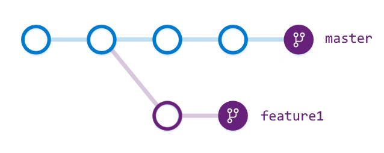

# Git branch statistics

[!INCLUDE [azure-devops](../_data/azure-devops-message.md)]

[!INCLUDE [API_version](../_data/version.md)]

[!INCLUDE [GET_STARTED](../_data/get-started.md)]

Branch statistics indicate how far behind and ahead a branch is from the default branch.
Branch A is "ahead" of branch B if branch A contains commits not in branch B's history.
In the picture below, `feature1` is 2 commits ahead of and 3 commits behind `master`.



There are [code samples](https://github.com/Microsoft/vsts-dotnet-samples/blob/master/ClientLibrary/Snippets/Microsoft.TeamServices.Samples.Client/repos/git/BranchStatsSample.cs) available for this endpoint.


## Get branch statistics

```no-highlight
GET https://{instance}/DefaultCollection/{project}/_apis/repos/git/repositories/{repository}/stats/branches[/{name}]?api-version={version}
```

| Parameter         | Type                         | Default | Notes
|:------------------|:-----------------------------|:--------|:----------------------------------------------------------------------------------------------------------------------------
| URL
| instance          | string                       |         | TFS server name ({server:port}).
| project           | string                       |         | ID or name of the [project](../tfs/projects.md). *Optional if specifying an ID for repository.*
| repository        | string                       |         | ID of the [repository](./repositories.md).
| name              | string                       |         | Name of the branch.
| Query
| api-version       | string                       |         | [Version](../../concepts/rest-api-versioning.md) of the API to use.
| baseVersionType   | enum { Branch, Tag, Commit } | Branch  | [Item versions](./items.md#getaspecificversion).
| baseVersion       | string                       | master  | [Item versions](./items.md#getaspecificversion).

[!INCLUDE [ID_vs_Name](_data/id_or_name.md)]

### For all branches 

#### Sample request

```
GET https://mytfsserver/DefaultCollection/_apis/git/repositories/278d5cd2-584d-4b63-824a-2ba458937249/stats/branches?api-version=1.0
```

#### Sample response

```json
{
  "count": 3,
  "value": [
    {
      "commit": {
        "commitId": "67cae2b029dff7eb3dc062b49403aaedca5bad8d",
        "author": {
          "name": "Chuck Reinhart",
          "email": "fabrikamfiber3@hotmail.com",
          "date": "2014-01-29T23:52:56Z"
        },
        "committer": {
          "name": "Chuck Reinhart",
          "email": "fabrikamfiber3@hotmail.com",
          "date": "2014-01-29T23:52:56Z"
        },
        "comment": "home page",
        "url": "https://mytfsserver/DefaultCollection/_apis/git/repositories/278d5cd2-584d-4b63-824a-2ba458937249/commits/67cae2b029dff7eb3dc062b49403aaedca5bad8d"
      },
      "name": "develop",
      "aheadCount": 1,
      "behindCount": 17,
      "isBaseVersion": false
    },
    {
      "commit": {
        "parents": [
          "fe17a84cc2dfe0ea3a2202ab4dbac0706058e41f"
        ],
        "treeId": "8263e7232a2331c563d737e4fc4e9c66a8286c63",
        "commitId": "23d0bc5b128a10056dc68afece360d8a0fabb014",
        "author": {
          "name": "Norman Paulk",
          "email": "Fabrikamfiber16@hotmail.com",
          "date": "2014-06-30T18:10:55Z"
        },
        "committer": {
          "name": "Norman Paulk",
          "email": "Fabrikamfiber16@hotmail.com",
          "date": "2014-06-30T18:10:55Z"
        },
        "comment": "Better description for hello world\n",
        "url": "https://mytfsserver/DefaultCollection/_apis/git/repositories/278d5cd2-584d-4b63-824a-2ba458937249/commits/23d0bc5b128a10056dc68afece360d8a0fabb014"
      },
      "name": "master",
      "aheadCount": 0,
      "behindCount": 0,
      "isBaseVersion": true
    },
    {
      "commit": {
        "parents": [
          "fe17a84cc2dfe0ea3a2202ab4dbac0706058e41f"
        ],
        "treeId": "8263e7232a2331c563d737e4fc4e9c66a8286c63",
        "commitId": "23d0bc5b128a10056dc68afece360d8a0fabb014",
        "author": {
          "name": "Norman Paulk",
          "email": "Fabrikamfiber16@hotmail.com",
          "date": "2014-06-30T18:10:55Z"
        },
        "committer": {
          "name": "Norman Paulk",
          "email": "Fabrikamfiber16@hotmail.com",
          "date": "2014-06-30T18:10:55Z"
        },
        "comment": "Better description for hello world\n",
        "url": "https://mytfsserver/DefaultCollection/_apis/git/repositories/278d5cd2-584d-4b63-824a-2ba458937249/commits/23d0bc5b128a10056dc68afece360d8a0fabb014"
      },
      "name": "npaulk/feature",
      "aheadCount": 0,
      "behindCount": 0,
      "isBaseVersion": true
    }
  ]
}
```


### For a single branch

#### Sample request

```
GET https://mytfsserver/DefaultCollection/_apis/git/repositories/278d5cd2-584d-4b63-824a-2ba458937249/stats/branches/develop?api-version=1.0
```

#### Sample response

```json
{
  "commit": {
    "commitId": "67cae2b029dff7eb3dc062b49403aaedca5bad8d",
    "author": {
      "name": "Chuck Reinhart",
      "email": "fabrikamfiber3@hotmail.com",
      "date": "2014-01-29T23:52:56Z"
    },
    "committer": {
      "name": "Chuck Reinhart",
      "email": "fabrikamfiber3@hotmail.com",
      "date": "2014-01-29T23:52:56Z"
    },
    "comment": "home page",
    "url": "https://mytfsserver/DefaultCollection/_apis/git/repositories/278d5cd2-584d-4b63-824a-2ba458937249/commits/67cae2b029dff7eb3dc062b49403aaedca5bad8d"
  },
  "name": "develop",
  "aheadCount": 1,
  "behindCount": 17,
  "isBaseVersion": false
}
```


### For a tag or commit

You can leave out the branch name and instead specify `baseVersion` and `baseVersionType` to get stats for a commit.

#### Sample request

```
GET https://mytfsserver/DefaultCollection/_apis/git/repositories/278d5cd2-584d-4b63-824a-2ba458937249/stats/branches/develop?baseVersionType=commit&baseVersion=67cae2b029dff7eb3dc062b49403aaedca5bad8d&api-version=1.0
```

#### Sample response

```json
{
  "commit": {
    "parents": [
      "be67f8871a4d2c75f13a51c1d3c30ac0d74d4ef4"
    ],
    "treeId": "f9a2a90cbeac747fff9dadcf77ff5bcd12b65a44",
    "commitId": "67cae2b029dff7eb3dc062b49403aaedca5bad8d",
    "author": {
      "name": "Chuck Reinhart",
      "email": "fabrikamfiber3@hotmail.com",
      "date": "2014-01-29T23:52:56Z"
    },
    "committer": {
      "name": "Chuck Reinhart",
      "email": "fabrikamfiber3@hotmail.com",
      "date": "2014-01-29T23:52:56Z"
    },
    "comment": "home page\n",
    "url": "https://mytfsserver/DefaultCollection/_apis/git/repositories/278d5cd2-584d-4b63-824a-2ba458937249/commits/67cae2b029dff7eb3dc062b49403aaedca5bad8d"
  },
  "name": "develop",
  "aheadCount": 0,
  "behindCount": 0,
  "isBaseVersion": true
}
```


