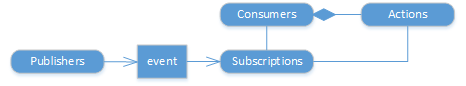

# Service hooks

[!INCLUDE [azure-devops](../_data/azure-devops-message.md)]

[!INCLUDE [API_version](../_data/version.md)]

The service hook [publishers](./publishers.md) define a set of events. You create [subscriptions](./subscriptions.md) based on an event and select the 
service hook [consumer](./consumers.md) and action to take in response to that event from the publisher.

* [Consumers](./consumers.md)
* [Publishers](./publishers.md)
* [Subscriptions](./subscriptions.md)

## Common tasks

### Get a list of publishers

Get the list of event [publishers](./publishers.md#getalistofpublishers) for VSTS.
