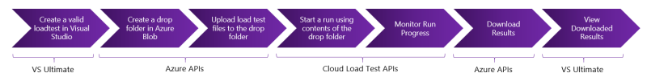

# Cloud Load Test
[!INCLUDE [API_version](../_data/version.md)]

This API provides a test infrastructure in the cloud to execute web load tests at a high scale and reliability without requiring any upfront setup, configuration or provisioning tax.

### Prerequisites
* Add `.vsclt` to your account name to get redirected to the Cloud Load Test (CLT) service under visualstudio.com.
For example, if your VSTS organization URL is `https://fabrikam.visualstudio.com/`, then use `https://fabrikam.vsclt.visualstudio.com/` as endpoint for CLT REST APIs.
* To get started quickly you can refer to the API sample [here][2].

### How to use the APIs
The following steps are essential to be successful with these APIs. These are demonstrated in the sample linked above.

1. Create a valid loadtest file. You can use the load test file from an earlier run through Visual Studio for this.
2. Create a location to upload the file(s). This location is a drop folder on Azure Blob and is below referred to as "TestDrop".
3. Upload the loadtest file and any other files required for the run, this includes the webtest files, settings file, etc. to this location or "TestDrop".
3. Create a Test Run using the Testdrop from the previous step as all the files required for a run are now available at the drop location.
4. Start the run.
5. Once finished, download the results to your local machine. This will be a gzip file. Uncompress it to get the results file.
6. Use Visual Studio to view the downloaded results.

#### Notes

* Creation of a test drop location requires the Azure Storage APIs which are available as part of the Azure SDK. Look up the [sample][2] to see how to use them.
* Uploading the files and downloading the results are also achieved through the Azure Storage APIs as results are stored as Azure Blobs. Refer to [sample][3] for details of downloading and importing the load test results.
* Creating a load test cannot be achieved through the APIs. You will need Visual Studio IDE to author the web performance and load tests. Refer to [MSDN documentation][4].

### Resources

* [Test Runs](test-runs.md) - runs which are queued on the Cloud Load Test service. Refer to [Test Run Type](types.md#testrun) for the detailed description of the test run resource type.
* [Test Drops](test-drops.md) - a container where test binaries, test data files and the detailed test definition, such as LOADTEST XML are stored. Every test run is associated with a test drop. Refer to [Test Drop Type](types.md#testdrop) for the detailed description of the test drop resource type.
* [Counter Instances](counter-instances.md) - counter instances from a specific load test run. Refer to [Counter Instance Type](types.md#counterinstance) for the detailed description of the test run resource type.
* [Counter Samples](counter-samples.md) - counter samples from a specific load test run. Refer to [Counter Sample Type](types.md#countersample) for the detailed description of the test run resource type.
* [APM Plugins](apm-plugins.md) - available Application Performance Management ([APM][5]) plugins, such as [Application Insights][6], which can be used to pull Application-side performance counters during the load test run. This resource allows query for plugin configuration.
* [APM Applications](apm-applications.md) - applications configured in the APM service. These application references can be used in the load test authoring to enable APM counter integration during the load test run.
* [APM Counters](apm-counters.md) - application counters configured and available for query in the APM service, such as [Metrics in Application Insights][7].
* [Configuration](configuration.md) - get configuration details applicable at an organization level, such as permitted target geo-locations ([Azure regions][8]) for the load agents.

[1]:http://visualstudio.microsoft.com/en-us/integrate/get-started/get-started-auth-introduction-vsi
[2]:http://code.msdn.microsoft.com/Cloud-Load-Testing-API-b333e778
[3]:https://code.msdn.microsoft.com/Importing-Load-Test-Results-b577864b
[4]:https://msdn.microsoft.com/library/dn250793.aspx
[5]:https://en.wikipedia.org/wiki/Application_performance_management
[6]:http://go.microsoft.com/fwlink/?LinkId=506854
[7]:/azure/application-insights/app-insights-metrics-explorer
[8]:https://azure.microsoft.com/regions/

