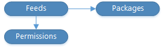

# Packaging

[!INCLUDE [azure-devops](../_data/azure-devops-message.md)]

[!INCLUDE [API_version](../_data/version2-preview1.md)]

[!INCLUDE [disclaimer](../_data/disclaimer.md)]

You can create [feeds](./feeds.md) and store [packages](./packages.md) in those feeds.
Feeds have [permissions](./permissions.md) which control who can read from, push to, and manage feeds.

You can also access [NuGet specific operations](./nuget.md) such as delete and delist.

* [Feeds](./feeds.md)
* [Packages](./packages.md)
* [Feed Polling](./polling.md)
* [NuGet](./nuget.md)
* [npm](./npm.md)
* [Maven](./maven.md)
* [Permissions](./permissions.md)
* [Release Views](./views.md)

## Common tasks

### Get a list of feeds
1. Look up the [feeds](./feeds.md#getfeeds) that you want to use.

### Create a feed
1. Create a new [feed](./feeds.md#createafeed).
