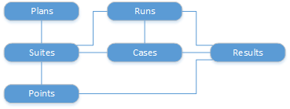

# Test Management

[!INCLUDE [azure-devops](../_data/azure-devops-message.md)]

[!INCLUDE [API_version](../_data/version.md)]

A [test case](./cases.md) describes the steps to take when you run a test.
[Test suites](./suites.md) are groups of test cases, and a [test plan](./plans.md) is the collection of test suites that need to be run for a particular iteration or release.
[Test points](./points.md) are the pairings of test cases with test configurations that need to be run for the test plan.
A [test run](./runs.md) consists of a set of test points. The [results](./results.md) are the outcome of running the tests in the test run.

* [Attachments](./attachments.md)
* [Cases](./cases.md)
* [Configurations](./configurations.md)
* [Code coverage](./code-coverage.md)
* [Plans](./plans.md)
* [Points](./points.md)
* [Result retention settings](./resultretentionsettings.md)
* [Results](./results.md)
* [Results (1.0)](./results_1_0.md)
* [Runs](./runs.md)
* [Suites](./suites.md)
* [SuiteEntries](./suite-entries.md)
* [Suite/Plan clone operations](./cloneOperations.md)
* [Sessions](./sessions.md)
* [Variables](./variables.md)

## Common tasks

### Create a test plan
1. Get the [project](../tfs/projects.md) that you're working in.
2. Create the [test plan](./plans.md#createatestplan).

### Create a test suite with test cases
You need to have some test cases already created to do this.

1. Create a [test suite](./suites.md#createatestsuite).
2. Add some [test cases](./suites.md#addtestcasestoasuite) to the suite.

### Get the results from a test run

After you've run some tests...

1. Get a [test run](./runs.md#getalistoftestruns).
2. Get the ID of a run from the list, and get the [results](./results.md#getalistofresults) for that run.
3. You can also get [statistics](./runs.md#gettestrunstatistic) for the run.

## Licensing Requirements
Test resources are subject to specific licensing and access restrictions. Please refer to the documentation links below for ensuring that the REST APIs are accessed with the appropriate user context.

[Access Levels for Test Manager](https://visualstudio.microsoft.com/docs/work/connect/change-access-levels#test-manager)

[Test Manager extension for Azure Test Plans](https://marketplace.visualstudio.com/items?itemName=ms.vss-testmanager-web)
