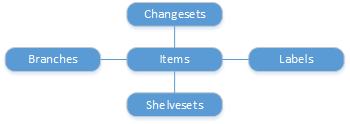

# Version Control

[!INCLUDE [azure-devops](../_data/azure-devops-message.md)]

[!INCLUDE [API_version](../_data/version.md)]

[Items](./items.md) are files and folders in version control.
[Changesets](./changesets.md) and [shelvesets](./shelvesets.md) represent changes to a set of items.
Folders can be [branched](./branches.md) and items can be [labelled](./labels.md).

* [Branches](./branches.md)
* [Changesets](./changesets.md)
* [Items](./items.md)
* [Labels](./labels.md)
* [Shelvesets](./shelvesets.md)

## Common tasks

### Get recent changes

1. Get the [most recent changesets](./changesets.md#apageatatime), or the changesets in a [date range](./changesets.md#inadaterange).
2. Get each changeset with [changes](./changesets.md#withallchanges), associated [work items](./changesets.md#withworkitems), or [policy details and check-in notes](./changesets.md#withpolicydetailsandcheck-innotes).

### Download a file

Get the contents of a [file](./items.md#getafile).

### Get item metadata

- Get the metadata for the most recent version of each file or folder by getting the [items recursively](./items.md#afolderanditschildren).
- You can get [different versions](./items.md#getaspecificversion) of the items, too.

