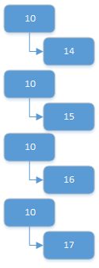
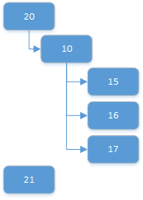

# Work item query language

[!INCLUDE [azure-devops](../_data/azure-devops-message.md)]

[!INCLUDE [API_version](../_data/version.md)]

[!INCLUDE [GET_STARTED](../_data/get-started.md)]


## Run a query 

```no-highlight
POST https://{instance}/DefaultCollection/[{project}/]_apis/wit/wiql?api-version={version}
```
```http
Content-type: application/json
```
```json
{
  "query": string
}
```

| Parameter     | Type    | Default | Notes	
|:--------------|:--------|:--------|:------------------------------
| URL
| instance      | string  |         | TFS server name ({server:port}).
| project       | string  |         | Filter the results to this project.<br/>If your query string uses the @project macro ([System.TeamProject] = @project, for example), you must specify the project in the URL.
| Query
| api-version   | string  |         | [Version](../../concepts/rest-api-versioning.md) of the API to use.
| timePrecision | boolean | false   | True if time precision is allowed in the date time comparisons.
| Body
| query         | string  |         | The [query string](http://msdn.microsoft.com/library/bb130306.aspx) to run.

#### Sample request

```
POST https://mytfsserver/DefaultCollection/Fabrikam-Fiber-Git/_apis/wit/wiql?api-version=1.0
```
```json
{
  "query": "Select [System.WorkItemType],[System.Title],[System.State],[Microsoft.VSTS.Scheduling.Effort],[System.IterationPath] FROM WorkItemLinks WHERE Source.[System.WorkItemType] IN GROUP 'Microsoft.RequirementCategory' AND Target.[System.WorkItemType] IN GROUP 'Microsoft.RequirementCategory' AND Target.[System.State] IN ('New','Approved','Committed') AND [System.Links.LinkType] = 'System.LinkTypes.Hierarchy-Forward' ORDER BY [Microsoft.VSTS.Common.BacklogPriority] ASC,[System.Id] ASC MODE (Recursive, ReturnMatchingChildren)"
}
```

#### Sample response

```json
{
  "queryType": "tree",
  "asOf": "2014-12-29T20:49:34.193Z",
  "columns": [
    {
      "referenceName": "System.WorkItemType",
      "name": "Work Item Type",
      "url": "https://mytfsserver/DefaultCollection/_apis/wit/fields/System.WorkItemType"
    },
    {
      "referenceName": "System.Title",
      "name": "Title",
      "url": "https://mytfsserver/DefaultCollection/_apis/wit/fields/System.Title"
    },
    {
      "referenceName": "System.State",
      "name": "State",
      "url": "https://mytfsserver/DefaultCollection/_apis/wit/fields/System.State"
    },
    {
      "referenceName": "Microsoft.VSTS.Scheduling.Effort",
      "name": "Effort",
      "url": "https://mytfsserver/DefaultCollection/_apis/wit/fields/Microsoft.VSTS.Scheduling.Effort"
    },
    {
      "referenceName": "System.IterationPath",
      "name": "Iteration Path",
      "url": "https://mytfsserver/DefaultCollection/_apis/wit/fields/System.IterationPath"
    }
  ],
  "sortColumns": [
    {
      "field": {
        "referenceName": "Microsoft.VSTS.Common.BacklogPriority",
        "name": "Backlog Priority",
        "url": "https://mytfsserver/DefaultCollection/_apis/wit/fields/Microsoft.VSTS.Common.BacklogPriority"
      },
      "descending": false
    },
    {
      "field": {
        "referenceName": "System.Id",
        "name": "ID",
        "url": "https://mytfsserver/DefaultCollection/_apis/wit/fields/System.Id"
      },
      "descending": false
    }
  ],
  "workItemRelations": [
    {
      "target": {
        "id": 5,
        "url": "https://mytfsserver/DefaultCollection/_apis/wit/workItems/5"
      }
    },
    {
      "target": {
        "id": 47,
        "url": "https://mytfsserver/DefaultCollection/_apis/wit/workItems/47"
      }
    },
    {
      "target": {
        "id": 41,
        "url": "https://mytfsserver/DefaultCollection/_apis/wit/workItems/41"
      }
    },
    {
      "target": {
        "id": 45,
        "url": "https://mytfsserver/DefaultCollection/_apis/wit/workItems/45"
      }
    },
    {
      "target": {
        "id": 297,
        "url": "https://mytfsserver/DefaultCollection/_apis/wit/workItems/297"
      }
    }
  ]
}
```


## Run a stored query

```no-highlight
GET https://{instance}/DefaultCollection/[{project}/]_apis/wit/wiql/{id}?api-version={version}
```

| Parameter     | Type    | Default | Notes	
|:--------------|:--------|:--------|:------------------------------
| URL
| instance      | string  |         | TFS server name ({server:port}).
| project       | string  |         | Filter the results to this project.<br/>If the query uses the @project macro ([System.TeamProject] = @project, for example), you must specify the project in the URL.
| id            | GUID    |         | ID of a [stored query](./queries.md).
| Query
| version       | string  |         | [Version](../../concepts/rest-api-versioning.md) of the API to use.
| timePrecision | boolean | false   | True if time precision is allowed in the date time comparisons.

#### Sample request

```
GET https://mytfsserver/DefaultCollection/Fabrikam-Fiber-Git/_apis/wit/wiql/1e4e5b17-f212-4ba2-9c2f-a95600ef50a5?api-version=1.0
```

#### Sample response

```json
{
  "queryType": "tree",
  "asOf": "2014-12-29T20:49:33.803Z",
  "columns": [
    {
      "referenceName": "System.Id",
      "name": "ID",
      "url": "https://mytfsserver/DefaultCollection/_apis/wit/fields/System.Id"
    },
    {
      "referenceName": "System.WorkItemType",
      "name": "Work Item Type",
      "url": "https://mytfsserver/DefaultCollection/_apis/wit/fields/System.WorkItemType"
    },
    {
      "referenceName": "System.Title",
      "name": "Title",
      "url": "https://mytfsserver/DefaultCollection/_apis/wit/fields/System.Title"
    },
    {
      "referenceName": "System.AssignedTo",
      "name": "Assigned To",
      "url": "https://mytfsserver/DefaultCollection/_apis/wit/fields/System.AssignedTo"
    },
    {
      "referenceName": "System.State",
      "name": "State",
      "url": "https://mytfsserver/DefaultCollection/_apis/wit/fields/System.State"
    }
  ],
  "workItemRelations": [
    {
      "target": {
        "id": 4,
        "url": "https://mytfsserver/DefaultCollection/_apis/wit/workItems/4"
      }
    },
    {
      "target": {
        "id": 5,
        "url": "https://mytfsserver/DefaultCollection/_apis/wit/workItems/5"
      }
    },
    {
      "target": {
        "id": 6,
        "url": "https://mytfsserver/DefaultCollection/_apis/wit/workItems/6"
      }
    },
    {
      "target": {
        "id": 7,
        "url": "https://mytfsserver/DefaultCollection/_apis/wit/workItems/7"
      }
    },
    {
      "rel": "System.LinkTypes.Hierarchy-Forward",
      "source": {
        "id": 7,
        "url": "https://mytfsserver/DefaultCollection/_apis/wit/workItems/7"
      },
      "target": {
        "id": 8,
        "url": "https://mytfsserver/DefaultCollection/_apis/wit/workItems/8"
      }
    },
    {
      "rel": "System.LinkTypes.Hierarchy-Forward",
      "source": {
        "id": 7,
        "url": "https://mytfsserver/DefaultCollection/_apis/wit/workItems/7"
      },
      "target": {
        "id": 9,
        "url": "https://mytfsserver/DefaultCollection/_apis/wit/workItems/9"
      }
    },
    {
      "target": {
        "id": 11,
        "url": "https://mytfsserver/DefaultCollection/_apis/wit/workItems/11"
      }
    },
    {
      "target": {
        "id": 12,
        "url": "https://mytfsserver/DefaultCollection/_apis/wit/workItems/12"
      }
    },
    {
      "target": {
        "id": 20,
        "url": "https://mytfsserver/DefaultCollection/_apis/wit/workItems/20"
      }
    },
    {
      "rel": "System.LinkTypes.Hierarchy-Forward",
      "source": {
        "id": 20,
        "url": "https://mytfsserver/DefaultCollection/_apis/wit/workItems/20"
      },
      "target": {
        "id": 1,
        "url": "https://mytfsserver/DefaultCollection/_apis/wit/workItems/1"
      }
    },
    {
      "rel": "System.LinkTypes.Hierarchy-Forward",
      "source": {
        "id": 20,
        "url": "https://mytfsserver/DefaultCollection/_apis/wit/workItems/20"
      },
      "target": {
        "id": 2,
        "url": "https://mytfsserver/DefaultCollection/_apis/wit/workItems/2"
      }
    },
    {
      "rel": "System.LinkTypes.Hierarchy-Forward",
      "source": {
        "id": 20,
        "url": "https://mytfsserver/DefaultCollection/_apis/wit/workItems/20"
      },
      "target": {
        "id": 3,
        "url": "https://mytfsserver/DefaultCollection/_apis/wit/workItems/3"
      }
    },
    {
      "rel": "System.LinkTypes.Hierarchy-Forward",
      "source": {
        "id": 20,
        "url": "https://mytfsserver/DefaultCollection/_apis/wit/workItems/20"
      },
      "target": {
        "id": 10,
        "url": "https://mytfsserver/DefaultCollection/_apis/wit/workItems/10"
      }
    },
    {
      "rel": "System.LinkTypes.Hierarchy-Forward",
      "source": {
        "id": 10,
        "url": "https://mytfsserver/DefaultCollection/_apis/wit/workItems/10"
      },
      "target": {
        "id": 13,
        "url": "https://mytfsserver/DefaultCollection/_apis/wit/workItems/13"
      }
    },
    {
      "rel": "System.LinkTypes.Hierarchy-Forward",
      "source": {
        "id": 10,
        "url": "https://mytfsserver/DefaultCollection/_apis/wit/workItems/10"
      },
      "target": {
        "id": 14,
        "url": "https://mytfsserver/DefaultCollection/_apis/wit/workItems/14"
      }
    },
    {
      "rel": "System.LinkTypes.Hierarchy-Forward",
      "source": {
        "id": 10,
        "url": "https://mytfsserver/DefaultCollection/_apis/wit/workItems/10"
      },
      "target": {
        "id": 15,
        "url": "https://mytfsserver/DefaultCollection/_apis/wit/workItems/15"
      }
    },
    {
      "rel": "System.LinkTypes.Hierarchy-Forward",
      "source": {
        "id": 10,
        "url": "https://mytfsserver/DefaultCollection/_apis/wit/workItems/10"
      },
      "target": {
        "id": 16,
        "url": "https://mytfsserver/DefaultCollection/_apis/wit/workItems/16"
      }
    },
    {
      "rel": "System.LinkTypes.Hierarchy-Forward",
      "source": {
        "id": 10,
        "url": "https://mytfsserver/DefaultCollection/_apis/wit/workItems/10"
      },
      "target": {
        "id": 17,
        "url": "https://mytfsserver/DefaultCollection/_apis/wit/workItems/17"
      }
    },
    {
      "rel": "System.LinkTypes.Hierarchy-Forward",
      "source": {
        "id": 10,
        "url": "https://mytfsserver/DefaultCollection/_apis/wit/workItems/10"
      },
      "target": {
        "id": 18,
        "url": "https://mytfsserver/DefaultCollection/_apis/wit/workItems/18"
      }
    },
    {
      "rel": "System.LinkTypes.Hierarchy-Forward",
      "source": {
        "id": 10,
        "url": "https://mytfsserver/DefaultCollection/_apis/wit/workItems/10"
      },
      "target": {
        "id": 19,
        "url": "https://mytfsserver/DefaultCollection/_apis/wit/workItems/19"
      }
    },
    {
      "target": {
        "id": 21,
        "url": "https://mytfsserver/DefaultCollection/_apis/wit/workItems/21"
      }
    },
    {
      "target": {
        "id": 33,
        "url": "https://mytfsserver/DefaultCollection/_apis/wit/workItems/33"
      }
    },
    {
      "target": {
        "id": 34,
        "url": "https://mytfsserver/DefaultCollection/_apis/wit/workItems/34"
      }
    },
    {
      "target": {
        "id": 46,
        "url": "https://mytfsserver/DefaultCollection/_apis/wit/workItems/46"
      }
    },
    {
      "target": {
        "id": 47,
        "url": "https://mytfsserver/DefaultCollection/_apis/wit/workItems/47"
      }
    },
    {
      "target": {
        "id": 58,
        "url": "https://mytfsserver/DefaultCollection/_apis/wit/workItems/58"
      }
    },
    {
      "target": {
        "id": 59,
        "url": "https://mytfsserver/DefaultCollection/_apis/wit/workItems/59"
      }
    },
    {
      "target": {
        "id": 297,
        "url": "https://mytfsserver/DefaultCollection/_apis/wit/workItems/297"
      }
    },
    {
      "rel": "System.LinkTypes.Hierarchy-Forward",
      "source": {
        "id": 297,
        "url": "https://mytfsserver/DefaultCollection/_apis/wit/workItems/297"
      },
      "target": {
        "id": 299,
        "url": "https://mytfsserver/DefaultCollection/_apis/wit/workItems/299"
      }
    },
    {
      "rel": "System.LinkTypes.Hierarchy-Forward",
      "source": {
        "id": 297,
        "url": "https://mytfsserver/DefaultCollection/_apis/wit/workItems/297"
      },
      "target": {
        "id": 300,
        "url": "https://mytfsserver/DefaultCollection/_apis/wit/workItems/300"
      }
    },
    {
      "target": {
        "id": 298,
        "url": "https://mytfsserver/DefaultCollection/_apis/wit/workItems/298"
      }
    }
  ]
}
```


## Get work items

After executing a query, [get the work items using the IDs](./work-items.md#byids) that are returned in the query results response. You can get up to 200 work items at a time.

### A flat query

##### 1. Get results of a flat work item query.  

#### Sample request

```
POST https://mytfsserver/DefaultCollection/_apis/wit/wiql?api-version=1.0
```
```json
{
  "query": "Select [System.Id], [System.Title], [System.State] From WorkItems Where [System.WorkItemType] = 'Task' AND [State] <> 'Closed' AND [State] <> 'Removed' order by [Microsoft.VSTS.Common.Priority] asc, [System.CreatedDate] desc"
}
```

#### Sample response

```json
{
  "queryType": "flat",
  "asOf": "2014-12-29T20:49:34.617Z",
  "columns": [
    {
      "referenceName": "System.Id",
      "name": "ID",
      "url": "https://mytfsserver/DefaultCollection/_apis/wit/fields/System.Id"
    },
    {
      "referenceName": "System.Title",
      "name": "Title",
      "url": "https://mytfsserver/DefaultCollection/_apis/wit/fields/System.Title"
    },
    {
      "referenceName": "System.State",
      "name": "State",
      "url": "https://mytfsserver/DefaultCollection/_apis/wit/fields/System.State"
    }
  ],
  "sortColumns": [
    {
      "field": {
        "referenceName": "Microsoft.VSTS.Common.Priority",
        "name": "Priority",
        "url": "https://mytfsserver/DefaultCollection/_apis/wit/fields/Microsoft.VSTS.Common.Priority"
      },
      "descending": false
    },
    {
      "field": {
        "referenceName": "System.CreatedDate",
        "name": "Created Date",
        "url": "https://mytfsserver/DefaultCollection/_apis/wit/fields/System.CreatedDate"
      },
      "descending": true
    }
  ],
  "workItems": [
    {
      "id": 300,
      "url": "https://mytfsserver/DefaultCollection/_apis/wit/workItems/300"
    },
    {
      "id": 299,
      "url": "https://mytfsserver/DefaultCollection/_apis/wit/workItems/299"
    },
    {
      "id": 298,
      "url": "https://mytfsserver/DefaultCollection/_apis/wit/workItems/298"
    },
    {
      "id": 17,
      "url": "https://mytfsserver/DefaultCollection/_apis/wit/workItems/17"
    },
    {
      "id": 16,
      "url": "https://mytfsserver/DefaultCollection/_apis/wit/workItems/16"
    },
    {
      "id": 15,
      "url": "https://mytfsserver/DefaultCollection/_apis/wit/workItems/15"
    },
    {
      "id": 14,
      "url": "https://mytfsserver/DefaultCollection/_apis/wit/workItems/14"
    },
    {
      "id": 9,
      "url": "https://mytfsserver/DefaultCollection/_apis/wit/workItems/9"
    },
    {
      "id": 8,
      "url": "https://mytfsserver/DefaultCollection/_apis/wit/workItems/8"
    }
  ]
}
```


##### 2. Get data for each work item returned.

#### Sample request

```
GET https://mytfsserver/DefaultCollection/_apis/wit/WorkItems?ids=300,299,298,17,16,15,14,9,8&fields=System.Id,System.Title,System.State&asOf=2014-12-29T20:49:34.617Z&api-version=1.0
```

#### Sample response

```json
{
  "count": 9,
  "value": [
    {
      "id": 8,
      "rev": 3,
      "fields": {
        "System.Id": 8,
        "System.State": "Done",
        "System.Title": "Create UI for logging in with Live ID"
      },
      "url": "https://mytfsserver/DefaultCollection/_apis/wit/workItems/8"
    },
    {
      "id": 9,
      "rev": 2,
      "fields": {
        "System.Id": 9,
        "System.State": "Done",
        "System.Title": "Get unit tests working in the cloud"
      },
      "url": "https://mytfsserver/DefaultCollection/_apis/wit/workItems/9"
    },
    {
      "id": 14,
      "rev": 5,
      "fields": {
        "System.Id": 14,
        "System.State": "Done",
        "System.Title": "Design application workflow"
      },
      "url": "https://mytfsserver/DefaultCollection/_apis/wit/workItems/14"
    },
    {
      "id": 15,
      "rev": 4,
      "fields": {
        "System.Id": 15,
        "System.State": "In Progress",
        "System.Title": "UI Implementation"
      },
      "url": "https://mytfsserver/DefaultCollection/_apis/wit/workItems/15"
    },
    {
      "id": 16,
      "rev": 4,
      "fields": {
        "System.Id": 16,
        "System.State": "In Progress",
        "System.Title": "Write code to get GPS location and resolve to address"
      },
      "url": "https://mytfsserver/DefaultCollection/_apis/wit/workItems/16"
    },
    {
      "id": 17,
      "rev": 4,
      "fields": {
        "System.Id": 17,
        "System.State": "In Progress",
        "System.Title": "Unit testing for feature"
      },
      "url": "https://mytfsserver/DefaultCollection/_apis/wit/workItems/17"
    },
    {
      "id": 298,
      "rev": 1,
      "fields": {
        "System.Id": 298,
        "System.State": "To Do",
        "System.Title": "JavaScript implementation for Microsoft Account"
      },
      "url": "https://mytfsserver/DefaultCollection/_apis/wit/workItems/298"
    },
    {
      "id": 299,
      "rev": 7,
      "fields": {
        "System.Id": 299,
        "System.State": "To Do",
        "System.Title": "JavaScript implementation for Microsoft Account"
      },
      "url": "https://mytfsserver/DefaultCollection/_apis/wit/workItems/299"
    },
    {
      "id": 300,
      "rev": 1,
      "fields": {
        "System.Id": 300,
        "System.State": "To Do",
        "System.Title": "Unit Testing for MSA login"
      },
      "url": "https://mytfsserver/DefaultCollection/_apis/wit/workItems/300"
    }
  ]
}
```


### A one-hop query


##### 1. Get results of a one-hop work item query.

#### Sample request

```
POST https://mytfsserver/DefaultCollection/Fabrikam-Fiber-Git/_apis/wit/wiql?api-version=1.0
```
```json
{
  "query": "SELECT [System.Id], [System.Links.LinkType], [System.WorkItemType], [System.Title], [System.State] FROM WorkItemLinks WHERE ([Source].[System.TeamProject] = @project AND  [Source].[System.WorkItemType] IN GROUP 'Microsoft.RequirementCategory'  AND  [Source].[System.State] <> 'Done') AND ([System.Links.LinkType] <> '') And ([Target].[System.State] <> 'Removed' AND [Target].[System.WorkItemType] NOT IN GROUP 'Microsoft.FeatureCategory') mode(MustContain)"
}
```

#### Sample response

```json
{
  "queryType": "oneHop",
  "asOf": "2014-12-29T20:49:35.357Z",
  "columns": [
    {
      "referenceName": "System.Id",
      "name": "ID",
      "url": "https://mytfsserver/DefaultCollection/_apis/wit/fields/System.Id"
    },
    {
      "referenceName": "System.Links.LinkType",
      "name": "Link Type",
      "url": "https://mytfsserver/DefaultCollection/_apis/wit/fields/System.Links.LinkType"
    },
    {
      "referenceName": "System.WorkItemType",
      "name": "Work Item Type",
      "url": "https://mytfsserver/DefaultCollection/_apis/wit/fields/System.WorkItemType"
    },
    {
      "referenceName": "System.Title",
      "name": "Title",
      "url": "https://mytfsserver/DefaultCollection/_apis/wit/fields/System.Title"
    },
    {
      "referenceName": "System.State",
      "name": "State",
      "url": "https://mytfsserver/DefaultCollection/_apis/wit/fields/System.State"
    }
  ],
  "sortColumns": [
    {
      "field": {
        "referenceName": "System.Id",
        "name": "ID",
        "url": "https://mytfsserver/DefaultCollection/_apis/wit/fields/System.Id"
      },
      "descending": false
    },
    {
      "field": {
        "referenceName": "System.Id",
        "name": "ID",
        "url": "https://mytfsserver/DefaultCollection/_apis/wit/fields/System.Id"
      },
      "descending": false
    }
  ],
  "workItemRelations": [
    {
      "target": {
        "id": 297,
        "url": "https://mytfsserver/DefaultCollection/_apis/wit/workItems/297"
      }
    },
    {
      "rel": "System.LinkTypes.Hierarchy-Forward",
      "source": {
        "id": 297,
        "url": "https://mytfsserver/DefaultCollection/_apis/wit/workItems/297"
      },
      "target": {
        "id": 299,
        "url": "https://mytfsserver/DefaultCollection/_apis/wit/workItems/299"
      }
    },
    {
      "rel": "System.LinkTypes.Hierarchy-Forward",
      "source": {
        "id": 297,
        "url": "https://mytfsserver/DefaultCollection/_apis/wit/workItems/297"
      },
      "target": {
        "id": 300,
        "url": "https://mytfsserver/DefaultCollection/_apis/wit/workItems/300"
      }
    }
  ]
}
```


##### 2. Get data for each work item returned.

#### Sample request

```
GET https://mytfsserver/DefaultCollection/_apis/wit/WorkItems?ids=297,299,300&fields=System.Id,System.Links.LinkType,System.WorkItemType,System.Title,System.State&asOf=2014-12-29T20:49:35.357Z&api-version=1.0
```

#### Sample response

```json
{
  "count": 3,
  "value": [
    {
      "id": 297,
      "rev": 1,
      "fields": {
        "System.Id": 297,
        "System.WorkItemType": "Product Backlog Item",
        "System.State": "New",
        "System.Title": "Customer can sign in using their Microsoft Account"
      },
      "url": "https://mytfsserver/DefaultCollection/_apis/wit/workItems/297"
    },
    {
      "id": 299,
      "rev": 7,
      "fields": {
        "System.Id": 299,
        "System.WorkItemType": "Task",
        "System.State": "To Do",
        "System.Title": "JavaScript implementation for Microsoft Account"
      },
      "url": "https://mytfsserver/DefaultCollection/_apis/wit/workItems/299"
    },
    {
      "id": 300,
      "rev": 1,
      "fields": {
        "System.Id": 300,
        "System.WorkItemType": "Task",
        "System.State": "To Do",
        "System.Title": "Unit Testing for MSA login"
      },
      "url": "https://mytfsserver/DefaultCollection/_apis/wit/workItems/300"
    }
  ]
}
```


### A tree query


##### 1. Get results of a tree work item query.

#### Sample request

```
POST https://mytfsserver/DefaultCollection/Fabrikam-Fiber-Git/_apis/wit/wiql?api-version=1.0
```
```json
{
  "query": "Select [System.Id], [System.WorkItemType], [System.Title], [System.AssignedTo], [System.State] From WorkItemLinks WHERE (Source.[System.TeamProject] = @project and Source.[System.State] <> 'Removed') and ([System.Links.LinkType] = 'System.LinkTypes.Hierarchy-Forward') and (Target.[System.WorkItemType] <> '') mode(Recursive)"
}
```

#### Sample response

```json
{
  "queryType": "tree",
  "asOf": "2014-12-29T20:49:35.983Z",
  "columns": [
    {
      "referenceName": "System.Id",
      "name": "ID",
      "url": "https://mytfsserver/DefaultCollection/_apis/wit/fields/System.Id"
    },
    {
      "referenceName": "System.WorkItemType",
      "name": "Work Item Type",
      "url": "https://mytfsserver/DefaultCollection/_apis/wit/fields/System.WorkItemType"
    },
    {
      "referenceName": "System.Title",
      "name": "Title",
      "url": "https://mytfsserver/DefaultCollection/_apis/wit/fields/System.Title"
    },
    {
      "referenceName": "System.AssignedTo",
      "name": "Assigned To",
      "url": "https://mytfsserver/DefaultCollection/_apis/wit/fields/System.AssignedTo"
    },
    {
      "referenceName": "System.State",
      "name": "State",
      "url": "https://mytfsserver/DefaultCollection/_apis/wit/fields/System.State"
    }
  ],
  "workItemRelations": [
    {
      "target": {
        "id": 4,
        "url": "https://mytfsserver/DefaultCollection/_apis/wit/workItems/4"
      }
    },
    {
      "target": {
        "id": 5,
        "url": "https://mytfsserver/DefaultCollection/_apis/wit/workItems/5"
      }
    },
    {
      "target": {
        "id": 6,
        "url": "https://mytfsserver/DefaultCollection/_apis/wit/workItems/6"
      }
    },
    {
      "target": {
        "id": 7,
        "url": "https://mytfsserver/DefaultCollection/_apis/wit/workItems/7"
      }
    },
    {
      "rel": "System.LinkTypes.Hierarchy-Forward",
      "source": {
        "id": 7,
        "url": "https://mytfsserver/DefaultCollection/_apis/wit/workItems/7"
      },
      "target": {
        "id": 8,
        "url": "https://mytfsserver/DefaultCollection/_apis/wit/workItems/8"
      }
    },
    {
      "rel": "System.LinkTypes.Hierarchy-Forward",
      "source": {
        "id": 7,
        "url": "https://mytfsserver/DefaultCollection/_apis/wit/workItems/7"
      },
      "target": {
        "id": 9,
        "url": "https://mytfsserver/DefaultCollection/_apis/wit/workItems/9"
      }
    },
    {
      "target": {
        "id": 11,
        "url": "https://mytfsserver/DefaultCollection/_apis/wit/workItems/11"
      }
    },
    {
      "target": {
        "id": 12,
        "url": "https://mytfsserver/DefaultCollection/_apis/wit/workItems/12"
      }
    },
    {
      "target": {
        "id": 20,
        "url": "https://mytfsserver/DefaultCollection/_apis/wit/workItems/20"
      }
    },
    {
      "rel": "System.LinkTypes.Hierarchy-Forward",
      "source": {
        "id": 20,
        "url": "https://mytfsserver/DefaultCollection/_apis/wit/workItems/20"
      },
      "target": {
        "id": 1,
        "url": "https://mytfsserver/DefaultCollection/_apis/wit/workItems/1"
      }
    },
    {
      "rel": "System.LinkTypes.Hierarchy-Forward",
      "source": {
        "id": 20,
        "url": "https://mytfsserver/DefaultCollection/_apis/wit/workItems/20"
      },
      "target": {
        "id": 2,
        "url": "https://mytfsserver/DefaultCollection/_apis/wit/workItems/2"
      }
    },
    {
      "rel": "System.LinkTypes.Hierarchy-Forward",
      "source": {
        "id": 20,
        "url": "https://mytfsserver/DefaultCollection/_apis/wit/workItems/20"
      },
      "target": {
        "id": 3,
        "url": "https://mytfsserver/DefaultCollection/_apis/wit/workItems/3"
      }
    },
    {
      "rel": "System.LinkTypes.Hierarchy-Forward",
      "source": {
        "id": 20,
        "url": "https://mytfsserver/DefaultCollection/_apis/wit/workItems/20"
      },
      "target": {
        "id": 10,
        "url": "https://mytfsserver/DefaultCollection/_apis/wit/workItems/10"
      }
    },
    {
      "rel": "System.LinkTypes.Hierarchy-Forward",
      "source": {
        "id": 10,
        "url": "https://mytfsserver/DefaultCollection/_apis/wit/workItems/10"
      },
      "target": {
        "id": 13,
        "url": "https://mytfsserver/DefaultCollection/_apis/wit/workItems/13"
      }
    },
    {
      "rel": "System.LinkTypes.Hierarchy-Forward",
      "source": {
        "id": 10,
        "url": "https://mytfsserver/DefaultCollection/_apis/wit/workItems/10"
      },
      "target": {
        "id": 14,
        "url": "https://mytfsserver/DefaultCollection/_apis/wit/workItems/14"
      }
    },
    {
      "rel": "System.LinkTypes.Hierarchy-Forward",
      "source": {
        "id": 10,
        "url": "https://mytfsserver/DefaultCollection/_apis/wit/workItems/10"
      },
      "target": {
        "id": 15,
        "url": "https://mytfsserver/DefaultCollection/_apis/wit/workItems/15"
      }
    },
    {
      "rel": "System.LinkTypes.Hierarchy-Forward",
      "source": {
        "id": 10,
        "url": "https://mytfsserver/DefaultCollection/_apis/wit/workItems/10"
      },
      "target": {
        "id": 16,
        "url": "https://mytfsserver/DefaultCollection/_apis/wit/workItems/16"
      }
    },
    {
      "rel": "System.LinkTypes.Hierarchy-Forward",
      "source": {
        "id": 10,
        "url": "https://mytfsserver/DefaultCollection/_apis/wit/workItems/10"
      },
      "target": {
        "id": 17,
        "url": "https://mytfsserver/DefaultCollection/_apis/wit/workItems/17"
      }
    },
    {
      "rel": "System.LinkTypes.Hierarchy-Forward",
      "source": {
        "id": 10,
        "url": "https://mytfsserver/DefaultCollection/_apis/wit/workItems/10"
      },
      "target": {
        "id": 18,
        "url": "https://mytfsserver/DefaultCollection/_apis/wit/workItems/18"
      }
    },
    {
      "rel": "System.LinkTypes.Hierarchy-Forward",
      "source": {
        "id": 10,
        "url": "https://mytfsserver/DefaultCollection/_apis/wit/workItems/10"
      },
      "target": {
        "id": 19,
        "url": "https://mytfsserver/DefaultCollection/_apis/wit/workItems/19"
      }
    },
    {
      "target": {
        "id": 21,
        "url": "https://mytfsserver/DefaultCollection/_apis/wit/workItems/21"
      }
    },
    {
      "target": {
        "id": 33,
        "url": "https://mytfsserver/DefaultCollection/_apis/wit/workItems/33"
      }
    },
    {
      "target": {
        "id": 34,
        "url": "https://mytfsserver/DefaultCollection/_apis/wit/workItems/34"
      }
    },
    {
      "target": {
        "id": 46,
        "url": "https://mytfsserver/DefaultCollection/_apis/wit/workItems/46"
      }
    },
    {
      "target": {
        "id": 47,
        "url": "https://mytfsserver/DefaultCollection/_apis/wit/workItems/47"
      }
    },
    {
      "target": {
        "id": 58,
        "url": "https://mytfsserver/DefaultCollection/_apis/wit/workItems/58"
      }
    },
    {
      "target": {
        "id": 59,
        "url": "https://mytfsserver/DefaultCollection/_apis/wit/workItems/59"
      }
    },
    {
      "target": {
        "id": 297,
        "url": "https://mytfsserver/DefaultCollection/_apis/wit/workItems/297"
      }
    },
    {
      "rel": "System.LinkTypes.Hierarchy-Forward",
      "source": {
        "id": 297,
        "url": "https://mytfsserver/DefaultCollection/_apis/wit/workItems/297"
      },
      "target": {
        "id": 299,
        "url": "https://mytfsserver/DefaultCollection/_apis/wit/workItems/299"
      }
    },
    {
      "rel": "System.LinkTypes.Hierarchy-Forward",
      "source": {
        "id": 297,
        "url": "https://mytfsserver/DefaultCollection/_apis/wit/workItems/297"
      },
      "target": {
        "id": 300,
        "url": "https://mytfsserver/DefaultCollection/_apis/wit/workItems/300"
      }
    },
    {
      "target": {
        "id": 298,
        "url": "https://mytfsserver/DefaultCollection/_apis/wit/workItems/298"
      }
    }
  ]
}
```


##### 2. Get data for each work item returned.

#### Sample request

```
GET https://mytfsserver/DefaultCollection/_apis/wit/WorkItems?ids=4,5,6,7,8,9,11,12,20,1,2,3,10,13,14,15,16,17,18,19,21,33,34,46,47,58,59,297,299,300,298&fields=System.Id,System.WorkItemType,System.Title,System.AssignedTo,System.State&asOf=2014-12-29T20:49:35.983Z&api-version=1.0
```

#### Sample response

```json
{
  "count": 31,
  "value": [
    {
      "id": 1,
      "rev": 5,
      "fields": {
        "System.Id": 1,
        "System.WorkItemType": "Product Backlog Item",
        "System.State": "Done",
        "System.Title": "Technician can check on parts orders on Windows Phone"
      },
      "url": "https://mytfsserver/DefaultCollection/_apis/wit/workItems/1"
    },
    {
      "id": 2,
      "rev": 5,
      "fields": {
        "System.Id": 2,
        "System.WorkItemType": "Product Backlog Item",
        "System.State": "Done",
        "System.Title": "Technician can look for closest hardware store from Windows Phone"
      },
      "url": "https://mytfsserver/DefaultCollection/_apis/wit/workItems/2"
    },
    {
      "id": 3,
      "rev": 5,
      "fields": {
        "System.Id": 3,
        "System.WorkItemType": "Product Backlog Item",
        "System.State": "Done",
        "System.Title": "Technician can submit invoices on Windows Phone"
      },
      "url": "https://mytfsserver/DefaultCollection/_apis/wit/workItems/3"
    },
    {
      "id": 4,
      "rev": 7,
      "fields": {
        "System.Id": 4,
        "System.WorkItemType": "Product Backlog Item",
        "System.State": "Done",
        "System.Title": "Service rep can view service ticket details from the dashboard"
      },
      "url": "https://mytfsserver/DefaultCollection/_apis/wit/workItems/4"
    },
    {
      "id": 5,
      "rev": 6,
      "fields": {
        "System.Id": 5,
        "System.WorkItemType": "Product Backlog Item",
        "System.State": "New",
        "System.Title": "Customer can view service invoices online"
      },
      "url": "https://mytfsserver/DefaultCollection/_apis/wit/workItems/5"
    },
    {
      "id": 6,
      "rev": 6,
      "fields": {
        "System.Id": 6,
        "System.WorkItemType": "Product Backlog Item",
        "System.State": "Done",
        "System.Title": "Customer can pay invoices online"
      },
      "url": "https://mytfsserver/DefaultCollection/_apis/wit/workItems/6"
    },
    {
      "id": 7,
      "rev": 6,
      "fields": {
        "System.Id": 7,
        "System.WorkItemType": "Product Backlog Item",
        "System.State": "Done",
        "System.Title": "Customer can opt-in/opt-out of paper billing"
      },
      "url": "https://mytfsserver/DefaultCollection/_apis/wit/workItems/7"
    },
    {
      "id": 8,
      "rev": 3,
      "fields": {
        "System.Id": 8,
        "System.WorkItemType": "Task",
        "System.State": "Done",
        "System.AssignedTo": "Christie Church <fabrikamfiber1@hotmail.com>",
        "System.Title": "Create UI for logging in with Live ID"
      },
      "url": "https://mytfsserver/DefaultCollection/_apis/wit/workItems/8"
    },
    {
      "id": 9,
      "rev": 2,
      "fields": {
        "System.Id": 9,
        "System.WorkItemType": "Task",
        "System.State": "Done",
        "System.AssignedTo": "Chuck Reinhart <fabrikamfiber3@hotmail.com>",
        "System.Title": "Get unit tests working in the cloud"
      },
      "url": "https://mytfsserver/DefaultCollection/_apis/wit/workItems/9"
    },
    {
      "id": 10,
      "rev": 8,
      "fields": {
        "System.Id": 10,
        "System.WorkItemType": "Product Backlog Item",
        "System.State": "Done",
        "System.AssignedTo": "Jamal Hartnett <fabrikamfiber4@hotmail.com>",
        "System.Title": "Technician can send GPS location from Windows Phone"
      },
      "url": "https://mytfsserver/DefaultCollection/_apis/wit/workItems/10"
    },
    {
      "id": 11,
      "rev": 11,
      "fields": {
        "System.Id": 11,
        "System.WorkItemType": "Bug",
        "System.State": "Approved",
        "System.AssignedTo": "Johnnie McLeod <fabrikamfiber2@hotmail.com>",
        "System.Title": "Customers with Canadian addresses not displaying properly"
      },
      "url": "https://mytfsserver/DefaultCollection/_apis/wit/workItems/11"
    },
    {
      "id": 12,
      "rev": 6,
      "fields": {
        "System.Id": 12,
        "System.WorkItemType": "Bug",
        "System.State": "Done",
        "System.AssignedTo": "Johnnie McLeod <fabrikamfiber2@hotmail.com>",
        "System.Title": "Header image missing from deployment folder"
      },
      "url": "https://mytfsserver/DefaultCollection/_apis/wit/workItems/12"
    },
    {
      "id": 13,
      "rev": 3,
      "fields": {
        "System.Id": 13,
        "System.WorkItemType": "Task",
        "System.State": "Removed",
        "System.AssignedTo": "Jamal Hartnett <fabrikamfiber4@hotmail.com>",
        "System.Title": "Review application design with technicians"
      },
      "url": "https://mytfsserver/DefaultCollection/_apis/wit/workItems/13"
    },
    {
      "id": 14,
      "rev": 5,
      "fields": {
        "System.Id": 14,
        "System.WorkItemType": "Task",
        "System.State": "Done",
        "System.AssignedTo": "Jamal Hartnett <fabrikamfiber4@hotmail.com>",
        "System.Title": "Design application workflow"
      },
      "url": "https://mytfsserver/DefaultCollection/_apis/wit/workItems/14"
    },
    {
      "id": 15,
      "rev": 4,
      "fields": {
        "System.Id": 15,
        "System.WorkItemType": "Task",
        "System.State": "In Progress",
        "System.AssignedTo": "Raisa Pokrovskaya <fabrikamfiber5@hotmail.com>",
        "System.Title": "UI Implementation"
      },
      "url": "https://mytfsserver/DefaultCollection/_apis/wit/workItems/15"
    },
    {
      "id": 16,
      "rev": 4,
      "fields": {
        "System.Id": 16,
        "System.WorkItemType": "Task",
        "System.State": "In Progress",
        "System.AssignedTo": "Johnnie McLeod <fabrikamfiber2@hotmail.com>",
        "System.Title": "Write code to get GPS location and resolve to address"
      },
      "url": "https://mytfsserver/DefaultCollection/_apis/wit/workItems/16"
    },
    {
      "id": 17,
      "rev": 4,
      "fields": {
        "System.Id": 17,
        "System.WorkItemType": "Task",
        "System.State": "In Progress",
        "System.AssignedTo": "Jamal Hartnett <fabrikamfiber4@hotmail.com>",
        "System.Title": "Unit testing for feature"
      },
      "url": "https://mytfsserver/DefaultCollection/_apis/wit/workItems/17"
    },
    {
      "id": 18,
      "rev": 2,
      "fields": {
        "System.Id": 18,
        "System.WorkItemType": "Task",
        "System.State": "Removed",
        "System.AssignedTo": "Christie Church <fabrikamfiber1@hotmail.com>",
        "System.Title": "Review feature with technician early adopters"
      },
      "url": "https://mytfsserver/DefaultCollection/_apis/wit/workItems/18"
    },
    {
      "id": 19,
      "rev": 3,
      "fields": {
        "System.Id": 19,
        "System.WorkItemType": "Task",
        "System.State": "Removed",
        "System.AssignedTo": "Johnnie McLeod <fabrikamfiber2@hotmail.com>",
        "System.Title": "Automated functional testing"
      },
      "url": "https://mytfsserver/DefaultCollection/_apis/wit/workItems/19"
    },
    {
      "id": 20,
      "rev": 3,
      "fields": {
        "System.Id": 20,
        "System.WorkItemType": "Feature",
        "System.State": "In Progress",
        "System.Title": "Windows Phone Technician App"
      },
      "url": "https://mytfsserver/DefaultCollection/_apis/wit/workItems/20"
    },
    {
      "id": 21,
      "rev": 1,
      "fields": {
        "System.Id": 21,
        "System.WorkItemType": "Feature",
        "System.State": "New",
        "System.Title": "Modern Windows end user application"
      },
      "url": "https://mytfsserver/DefaultCollection/_apis/wit/workItems/21"
    },
    {
      "id": 33,
      "rev": 5,
      "fields": {
        "System.Id": 33,
        "System.WorkItemType": "Bug",
        "System.State": "Committed",
        "System.AssignedTo": "Chuck Reinhart <fabrikamfiber3@hotmail.com>",
        "System.Title": "Issue with web.config; parameter not set properly"
      },
      "url": "https://mytfsserver/DefaultCollection/_apis/wit/workItems/33"
    },
    {
      "id": 34,
      "rev": 2,
      "fields": {
        "System.Id": 34,
        "System.WorkItemType": "Impediment",
        "System.State": "Closed",
        "System.Title": "testing"
      },
      "url": "https://mytfsserver/DefaultCollection/_apis/wit/workItems/34"
    },
    {
      "id": 46,
      "rev": 1,
      "fields": {
        "System.Id": 46,
        "System.WorkItemType": "Bug",
        "System.State": "New",
        "System.Title": "Chuck Reinhart, here is the test ticket you requested"
      },
      "url": "https://mytfsserver/DefaultCollection/_apis/wit/workItems/46"
    },
    {
      "id": 47,
      "rev": 3,
      "fields": {
        "System.Id": 47,
        "System.WorkItemType": "Product Backlog Item",
        "System.State": "New",
        "System.Title": "Investigate feedback issues reported from Trello"
      },
      "url": "https://mytfsserver/DefaultCollection/_apis/wit/workItems/47"
    },
    {
      "id": 58,
      "rev": 1,
      "fields": {
        "System.Id": 58,
        "System.WorkItemType": "Test Plan",
        "System.State": "Active",
        "System.AssignedTo": "Fabrikam Fiber <fabrikamfiber1@outlook.com>",
        "System.Title": "NewPlan"
      },
      "url": "https://mytfsserver/DefaultCollection/_apis/wit/workItems/58"
    },
    {
      "id": 59,
      "rev": 1,
      "fields": {
        "System.Id": 59,
        "System.WorkItemType": "Test Suite",
        "System.State": "In Progress",
        "System.AssignedTo": "[DefaultCollection]\\Project Collection Service Accounts <d81542e4-cdfa-4333-b082-1ae2d6c3ad16>",
        "System.Title": "NewPlan"
      },
      "url": "https://mytfsserver/DefaultCollection/_apis/wit/workItems/59"
    },
    {
      "id": 297,
      "rev": 1,
      "fields": {
        "System.Id": 297,
        "System.WorkItemType": "Product Backlog Item",
        "System.State": "New",
        "System.Title": "Customer can sign in using their Microsoft Account"
      },
      "url": "https://mytfsserver/DefaultCollection/_apis/wit/workItems/297"
    },
    {
      "id": 298,
      "rev": 1,
      "fields": {
        "System.Id": 298,
        "System.WorkItemType": "Task",
        "System.State": "To Do",
        "System.Title": "JavaScript implementation for Microsoft Account"
      },
      "url": "https://mytfsserver/DefaultCollection/_apis/wit/workItems/298"
    },
    {
      "id": 299,
      "rev": 7,
      "fields": {
        "System.Id": 299,
        "System.WorkItemType": "Task",
        "System.State": "To Do",
        "System.AssignedTo": "Johnnie McLeod <fabrikamfiber2@hotmail.com>",
        "System.Title": "JavaScript implementation for Microsoft Account"
      },
      "url": "https://mytfsserver/DefaultCollection/_apis/wit/workItems/299"
    },
    {
      "id": 300,
      "rev": 1,
      "fields": {
        "System.Id": 300,
        "System.WorkItemType": "Task",
        "System.State": "To Do",
        "System.Title": "Unit Testing for MSA login"
      },
      "url": "https://mytfsserver/DefaultCollection/_apis/wit/workItems/300"
    }
  ]
}
```


## Limits on WIQL length  

For queries made against Team Services, the WIQL length must not exceed 32K characters. The system won't allow you to create or run queries that exceed that length. 

## WIQL extension

See [Wiql Editor, a Marketplace extension](https://marketplace.visualstudio.com/items?itemName=ottostreifel.wiql-editor).