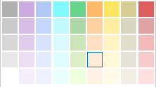

# Card rules

[!INCLUDE [azure-devops](../_data/azure-devops-message.md)]

[!INCLUDE [API_version](../_data/version2-preview1.md)]

Use card styling rules to visually draw attention towards specific cards on kanban boards.

[!INCLUDE [GET_STARTED](../_data/get-started.md)]

## Get card styling rules for a board
<a name="getcardstylingrulesforaboard" />

```no-highlight
GET https://{instance}/DefaultCollection/{project}/{team}/_apis/work/boards/{board}/cardrulesettings?api-version={api-version}
```

| Parameter | Type    |Default Value | Notes	
|:----------|:--------|:------------ |:------------------------------
| URL
| instance  | string  | | TFS server name ({server:port}).
| project   | string  | | Name or ID of a project.
| team	    | string  | Project's default team ID | Name or ID of a team within the project.
| board	| string  || Name or ID of the specific board.
| Query
| api-version | string  || Version of the API to use.

### By ID

#### Sample request

```
GET https://mytfsserver/DefaultCollection/Fabrikam/_apis/work/boards/41688c28-a3fc-4811-977d-247a33f18a00/cardrulesettings?api-version=2.0-preview.1
```

#### Sample response

```json
{
  "url": "https://mytfsserver/DefaultCollection/8e5a3cfb-fed3-46f3-8657-e3b175cd0305/185d185a-33c3-4196-845d-96c46d6a505b/_apis/work/boards/41688c28-a3fc-4811-977d-247a33f18a00/cardrulesettings",
  "rules": {
    "fill": [
      {
        "name": "High Priority",
        "isEnabled": "True",
        "filter": "[System.Title] contains 'Shopping'",
        "clauses": [
          {
            "fieldName": "System.Title",
            "index": 1,
            "logicalOperator": "",
            "operator": "CONTAINS",
            "value": "Shopping"
          }
        ],
        "settings": {
          "background-color": "#EFFFDC",
          "title-color": "#000000"
        }
      },
      {
        "name": "P1-LSI-ActionItems",
        "isEnabled": "True",
        "filter": "[System.Tags] contains 'LSI' and [Microsoft.VSTS.Common.Priority] = '1' and [System.State] = 'Active'",
        "clauses": [
          {
            "fieldName": "System.Tags",
            "index": 1,
            "logicalOperator": "",
            "operator": "CONTAINS",
            "value": "LSI"
          },
          {
            "fieldName": "Microsoft.VSTS.Common.Priority",
            "index": 2,
            "logicalOperator": "AND",
            "operator": "=",
            "value": "1"
          },
          {
            "fieldName": "System.State",
            "index": 3,
            "logicalOperator": "AND",
            "operator": "=",
            "value": "Active"
          }
        ],
        "settings": {
          "background-color": "#F7CBCB",
          "title-color": "#000000",
          "title-font-weight": "bold"
        }
      },
      {
        "name": "LSI-ActionItems",
        "isEnabled": "True",
        "filter": "[System.Tags] contains 'LSI' and [System.State] = 'Active'",
        "clauses": [
          {
            "fieldName": "System.Tags",
            "index": 1,
            "logicalOperator": "",
            "operator": "CONTAINS",
            "value": "LSI"
          },
          {
            "fieldName": "System.State",
            "index": 2,
            "logicalOperator": "AND",
            "operator": "=",
            "value": "Active"
          }
        ],
        "settings": {
          "background-color": "#FFBA69",
          "title-color": "#000000",
          "title-font-weight": "bold"
        }
      }
    ],
    "tagStyle": [
      {
        "name": "LSI",
        "isEnabled": "True",
        "settings": {
          "background-color": "#FBFD52",
          "color": "#000000"
        }
      },
      {
        "name": "Blocked",
        "isEnabled": "True",
        "settings": {
          "background-color": "#EC001D",
          "color": "#FFFFFF"
        }
      }
    ]
  },
  "_links": {
    "self": {
      "href": "https://mytfsserver/DefaultCollection/8e5a3cfb-fed3-46f3-8657-e3b175cd0305/185d185a-33c3-4196-845d-96c46d6a505b/_apis/work/boards/41688c28-a3fc-4811-977d-247a33f18a00/cardrulesettings"
    },
    "cardsettings": {
      "href": "https://mytfsserver/DefaultCollection/8e5a3cfb-fed3-46f3-8657-e3b175cd0305/185d185a-33c3-4196-845d-96c46d6a505b/_apis/work/boards/41688c28-a3fc-4811-977d-247a33f18a00/cardsettings"
    },
    "board": {
      "href": "https://mytfsserver/DefaultCollection/8e5a3cfb-fed3-46f3-8657-e3b175cd0305/185d185a-33c3-4196-845d-96c46d6a505b/_apis/work/boards/41688c28-a3fc-4811-977d-247a33f18a00"
    }
  }
}
```


### By name

#### Sample request

```
GET https://mytfsserver/DefaultCollection/Fabrikam/_apis/work/boards/Backlog%20items/cardrulesettings?api-version=2.0-preview.1
```

#### Sample response

```json
{
  "url": "https://mytfsserver/DefaultCollection/8e5a3cfb-fed3-46f3-8657-e3b175cd0305/185d185a-33c3-4196-845d-96c46d6a505b/_apis/work/boards/Backlog items/cardrulesettings",
  "rules": {
    "fill": [
      {
        "name": "High Priority",
        "isEnabled": "True",
        "filter": "[System.Title] contains 'Shopping'",
        "clauses": [
          {
            "fieldName": "System.Title",
            "index": 1,
            "logicalOperator": "",
            "operator": "CONTAINS",
            "value": "Shopping"
          }
        ],
        "settings": {
          "background-color": "#EFFFDC",
          "title-color": "#000000"
        }
      },
      {
        "name": "P1-LSI-ActionItems",
        "isEnabled": "True",
        "filter": "[System.Tags] contains 'LSI' and [Microsoft.VSTS.Common.Priority] = '1' and [System.State] = 'Active'",
        "clauses": [
          {
            "fieldName": "System.Tags",
            "index": 1,
            "logicalOperator": "",
            "operator": "CONTAINS",
            "value": "LSI"
          },
          {
            "fieldName": "Microsoft.VSTS.Common.Priority",
            "index": 2,
            "logicalOperator": "AND",
            "operator": "=",
            "value": "1"
          },
          {
            "fieldName": "System.State",
            "index": 3,
            "logicalOperator": "AND",
            "operator": "=",
            "value": "Active"
          }
        ],
        "settings": {
          "background-color": "#F7CBCB",
          "title-color": "#000000",
          "title-font-weight": "bold"
        }
      },
      {
        "name": "LSI-ActionItems",
        "isEnabled": "True",
        "filter": "[System.Tags] contains 'LSI' and [System.State] = 'Active'",
        "clauses": [
          {
            "fieldName": "System.Tags",
            "index": 1,
            "logicalOperator": "",
            "operator": "CONTAINS",
            "value": "LSI"
          },
          {
            "fieldName": "System.State",
            "index": 2,
            "logicalOperator": "AND",
            "operator": "=",
            "value": "Active"
          }
        ],
        "settings": {
          "background-color": "#FFBA69",
          "title-color": "#000000",
          "title-font-weight": "bold"
        }
      }
    ],
    "tagStyle": [
      {
        "name": "LSI",
        "isEnabled": "True",
        "settings": {
          "background-color": "#FBFD52",
          "color": "#000000"
        }
      },
      {
        "name": "Blocked",
        "isEnabled": "True",
        "settings": {
          "background-color": "#EC001D",
          "color": "#FFFFFF"
        }
      }
    ]
  },
  "_links": {
    "self": {
      "href": "https://mytfsserver/DefaultCollection/8e5a3cfb-fed3-46f3-8657-e3b175cd0305/185d185a-33c3-4196-845d-96c46d6a505b/_apis/work/boards/Backlog items/cardrulesettings"
    },
    "cardsettings": {
      "href": "https://mytfsserver/DefaultCollection/8e5a3cfb-fed3-46f3-8657-e3b175cd0305/185d185a-33c3-4196-845d-96c46d6a505b/_apis/work/boards/Backlog items/cardsettings"
    },
    "board": {
      "href": "https://mytfsserver/DefaultCollection/8e5a3cfb-fed3-46f3-8657-e3b175cd0305/185d185a-33c3-4196-845d-96c46d6a505b/_apis/work/boards/Backlog items"
    }
  }
}
```


## Update styling rules on a board
<a name="updatecardstylingrulesonaboard" />
Allow users to add, update or delete card styling rules 

```no-highlight
PATCH https://{instance}/DefaultCollection/{project}/{team}/_apis/work/boards/{board}/cardrulesettings?api-version={api-version}
```

| Parameter | Type    |Default Value | Notes	
|:----------|:--------|:--------|:------------------------------
| URL
| instance  | string  |   | TFS server name ({server:port}).
| project   | string  |  | Name or ID of a project.
| team	    | string  | Project's default team ID | Name or ID of a team within the project.
| board	| string  |  | Name or ID of the specific board.
| Query
| api-version | string  |  | Version of the API to use.
| Body
| rules	| key/value	| | Key is the rule type. Currently only "fill" and "tagStyle" are supported. Value is an ordered array of rules, associated with the rule type.
| name	| string	| | Name of the style rule. This is a mandatory field. It must be unique (within a rule type)/nonnull and less then 255 characters.
| isEnabled	| string	|  | This is a mandatory field, which tells whether the rule is enabled/disabled.
| filter	| string	| | Filter represents a flat query WIQL string which starts after the "WHERE" clause. Some style types (like "fill") require this field to be present in each rule.
| settings	| key/value	| | This is a mandatory field. This is a set of key/value pair associated with the style type to be applied on the card e.g. {"background-color": "#C3D69B", "title-color": "#000000", "title-font-weight": "bold"} for type "fill" and  {"background-color": "#FBFD52", "color": "#000000"} for type "tagStyle".

#### Assumption:
1. Rule preference is determined by the order of rules in post data.
2. Any existing rule type that is not on the post data will not be modified.
3. For each update, all the existing rules must be mentioned for the type even if a single rule needs to be updated.
4. Maximum number of rules allowed in "fill" type is 10 and for "tagStyle" maximum number of allowed rules is 20.

#### When rule update fails, it will return bad request. Following exceptions can be thrown depending on the errors:
1. CardRulesValidationFailureException
2. CardRulesUpdateFailureException
3. NoPermissionUpdateCardRulesException

Status code: 400
```json
{
"$id":"1","innerException":null,"message":"TF1530017: The card rules are invalid. Error message: isEnabled field should either be true or false.","typeName":"Microsoft.TeamFoundation.Agile.Common.Exceptions.CardRulesValidationFailureException, Microsoft.TeamFoundation.Agile.Common, Version=14.0.0.0, Culture=neutral, PublicKeyToken=b03f5f7f11d50a3a","typeKey":"CardRulesValidationFailureException","errorCode":0,"eventId":3000
}
```

#### Sample request

```
PATCH https://mytfsserver/DefaultCollection/Fabrikam/_apis/work/boards/Backlog%20items/cardrulesettings?api-version=2.0-preview.1
```
```json
{
  "rules": {
    "fill": [
      {
        "name": "High Priority",
        "isEnabled": "True",
        "filter": "[System.Title] contains 'Shopping'",
        "settings": {
          "background-color": "#EFFFDC",
          "title-color": "#000000"
        }
      },
      {
        "name": "P1-LSI-ActionItems",
        "isEnabled": "True",
        "filter": "[System.Tags] contains 'LSI' and [Microsoft.VSTS.Common.Priority] = '1' and [System.State] = 'Active'",
        "settings": {
          "background-color": "#F7CBCB",
          "title-color": "#000000",
          "title-font-weight": "bold"
        }
      },
      {
        "name": "LSI-ActionItems",
        "isEnabled": "True",
        "filter": "[System.Tags] contains 'LSI' and [System.State] = 'Active'",
        "settings": {
          "background-color": "#FFBA69",
          "title-color": "#000000",
          "title-font-weight": "bold"
        }
      }
    ],
    "tagStyle": [
      {
        "name": "LSI",
        "isEnabled": "True",
        "settings": {
          "background-color": "#FBFD52",
          "color": "#000000"
        }
      },
      {
        "name": "Blocked",
        "isEnabled": "True",
        "settings": {
          "background-color": "#EC001D",
          "color": "#FFFFFF"
        }
      }
    ]
  }
}
```

#### Sample response

```json
{
  "url": "https://mytfsserver/DefaultCollection/8e5a3cfb-fed3-46f3-8657-e3b175cd0305/185d185a-33c3-4196-845d-96c46d6a505b/_apis/work/boards/Backlog items/cardrulesettings",
  "rules": {
    "fill": [
      {
        "name": "High Priority",
        "isEnabled": "True",
        "filter": "[System.Title] contains 'Shopping'",
        "clauses": [
          {
            "fieldName": "System.Title",
            "index": 1,
            "logicalOperator": "",
            "operator": "CONTAINS",
            "value": "Shopping"
          }
        ],
        "settings": {
          "background-color": "#EFFFDC",
          "title-color": "#000000"
        }
      },
      {
        "name": "P1-LSI-ActionItems",
        "isEnabled": "True",
        "filter": "[System.Tags] contains 'LSI' and [Microsoft.VSTS.Common.Priority] = '1' and [System.State] = 'Active'",
        "clauses": [
          {
            "fieldName": "System.Tags",
            "index": 1,
            "logicalOperator": "",
            "operator": "CONTAINS",
            "value": "LSI"
          },
          {
            "fieldName": "Microsoft.VSTS.Common.Priority",
            "index": 2,
            "logicalOperator": "AND",
            "operator": "=",
            "value": "1"
          },
          {
            "fieldName": "System.State",
            "index": 3,
            "logicalOperator": "AND",
            "operator": "=",
            "value": "Active"
          }
        ],
        "settings": {
          "background-color": "#F7CBCB",
          "title-color": "#000000",
          "title-font-weight": "bold"
        }
      },
      {
        "name": "LSI-ActionItems",
        "isEnabled": "True",
        "filter": "[System.Tags] contains 'LSI' and [System.State] = 'Active'",
        "clauses": [
          {
            "fieldName": "System.Tags",
            "index": 1,
            "logicalOperator": "",
            "operator": "CONTAINS",
            "value": "LSI"
          },
          {
            "fieldName": "System.State",
            "index": 2,
            "logicalOperator": "AND",
            "operator": "=",
            "value": "Active"
          }
        ],
        "settings": {
          "background-color": "#FFBA69",
          "title-color": "#000000",
          "title-font-weight": "bold"
        }
      }
    ],
    "tagStyle": [
      {
        "name": "LSI",
        "isEnabled": "True",
        "settings": {
          "background-color": "#FBFD52",
          "color": "#000000"
        }
      },
      {
        "name": "Blocked",
        "isEnabled": "True",
        "settings": {
          "background-color": "#EC001D",
          "color": "#FFFFFF"
        }
      }
    ]
  },
  "_links": {
    "self": {
      "href": "https://mytfsserver/DefaultCollection/8e5a3cfb-fed3-46f3-8657-e3b175cd0305/185d185a-33c3-4196-845d-96c46d6a505b/_apis/work/boards/Backlog items/cardrulesettings"
    },
    "cardsettings": {
      "href": "https://mytfsserver/DefaultCollection/8e5a3cfb-fed3-46f3-8657-e3b175cd0305/185d185a-33c3-4196-845d-96c46d6a505b/_apis/work/boards/Backlog items/cardsettings"
    },
    "board": {
      "href": "https://mytfsserver/DefaultCollection/8e5a3cfb-fed3-46f3-8657-e3b175cd0305/185d185a-33c3-4196-845d-96c46d6a505b/_apis/work/boards/Backlog items"
    }
  }
}
```


### Recommended fill colors

| Grey | Purple    | Blue | Teal | Green | Orange | Yellow | Beige | Red	
|:----------|:--------|:--------|:--------|:--------|:--------|:--------|:--------|:--------
| #B0B0B0 | #CCABDE | #B1C8F7 | #80F8FF | #66D589 | #FFBA69 | #FFE660 | #D6CE95 | #DE5E5E
| #CACACA | #D7BDE5 | #C5D6FD | #C2F8FF | #AED7A8 | #FFD0A0 | #FFEEA2 | #D9D6C0 | #E0A3A3
| #D7D7D7 | #E0CDEB | #D7E3FD | #DAFAFF | #CAE5B8 | #FFE0C1 | #FFF4C2 | #E2DECC | #F4BABA
| #E7E7E7 | #EBDDF2 | #E2EBFE | #DFFDFF | #DCEEC6 | #FFEBD7 | #FFF8D7 | #E4E2D6 | #F7CBCB
| #FFFFFF | #F5EEF8 | #EDF2FE | #EAFF0F | #EFFFDC | #FFF2E5 | #FFFAE5 | #F1EDE2 | #FFDFE0



### Recommended tag colors

|Background Color Name | Background Color Code | Text Color Name | Text Color Code
|:----------|:--------|:--------|:--------
| Grey | #525252 | White | #FFFFFF
| Dark Purple |  #602F70 | White |#FFFFFF
| Dark red | #7A0002 | White |#FFFFFF
| Red | #EC001D | White |#FFFFFF
| Orange | #FBBC3D | Black |#000000
| Yellow | #FBFD52 | Black| #000000
| Dark Green | #00564B | White |#FFFFFF
| Green | #7ACE64 | Black| #000000
| Blue | #245CAC | White | #FFFFFF
| Teal | #2CBDD9 | Black| #000000
| Purple | #FF00FF | White |#FFFFFF
| Default | #D9E6F1 | Black | #000000


### Recommended title colors

| Name | Code
|:----------|:--------
| Grey | #525252
| Dark Purple |  #602F70
| Dark red | #7A0002
| Red | #EC001D
| Orange | #FBBC3D
| Yellow | #FBFD52
| Dark Green | #00564B
| Green | #7ACE64
| Blue | #245CAC
| Teal | #2CBDD9
| White | #FFFFFF
| Black | #000000


