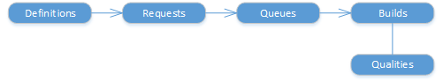

# Build (1.0)

[!INCLUDE [azure-devops](../_data/azure-devops-message.md)]

[!INCLUDE [API_version](../_data/version.md)]

A [build request](./requests.md) references a [build definition](./definitions.md) to add a new [build](./builds.md) to a [build queue](./queues.md).
Completed builds are assigned a [build quality](./qualities.md).

* [Builds](./builds.md)
* [Definitions](./definitions.md)
* [Qualities](./qualities.md)
* [Queues](./queues.md)
* [Requests](./requests.md)

## Common tasks

###Start a build

1. Get the ID of the build [definition](./definitions.md) that you want to use.
2. Create a [build request](./requests.md#requestabuild).
3. Get the ID of the request from the response so you can use it later.

###Postpone or cancel a build request

Before the build request has started, you can [cancel](./requests.md#cancelabuildrequest) or [postpone](./requests.md#updatethestatusofabuildrequest) it.

###Get a build

1. Get a list of [builds](./builds.md) and find the ID of the build you're interested in.
For example, find the build that you requested by using the request ID.
2. Get the [details](./builds.md#getbuilddetails) about the build.

###Set the build quality

1. If you don't know what qualities are available in your project, get the list of [qualities](./qualities.md).
2. Set the [quality](./builds.md#setthebuildquality) of the build.
3. You can also define what [qualities](./qualities.md#addaquality) are available.

