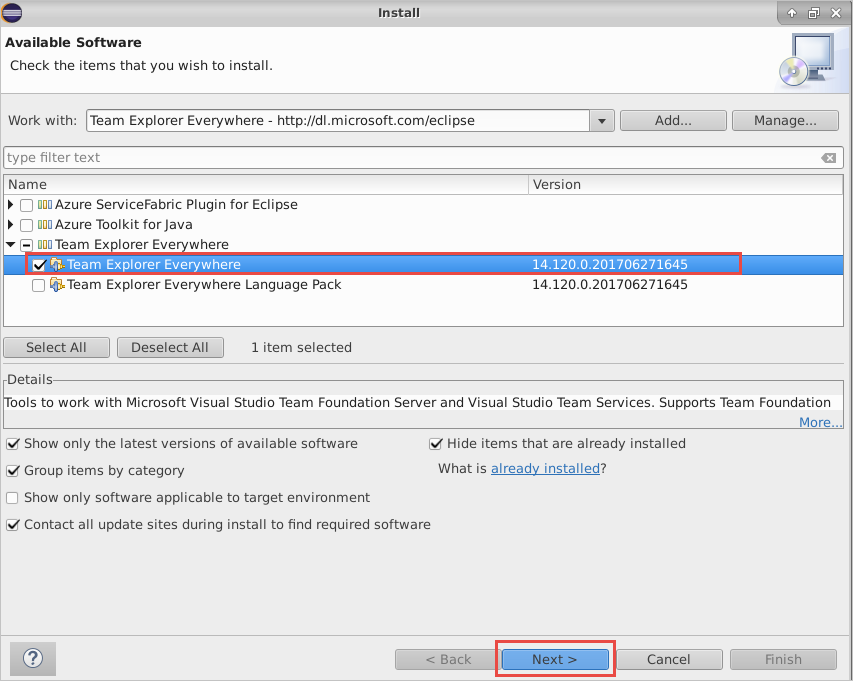

# Visual Studio Team Explorer Everywhere for Eclipse (Azure DevOps Services and TFS)

Visual Studio Team Explorer Everywhere (TEE) is a plug-in for [Eclipse](https://www.eclipse.org/) that enables
you to work with Team Foundation Server (TFS) and Azure DevOps using both Team Foundation Version Control (TFVC) 
and Git version control systems. 

For information on connecting to an Azure DevOps Services Git repo from Eclipse with TEE, read [Share your code with Eclipse and Azure DevOps Services Git](/azure/devops/repos/git/share-your-code-in-git-eclipse).

## Eclipse Update Site for Latest Release
The latest release of [TEE](https://marketplace.eclipse.org/content/team-explorer-everywhere) can always be installed in Eclipse using this update site URL:

* **https://dl.microsoft.com/eclipse**

### To install Team Explorer Everywhere from within Eclipse

1. Click on the Eclipse icon in the toolbar to open the Eclipse Java IDE.

    

1. The first time you run Eclipse, it will prompt for default workspace. Click on the box "Use this as the default and do not ask again" to use the default workspace on startup.

    

1. When the Welcome dialog appears, on the Help Menu select Install New Software.

    

1. Choose the Add button to add a new repository.  Use Team Explorer Everywhere as the name. The location of the update site is `https://dl.microsoft.com/eclipse`. 

    

1. Choose the OK button.

1. In the list of features in the Install dialog box, select the check box that corresponds to the Team Explorer Everywhere plugin. If you don't see this option, use the pull-down menu for "Work with:" and find the update site URL you just entered in the list and select it, then select the check box beside the plug-in mentioned above.

    

1. Choose Next two times. Accept the license agreement and choose Finish

1. Eclipse will need to restart.

## Standalone Download Links

### Latest TEE Release
* [Latest release on GitHub](https://github.com/Microsoft/team-explorer-everywhere/releases)
* Contains the TEE plugin for Eclipse, the cross-platform TFVC command-line-client (CLC), and the TFS SDK for Java

### TEE 2015 (Dev 14 RTM)
* [Download page for TEE 2015](https://www.microsoft.com/download/details.aspx?id=47727)
* SP 3 (14.0.3) Released 03/29/2016
* SP 2 (14.0.2) Released 12/30/2015
* SP 1 (14.0.1) Released 07/15/2015
* Contains the TEE plugin for Eclipse, the cross-platform TFVC command-line-client (CLC), and the TFS SDK for Java

### TEE 2013 (Dev 12 RTM)
* [Download page for TEE 2013](http://www.microsoft.com/download/details.aspx?id=40785)
* Released 09/21/2014
* Contains the TEE plugin for Eclipse, the cross-platform TFVC command-line-client (CLC), and the TFS SDK for Java

### TEE (Dev 11 RTM)
* [Download page for TEE Dev 11 RTM](http://www.microsoft.com/download/details.aspx?id=30661)
* Released 06/26/2013
* Contains the TEE plugin for Eclipse and the cross-platform TFVC command-line-client (CLC)

### TEE 2010
* [Download page for TEE 2010](http://www.microsoft.com/download/details.aspx?id=4240)
* Released 04/12/2010
* Contains the Eclipse TEE Plugin and a cross-platform TFVC command-line-client (CLC)
* [Download page for TEE 2010 SP1](http://www.microsoft.com/download/details.aspx?id=25125)
* [Download page for TEE 2010 SP1 Language Pack](http://www.microsoft.com/download/details.aspx?id=27118)
* [Download page for TEE 2010 Power Tools](http://www.microsoft.com/download/confirmation.aspx?id=28557)

## Next Steps 
* Learn more about TEE from our [Eclipse FAQ](eclipse-faq.md)
