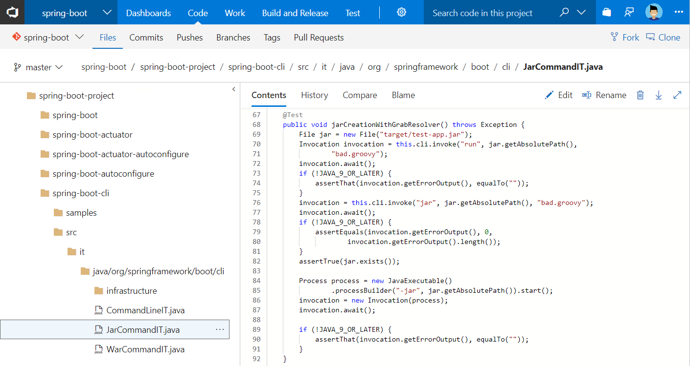

# Working with Visual Studio Team Services (VSTS) and Java

Built with Java teams in mind, VSTS offers an open, cloud-hosted hub for Java DevOps. Code in your favorite IDEs, collaborate on pull requests, build, test, and deploy to any platform.

> [!div class="mx-imgBorder"]

## 5-Minute Quickstarts

Get started with VSTS and Java using your IDE and your tools.

 - [Java DevOps with Azure](../build-release/apps/cd/azure/azure-devops-project-java.md?toc=/vsts/java/toc.json&bc=/vsts/java/breadcrumb/toc.json)
 - [Android Studio plugin](../git/create-repo-intellij.md?toc=/vsts/java/toc.json&bc=/vsts/java/breadcrumb/toc.json)
 - [Eclipse plugin](../git/share-your-code-in-git-eclipse.md?toc=/vsts/java/toc.json&bc=/vsts/git/breadcrumb/toc.json)
 - [IntelliJ IDEA plugin](../git/create-repo-intellij.md?toc=/vsts/java/toc.json&bc=/vsts/git/breadcrumb/toc.json)
 - [Build Android apps](../build-release/apps/mobile/android.md?toc=/vsts/java/toc.json&bc=/vsts/java/breadcrumb/toc.json)
 - [Build with Gradle](../build-release/apps/java/build-gradle.md?toc=/vsts/java/toc.json&bc=/vsts/java/breadcrumb/toc.json)
 - [Build with Maven](../build-release/apps/java/build-maven.md?toc=/vsts/java/toc.json&bc=/vsts/java/breadcrumb/toc.json)
 - [Manage Maven packages](../package/get-started-maven.md??toc=/vsts/java/toc.json&bc=/vsts/java/breadcrumb/toc.json)

## Videos

> [!VIDEO https://www.youtube.com/embed/z_7jSdGyZko]

> - Java DevOps with VSTS

 

> [!VIDEO https://www.youtube.com/embed/wSdgmQL-Zbg]

> - VSTS plugin for Android Studio and IntelliJ IDEA

 

> [!VIDEO https://www.youtube.com/embed/uCRSV62hGV8]

> - Deploy a Java application to Cloud Foundry

Check out the [Java ALM channel on YouTube](https://www.youtube.com/channel/UCJXFFf7-aX_7Jno9Ru0zd9w) for more!

## Step-by-Step Tutorials

Learn the basics of CI/CD for your Java app using VSTS and a variety of tools.

 - [Use VSTS with GitHub for Azure DevOps](../build-release/actions/azure-devops-project-github.md?toc=/vsts/java/toc.json&bc=/vsts/java/breadcrumb/toc.json)

## Reference

 - [Continuous Java testing with VSTS](/vsts/build-release/test/continuous-test-java)

## Resources

 - [VSTS CI/CD documentation](/vsts/build-release/index)
