# Manage your Java project with Azure Boards

In this exercise, you are going to examine the various Agile planning features of Azure DevOps Services to group and manage your Java project work and that of your team using backlogs. 

> [!NOTE]
> These Hands-On Labs use a virtual machine with a Java environment configured by our partner, [Northwest Cadence](https://www.nwcadence.com/).
>
> **[Learn how to connect to the Java VM environment here](https://github.com/nwcadence/java-dev-vsts)**.

## Prerequisites

This exercise assumes you have completed [setting up your Azure DevOps Services Java project](../settingvstsproject/index.md), and have created a Team Project using the Scrum template with a Git repo.

## Manage your team project backlog

This exercise uses a team project named **jdev** (if you have chosen a
different name for your project, select the project you created in the
previous exercise). For this first part, you will create work items for
you in the lab. Later, you will create some more work items as you work
through the MyShuttle scenario.

1. Sign in to your organization and navigate to your project.

2. Click the **Work** link.

3. On the left, click the **Features** link.

    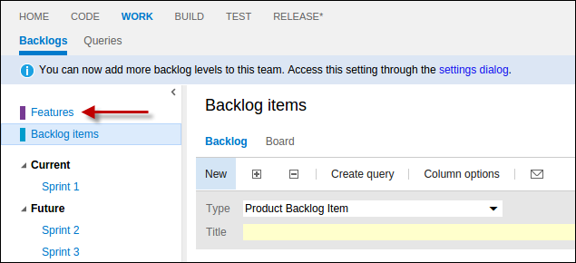

    You're now on the **Features** backlog.

    

4. In the Title box, enter **Intranet Site Updates** and press Enter.

5. Let's add another feature. In the Title box, enter **Internet Site
    Updates** and press Enter.

    You now have defined two features.

    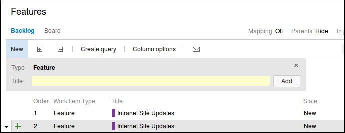

6. Double-click the **Intranet Site Updates** feature to open the
    feature details and enter additional information such as who owns
    the feature, status, expected completion date, etc.

    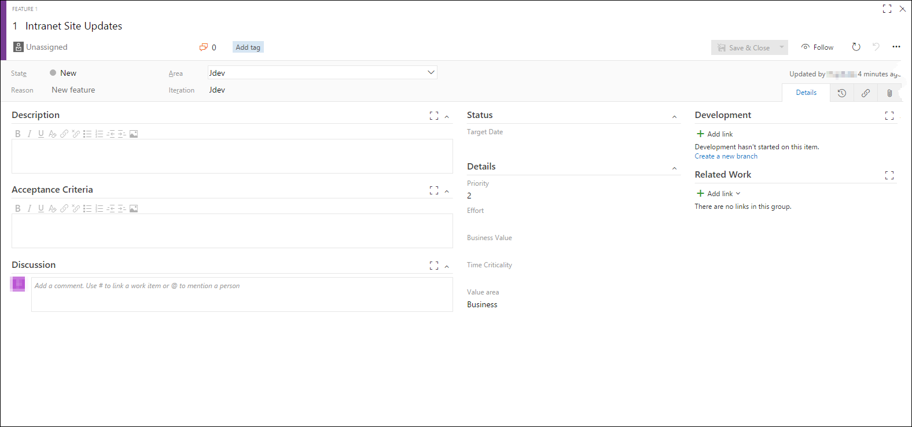

7. Change the value of the **State** field from **New** to **In
    Progress**.

    

8. Press tab to move to the **Assigned To** field, which current is set
    to **Unassigned**. Assign it to yourself.

9. Select the **Iteration** field. Expand the combo-box to see the
    available values.

    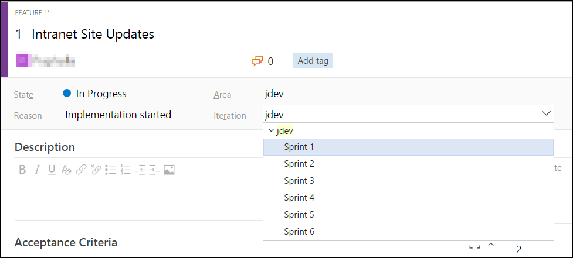

10. Select **Sprint 1**.

11. In the **Description** field, type a short note like, **Complete
    updates to Intranet site for partners**.

    Note this is a rich text field, and you can use various types of
    formatting.

    

12. Click the links button on the right of the form.

    

13. Click the **Add link** drop down menu and select **New item** link.

    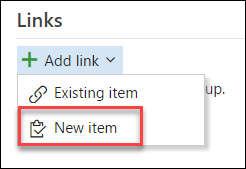

14. Change the **Work item type** field to **Product Backlog Item** and
    make sure the **Link type** is set to **Child**.

15. In the **Title** field, enter **Site Fit & Finish**.

    

16. Click **OK**. Azure DevOps Services opens up the New Product
    Backlog Item screen. Feel free to add a description.

17. When ready click **Save and close**.

    

18. Back on the Feature dialog, click **Save and close** to update and
    close the feature.

19. Click the **Backlog Items** link to return to that backlog.

    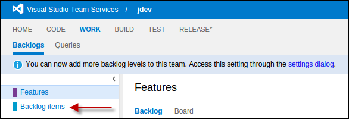

20. Double-click on the **Site Fit & Finish** Product Backlog Item (PBI)
    in the list to open up the dialog

21. Change the **State** to **Committed**. You'll notice that it's
    assigned to you automatically because the parent feature was
    assigned to you.

22. Click the links button on the right of the form.

    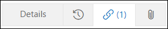

23. Click the **Add link** drop down menu and select **New Item** link.

    

24. Change the **Work item type** field to **Task** and make sure the
    **Link type** is set to **Child**.

25. In the **Title** field, enter **Add master branding**. Click **OK**
    when ready.

26. Feel free to explore a bit, add a description if you like and then
    click **Save and close** to finish using Task dialog.

27. Back at the PBI screen Click **Save and close** to close the Product
    Backlog Item.

28. Click the small triangle to the left the Explore VS Team
    Services PBI.

    

    You can now see any of the child tasks associated with the PBI.

    

    You can also see parent items (in the case Features).

29. On the command bar above the backlog, click the Hide link to the
    right of the Parents label to "show" the parent Features.

    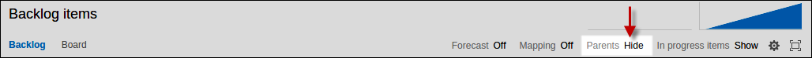

    You now can see the Parent Features.

    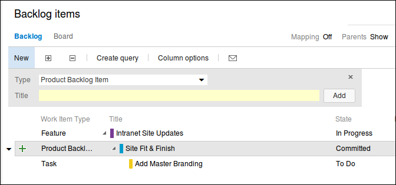

30. Under the Backlog items title, click the Board link.

     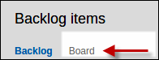

31. In the Committed column, on the only card, click the
    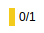 item.

    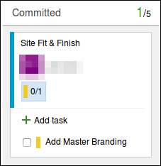

    You can see the child task here.

32. Click the **+ Add task** item.

33. In the open text area, type **Add master navigation to menu page**
    and press **Enter**.

    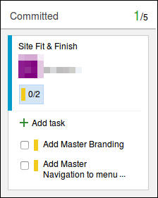

    You can see all of your work for the active sprint by accessing the
**Task Board**.

1. On the left, click **Sprint 1** under **Current**.

    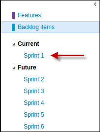

    Now you can see your work for just the current sprint.

    

    You need to assign the **Add master navigation to menu page** Task to you.

1. Move your mouse and hover over the card and you'll get a combo-box
    that opens up.

    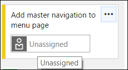

1. Assign the task to yourself.

    One more thing you need to do is add an estimate for each work item.

1. In the task board mouse over at the bottom right corner of the task card and enter the value **1**. This is nothing but **Remaining Work** field , you can also open the work item and then update **Remaining Work** field value and save the changes. Repeat this for another task in task board.

    

    Now you want to show that you've started working.

1. Drag and drop the **Add Master Branding** work item to the **In
    progress** column.

    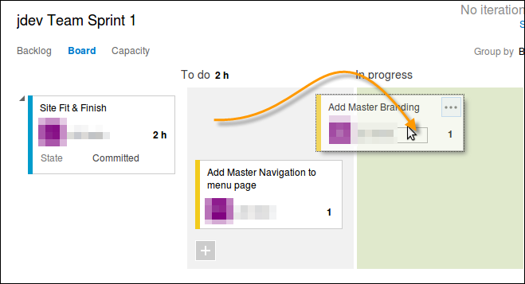

1. In the upper right corner of the Task board, click the **Settings**
    icon

    

    This opens the Settings dialog where you can make adjustments to many
    features of the Work Hub including the Task board.

1. For **Task** check the **Show ID** checkbox to show the work item ID
    on the cards.

    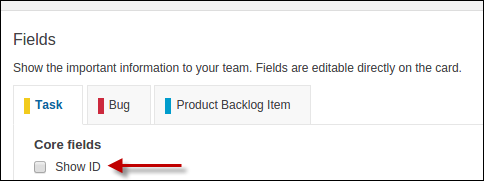

1. Click **Save and Close** when done.

    Now you'll be able to see the Work Item ID easily when you look at
    the Task board. You'll use the IDs later when you commit code to
    your Git repo in the next exercise.

This is a quick introduction to the Agile Planning tools and Work Items. You'll work with them
some more later. If you want to read more about the Agile Planning tools, Sprint Planning, and the Scrum
template, read [Sprint planning with Azure DevOps Services](/azure/devops/boards/sprints/assign-work-sprint).
