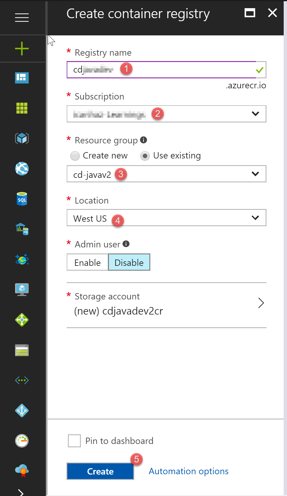
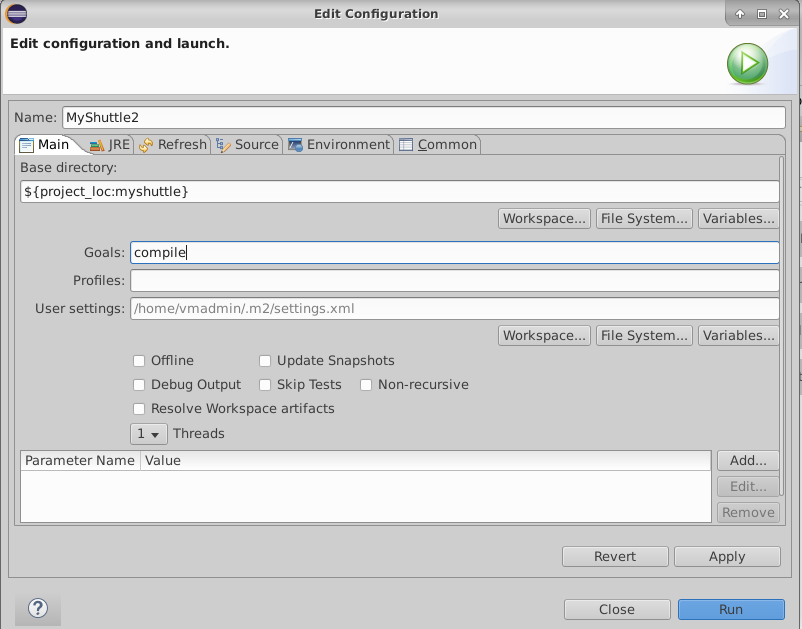
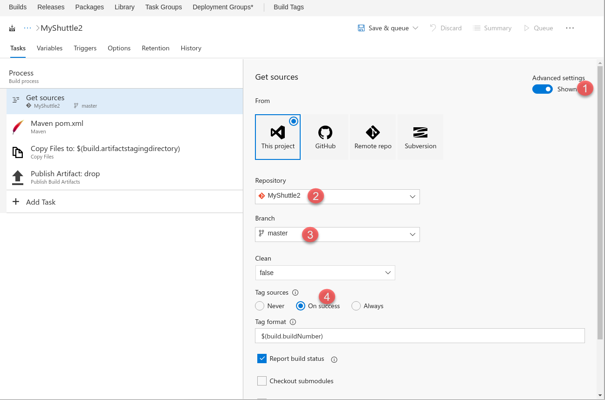
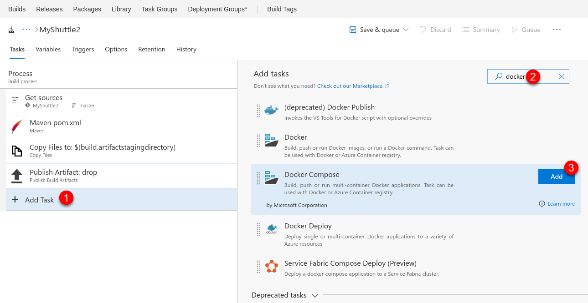
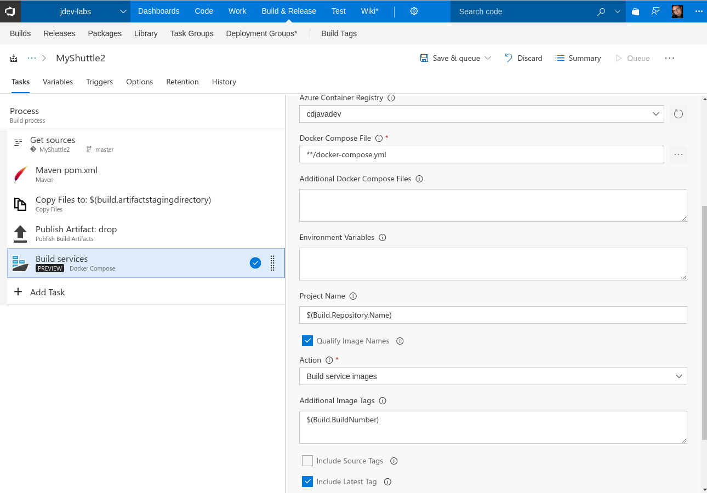
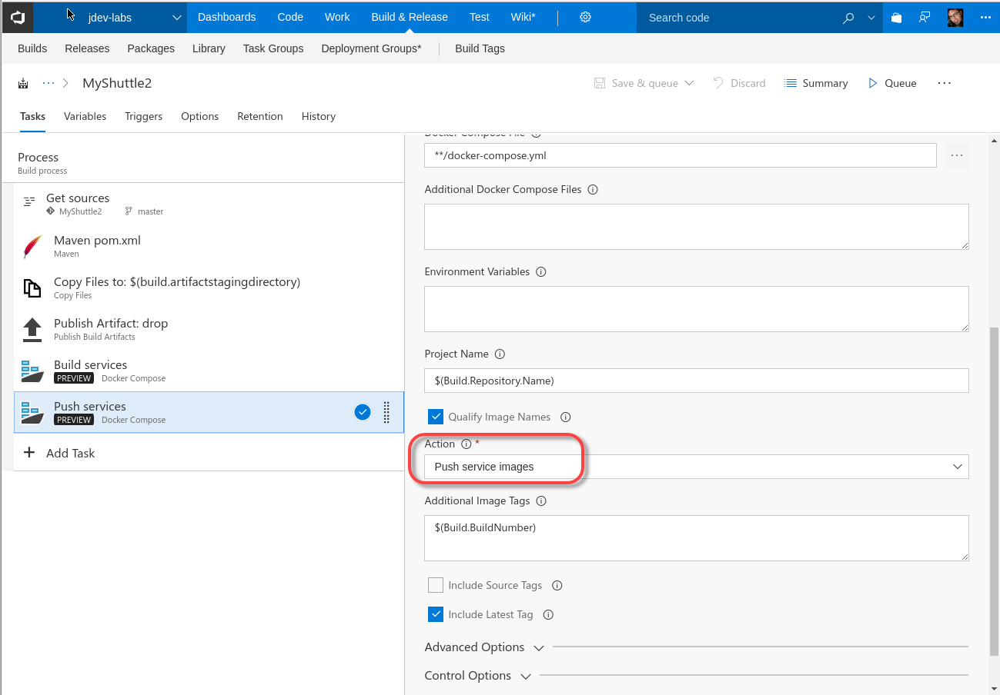
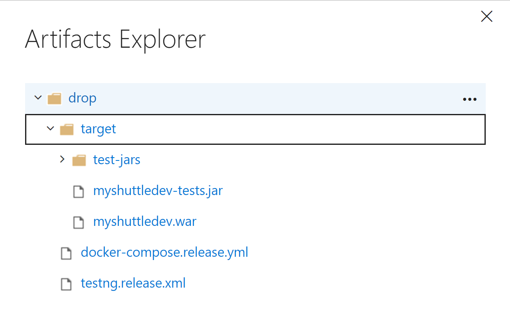

# Create a Docker build for Java in Azure DevOps Services and publish it to ACR

In this exercise, you are going to create a Docker Registry in Azure as well as an Azure DevOps Services build that builds two Docker container images and publishes them to the Azure Container Registry (ACR). In a later lab ([Continuous Deployment](../releasemanagement/index.md)) you will configure a Release in Azure DevOps Services to run the containers.

> [!NOTE]
> These Hands-On Labs use a virtual machine with a Java environment configured by our partner, [Northwest Cadence](https://www.nwcadence.com/).
>
> **[Learn how to connect to the Java VM environment here](https://github.com/nwcadence/java-dev-vsts)**.

## Prerequisites

This exercise assumes you have completed the exercises to [create a Team Project](../settingvstsproject/index.md) and have [set up the Docker private Azure DevOps Services agent](../dockerbuildagent/index.md). You should also have set up Maven package management and have a MyShuttleCalc package in the feed. This exercise uses a team project named **jdev**, though your team project name may differ.

> **Note**: You don't have to use the Azure container registry - you can use whatever registry you choose. You can also create an equivalent build using Jenkins.

## Create a Docker Container Registry in Azure

1. Open a browser and navigate to the [Azure Portal](https://portal.azure.com)

1. Click the + icon in the upper left of the menu, type "azure container registry" and press Enter.

    

1. Click on "Azure Container Registry" and then click the Create button from the Azure Container Registry item blade.

    

1. Enter a name, create or use an existing resource group, and choose a location. Enable the Admin user option, and enable managed registry. This allows you to not have to manage a storage account for the images (similar to managed disks with VMs). Select the Basic pricing tier. Click Create when you are done.

    

1. After a few moments, your registry will be created.

## Update the pom.xml File for MyShuttle2

In this task you will update the pom.xml file for the MyShuttle2 application so that it can consume the MyShuttleCalc package from the Maven package feed.

1. In Chrome, navigate to your organization and project. Click on the Build & Release Hub, click on Packages, and select the Maven feed. Click on "Connect to Feed". Click on the copy button in the section labeled `Add this feed to your project pom.xml inside the <repositories> tag`.

    

2. Open the MyShuttle2 project.

3. Click on the pom.xml file.

4. In the `<repositories>` element there is a reference to a Maven repo. Paste in the repository settings you got from Azure DevOps Services.

5. Find the `<dependency>` with `<groupId>com.microsoft.exampledep</groupId>` and update the version number to match the version number of the MyShuttleCalc package in your package feed. This may look something like:

    ```xml
    ...
    <dependency>
      <groupId>com.microsoft.exampledep</groupId>
      <artifactId>MyShuttleCalc</artifactId>
      <version>1.0.6</version>
    </dependency>
    ...
    ```

6. Copy the maven settings file from the MyShuttleCalc project (you updated this file in another lab to include the authentication settings for the Maven package feed). Run the following command in a terminal:

    ```sh
    cp ~/MyShuttleCalc/maven/settings.xml ~/MyShuttle2/maven/
    ```

### IntelliJ

1. You may have to reload the Maven project to update the plugins and dependencies. You can do this by clicking `View->Tool Windows->Maven` and then clicking the reload button (the top-left icon in the Maven project view).

    

1. From the top toolbar of IntelliJ, click Build->Build Project and make sure there are no errors.

1. Click VCS->Commit. Add a commit message "Updating feed settings". Click the drop-down on the Commit button and select Commit and Push. Click Push on the prompt.

    

### Eclipse

1. You may have to reload the Maven project to update the plugins and dependencies. You can do this by right-clicking on the `myshuttle` working set/project, then selecting Maven -> Update Project. Then, keep the checkbox for `myshuttle` checked and press the OK button.

    

1. Right-click on the `myshuttle` working set/project, then select Run As -> Maven build.

    

    In the configuration window, type in "compile" as the Maven Goal then press the Run button.

    

    >Note: Ensure that you have already copied the settings.xml file from MyShuttleCalc to the .m2 folder before you run this. Otherwise, you can specify the settings.xml file in MyShuttle2 by clicking on the "File System..." button to the right of the User settings field in the configuration window to reference a settings file other than in the default .m2 folder.

1. Commit and push your changes through Team Explorer Everywhere.

## Build Docker images with Azure Pipelines

In this task you will create an Azure Pipelines build pipeline that will create two containers (a mysql database container as well as a tomcat container for running the MyShuttle2 site). The build will publish the containers to the Azure Container Registry you just created.

1. Connect to the virtual machine with the user credentials which you specified when creating the VM in Azure.

1. Open Chrome and browse to `http://<youraccount>.visualstudio.com` (where `youraccount` is the account you created in Azure DevOps Services).

1. Click on the `jdev` project and navigate to the "Build & Release" Hub.

1. Click on Builds to go the Builds view. Click on "+ New" to create a new build pipeline.

    

1. Type "maven" into the search box. Select the Maven template and click Apply.

1. Change the name of the build to MyShuttle2.

1. On the Get Sources step, ensure that the repo is `MyShuttle2`, and the branch is `master`. Toggle the Advanced Settings toggle and change `Tag Sources` to "On Success".

    

1. Click on the `Maven pom.xml` step and edit the following values:

    | Parameter | Value | Notes |
    | --------------- | ---------------------------- | ----------------------------------------------------------- |
    | Options | `-DskipITs --settings ./maven/settings.xml` | Skips integration tests during the build |
    | Server URL | `http://10.0.0.4:8080`  | Selects JaCoCo as the coverage tool |
    | Source Files Directory | `src/main` | Sets the source files directory for JaCoCo |

    

1. Click on the "Copy Files" task. Set the Contents property to:

    ```java
    target/myshuttledev*.*
    target/test-jars/*
    *.release.*
    ```

    

    The Publish Build Artifacts task publishes everything in the artifact staging directory. The Copy Files task copies the following artifacts into this directory so that they are available for Release (which you will create in a later lab):

    - **myshuttledev.war** - the site war file
    - **myshuttledev-tests.jar** - integration test jar
    - **target/test-jars** - dependency jars required to run the test jar
    - **Release yml files** - for docker operations
    - **Release xml files** - test configuration files

1. Under the list of tasks, click "Add Task". Type "docker" into the search box and then click the Apply button next to the Docker Compose task.

    

1. If it is not positioned after the Publish Artifact task, then drag the Docker Compose task under it so that it is the last step in the build.

1. Configure the settings of the Docker Compose task as follows:

    | Parameter | Value | Notes |
    | --------------- | ---------------------------- | ----------------------------------------------------------- |
    | Container Registry Type | Azure Container Registry | This is to connect to the Azure Container Registry you created earlier |
    | Azure Subscription | Your Azure subscription | The subscription that contains your registry |
    | Azure Container Registry | Your registry | Select the Azure Container registry you created earlier |
    | Additional Image Tags | `$(Build.BuildNumber)` | Sets a unique tag for each instance of the build |
    | Include Latest Tag | Check (set to true) | Adds the `latest` tag to the images produced by this build |

    

1. Right-click the Docker Compose task and click Clone to create a copy of the task.

1. Position the new task so that it is below the Build Images task.

1. Update the action to "Push services".

    

1. Click on Triggers. Enable the Continuous Integration trigger. Set the branch filter to * to trigger off commits to any branch.

    

1. On the options page, set the queue to `default` so that your dockerized agent is the agent to run this build.

1. Click the "Save and Queue" button to save and queue this build. Click the Queue button in the dialog and then click the link in the green bar that appears at the top to go to the live logs for the build run.

1. You should see a successful build. Click on the build number to navigate to the summary page.

    

1. Click on the Artifacts link just below the build histogram to open the artifacts. Click Explore next to the `drop` artifact. Your drop should look like this:

    

1. Navigate back to the Azure Portal and find your Azure Container Registry. Click on Repositories. You should see a `db` and a `web` repository. If you click on one of the repos, you will see a latest tag as well as tags for each build number.

    
