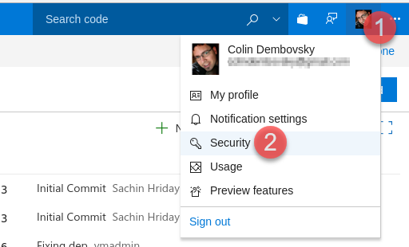
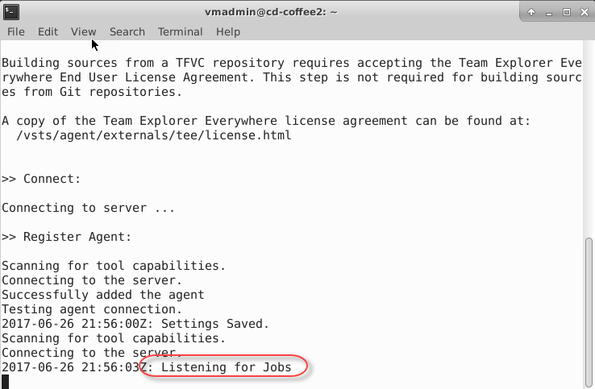

# Configure a private Java build agent with Azure DevOps Services

In this exercise, you are going to configure a private build agent that runs in a Docker container.

## Prerequisites

This exercise assumes you have completed the exercises to create a Team Project. This exercise uses a team project named **jdev**, though your team project name may differ.

> [!NOTE]
> It is not necessary to run the Azure DevOps Services agent in a container - but it is convenient to do so and means that you don't have to install any other prerequisites on the machine running the container, since all the prerequisites are inside the container.

## Generating an Azure DevOps Services Personal Access Token (PAT)

In this task you will generate a PAT for yourself. You will use this PAT to connect the agent to your organization in Azure DevOps.

> [!NOTE]
> If you already have a PAT, you can skip this step and use your existing PAT (assuming it has the correct scopes).

1. Connect to the virtual machine with the user credentials which you specified when creating the VM in Azure.

2. Open Chrome and browse to `http://<youraccount>.visualstudio.com` (where `youraccount` is the account you created in Azure DevOps Services).

3. In the upper right, click on your profile image and Click Security.

    

4. On the Personal access tokens page, click the "Add" button. Enter "java" (or whatever you want) for the Description. Scroll to the bottom of the page and click "Create token".

5. When the token is created you will have to copy it - this is your only chance to see the token. Copy it from the browser into the clipboard.

6. Click on the Visual Studio Code icon in the toolbar to open Visual Studio Code.

    

7. Press Ctrl-N (or use File->New File) to create a new file. Paste in your PAT. Save this file (File->Save or Ctrl-S) to `/home/vmadmin/pat.txt`.

## Starting an Azure DevOps Services Agent Container using Docker

In this task you will start an Azure DevOps Services build agent container using Docker. This container will be used to run builds and releases.

1. On your VM, open a terminal by clicking on the Terminal Emulator icon in the toolbar.

    

1. Enter the following command:

    ```sh
    docker run -e Azure DevOps Services_ACCOUNT=<account> -e Azure DevOps Services_TOKEN=<pat> -v /var/run/docker.sock:/var/run/docker.sock --name Azure DevOps Servicesagent -it Azure DevOps Services/agent
    ```

    where:
    - _account_ is your organization name (the bit before .visualstudio.com)
    - _pat_ is your PAT

    You should see a message indicating "Listening for Jobs":

    

    > [!NOTE]
    > This starts a docker container (called Azure DevOps Servicesagent) that has an Azure DevOps Services agent running inside it. The agent is connected to your organization and has also mounted the VM Docker socket so that the container can perform Docker operations (like building containers). It is created from a Dockerfile (listed below) that installs PhantomJS for running headless Selenium tests and configures Docker certs and environment variables. You can move this terminal to the side since the container is running interactively, so the prompt you are seeing is actually inside the container. Open a new terminal by clicking on the Terminal Emulator icon in the toolbar.

    ```dockerfile
    # Dockerfile for custom Azure DevOps Services agent image with phantomjs and docker config
    FROM microsoft/vsts-agent

    # install phantomjs
    RUN curl -L https://bitbucket.org/ariya/phantomjs/downloads/$PHANTOM.tar.bz2 > $PHANTOM.tar.bz2 && \
    tar xvjf $PHANTOM.tar.bz2 -C /usr/local/share && \
    ln -sf /usr/local/share/$PHANTOM/bin/phantomjs /usr/local/share/phantomjs && \
    ln -sf /usr/local/share/$PHANTOM/bin/phantomjs /usr/local/bin/phantomjs && \
    ln -sf /usr/local/share/$PHANTOM/bin/phantomjs /usr/bin/phantomjs
    RUN apt-get update && apt-get install libfontconfig -y

    # configure docker
    COPY .docker /root/.docker/
    ENV DOCKER_HOST=tcp://$HOSTNAME:2376 DOCKER_TLS_VERIFY=1
    ```

    > [!NOTE]
    > `$HOSTNAME` is a variable that resolves in the setup script that executed when you set up your Azure VM.

2. If your container stops running for some reason, you can run the following commands to restart and attach to it:

    ```sh
    docker start Azure DevOps Servicesagent
    docker attach Azure DevOps Servicesagent
    ```
